<div align="center">
   
</div>

<h1 align="center">Universidad Peruana de Ciencias Aplicadas</h1>

<h2 align="center">Carrera de Ingeniería de Software</h2>

<br>
<h3 align="center">1ASI0730</h3>
<h3 align="center">Aplicaciones Web</h3>
<h3 align="center">NRC</h3>
<h3 align="center">10215</h3>
<h3 align="center">Informe del Trabajo Final</h3>
<h3 align="center">Docente</h3>
<p align="center">Velásquez Núñez, Ángel Augusto</p>
<h3 align="center">Equipo</h3>
<p align="center">FreshGuard</p>
<h3 align="center">Proyecto</h3>
<p align="center">ColdTrack</p>
<h3 align="center">Integrantes</h3>
<div align="center">


| **Código** | **Apellidos y Nombres** |
|------------|--------------------------|
| U201911249 | Celis Berrospi, Eslander |
| U202416908 | Mendoza Palacios, Gabriel |
| U20221G185 | Oblitas Alcalde, Rodrigo |
| U201823654 | Avila Palacios, Aarón |
| U202320699 | Arechaga Saavedra, Mathias |


</div>

<h3 align="center">Período 202610</h3>
<h3 align="center">Junio 2026</h3>

<div style="page-break-before: always;"></div>

# Registro de Versiones del Informe
| Versión | Fecha      | Autor(es)                 | Descripción                                             |
|---------|------------|---------------------------|---------------------------------------------------------|
| 1.1     | 12/04/2026 | Eslander Celis Berrospi   | Desarrollo del capítulo I: Introducción                 |
| 1.2     | 30/04/2026 | Gabriel Mendoza Palacios  | Desarrollo del capítulo II: Requirements Elicitation & Analysis   |
| 1.3     | 18/04/2026 | Eslander Celis Berrospi   | Desarrollo del capítulo III: Requirements specification |
| 1.4     | 19/04/2026 | Rodrigo Oblitas Alcalde   | Desarrollo del capítulo VI: Landing Page                |
| 1.5     | 19/04/2026 | Aarón Avila Palacios      | Desarrollo del capítulo V                               |
| 1.6     | 21/04/2026 | Mathias Arechaga Saavedra | Desarrollo del capitulo IV: Wireframes                  |
| 2.1     | 13/05/2026 | Aarón Avila Palacios      | Desarrollo de las evidencias de ejecución y despliegue del Sprint 2, actualización del índice e incorporación de capturas del reporte. |
| 3.1     | 19/06/2026 | Aarón Avila Palacios      | Corrección de la carátula, actualización del Student Outcome para AV2 e incorporación de conclusiones, recomendaciones y referencias bibliográficas de la entrega. |
| 3.2     | 19/06/2026 | Aarón Avila Palacios      | Desarrollo de las evidencias de ejecución y despliegue del Sprint 3, documentación de los flujos integrados y preparación de la sección Video About-the-Product. |
| 3.3     | 19/06/2026 | Aarón Avila Palacios      | Ampliación de las evidencias de ejecución y despliegue mediante escenarios verificables, arquitectura productiva, configuración reproducible y criterios de aceptación. |


# Project Report Collaboration Insights

#### Repositorio del informe del proyecto
El informe del proyecto se encuentra alojado en el siguiente repositorio de la organización de GitHub del equipo:

- 🔗 Enlace de la organización: https://github.com/1ASI0730-2610-10215
- 🔗 Enlace de repositorios: https://github.com/orgs/1ASI0730-2610-10215/repositories

A continuación, se detallan las actividades realizadas en cada entrega, la participación de los miembros del equipo, y las evidencias correspondientes.

## AV1
Para la primera entrega (AV1) se trabajó en la estructura inicial del informe, definiendo el índice y distribuyendo las secciones entre los miembros.

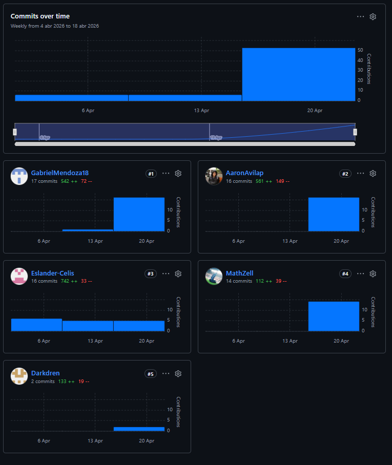


## Contenido

* [Registro de Versiones del Informe](#registro-de-versiones-del-informe)

* [Project Report Collaboration Insights](#project-report-collaboration-insights)

* [Student Outcome](#student-outcome)

* [Capitulo I: Introducción](#capitulo-i-introducción)

  * [1.1. Startup Profile](#11-startup-profile)

    * [1.1.1. Descripcion de la Startup](#111-descripcion-de-la-startup)
    * [1.1.2. Perfiles de integrantes del equipo](#112-perfiles-de-integrantes-del-equipo)
  * [1.2. Solution Profile](#12-solution-profile)

    * [1.2.1. Antecedentes y problematica](#121-antecedentes-y-problematica)
    * [1.2.2. Lean UX Process](#122-lean-ux-process)

      * [1.2.2.1. Lean UX Problem Statements](#1221-lean-ux-problem-statements)
      * [1.2.2.2. Lean UX Assumptions](#1222-lean-ux-assumptions)
      * [1.2.2.3. Lean UX Hypothesis Statements](#1223-lean-ux-hypothesis-statements)
      * [1.2.2.4. Lean UX Canvas](#1224-lean-ux-canvas)
  * [1.3. Segmentos Objetivo](#13-segmentos-objetivo)

    * [Segmento Objetivo 1: Estudiantes Universitarios](#segmento-objetivo-1-estudiantes-universitarios)
    * [Segmento Objetivo 2: Profesores Universitarios](#segmento-objetivo-2-profesores-universitarios)

* [Capitulo II: Requirements Elicitation & Analysis](#capitulo-ii-requirements-elicitation--analysis)

  * [2.1. Competidores](#21-competidores)

    * [2.1.1. Analisis competitivo](#211-analisis-competitivo)
    * [2.1.2. Estrategias y tacticas frente a competidores](#212-estrategias-y-tacticas-frente-a-competidores)
  * [2.2. Entrevistas](#22-entrevistas)

    * [2.2.1. Diseno de entrevistas](#221-diseno-de-entrevistas)
    * [2.2.2. Registro de entrevistas](#222-registro-de-entrevistas)
    * [2.2.3. Analisis de entrevistas](#223-analisis-de-entrevistas)
  * [2.3. Needfinding](#23-needfinding)

    * [2.3.1. User Personas](#231-user-personas)
    * [2.3.2. User Task Matrix](#232-user-task-matrix)
    * [2.3.3. User Journey Mapping](#233-user-journey-mapping)
    * [2.3.4. Empathy Mapping](#234-empathy-mapping)
    * [2.3.5. As-is Scenario Mapping](#235-as-is-scenario-mapping)
  * [2.4. Ubiquitous Language](#24-ubiquitous-language)

* [Capitulo III: Requirements specification](#capitulo-iii-requirements-specification)

  * [3.1. To-Be Scenario Mapping](#31-to-be-scenario-mapping)
  * [3.2. User Stories](#32-user-stories)
  * [3.3. Impact Mapping](#33-impact-mapping)
  * [3.4. Product Backlog](#34-product-backlog)

* [Capitulo IV: Product Design](#capitulo-iv-product-design)

  * [4.1. Style Guidelines](#41-style-guidelines)

    * [4.1.1. General Style Guidelines](#411-general-style-guidelines)
    * [4.1.2. Web Style Guidelines](#412-web-style-guidelines)
  * [4.2. Information Architecture](#42-information-architecture)

    * [4.2.1. Organization Systems](#421-organization-systems)
    * [4.2.2. Labeling Systems](#422-labeling-systems)
    * [4.2.3. SEO Tags and Meta Tags](#423-seo-tags-and-meta-tags)
    * [4.2.4. Searching Systems](#424-searching-systems)
    * [4.2.5. Navigation Systems](#425-navigation-systems)
  * [4.3. Landing Page UI Design](#43-landing-page-ui-design)

    * [4.3.1. Landing Page Wireframe](#431-landing-page-wireframe)
    * [4.3.2. Landing Page Mock-up](#432-landing-page-mock-up)
  * [4.4. Web Applications UX/UI Design](#44-web-applications-uxui-design)

    * [4.4.1. Web Applications Wireframes](#441-web-applications-wireframes)
    * [4.4.2. Web Applications Wireflow Diagrams](#442-web-applications-wireflow-diagrams)
    * [4.4.2. Web Applications Mock-ups](#442-web-applications-mock-ups)
    * [4.4.3. Web Applications User Flow Diagrams](#443-web-applications-user-flow-diagrams)
  * [4.5. Web Applications Prototyping](#45-web-applications-prototyping)
  * [4.6. Domain-Driven Software Architecture](#46-domain-driven-software-architecture)

    * [4.6.1. Design-Level EventStorming](#461-design-level-eventstorming)
    * [4.6.2. Software Architecture Context Diagram](#462-software-architecture-context-diagram)
    * [4.6.3. Software Architecture Container Diagrams](#463-software-architecture-container-diagrams)
    * [4.6.4. Software Architecture Components Diagrams](#464-software-architecture-components-diagrams)
  * [4.7. Software Object-Oriented Design](#47-software-object-oriented-design)

    * [4.7.1. Class Diagrams](#471-class-diagrams)
    * [4.7.2. Class Dictionary](#472-class-dictionary)
  * [4.8. Database Design](#48-database-design)

    * [4.8.1. Database Diagram](#481-database-diagram)

* [Capitulo V: Product Implementation, Validation & Deployment](#capitulo-v-product-implementation-validation--deployment)

  * [5.1. Software Configuration Management](#51-software-configuration-management)

    * [5.1.1. Software Development Environment Configuration](#511-software-development-environment-configuration)
    * [5.1.2. Source Code Management](#512-source-code-management)
    * [5.1.3. Source Code Style Guide & Conventions](#513-source-code-style-guide--conventions)
    * [5.1.4. Software Deployment Configuration](#514-software-deployment-configuration)

  * [5.2. Landing Page, Services & Applications Implementation](#52-landing-page-services--applications-implementation)

    * [5.2.1. Sprint 1](#521-sprint-1)

      * [5.2.1.1. Sprint Planning 1](#5211-sprint-planning-1)
      * [5.2.1.2. Aspect Leaders and Collaborators](#5212-aspect-leaders-and-collaborators)
      * [5.2.1.3. Sprint Backlog 1](#5213-sprint-backlog-1)
      * [5.2.1.4. Development Evidence for Sprint Review](#5214-development-evidence-for-sprint-review)
      * [5.2.1.5. Execution Evidence for Sprint Review](#5215-execution-evidence-for-sprint-review)
      * [5.2.1.6. Services Documentation Evidence for Sprint Review](#5216-services-documentation-evidence-for-sprint-review)
      * [5.2.1.7. Software Deployment Evidence for Sprint Review](#5217-software-deployment-evidence-for-sprint-review)
      * [5.2.1.8. Team Collaboration Insights during Sprint](#5218-team-collaboration-insights-during-sprint)

    * [5.2.2. Sprint 2](#522-sprint-2)

      * [5.2.2.1. Sprint Planning 2](#5221-sprint-planning-2)
      * [5.2.2.2. Aspect Leaders and Collaborators](#5222-aspect-leaders-and-collaborators)
      * [5.2.2.3. Sprint Backlog 2](#5223-sprint-backlog-2)
      * [5.2.2.4. Development Evidence for Sprint Review](#5224-development-evidence-for-sprint-review)
      * [5.2.2.5. Execution Evidence for Sprint Review](#5225-execution-evidence-for-sprint-review)
      * [5.2.2.6. Services Documentation Evidence for Sprint Review](#5226-services-documentation-evidence-for-sprint-review)
      * [5.2.2.7. Software Deployment Evidence for Sprint Review](#5227-software-deployment-evidence-for-sprint-review)
      * [5.2.2.8. Team Collaboration Insights during Sprint](#5228-team-collaboration-insights-during-sprint)

    * [5.2.3. Sprint 3](#523-sprint-3)

      * [5.2.3.1. Sprint Planning 3](#5231-sprint-planning-3)
      * [5.2.3.2. Aspect Leaders and Collaborators](#5232-aspect-leaders-and-collaborators)
      * [5.2.3.3. Sprint Backlog 3](#5233-sprint-backlog-3)
      * [5.2.3.4. Development Evidence for Sprint Review](#5234-development-evidence-for-sprint-review)
      * [5.2.3.5. Execution Evidence for Sprint Review](#5235-execution-evidence-for-sprint-review)
      * [5.2.3.6. Services Documentation Evidence for Sprint Review](#5236-services-documentation-evidence-for-sprint-review)
      * [5.2.3.7. Software Deployment Evidence for Sprint Review](#5237-software-deployment-evidence-for-sprint-review)
      * [5.2.3.8. Team Collaboration Insights during Sprint](#5238-team-collaboration-insights-during-sprint)

  * [5.3. Validation Interviews](#53-validation-interviews)

    * [5.3.1. Diseño de Entrevistas](#531-diseño-de-entrevistas)
    * [5.3.2. Registro de Entrevistas](#532-registro-de-entrevistas)
    * [5.3.3. Evaluaciones según heurísticas](#533-evaluaciones-según-heurísticas)

  * [5.4. Video About-the-Product](#54-video-about-the-product)

* [Conclusiones](#conclusiones)

  * [Conclusiones y recomendaciones](#conclusiones-y-recomendaciones)

* [Bibliografía](#bibliografía)

* [Anexos](#anexos)

# Student Outcome
ABET – EAC - Student Outcome 5

La capacidad de funcionar efectivamente en un equipo cuyos miembros juntos proporcionan liderazgo, crean un entorno de colaboración e inclusivo, establecen objetivos, planifican tareas y cumplen objetivos. 

<table>
    <tr>
        <th>CRITERIO ESPECIFICO</th>
        <th>ACCIONES REALIZADAS</th>
        <th>CONCLUSIONES</th>
    </tr>
    <tr>
        <th> Trabaja en equipo para
             proporcionar liderazgo en
             forma conjunta</th>
        <td>
         <b>Aarón Avila</b>
         <ul>
           <li><b>AV1:</b> Durante el desarrollo del proyecto, trabajé de manera autónoma asumiendo un rol activo en la organización de las actividades y la gestión del proyecto, ejerciendo liderazgo en la planificación y ejecución de cada etapa. Participé en la toma de decisiones relacionadas con la definición de la startup, la identificación de la problemática, la segmentación de usuarios y la elaboración de artefactos como User Personas, Empathy Maps, As-Is Scenario Mapping y Ubiquitous Language, demostrando capacidad para dirigir el proyecto de manera integral.</li>
           <li><b>TB1:</b> Durante el Sprint 2 (TB1), ejercí liderazgo en la estructuración técnica del proyecto frontend y la configuración de variables de entorno. Coordiné con el equipo la adopción de Vue.js y apoyé en la toma de decisiones arquitectónicas, asegurando que el desarrollo de los módulos principales estuviera alineado con los requerimientos técnicos y de diseño.</li>
           <li><b>AV2:</b> Durante el Sprint 3 lideré la integración entre la Web Application y los Web Services de ColdTrack. Coordiné la sustitución de la API simulada por el backend desplegado, la validación de los flujos de autenticación, envíos, sensores, telemetría, alertas e historial, y la preparación de releases trazables mediante GitFlow. Este trabajo permitió al equipo consolidar una solución integrada y demostrable para la Sprint Review.</li>
         </ul>
         <b>Eslander Celis</b>
         <ul>
           <li><b>AV1:</b> Durante el desarrollo del proyecto, trabajé en equipo aportando ideas y asumiendo un rol activo en la organización de las actividades, contribuyendo al liderazgo compartido dentro del grupo. Participé en la toma de decisiones relacionadas con la definición de la startup, la problemática, los segmentos objetivos y la estructuración de los User Stories, Product Backlog e Impact Map. Además, mantuve una comunicación constante con mis compañeros, apoyando cuando era necesario y asegurando que todos estuviéramos alineados con los objetivos del proyecto.</li>
           <li><b>TB1:</b> En esta fase, asumí un rol activo organizando las tareas de desarrollo frontend. Promoví el liderazgo compartido guiando al equipo en la implementación del entorno de desarrollo y asegurando que las ramas de GitFlow se manejaran adecuadamente para la correcta integración continua de las vistas de la aplicación web.</li>
         </ul>
         <b>Gabriel Mendoza Palacios</b>
         <ul>
           <li><b>AV1:</b> Durante el desarrollo del proyecto, asumí un rol proactivo enfocado en el liderazgo compartido, coordinando la ejecución del análisis de requerimientos. Participé activamente en la evaluación del mercado mediante el análisis competitivo, la estructuración de entrevistas y la consolidación del Needfinding de ColdTrack. Promoví el debate constructivo y el intercambio de ideas con mis compañeros para asegurar que nuestra propuesta técnica estuviera perfectamente alineada con las necesidades logísticas de los usuarios.</li>
           <li><b>TB1:</b> Durante el Sprint 2, lideré aspectos clave de la integración del diseño UI en los componentes de Vue.js. Mantuve una actitud proactiva, promoviendo sesiones de revisión de código (Pull Requests) para garantizar la calidad visual y técnica de las vistas antes de su integración a la rama principal.</li>
         </ul>
         <b>Rodrigo Oblitas</b>
         <ul>
           <li><b>AV1:</b> Durante el desarrollo del proyecto, asumí un rol activo en el trabajo en equipo, participando en la elaboración del Lean UX Process, incluyendo Problem Statement, Assumptions e Hypothesis, así como en el desarrollo de la Landing Page. Contribuí en la toma de decisiones y en la organización de las tareas, promoviendo la colaboración entre los integrantes y asegurando que el equipo avance de manera alineada hacia los objetivos establecidos.</li>
           <li><b>TB1:</b> Mantuve mi compromiso con el trabajo colaborativo asumiendo el liderazgo en la implementación de la autenticación y la gestión de envíos. Facilité la comunicación entre los miembros del equipo para resolver bloqueos técnicos, asegurando un progreso constante hacia el cumplimiento del Sprint Goal de desarrollo frontend.</li>
         </ul>
         <b>Mathias Arechaga</b>
         <ul>
           <li><b>AV1:</b> Durante el proyecto, participé activamente en el desarrollo de artefactos de diseño centrados en el usuario, como User Personas, User Journey Mapping y prototipos de la aplicación. Colaboré en la coordinación de tareas relacionadas con el diseño y la experiencia de usuario, aportando ideas y apoyando al equipo para mantener una organización eficiente y un liderazgo compartido en el desarrollo del proyecto.</li>
           <li><b>TB1:</b> Durante el desarrollo del Sprint 2, aporté liderazgo en el diseño e implementación del dashboard y los componentes interactivos. Coordiné la transformación de nuestros wireframes previos en interfaces funcionales, asegurando que el producto final cumpliera con la experiencia de usuario proyectada.</li>
         </ul>
        </td>
        <td>
          <ul>
             <li><b>AV1:</b> El equipo logró trabajar de manera conjunta, compartiendo responsabilidades y asumiendo un liderazgo distribuido que permitió organizar mejor las actividades y tomar decisiones de forma eficiente. La participación activa de todos los integrantes facilitó la coordinación en el desarrollo de entregables como los User Stories, el Product Backlog y el Impact Map, generando un ambiente de confianza y compromiso. Esto contribuyó a mantener al equipo alineado y enfocado en los objetivos del proyecto.</li>
             <li><b>TB1:</b> Durante el Sprint 2, el equipo demostró madurez al aplicar un liderazgo técnico y organizativo conjunto. La implementación de la aplicación en Vue.js exigió una alta coordinación mediante GitFlow, donde cada integrante lideró el desarrollo de módulos específicos (dashboard, alertas, envíos) mientras se apoyaban mutuamente en las revisiones de código, logrando consolidar la Web Application con éxito.</li>
             <li><b>AV2:</b> En el Sprint 3, el liderazgo compartido permitió integrar frontend, backend y base de datos sin perder la separación entre bounded contexts. La coordinación de despliegues, pruebas de endpoints y releases facilitó que cada integrante aportara desde su responsabilidad técnica y que el equipo presentara una solución consistente, trazable y disponible públicamente.</li>
          </ul>
        </td>
    </tr>
    <tr>
        <th>Crea un entorno colaborativo e
            inclusivo, establece metas,
            planifica tareas y cumple
            objetivos.</th>
        <td>
         <b>Aarón Avila</b>
         <ul>
           <li><b>AV1:</b> Durante el desarrollo del proyecto, mantuve un enfoque basado en la autoevaluación y la mejora continua, considerando diferentes perspectivas en la toma de decisiones y asegurando la coherencia del trabajo realizado. Esto me permitió simular un entorno colaborativo mediante la revisión constante de los avances, organizando las tareas de manera eficiente y garantizando el cumplimiento de los objetivos y entregables dentro de los plazos establecidos.</li>
           <li><b>TB1:</b> Para el Sprint 2, ayudé a establecer metas de desarrollo claras, dividiendo los requerimientos en tareas manejables. Fomenté un entorno inclusivo al apoyar a mis compañeros con dudas sobre el nuevo stack tecnológico (Vue.js, Vite), asegurando que todos cumpliéramos con los entregables dentro de los tiempos estipulados para el despliegue.</li>
           <li><b>AV2:</b> Organicé las correcciones y validaciones de la entrega en ramas funcionales creadas desde <code>develop</code>, documenté los pasos de integración y despliegue, y apoyé al equipo en el uso de Swagger, MySQL y los servicios publicados. La planificación por incrementos y la revisión previa a cada merge ayudaron a reducir conflictos y a cumplir las metas técnicas y documentales de AV2.</li>
         </ul>
         <b>Eslander Celis</b>
         <ul>
           <li><b>AV1:</b> Contribuí a crear un entorno colaborativo e inclusivo al respetar las ideas de cada integrante y fomentar la participación de todos. Ayudé a establecer metas claras y a planificar las tareas de manera organizada, distribuyendo responsabilidades de forma equitativa. Me aseguré de cumplir con mis entregables en los tiempos acordados, lo que permitió avanzar de manera constante y alcanzar los objetivos planteados como equipo.</li>
           <li><b>TB1:</b> Contribuí a la planificación ágil del Sprint 2 distribuyendo las historias de usuario de forma equitativa. Mantuve un ambiente colaborativo promoviendo reuniones breves de sincronización para identificar bloqueos a tiempo, lo que garantizó que todos lográramos completar nuestras tareas de programación en los plazos acordados.</li>
         </ul>
         <b>Gabriel Mendoza Palacios</b>
         <ul>
           <li><b>AV1:</b> Fomenté un ambiente de trabajo integrador al mantener una actitud receptiva frente a las propuestas del equipo y comunicarme de manera clara y constante. Me encargué de estructurar mis responsabilidades con orden, cumpliendo estrictamente con los plazos establecidos para el desarrollo de mis asignaciones. Colaboré activamente en la planificación de nuestras metas a corto plazo, ayudando a resolver bloqueos técnicos y asegurando que avanzáramos en sintonía hacia el objetivo final del proyecto.</li>
           <li><b>TB1:</b> Durante esta fase, cumplí rigurosamente con mis objetivos de desarrollo de componentes visuales. Planifiqué mis commits y revisiones de forma estructurada, colaborando con los demás para integrar nuestras vistas sin generar conflictos en el repositorio, manteniendo siempre una comunicación respetuosa y resolutiva.</li>
         </ul>
         <b>Rodrigo Oblitas</b>
         <ul>
           <li><b>AV1:</b> Contribuí a mantener un entorno colaborativo al participar activamente en la planificación del Lean UX Process y el desarrollo de la Landing Page. Organicé mis tareas de manera eficiente, cumpliendo con los plazos establecidos y apoyando en la coordinación del equipo para asegurar el cumplimiento de los objetivos propuestos.</li>
           <li><b>TB1:</b> Fomenté la colaboración activa asegurándome de que el trabajo en mis ramas de características (features) estuviera bien documentado y organizado. Cumplí con las metas de desarrollo asignadas y mantuve la disposición para ayudar a otros integrantes a conectar sus módulos, garantizando un avance uniforme del equipo.</li>
         </ul>
         <b>Mathias Arechaga</b>
         <ul>
           <li><b>AV1:</b> Apoyé en la creación de un entorno colaborativo mediante el desarrollo organizado de los entregables de diseño, como wireframes, mock-ups y prototipos. Planifiqué mis actividades de manera estructurada y cumplí con los tiempos establecidos, contribuyendo a que el equipo avance de forma constante y alineada con las metas del proyecto.</li>
           <li><b>TB1:</b> Apoyé la colaboración del equipo cumpliendo puntualmente con mis tareas en la creación de las vistas interactivas. Al planificar mis actividades de desarrollo frontend en fases claras, logré no solo alcanzar mis metas individuales sino también facilitar el proceso de integración continua con el resto del equipo, fortaleciendo el cumplimiento del Sprint Goal.</li>
         </ul>
        </td>
        <td>
          <ul>
             <li><b>AV1:</b> Se consolidó un entorno colaborativo e inclusivo donde se respetaron las ideas de cada integrante y se promovió la participación equitativa. El equipo estableció metas claras, planificó las tareas de manera organizada y cumplió con los plazos establecidos, lo que permitió avanzar de forma constante. Esta dinámica de trabajo favoreció la calidad de los resultados y aseguró el cumplimiento de los objetivos propuestos.</li>
             <li><b>TB1:</b> El equipo logró mantener un entorno altamente colaborativo bajo la presión del desarrollo técnico del Sprint 2. Las metas fueron claramente divididas a través de un tablero de gestión ágil, permitiendo a cada integrante planificar y ejecutar tareas de programación específicas. El cumplimiento estricto de estos objetivos individuales se reflejó en la exitosa integración y despliegue final de la Web Application frontend.</li>
             <li><b>AV2:</b> El equipo mantuvo un entorno colaborativo al distribuir el trabajo entre bounded contexts y ramas de característica, establecer criterios comunes de integración y revisar los cambios antes de incorporarlos. La sincronización entre desarrollo, despliegue y documentación permitió cumplir los objetivos del Sprint 3 y dejó una base compartida para continuar las validaciones con usuarios.</li>
          </ul>
        </td>
    </tr>
</table>

# Project: 
# Capitulo I: Introduccion

## 1.1. Startup Profile

### 1.1.1. Descripcion de la Startup
FreshGuard Technologies es una startup tecnológica enfocada en optimizar la calidad de los alimentos durante su transporte mediante el uso de tecnología de monitoreo en tiempo real. Su producto principal, ColdTrack, es una aplicación que se integra con sensores de temperatura y humedad instalados en las unidades de transporte, permitiendo a las empresas supervisar las condiciones de los productos desde los centros de distribución hasta su destino final. A través de esta solución, los usuarios pueden visualizar datos en tiempo real, recibir alertas ante variaciones críticas y acceder a un registro histórico de cada envío. De esta manera, FreshGuard Technologies busca reducir pérdidas, mejorar la eficiencia logística y garantizar que los alimentos lleguen en condiciones óptimas al consumidor.

- **Nombre de la startup:** FreshGuard Technologies

- **Producto:** ColdTrack

- **Misión:**
Nuestra misión es garantizar la calidad y seguridad de los alimentos durante su transporte mediante el uso de tecnología de monitoreo en tiempo real, permitiendo a las empresas tomar decisiones rápidas y efectivas para evitar pérdidas y asegurar condiciones óptimas.

- **Visión:**
Nuestra visión es convertirnos en la solución líder en monitoreo de condiciones de transporte de alimentos en Perú y Latinoamérica, destacando por nuestra innovación, confiabilidad y aporte a la seguridad alimentaria.

- **Valores:**
Responsabilidad, innovación y confiabilidad.

### 1.1.2. Perfiles de integrantes del equipo

<table border="1" cellspacing="0" cellpadding="8">
  <tr>
   <td style="text-align: center" align="center">
        <p align="center">
         Eslander Celis Berrospi - U201911249 
         <br>
         
         </p>
        </td>
        <td style="text-align: center" align="center">
         Soy Eslander, estudiante de Ingeniería de Software. Me considero una persona responsable y comprometida con mis objetivos, con una gran disposición para aprender y mejorar de manera continua. Valoro mucho la ética y el trabajo en equipo, aportando siempre ideas y soluciones para alcanzar resultados de calidad. Me esfuerzo por mantener un enfoque ordenado en mis tareas y contribuir activamente al desarrollo colectivo. Tengo conocimientos en Python, C++ y HTML, lo que me permite desarrollar soluciones tecnológicas y fortalecer mis habilidades en programación. Estoy motivado a seguir aprendiendo y asumir nuevos retos que me ayuden a crecer tanto profesional como personalmente.
        </td>
       
  </tr>
  <tr>
    <td style="text-align: center" align="center">
        <p align="center">
        Gabriel Mendoza Palacios - U202416908
         <br>
         
         </p>
        </td>
        <td style="text-align: center" align="center">
         Soy estudiante de Ingeniería de Software con interes en seguir desarrollando mis habilidades de manera constante. Suelo trabajar de forma ordenada y cumplir con mis responsabilidades, aportando en entornos colaborativos. Tengo conocimientos en C++ y Python, que utilizo para resolver problemas y entender mejor el desarrollo de software. Busco seguir aprendiendo a través de nuevos retos y experiencias que me permitan crecer tanto a nivel académico como profesional.
        </td>
       
  </tr>
  <tr>
    <td style="text-align: center" align="center">
        <p align="center">
        Rodrigo Oblitas Alcalde - U20221G185
         <br>
         
         </p>
        </td>
        <td style="text-align: center" align="center">
         Soy Rodrigo Oblitas, estudiante de Ingeniería de Software en el 6to ciclo. Soy una persona apasionada por la programación y el desarrollo de soluciones tecnológicas innovadoras. Me destaco por mi capacidad para trabajar en equipo, donde contribuyo con mis ideas y habilidades para lograr objetivos comunes de manera eficiente. Además de mi dedicación académica, soy una persona disciplinada que disfruta del entrenamiento físico como parte de mi estilo de vida, lo que refleja mi compromiso con la excelencia en todas las áreas. Tengo conocimientos en programación y busco constantemente mejorar mis habilidades técnicas para enfrentar nuevos desafíos en el desarrollo de software.
        </td>
       
  </tr>
  <tr>
    <td style="text-align: center" align="center">
        <p align="center">
        Aarón Avila Palacios - U201823654
         <br>
         
         </p>
        </td>
        <td style="text-align: center" align="center">
        Soy estudiante de Ingeniería de software y estoy cursando el quinto ciclo de la carrera. Tengo 23 años. Tengo conocimientos en programación orientada a objetos en lenguaje de programación C++, también en diseño de prototipos de aplicaciones, diseño gráfico, diseño e implementación de páginas web. Todas estas habilidades ayudan al desarrollo del proyecto, dado que son de vital importancia en este curso y en nuestra carrera. Soy capaz de desarrollar de manera eficaz cualquier tarea que se me asigne. 
        </td>
  
  <tr>
    <td style="text-align: center" align="center">
        <p align="center">
        Mathias Arechaga Saavedra - U202320699
         <br>
         
         </p>
        </td>
        <td style="text-align: center" align="center">
        Soy Mathias Arechaga, estudiante de Ingeniería de Software y actualmente cursando el quinto ciclo. Me considero una persona dedicada y orientada a crecer tanto en el ámbito académico como profesional. Me interesa el mundo de la programación porque me permite diseñar soluciones, afrontar retos y adquirir constantemente nuevos conocimientos tecnológicos. Cuento con manejo de HTML y conocimientos básicos de Python, lo que me facilita desarrollar proyectos simples mientras sigo perfeccionando mis competencias.
        </td>
  
</table>

## 1.2. Solution Profile
ColdTrack es una plataforma digital diseñada para monitorear en tiempo real las condiciones de temperatura y humedad durante el transporte de alimentos, asegurando que estos se mantengan dentro de los rangos adecuados desde los centros de distribución hasta su destino final. El sistema se integra con sensores instalados en las unidades de transporte, los cuales envían datos constantemente a la aplicación, permitiendo a los usuarios visualizar el estado de cada envío en todo momento.

La plataforma genera alertas automáticas cuando se detectan variaciones que podrían comprometer la calidad del producto, facilitando una rápida toma de decisiones para evitar pérdidas. Además, los usuarios pueden acceder a un historial detallado de cada transporte, lo que permite analizar el desempeño logístico y garantizar un mayor control en la cadena de distribución.

Con una interfaz intuitiva y fácil de usar, ColdTrack no solo mejora la supervisión del transporte de alimentos, sino que también incrementa la eficiencia operativa, reduce riesgos y asegura que los productos lleguen en condiciones óptimas al consumidor final.

### 1.2.1. Antecedentes y problematica

#### 1. What / ¿QUÉ?

##### ¿Cuál es el problema que se busca resolver?  
El problema es la falta de control y monitoreo en tiempo real de la temperatura y humedad durante el transporte de alimentos, lo que puede generar deterioro en los productos.

##### ¿Qué producto o servicio se propone?  
Se propone una aplicación llamada ColdTrack que permite monitorear en tiempo real las condiciones ambientales mediante sensores.

##### ¿Para qué se utiliza esta solución?  
Se utiliza para garantizar que los alimentos se mantengan en condiciones óptimas durante su traslado.

---

#### 2. When / ¿CUÁNDO?

##### ¿Cuándo ocurre el problema?  
El problema ocurre durante el transporte de alimentos desde los centros de distribución hasta su destino final.

##### ¿En qué momento del proceso es más crítico?  
Es más crítico durante trayectos largos o cuando ocurren fallas en los sistemas de refrigeración sin ser detectadas oportunamente.

---

#### 3. Where / ¿DÓNDE?

##### ¿Dónde surge el problema?  
El problema surge en el proceso logístico de distribución de alimentos, específicamente en las unidades de transporte.

##### ¿Dónde se utilizará la solución?  
La solución será utilizada en camiones y sistemas de transporte que trasladan alimentos desde centros de distribución.

---

#### 4. Who / ¿QUIÉN?

##### ¿Quiénes están involucrados en la situación?  
Están involucradas empresas distribuidoras de alimentos, operadores logísticos, conductores y el equipo de desarrollo de la startup.

##### ¿Quiénes son los usuarios del producto?  
Los usuarios principales son las empresas de distribución, supervisores logísticos y personal encargado del control de calidad.

---

#### 5. Why / ¿POR QUÉ?

##### ¿Por qué ocurre este problema?  
Ocurre debido a la falta de herramientas tecnológicas que permitan monitorear en tiempo real las condiciones ambientales durante el transporte.

##### ¿Por qué es importante resolverlo?  
Porque impacta directamente en la calidad de los alimentos, genera pérdidas económicas y puede afectar la salud de los consumidores.

---

#### 6. How / ¿CÓMO?

##### ¿Cómo se llevará a cabo la solución?  
Se implementará una aplicación conectada a sensores que registran temperatura y humedad en tiempo real.

##### ¿Cómo funcionará en la práctica?  
Los sensores enviarán datos constantemente a la app, la cual permitirá visualizar condiciones, generar alertas y almacenar un historial de cada transporte.

---

#### 7. How Much / ¿CUÁNTO?

##### ¿Cuánto impacta el problema?  
El problema puede generar pérdidas frecuentes de productos debido a condiciones inadecuadas durante el transporte.

##### ¿Cuánto costará implementar la solución?  
Para el prototipo, el costo será bajo, pero en una implementación real implicará inversión en sensores, infraestructura tecnológica y mantenimiento.


### 1.2.2. Lean UX Process

El Lean UX Process es una metodologia de trabajo iterativa que permite validar rapidamente las ideas del producto con base en las necesidades reales de los usuarios. Para ColdTrack, este proceso permite comprender los problemas que enfrentan las empresas de distribucion de alimentos durante el transporte, plantear suposiciones sobre sus necesidades y convertirlas en hipotesis que puedan comprobarse mediante pruebas, entrevistas y prototipos. De esta manera, el equipo puede reducir riesgos antes de desarrollar la solucion completa y asegurar que la aplicacion responda a problemas reales relacionados con el monitoreo de temperatura, humedad, alertas y trazabilidad de los envios.

#### 1.2.2.1. Lean UX Problem Statements

Nuestro servicio esta disenado para ayudar a las empresas distribuidoras de alimentos, supervisores logisticos, personal de control de calidad y conductores a monitorear en tiempo real las condiciones de temperatura y humedad durante el transporte. Hemos observado que muchas organizaciones no cuentan con una herramienta centralizada que permita detectar variaciones criticas durante la ruta, lo que genera perdida de productos, retrasos en la toma de decisiones y menor control sobre la calidad de los alimentos. Esto esta causando problemas economicos, operativos y de seguridad alimentaria, ya que las fallas pueden ser identificadas demasiado tarde. Como podriamos mejorar el control del transporte de alimentos mediante una plataforma que permita visualizar datos en tiempo real, recibir alertas oportunas y consultar el historial de cada envio, midiendo el exito a traves de la reduccion de perdidas, mayor rapidez de respuesta y mejor trazabilidad logistica?


#### 1.2.2.2. Lean UX Assumptions

**User Assumptions (Suposiciones de Usuario)**

- Quien es el usuario: Los usuarios son empresas distribuidoras de alimentos, supervisores logisticos, personal de control de calidad y conductores encargados de asegurar que los productos lleguen en condiciones adecuadas.
- Donde encaja nuestro producto en su trabajo o vida: ColdTrack encaja dentro del proceso diario de transporte y supervision de alimentos, especialmente durante el traslado desde centros de distribucion hasta el destino final.
- Que problemas resuelve nuestro producto: Resuelve la falta de monitoreo en tiempo real, la deteccion tardia de variaciones de temperatura o humedad, la ausencia de alertas oportunas y la poca trazabilidad del estado de los envios.
- Cuando y como se usa nuestro producto: Se utiliza antes, durante y despues del transporte. Antes del envio permite verificar la unidad y sensores; durante la ruta permite monitorear condiciones y recibir alertas; despues del envio permite revisar el historial registrado.
- Que caracteristicas son importantes: Las caracteristicas importantes son monitoreo en tiempo real, alertas automaticas, registro historico, visualizacion de temperatura y humedad, gestion de envios y una interfaz clara para supervisores y conductores.
- Como debe verse y comportarse nuestro producto: Debe ser una aplicacion sencilla, clara y confiable, con informacion facil de interpretar, tiempos de respuesta rapidos y alertas visibles que permitan actuar de inmediato.

**Business Assumptions (Suposiciones de Negocio)**

- Necesidades y problemas: Creemos que las empresas de distribucion de alimentos necesitan herramientas digitales que reduzcan perdidas y mejoren el control de calidad durante el transporte.
- Plataforma: Estas necesidades pueden resolverse mediante una aplicacion conectada a sensores de temperatura y humedad instalados en las unidades de transporte.
- Segmentacion: Los usuarios principales seran empresas del sector alimentario, operadores logisticos, supervisores de calidad y personal de transporte.
- Comportamientos: El valor principal que un usuario quiere obtener de ColdTrack es mayor control sobre las condiciones del envio y capacidad de reaccionar rapidamente ante incidentes.
- Beneficios: Los usuarios obtendran reduccion de perdidas, mejor trazabilidad, mayor eficiencia operativa y mayor seguridad en la distribucion de alimentos.
- Captacion de clientes: Obtendremos usuarios mediante alianzas con empresas distribuidoras, demostraciones del prototipo, recomendaciones del sector logistico y presencia en canales digitales.
- Modelos de ingresos: Para una implementacion real, el servicio podria funcionar bajo un modelo de suscripcion por empresa o por unidad de transporte monitoreada.
- Competencia: Nuestra competencia incluye soluciones de monitoreo logistico, sistemas de sensores IoT y plataformas de gestion de transporte.
- Ventaja competitiva: ColdTrack se diferencia por enfocarse especificamente en el transporte de alimentos, integrando monitoreo ambiental, alertas e historial de envios en una sola plataforma.

**Technical Assumptions (Suposiciones Tecnicas)**

- Tecnologia utilizada: Se utilizaran tecnologias web modernas para desarrollar la aplicacion y permitir el acceso desde distintos dispositivos.
- Integraciones: La plataforma se integrara con sensores de temperatura y humedad capaces de enviar datos periodicamente al sistema.
- Escalabilidad: La solucion debe estar preparada para manejar multiples unidades de transporte, varios envios simultaneos y crecimiento progresivo de usuarios.
- Disponibilidad: La aplicacion debe mantener disponibilidad constante durante las rutas, ya que las alertas y datos en tiempo real son importantes para la toma de decisiones.

**Market Assumptions (Suposiciones de Mercado)**

- Tamano del mercado: El mercado objetivo incluye empresas peruanas y latinoamericanas dedicadas a la distribucion de alimentos que necesitan conservar la calidad de sus productos durante el transporte.
- Competencia: Existen plataformas de gestion logistica y soluciones IoT, pero no todas estan enfocadas en la cadena de frio y el control especifico de alimentos.
- Tendencias: Existe una mayor demanda de digitalizacion logistica, trazabilidad y control de calidad en la industria alimentaria.

**Design Assumptions (Suposiciones de Diseno)**

- Interaccion del usuario: La plataforma debe permitir que el usuario revise rapidamente el estado de un envio y entienda si existe algun riesgo.
- Experiencia del usuario: La experiencia debe ser fluida, directa y facil de usar, especialmente para conductores o personal operativo que necesita informacion clara durante la ruta.
- Colores y tipografia: Los usuarios valoraran una interfaz limpia, profesional y legible, con colores que permitan identificar estados normales, advertencias y alertas criticas.
- Preferencias visuales: Los usuarios preferiran graficos simples, indicadores de estado y datos resumidos antes que pantallas saturadas de informacion.
- Prototipos y pruebas: Se validaran las principales funciones mediante prototipos y pruebas de usabilidad con usuarios relacionados al transporte y control de calidad.

#### 1.2.2.3. Lean UX Hypothesis Statements

**Hypothesis Statement 01:** Creemos que las empresas distribuidoras de alimentos necesitan monitorear en tiempo real la temperatura y humedad durante el transporte. Sabremos que estamos en lo correcto cuando los supervisores consulten frecuentemente el estado de los envios y reporten mayor control sobre sus operaciones.

**Hypothesis Statement 02:** Creemos que las alertas automaticas ante variaciones criticas permitiran reducir perdidas de productos. Sabremos que estamos en lo correcto cuando los usuarios puedan actuar antes de que las condiciones afecten la calidad de los alimentos.

**Hypothesis Statement 03:** Creemos que contar con un historial de cada envio mejorara la trazabilidad y el analisis logistico. Sabremos que estamos en lo correcto cuando las empresas utilicen los registros para revisar incidentes y tomar decisiones de mejora.

**Hypothesis Statement 04:** Creemos que una interfaz clara y sencilla facilitara la adopcion de ColdTrack por parte de supervisores y conductores. Sabremos que estamos en lo correcto cuando los usuarios puedan interpretar el estado del envio sin requerir capacitacion extensa.

**Hypothesis Statement 05:** Creemos que la integracion con sensores de temperatura y humedad aumentara la confiabilidad del control durante la ruta. Sabremos que estamos en lo correcto cuando los datos registrados permitan identificar cambios ambientales en tiempo real.

**Hypothesis Statement 06:** Creemos que los conductores necesitan recibir informacion directa sobre posibles fallas durante el transporte. Sabremos que estamos en lo correcto cuando las alertas ayuden a responder rapidamente ante problemas en la unidad o en el sistema de refrigeracion.

**Hypothesis Statement 07:** Creemos que ColdTrack ayudara a mejorar la eficiencia operativa de las empresas distribuidoras. Sabremos que estamos en lo correcto cuando se reduzca el tiempo dedicado a revisar manualmente las condiciones del transporte.

**Hypothesis Statement 08:** Creemos que la visualizacion centralizada de los envios permitira una mejor supervision logistica. Sabremos que estamos en lo correcto cuando los usuarios puedan revisar varias rutas o unidades desde una sola plataforma.

**Hypothesis Statement 09:** Creemos que la digitalizacion del control de calidad durante el transporte aumentara la confianza de las empresas en sus procesos. Sabremos que estamos en lo correcto cuando los usuarios consideren que la informacion registrada respalda mejor sus decisiones.

**Hypothesis Statement 10:** Creemos que una solucion enfocada en alimentos tendra mayor valor para empresas que requieren preservar la calidad de sus productos. Sabremos que estamos en lo correcto cuando los usuarios identifiquen a ColdTrack como una herramienta mas adecuada que plataformas logisticas genericas.


#### 1.2.2.4. Lean UX Canvas

| Seccion | Descripcion |
| --- | --- |
| Business Problem | Las empresas distribuidoras de alimentos tienen dificultades para controlar en tiempo real las condiciones de temperatura y humedad durante el transporte, lo que puede ocasionar perdidas economicas, deterioro de productos y problemas de calidad. |
| Business Outcomes | Reducir perdidas de alimentos, mejorar la eficiencia logistica, aumentar la trazabilidad de los envios y fortalecer el control de calidad durante el transporte. |
| Users | Empresas distribuidoras de alimentos, supervisores logisticos, personal de control de calidad y conductores encargados del traslado de productos. |
| User Outcomes & Benefits | Los usuarios podran conocer el estado de los envios en tiempo real, recibir alertas ante condiciones criticas, actuar rapidamente y revisar historiales para mejorar sus procesos. |
| Solutions | Aplicacion web ColdTrack conectada a sensores de temperatura y humedad, con monitoreo en tiempo real, alertas automaticas, visualizacion de datos e historial de envios. |
| Hypotheses | Si las empresas utilizan ColdTrack para monitorear sus envios, entonces podran reducir riesgos de deterioro y tomar decisiones mas rapidas durante el transporte. |
| What is the most important thing we need to learn first? | Validar si los usuarios consideran critico recibir alertas en tiempo real y si el historial de datos aporta valor para la supervision y control de calidad. |
| What is the least amount of work we need to do to learn the next most important thing? | Crear un prototipo funcional con visualizacion de temperatura y humedad, alertas basicas y registro de un envio para probarlo con usuarios del sector logistico. |


## 1.3. Segmentos Objetivo
Para ColdTrack, se identifican dos segmentos objetivo principales que utilizan la aplicación para monitorear las condiciones de temperatura y humedad durante el transporte de alimentos.

---

### Segmento Objetivo 1: Personal de Logística y Operaciones

Este segmento está compuesto por los trabajadores encargados de supervisar y gestionar el transporte de alimentos dentro de una empresa.

**Aspectos Demográficos:**

- Edad: 25 a 50 años  
- Género: Todos los géneros  
- Nivel educativo: Técnico o universitario  
- Ocupación: Personal de logística, operaciones o control de calidad  

**Aspectos Geográficos:**

- Ubicación: Perú (principalmente zonas urbanas)  
- Lugar de uso: Oficinas y centros de distribución  

**Aspectos Psicográficos:**

- Buscan tener control y visibilidad sobre los envíos.  
- Valoran herramientas que les permitan tomar decisiones rápidas.  
- Están interesados en mejorar la eficiencia del transporte.  

**Necesidades:**

- Monitorear temperatura y humedad en tiempo real.  
- Recibir alertas ante fallas.  
- Tener registro histórico de los envíos.  

**Beneficios clave:**

- Mejor control del proceso logístico.  
- Reducción de pérdidas de productos.  
- Mayor eficiencia en la operación.  

---

### Segmento Objetivo 2: Personal de Transporte

Este segmento está compuesto por las personas encargadas de trasladar los alimentos durante las rutas de distribución.

**Aspectos Demográficos:**

- Edad: 25 a 55 años  
- Género: Todos los géneros  
- Nivel educativo: Secundaria completa o técnico  
- Ocupación: Conductores o personal de transporte  

**Aspectos Geográficos:**

- Ubicación: Perú  
- Lugar de uso: Durante el transporte (en ruta)  

**Aspectos Psicográficos:**

- Se enfocan en cumplir correctamente con la entrega.  
- Prefieren herramientas simples y fáciles de usar.  
- Valoran recibir información clara y directa.  

**Necesidades:**

- Recibir alertas sobre cambios en temperatura o humedad.  
- Saber cuándo actuar ante un problema.  
- Tener acceso rápido a la información del estado del envío.  

**Beneficios clave:**

- Respuesta rápida ante fallas.  
- Mayor seguridad en el transporte.  
- Facilidad de uso durante el trabajo.

# Capitulo II: Requirements Elicitation & Analysis

## 2.1. Competidores

### 2.1.1. Analisis competitivo

<table border="1" cellpadding="8" cellspacing="0" style="border-collapse:collapse; width:100%; font-family:Arial, sans-serif;">
    <tr>
        <th colspan="7">Competitive Analysis Landscape</th>
    </tr>
    <tr>
        <td colspan="2" rowspan="2"><strong>¿Por qué llevar a cabo este análisis?</strong></td>
        <td colspan="5">¿Cómo se posiciona nuestra startup frente a sus competidores en cuanto a propuesta de valor, tecnología, producto y estrategia?</td>
    </tr>
    <tr>
        <td colspan="5">
            Es un análisis comparativo que permite identificar fortalezas, debilidades, oportunidades y amenazas, así como entender mejor la posición de ColdTrack frente a otras soluciones de monitoreo de cadena de frío.
        </td>
    </tr>
    <tr>
        <td colspan="3"></td>
        <td style="text-align:center;">
            <strong>ColdTrack</strong><br>
            
        </td>
        <td style="text-align:center;">
            <strong>TSO Mobile Perú</strong><br>
            
        </td>
        <td style="text-align:center;">
            <strong>Sensitech</strong><br>
            
        </td>
        <td style="text-align:center;">
            <strong>Aranet</strong><br>
            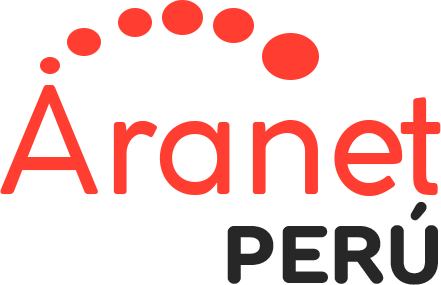
        </td>
    </tr>
    <tr>
        <td rowspan="2">Perfil</td>
        <td colspan="2">Overview</td>
        <td>Plataforma digital que monitorea temperatura y humedad en tiempo real durante el transporte de alimentos mediante sensores integrados, con alertas y registro histórico.</td>
        <td>Solución de monitoreo de flotas con sensores de temperatura y GPS para transporte en tiempo real.</td>
        <td>Plataforma global de monitoreo de cadena de frío con sensores IoT y análisis avanzado de datos.</td>
        <td>Sistema de sensores inalámbricos para monitoreo de temperatura y humedad en entornos controlados.</td>
    </tr>
    <tr>
        <td colspan="2">Ventaja competitiva ¿Qué valor ofrece a los clientes?</td>
        <td>Enfoque en transporte de alimentos, interfaz intuitiva, alertas en tiempo real y solución accesible para el mercado local.</td>
        <td>Integración con GPS y monitoreo de flotas en tiempo real.</td>
        <td>Alta precisión, tecnología avanzada y experiencia global.</td>
        <td>Implementación sencilla y sensores inalámbricos eficientes.</td>
    </tr>
    <tr>
        <td rowspan="2">Perfil de Marketing</td>
        <td colspan="2">Mercado objetivo</td>
        <td>Empresas de distribución de alimentos, operadores logísticos y supervisores de calidad.</td>
        <td>Empresas de transporte y logística en Perú.</td>
        <td>Empresas globales de logística, farmacéutica y alimentos.</td>
        <td>Empresas que requieren monitoreo ambiental (almacenes, industria).</td>
    </tr>
    <tr>
        <td colspan="2">Estrategias de marketing</td>
        <td>Enfoque en digitalización, eficiencia operativa y accesibilidad para empresas locales.</td>
        <td>Marketing B2B y soluciones integradas de flotas.</td>
        <td>Branding global, innovación tecnológica y posicionamiento premium.</td>
        <td>Marketing técnico enfocado en sensores y eficiencia.</td>
    </tr>
    <tr>
        <td rowspan="3">Perfil de Producto</td>
        <td colspan="2">Productos & Servicios.</td>
        <td>Aplicación web con monitoreo en tiempo real, alertas y registro histórico de envíos.</td>
        <td>Sistema de monitoreo con sensores y software de gestión de flotas.</td>
        <td>Dispositivos IoT + plataforma de monitoreo y análisis.</td>
        <td>Sensores inalámbricos + plataforma de monitoreo.</td>
    </tr>
    <tr>
        <td colspan="2">Precios & Costos</td>
        <td>Modelo accesible adaptable a empresas medianas y pequeñas.</td>
        <td>Costo medio-alto por implementación de hardware y software.</td>
        <td>Alto costo debido a tecnología avanzada.</td>
        <td>Costo medio dependiendo de sensores y sistema.</td>
    </tr>
    <tr>
        <td colspan="2">Canales de distribución (Web y/o Móvil)</td>
        <td>Web (escalable a móvil).</td>
        <td>Web y sistemas integrados.</td>
        <td>Web y plataformas empresariales.</td>
        <td>Web.</td>
    </tr>
    <tr>
        <td rowspan="5">Análisis SWOT</td>
    <tr>
        <td colspan="2">Fortalezas</td>
        <td>Fácil de usar, accesible, enfoque en transporte y monitoreo en tiempo real.</td>
        <td>Presencia local y monitoreo de flotas.</td>
        <td>Tecnología avanzada y reconocimiento global.</td>
        <td>Sensores precisos y fácil implementación.</td>
    </tr>
    <tr>
        <td colspan="2">Debilidades</td>
        <td>Startup nueva con baja presencia en el mercado.</td>
        <td>Enfoque técnico y menor usabilidad.</td>
        <td>Alto costo y complejidad.</td>
        <td>Menor enfoque en transporte.</td>
    </tr>
    <tr>
        <td colspan="2">Oportunidades</td>
        <td>Crecimiento del sector logístico y necesidad de control de calidad.</td>
        <td>Expansión en el mercado peruano.</td>
        <td>Expansión tecnológica global.</td>
        <td>Mayor adopción de IoT en industrias.</td>
    </tr>
    <tr>
        <td colspan="2">Amenazas</td>
        <td>Competidores consolidados y adopción lenta del mercado.</td>
        <td>Nuevas startups más accesibles.</td>
        <td>Competencia en precios y nuevas tecnologías.</td>
        <td>Competidores enfocados en transporte.</td>
    </tr>
</table>

### 2.1.2. Estrategias y tácticas frente a competidores

Para definir el posicionamiento de **ColdTrack** frente a la competencia, se ha desarrollado la siguiente matriz FODA Cruzada.

| **FODA CRUZADO** | &nbsp; | &nbsp; |
| :--- | :--- | :--- |
| **Factores Externos** | **Oportunidades (O)**<br>1. Crecimiento del sector logístico en Perú.<br>2. Regulaciones sanitarias más estrictas.<br>3. Disposición de Pymes para adoptar IoT.<br>4. Alianzas con gremios de transportistas. | **Amenazas (A)**<br>1. Competidores globales consolidados (Sensitech).<br>2. Resistencia al cambio tecnológico en conductores.<br>3. Competencia por precios bajos de sensores genéricos.<br>4. Inestabilidad de red móvil en zonas rurales. |
| **Fortalezas (F)**<br>1. Especialización exclusiva en alimentos.<br>2. Interfaz minimalista de fácil uso.<br>3. Costos reducidos para Pymes.<br>4. Soporte técnico local y personalizado. | **Estrategia (FO) — Ofensivas**<br>• **FO1 (F1, O2):** Posicionar a ColdTrack como el aliado para cumplir normativas sanitarias locales.<br>• **FO2 (F3, O3):** Capturar el mercado de Pymes con planes de suscripción accesibles.<br>• **FO3 (F2, O1):** Facilitar adopción en nuevas flotas con una interfaz sin fricciones técnicas. | **Estrategia (FA) — Defensivas**<br>• **FA1 (F1, A1):** Diferenciarse de generalistas destacando nuestro enfoque en la merma de alimentos.<br>• **FA2 (F2, A2):** Vencer la resistencia tecnológica con una app que facilite el trabajo del conductor.<br>• **FA3 (F4, A3):** Competir contra hardware genérico ofreciendo servicio post-venta local. |
| **Debilidades (D)**<br>1. Marca nueva con poca presencia.<br>2. Recursos limitados frente a corporaciones.<br>3. Dependencia de red en tiempo real.<br>4. Equipo de ventas reducido. | **Estrategia (DO) — Reorientación**<br>• **DO1 (D1, O4):** Ganar credibilidad rápida mediante convenios con asociaciones de transportistas.<br>• **DO2 (D3, O3):** Implementar almacenamiento offline en la app para sincronizar datos al recuperar señal.<br>• **DO3 (D4, O1):** Automatizar captación de clientes con marketing digital hiper-segmentado. | **Estrategia (DA) — Supervivencia**<br>• **DA1 (D2, A1):** Dominar nichos locales (ej. lácteos) antes de competir en licitaciones masivas.<br>• **DA2 (D1, A3):** Crear casos de éxito locales para generar confianza frente a opciones baratas.<br>• **DA3 (D3, A4):** Optimizar la app para que funcione con bajo consumo de datos en zonas rurales. |

## 2.2. Entrevistas

### 2.2.1. Diseno de entrevistas

<h4 id="Segment">Segmento objetivo: Personal de Logística y Operaciones</h4> 

<h4 id="PreguntPersonal">Preguntas Personales:</h4> 

¿Cuál es su nombre?

¿Cuál es su edad?

¿Cuál es su cargo o rol exacto dentro de la empresa?

¿Cuántos años de experiencia tiene en el sector logístico o control de calidad de alimentos?

---

<h4 id="PreguntEspe">Preguntas específicas:</h4> 

¿Cómo gestionan actualmente el monitoreo de temperatura y humedad en sus unidades de transporte?

¿Qué tipo de herramientas o sistemas utilizan en su día a día para este control (termómetros manuales, dataloggers, hojas de Excel, software)?

¿Cuáles son los principales problemas o frustraciones que enfrenta para garantizar que no se rompa la cadena de frío?

¿Ha tenido problemas recientes de pérdida de productos por fallas en la refrigeración que no se detectaron a tiempo?

¿Qué tan rápido pueden reaccionar actualmente frente a una emergencia de temperatura en medio de una ruta?

¿Qué información o métricas le resultaría más urgente visualizar en una plataforma en tiempo real?

¿Estaría dispuesto a implementar una nueva solución tecnológica si esta no requiere una instalación compleja de hardware?

¿Qué funcionalidades considera indispensables para que su equipo confíe en esta nueva plataforma?

---

<h4 id="Segment">Segmento objetivo: Personal de Transporte (Conductores)</h4> 

<h4 id="PreguntPersonal">Preguntas Personales:</h4> 

¿Cuál es su nombre?

¿Cuál es su edad?

¿Cuántos años de experiencia tiene manejando vehículos de transporte de carga refrigerada?

¿Qué tipo de alimentos perecibles suele transportar con mayor frecuencia?

---

<h4 id="PreguntEspe">Preguntas específicas:</h4> 

Durante un viaje, ¿cómo verifica actualmente que la temperatura de la cámara frigorífica se mantenga en los niveles correctos?

¿Qué tipo de aplicaciones móviles utiliza en su celular para facilitar su trabajo diario (GPS, WhatsApp, apps de la empresa)?

¿Cuáles son los principales problemas que enfrenta en la ruta respecto al cuidado de la carga?

¿Alguna vez se le ha dañado la mercadería por un cambio de temperatura que no notó a tiempo? ¿Cómo ocurrió?

Cuando ocurre una falla técnica con la refrigeración lejos de la base, ¿cuál es el protocolo que debe seguir?

¿Suele transitar por zonas donde la señal de internet o celular es inestable? ¿Cómo maneja la comunicación en esos casos?

Si tuviera una app que le avise de problemas con la temperatura, ¿cómo le gustaría que sea la alarma para que no lo distraiga mientras maneja?

¿Qué tendría que tener esta aplicación para que sienta que le ayuda en su trabajo y no que lo está complicando?

### 2.2.2. Registro de entrevistas
#### **Primer Segmento - Personal de Logística y Operaciones:** <br>

| **ENTREVISTA 1** |                            |
|------------------|----------------------------|
| **Nombre entrevistado** | Gianelly Vásquez |
| **Edad** | 27 |
| **Profesión** | supervisora de control de calidad |
| **Departamento** | Lima |
| **Inicio del video** | 00:00 |
| **Fin del video** | 03:58 |
| **Link del video** | https://upcedupe-my.sharepoint.com/:v:/g/personal/u202416908_upc_edu_pe/IQBXzX9sjMywR5oHRjJ8GAxeAdWlzKxOcQMLt52n6XrGGnc?e=VBNRJi&nav=eyJyZWZlcnJhbEluZm8iOnsicmVmZXJyYWxBcHAiOiJTdHJlYW1XZWJBcHAiLCJyZWZlcnJhbFZpZXciOiJTaGFyZURpYWxvZy1MaW5rIiwicmVmZXJyYWxBcHBQbGF0Zm9ybSI6IldlYiIsInJlZmVycmFsTW9kZSI6InZpZXcifX0%3D |
| **Foto entrevista** |  |
| **Resumen** | Gianelly Vásquez, supervisora de control de calidad en transporte de alimentos refrigerados que vive en Jesús María, actualmente gestiona el monitoreo de temperatura de forma manual usando termómetros digitales, dataloggers básicos y registros en Excel, sin contar con un sistema integrado en tiempo real, lo que genera dependencia del conductor y riesgo de errores humanos; su principal problema es la falta de visibilidad durante el trayecto, ya que las fallas en la cadena de frío suelen detectarse tarde, ocasionando pérdidas de productos, especialmente en rutas largas, y dificultando una reacción oportuna ante emergencias; por ello, considera que la solución ideal debería ofrecer monitoreo en tiempo real, alertas automáticas ante variaciones de temperatura, ubicación del vehículo, historial de datos y una interfaz fácil de usar desde el celular, creyendo que una aplicación como ColdTrack podría mejorar el control, reducir pérdidas y optimizar la operación logística. |

| **ENTREVISTA 2**        |                                                                    |
|-------------------------|--------------------------------------------------------------------|
| **Nombre entrevistado** | Gianmarco Palacios                                                 |
| **Edad**                | 33                                                                 |
| **Profesión**           | Encargado de area de abastecimiento                                |
| **Departamento**        | Arequipa                                                           |
| **Inicio del video**    | 03:59                                                              |
| **Fin del video**       | 09:21                                                              |
| **Link del video**      | https://upcedupe-my.sharepoint.com/:v:/g/personal/u202416908_upc_edu_pe/IQBXzX9sjMywR5oHRjJ8GAxeAdWlzKxOcQMLt52n6XrGGnc?e=VBNRJi&nav=eyJyZWZlcnJhbEluZm8iOnsicmVmZXJyYWxBcHAiOiJTdHJlYW1XZWJBcHAiLCJyZWZlcnJhbFZpZXciOiJTaGFyZURpYWxvZy1MaW5rIiwicmVmZXJyYWxBcHBQbGF0Zm9ybSI6IldlYiIsInJlZmVycmFsTW9kZSI6InZpZXcifX0%3D                                                               |
| **Foto entrevista**     |  |
| **Resumen** | Gianmarco Palacios, con 5 años de experiencia en logística, gestiona el monitoreo de temperatura y humedad mediante sensores y módulos integrados ("in-house"). Su principal problema es la pérdida de conectividad y la demora en el envío de información en ciertas rutas, lo que dificulta el control total de la cadena de frío. Aunque no ha tenido incidentes críticos recientemente, reporta pérdidas de productos 1 o 2 veces al mes debido a fallas en el sistema o envíos incorrectos. Está abierto a implementar nuevas soluciones tecnológicas siempre que sean eficaces y de baja complejidad de hardware. Considera indispensable que una plataforma ofrezca alertas en tiempo real multicanal (app y mensajería como WhatsApp) para permitir una reacción oportuna ante cualquier contingencia. |

| **ENTREVISTA 3** | |
|------------------|----------------------------|
| **Nombre entrevistado** | Carlos Ramirez |
| **Edad** | 26 |
| **Profesión** | Jefe de operaciones de Logística |
| **Departamento** | Lima |
| **Inicio del video** | 09:22 |
| **Fin del video** | 15:11 |
| **Link del video** | ---- |
| **Foto entrevista** |  |
| **Resumen** | Carlos Ramírez, jefe de operaciones de logística en la empresa Transportes Valle S.A.C., de 26 años y con base en Lima, actualmente enfrenta dificultades en la gestión de sus operaciones debido a la falta de monitoreo en tiempo real durante el transporte; esta limitación le impide tener visibilidad inmediata sobre el estado de las unidades y la trazabilidad de los procesos logísticos, generando dependencia de reportes manuales o comunicación directa con los conductores, lo que incrementa el riesgo de retrasos, errores y una toma de decisiones tardía ante incidencias en ruta; su principal problema radica en la ausencia de un sistema que le permita supervisar de manera continua y centralizada las operaciones, lo cual afecta la eficiencia y el control operativo; por ello, considera que una solución ideal debería incluir monitoreo en tiempo real, geolocalización de vehículos, alertas automáticas ante desviaciones o incidentes, y acceso a información desde dispositivos móviles, ya que una herramienta como ColdTrack podría optimizar la gestión logística, mejorar la capacidad de respuesta y fortalecer el control de las operaciones. |

#### **Segundo Segmento - Personal de Transporte:** <br>

| **ENTREVISTA 1** |                            |
|------------------|----------------------------|
| **Nombre entrevistado** | Edery Abanto |
| **Edad** | 30 |
| **Profesión** | personal de transporte |
| **Departamento** | Lima |
| **Inicio del video** | 15:12 |
| **Fin del video** | 20:42 |
| **Link del video** | https://upcedupe-my.sharepoint.com/:v:/g/personal/u202416908_upc_edu_pe/IQBXzX9sjMywR5oHRjJ8GAxeAdWlzKxOcQMLt52n6XrGGnc?e=VBNRJi&nav=eyJyZWZlcnJhbEluZm8iOnsicmVmZXJyYWxBcHAiOiJTdHJlYW1XZWJBcHAiLCJyZWZlcnJhbFZpZXciOiJTaGFyZURpYWxvZy1MaW5rIiwicmVmZXJyYWxBcHBQbGF0Zm9ybSI6IldlYiIsInJlZmVycmFsTW9kZSI6InZpZXcifX0%3D |
| **Foto entrevista** |  |
| **Resumen** | Edri Abanto, conductor de transporte de carga refrigerada de 30 años con 5 años de experiencia, encargado de trasladar productos perecibles como lácteos, embutidos y carnes frescas que requieren una cadena de frío estricta, actualmente monitorea la temperatura mediante un sistema integrado en la cabina que le permite visualizar el estado general sin detenerse, pero que no proporciona datos precisos, ni alertas preventivas, ni información en tiempo real compartible con la central, lo que genera una dependencia de la observación manual y aumenta el riesgo de no detectar fallas a tiempo; su principal problema es la inestabilidad de la temperatura durante la ruta debido a factores externos como el clima o paradas prolongadas, así como la falta de alertas automáticas ante fallas progresivas del sistema de refrigeración, lo que ya ha ocasionado pérdidas de mercadería en el pasado por detección tardía de incidentes; además, enfrenta limitaciones de conectividad en ciertas zonas, lo que dificulta la comunicación y el monitoreo continuo; por ello, considera que la solución ideal debería ofrecer alertas sonoras progresivas, indicadores visuales claros mediante códigos de color, monitoreo en tiempo real y una interfaz intuitiva que no requiera interacción constante, creyendo que una aplicación como ColdTrack podría brindarle mayor seguridad operativa, facilitar la toma de decisiones durante la ruta y reducir significativamente el riesgo de pérdida de productos. |

| **ENTREVISTA 2**        |                                                                    |
|-------------------------|--------------------------------------------------------------------|
| **Nombre entrevistado** | Fernando Perez                                                     |
| **Edad**                | 51                                                                 |
| **Profesión**           | personal de transporte                                             |
| **Departamento**        | Lima                                                               |
| **Inicio del video**    | 20:43                                                              |
| **Fin del video**       | 22:53                                                              |
| **Link del video**      | https://upcedupe-my.sharepoint.com/:v:/g/personal/u202416908_upc_edu_pe/IQBXzX9sjMywR5oHRjJ8GAxeAdWlzKxOcQMLt52n6XrGGnc?e=VBNRJi&nav=eyJyZWZlcnJhbEluZm8iOnsicmVmZXJyYWxBcHAiOiJTdHJlYW1XZWJBcHAiLCJyZWZlcnJhbFZpZXciOiJTaGFyZURpYWxvZy1MaW5rIiwicmVmZXJyYWxBcHBQbGF0Zm9ybSI6IldlYiIsInJlZmVycmFsTW9kZSI6InZpZXcifX0%3D                                                               |
| **Foto entrevista**     |  |
| **Resumen** | El entrevistado Fernando Perez, un transportista de 50 años que trabaja en la ruta Lima, explica que controla la temperatura de la carga revisando el termómetro y haciendo paradas para verificar su estado. Usa principalmente Google Maps y WhatsApp para su trabajo. Señala que los principales problemas son los cambios bruscos de temperatura, el tráfico y la falta de información inmediata ante fallas.|

### 2.2.3. Analisis de entrevistas


## 2.3. Needfinding

### 2.3.1. User Personas

<h5 id="SegUser">Segmento #1: Personal de Logística y Operaciones </h5>
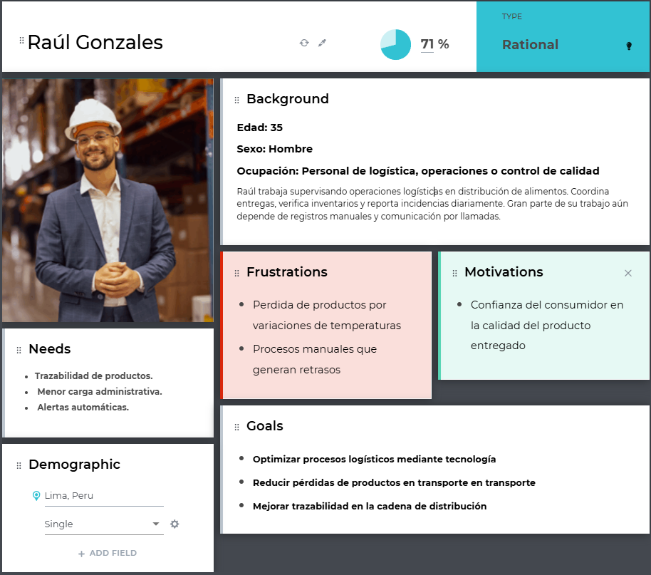

<h5 id="SegUser">Segmento #2: Personal de transporte </h5>
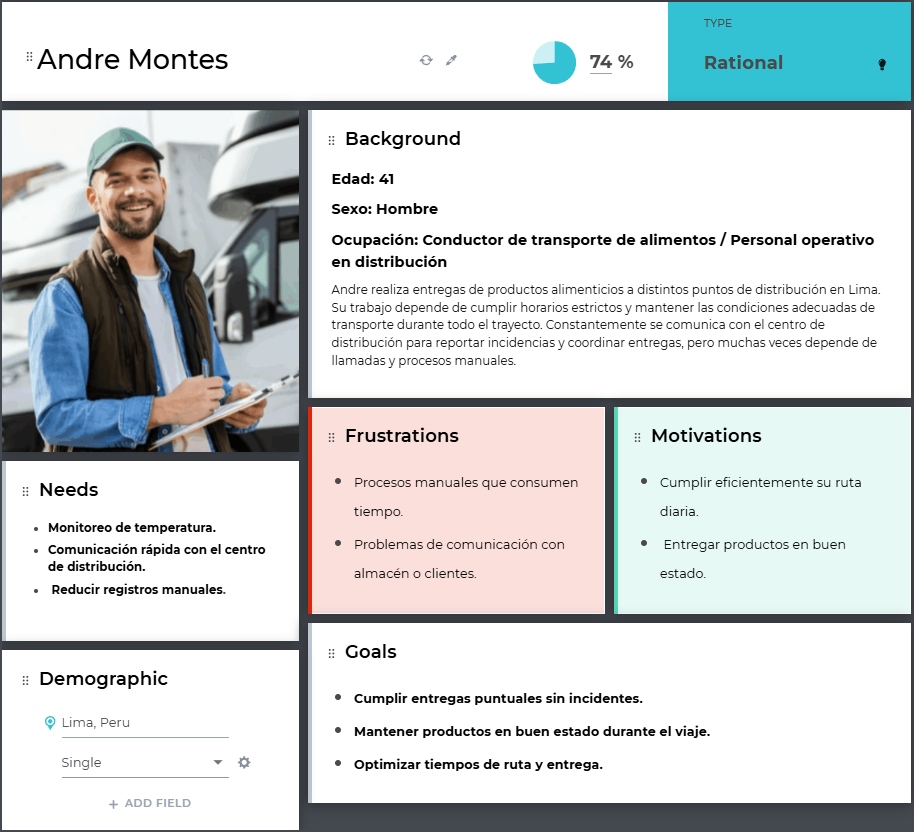

### 2.3.2. User Task Matrix

| **User Task** | **Personal de Logística y Operaciones** | **Personal de Transporte** |
|---------------|----------------------------|------------------------|
| Planificar rutas y tiempos | Frecuencia: Often          | Frecuencia: Rarely     |
| Monitorear condiciones de transporte | Frecuencia: Often          | Frecuencia: Often      |
| Analizar historial de envíos | Frecuencia: Often          | Frecuencia: Rarely     |
| Generar reportes de desempeño | Frecuencia: Often          | Frecuencia: Never      |
| Cumplir entregas puntuales | Frecuencia: Sometimes      | Frecuencia: Often      |
| Comunicar incidencias | Frecuencia: Often          | Frecuencia: Often      |
| Mantener condiciones óptimas de alimentos | Frecuencia: Sometimes      | Frecuencia: Often      |

### 2.3.3. User Journey Mapping

<h5 id="JourUser">Segmento #1: Personal de Logística y Operaciones </h5>
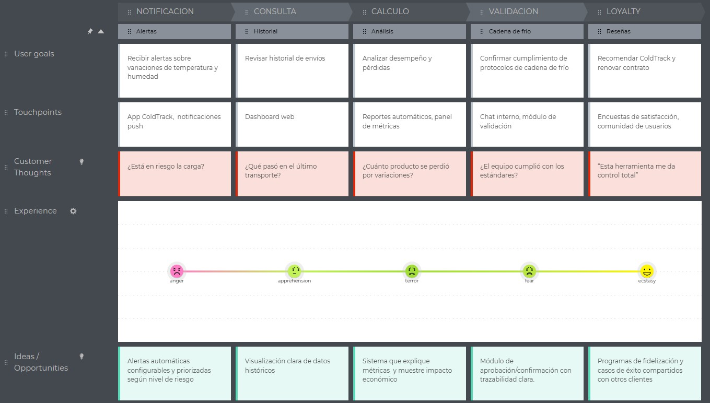

<h5 id="JourUser">Segmento #2: Personal de transporte </h5>


### 2.3.4. Empathy Mapping

**USER PERSONA: Raúl Gonzales**
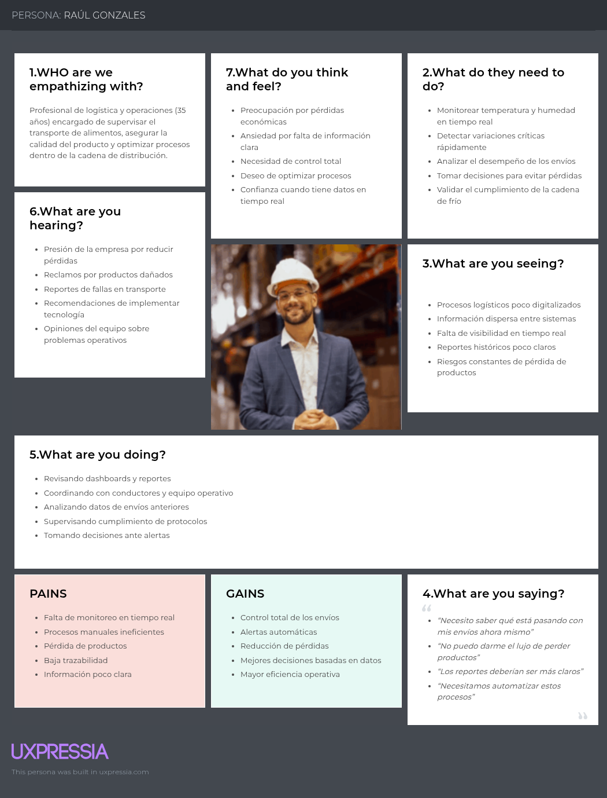

**USER PERSONA: Andre Montes**


### 2.3.5. As-is Scenario Mapping

**USER PERSONA: Raúl Gonzales**


**USER PERSONA: Andre Montes**


## 2.4. Ubiquitous Language

### Core Domain

- **Shipment (Envío):**  
  Conjunto de productos alimenticios que se trasladan desde un centro de distribución hasta un destino final.

- **Food Transportation (Transporte de Alimentos):**  
  Proceso logístico de traslado de alimentos asegurando que mantengan su calidad durante el trayecto.

- **Cold Chain (Cadena de Frío):**  
  Sistema de control que garantiza que los alimentos se mantengan dentro de condiciones de temperatura adecuadas durante todo el transporte.

- **Distribution Center (Centro de Distribución):**  
  Instalación donde se almacenan, preparan y despachan los productos para su envío.

- **Delivery Route (Ruta de Entrega):**  
  Recorrido que realiza la unidad de transporte desde el punto de origen hasta el destino.

---

### Monitoring and Conditions

- **Real-Time Monitoring (Monitoreo en Tiempo Real):**  
  Supervisión continua de las condiciones ambientales de un envío durante todo su trayecto.

- **Temperature (Temperatura):**  
  Nivel de calor dentro de la unidad de transporte que influye en la conservación de los alimentos.

- **Humidity (Humedad):**  
  Nivel de humedad presente en el ambiente del transporte que puede afectar la calidad del producto.

- **Environmental Conditions (Condiciones Ambientales):**  
  Conjunto de factores como temperatura y humedad que determinan el estado de los alimentos durante el transporte.

- **Optimal Range (Rango Óptimo):**  
  Valores adecuados de temperatura y humedad que garantizan la correcta conservación de los alimentos.

- **Condition Status (Estado de Condición):**  
  Situación actual del envío en función de sus condiciones ambientales (normal, advertencia o crítico).

---

### Alerts and Incidents

- **Alert (Alerta):**  
  Notificación generada cuando las condiciones del envío se alejan del rango óptimo.

- **Critical Alert (Alerta Crítica):**  
  Aviso que indica una situación grave que requiere acción inmediata para evitar pérdidas.

- **Warning Alert (Alerta de Advertencia):**  
  Notificación preventiva que indica un posible riesgo antes de llegar a una condición crítica.

- **Incident (Incidente):**  
  Evento que afecta o puede afectar negativamente el estado del envío.

- **Response Action (Acción de Respuesta):**  
  Medida tomada para corregir o mitigar un problema detectado durante el transporte.

---

### Traceability and Control

- **Traceability (Trazabilidad):**  
  Capacidad de rastrear y conocer el estado de un envío durante todo su recorrido.

- **Shipment History (Historial de Envío):**  
  Registro de las condiciones y eventos que ocurrieron durante el transporte de un envío.

- **Condition Check (Verificación de Condición):**  
  Revisión del estado ambiental del envío en un momento determinado.

---

### Stakeholders

- **Logistics Supervisor (Supervisor Logístico):**  
  Persona encargada de supervisar los envíos y asegurar que se cumplan las condiciones adecuadas.

- **Transport Personnel (Personal de Transporte):**  
  Persona responsable de trasladar físicamente los productos durante la ruta.

- **Quality Control Staff (Control de Calidad):**  
  Personal encargado de verificar que los productos cumplan con los estándares de calidad.

- **Distribution Company (Empresa Distribuidora):**  
  Organización responsable de gestionar el transporte de alimentos.

---

### Business Impact

- **Loss Event (Evento de Pérdida):**  
  Situación en la que los productos se deterioran debido a condiciones inadecuadas durante el transporte.

- **Loss Reduction (Reducción de Pérdidas):**  
  Disminución de productos dañados gracias a un mejor control de las condiciones.

- **Operational Efficiency (Eficiencia Operativa):**  
  Mejora en los procesos logísticos que permite optimizar tiempo, costos y recursos.

- **Food Safety (Seguridad Alimentaria):**  
  Garantía de que los alimentos llegan en condiciones aptas para el consumo.

- **Decision Making (Toma de Decisiones):**  
  Proceso de elegir acciones basadas en la información disponible sobre los envíos.

---

# Capitulo III: Requirements Specification

## 3.1. To-Be Scenario Mapping
1. Segmento 1: Personal de Logística y Operaciones.
 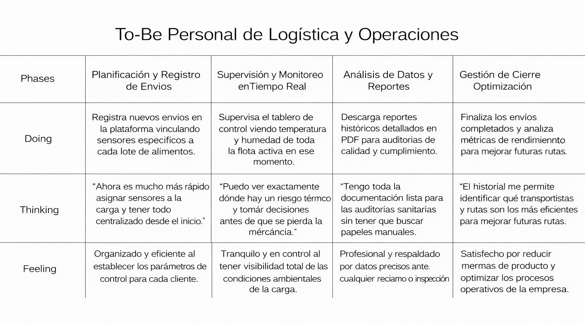
 
2. Segmento 2: Personal de Transporte.
 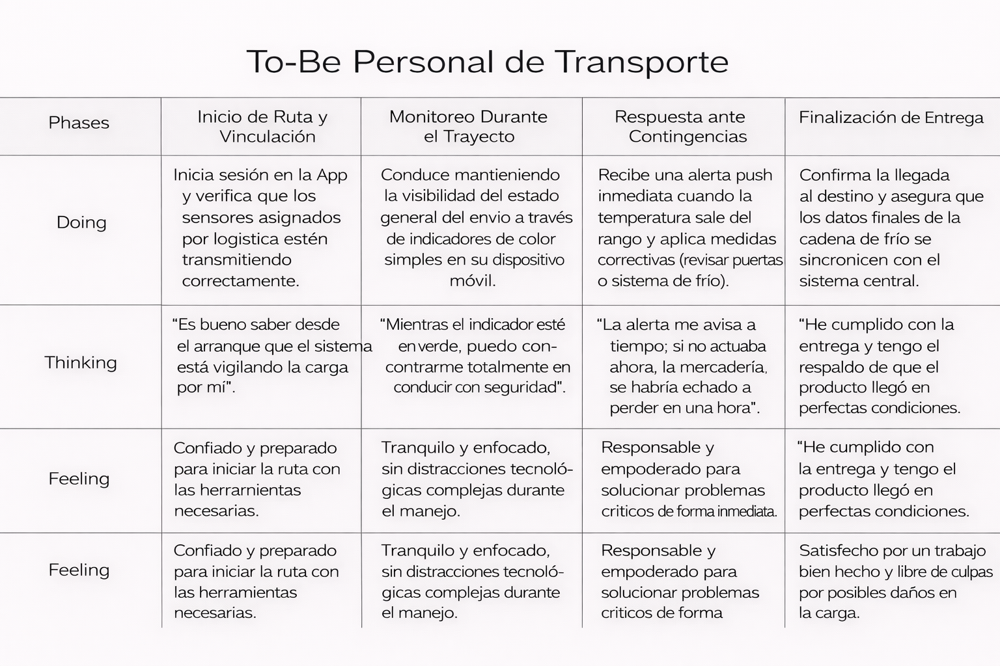

## 3.2. User Stories
En esta sección, estructuraremos nuestro proceso de desarrollo y aseguraremos de cubrir los os necesarios para satisfacer las necesidades del usuario.

A continuación, estableceremos las épicas, para luego detallarlas en historias de usuario. De este modo estableceremos los objetivos y funcionalidades.                                        

| Epic/Story ID | Título | Descripción | Criterios de Aceptación | Relacionado con (Epic ID) |
|---|---|---|---|---|
| EP-001 | Registro y Gestión de Usuarios | Como personal de logística y operaciones y personal de transporte<br>Quiero registrarme, iniciar sesión y gestionar mi cuenta de forma segura<br>Para acceder a las funcionalidades de ColdTrack según mi rol. | N/A | N/A |
| EP-002 | Gestión de Envíos | Como personal de logística y operaciones<br>Quiero crear, visualizar y gestionar envíos<br>Para mantener el control del transporte de alimentos desde el origen hasta el destino. | N/A | N/A |
| EP-003 | Monitoreo en Tiempo Real | Como personal de logística y operaciones y personal de transporte<br>Quiero visualizar en tiempo real la temperatura y humedad de los envíos mediante sensores<br>Para asegurar condiciones óptimas durante el transporte. | N/A | N/A |
| EP-004 | Sistema de Alertas | Como personal de logística y operaciones y personal de transporte<br>Quiero recibir alertas automáticas ante condiciones críticas de temperatura o humedad<br>Para tomar decisiones rápidas y evitar pérdidas de productos. | N/A | N/A |
| EP-005 | Historial y Reportes | Como personal de logística y operaciones y personal de transporte<br>Quiero acceder al historial de envíos y generar reportes<br>Para analizar el desempeño logístico y mejorar la trazabilidad. | N/A | N/A |
| EP-006 | Landing Page y Comunicación | Como visitante<br>Quiero acceder a información de la aplicación, conocer sus beneficios, contactar al equipo y visualizar testimonios<br>Para evaluar el uso de ColdTrack y resolver dudas. | N/A | N/A |
| US-001 | Registro de usuario | Como personal de logística y operaciones y personal de transporte<br>Quiero registrarme seleccionando mi rol<br>Para acceder a las funcionalidades correspondientes de ColdTrack. | Escenario 1: Registro como personal de logística y operaciones<br><br>Dado que el personal de logística y operaciones accede al formulario de registro<br>Cuando completa todos los datos correctamente y selecciona el rol “Logística”<br>Entonces el sistema registra la cuenta exitosamente<br>Y permite acceder a funcionalidades de supervisión.<br><br>Escenario 2: Registro como personal de transporte<br><br>Dado que el personal de transporte accede al formulario de registro<br>Cuando completa todos los datos correctamente y selecciona el rol “Transporte”<br>Entonces el sistema registra la cuenta exitosamente<br>Y permite acceder a funcionalidades en ruta. | EP-001 |
| US-002 | Inicio de sesión | Como personal de logística y operaciones y personal de transporte<br>Quiero iniciar sesión en el sistema<br>Para acceder de manera segura a mi cuenta y funcionalidades. | Escenario 1: Inicio exitoso<br><br>Dado que el personal de logística y operaciones o el personal de transporte se encuentra registrado en el sistema<br>Cuando ingresa sus credenciales correctamente<br>Entonces el sistema valida la información<br>Y permite el acceso al panel principal.<br><br>Escenario 2: Credenciales incorrectas<br><br>Dado que el personal de logística y operaciones o el personal de transporte ingresa datos inválidos<br>Cuando intenta iniciar sesión<br>Entonces el sistema muestra un mensaje de error<br>Y bloquea el acceso. | EP-001 |
| US-003 | Recuperar contraseña | Como personal de logística y operaciones y personal de transporte<br>Quiero recuperar mi contraseña<br>Para restablecer el acceso a mi cuenta en caso de olvido. | Escenario 1: Recuperación exitosa<br><br>Dado que el personal de logística y operaciones o el personal de transporte olvidó su contraseña<br>Cuando ingresa el correo registrado<br>Entonces el sistema envía un enlace de recuperación<br>Y permite restablecer la contraseña.<br><br>Escenario 2: Correo inválido<br><br>Dado que el correo ingresado no está registrado<br>Cuando se solicita la recuperación de contraseña<br>Entonces el sistema muestra un mensaje de error. | EP-001 |
| TS-001 | Crear usuario | Como sistema<br>Quiero registrar usuarios en la base de datos<br>Para permitir el acceso seguro a ColdTrack. | Escenario 1: Creación exitosa<br><br>Dado que el sistema recibe datos válidos de registro<br>Cuando procesa la solicitud<br>Entonces guarda la información del usuario en la base de datos<br>Y retorna una respuesta exitosa.<br><br>Escenario 2: Datos inválidos<br><br>Dado que faltan campos obligatorios en la solicitud<br>Cuando el sistema procesa la información<br>Entonces rechaza la operación<br>Y retorna un error. | EP-001 |
| TS-002 | Autenticación | Como sistema<br>Quiero validar las credenciales de acceso<br>Para garantizar la seguridad de los usuarios registrados. | Escenario 1: Autenticación válida<br><br>Dado que las credenciales coinciden con un usuario registrado<br>Cuando se realiza la validación<br>Entonces el sistema genera un token de acceso válido.<br><br>Escenario 2: Autenticación inválida<br><br>Dado que las credenciales no coinciden<br>Cuando se intenta autenticar<br>Entonces el sistema retorna un error de acceso. | EP-001 |
| US-004 | Crear envío | Como personal de logística y operaciones<br>Quiero registrar envíos<br>Para controlar el transporte de productos alimenticios. | Escenario 1: Registro exitoso<br><br>Dado que el personal de logística y operaciones completa todos los campos requeridos<br>Cuando registra el envío<br>Entonces el sistema guarda la información correctamente<br>Y el envío aparece en la lista de envíos activos.<br><br>Escenario 2: Datos incompletos<br><br>Dado que el personal de logística y operaciones deja campos obligatorios vacíos<br>Cuando intenta registrar el envío<br>Entonces el sistema muestra errores de validación<br>Y no permite el registro. | EP-002 |
| US-005 | Ver envíos activos | Como personal de logística y operaciones y personal de transporte<br>Quiero visualizar los envíos activos<br>Para monitorear el estado actual del transporte. | Escenario 1: Lista disponible<br><br>Dado que el personal de logística y operaciones o el personal de transporte accede a la sección de envíos<br>Y existen envíos registrados<br>Cuando visualiza la información<br>Entonces el sistema muestra la lista completa de envíos activos.<br><br>Escenario 2: Lista vacía<br><br>Dado que el personal de logística y operaciones o el personal de transporte accede a la sección de envíos<br>Y no existen envíos registrados<br>Cuando visualiza la información<br>Entonces el sistema muestra un mensaje indicando que no hay registros. | EP-002 |
| US-006 | Ver detalle del envío | Como personal de logística y operaciones y personal de transporte<br>Quiero visualizar el detalle de un envío<br>Para revisar temperatura, humedad y estado del transporte. | Escenario 1: Visualización correcta<br><br>Dado que el personal de logística y operaciones o el personal de transporte selecciona un envío<br>Cuando accede al detalle<br>Entonces el sistema muestra temperatura, humedad y estado del envío.<br><br>Escenario 2: Error de carga<br><br>Dado que ocurre un fallo en el sistema<br>Cuando se intenta visualizar el detalle del envío<br>Entonces el sistema muestra un mensaje de error. | EP-002 |
| TS-003 | CRUD envíos | Como sistema<br>Quiero gestionar operaciones de envíos<br>Para mantener actualizada la información logística. | Escenario 1: Consulta exitosa<br><br>Dado que existen envíos registrados en la base de datos<br>Cuando el sistema realiza una consulta<br>Entonces retorna correctamente la lista de envíos.<br><br>Escenario 2: Error interno<br><br>Dado que ocurre un fallo en el servidor<br>Cuando el sistema realiza la consulta<br>Entonces retorna un error. | EP-002 |
| US-007 | Asignar sensor a envío | Como personal de logística y operaciones<br>Quiero vincular sensores a los envíos<br>Para monitorear las condiciones del transporte en tiempo real. | Escenario 1: Asignación correcta<br><br>Dado que el personal de logística y operaciones selecciona un sensor válido<br>Cuando lo vincula a un envío<br>Entonces el sistema asocia correctamente el sensor.<br><br>Escenario 2: Sensor inválido<br><br>Dado que el sensor no existe o no está disponible<br>Cuando el personal de logística y operaciones intenta vincularlo<br>Entonces el sistema muestra un error. | EP-002 |
| US-008 | Finalizar envío | Como personal de logística y operaciones<br>Quiero finalizar un envío<br>Para registrar el cierre del transporte y enviarlo al historial. | Escenario 1: Finalización exitosa<br><br>Dado que el envío ha concluido correctamente<br>Cuando el personal de logística y operaciones lo finaliza<br>Entonces el sistema cambia el estado a “Completado”<br>Y envía el registro al historial.<br><br>Escenario 2: Error en cierre<br><br>Dado que ocurre un fallo durante el proceso<br>Cuando el personal de logística y operaciones intenta finalizar el envío<br>Entonces el sistema no guarda los cambios. | EP-002 |
| TS-004 | Asignación sensor | Como sistema<br>Quiero vincular sensores válidos a los envíos<br>Para permitir el monitoreo continuo de las condiciones del transporte. | Escenario 1: Asignación válida<br><br>Dado que el sensor existe en el sistema<br>Cuando se realiza la vinculación con un envío<br>Entonces el sistema asocia correctamente el sensor.<br><br>Escenario 2: Error<br><br>Dado que el sensor no es válido<br>Cuando el sistema intenta asignarlo<br>Entonces retorna un error. | EP-002 |
| US-009 | Ver temperatura en tiempo real | Como personal de logística y operaciones y personal de transporte<br>Quiero visualizar la temperatura en tiempo real<br>Para asegurar que los productos se mantengan en condiciones óptimas. | Escenario 1: Datos en tiempo real<br><br>Dado que el sensor se encuentra activo<br>Cuando el personal de logística y operaciones o el personal de transporte accede al monitoreo<br>Entonces el sistema muestra la temperatura actualizada.<br><br>Escenario 2: Sin conexión<br><br>Dado que el sensor deja de enviar datos<br>Cuando se accede al monitoreo<br>Entonces el sistema muestra una advertencia de conexión. | EP-003 |
| US-010 | Ver humedad en tiempo real | Como personal de logística y operaciones y personal de transporte<br>Quiero visualizar la humedad del envío<br>Para verificar las condiciones adecuadas de transporte. | Escenario 1: Visualización correcta<br><br>Dado que el sensor funciona correctamente<br>Cuando el personal de logística y operaciones o el personal de transporte accede al monitoreo<br>Entonces el sistema muestra el porcentaje de humedad actualizado.<br><br>Escenario 2: Error de sensor<br><br>Dado que el sensor no envía información<br>Cuando se accede al monitoreo<br>Entonces el sistema muestra una alerta de error. | EP-003 |
| US-011 | Estado del envío | Como personal de logística y operaciones y personal de transporte<br>Quiero visualizar el estado general del envío<br>Para identificar posibles riesgos durante el transporte. | Escenario 1: Estado normal<br><br>Dado que las condiciones del envío están dentro del rango permitido<br>Cuando el sistema analiza los datos<br>Entonces muestra un estado óptimo.<br><br>Escenario 2: Estado crítico<br><br>Dado que los valores superan los límites establecidos<br>Cuando el sistema evalúa la información<br>Entonces muestra un estado de alerta. | EP-003 |
| US-012 | Visualizar gráficos históricos | Como personal de logística y operaciones<br>Quiero visualizar gráficos históricos de monitoreo<br>Para analizar el comportamiento de temperatura y humedad. | Escenario 1: Datos disponibles<br><br>Dado que existen registros históricos de monitoreo<br>Cuando el personal de logística y operaciones accede a los gráficos<br>Entonces el sistema muestra la información visual.<br><br>Escenario 2: Sin datos<br><br>Dado que no existen registros históricos<br>Cuando se accede a la sección de gráficos<br>Entonces el sistema muestra un mensaje informativo. | EP-003 |
| TS-005 | Integración IoT | Como sistema<br>Quiero recibir datos de sensores IoT<br>Para almacenar y procesar información de monitoreo. | Escenario 1: Recepción válida<br><br>Dado que el sensor IoT envía información correctamente<br>Cuando el sistema recibe los datos<br>Entonces los almacena en la base de datos.<br><br>Escenario 2: Datos inválidos<br><br>Dado que los datos recibidos están corruptos<br>Cuando el sistema procesa la información<br>Entonces descarta los datos inválidos. | EP-003 |
| TS-006 | Tiempo real | Como sistema<br>Quiero utilizar WebSockets para actualizar información en tiempo real<br>Para mantener sincronizados los datos de monitoreo. | Escenario 1: Conexión activa<br><br>Dado que existe una conexión WebSocket establecida<br>Cuando llegan nuevos datos de monitoreo<br>Entonces el sistema actualiza la información en tiempo real.<br><br>Escenario 2: Desconexión<br><br>Dado que la conexión se pierde<br>Cuando el sistema detecta la desconexión<br>Entonces intenta reconectarse automáticamente. | EP-003 |
| US-013 | Alertas de temperatura | Como personal de logística y operaciones y personal de transporte<br>Quiero recibir alertas automáticas<br>Para actuar rápidamente ante cambios críticos de temperatura. | Escenario 1: Alerta generada<br><br>Dado que el sistema detecta que la temperatura supera los límites establecidos<br>Cuando analiza los datos recibidos por los sensores<br>Entonces genera una alerta<br>Y notifica al personal de logística y operaciones y al personal de transporte.<br><br>Escenario 2: Condición normal<br><br>Dado que las condiciones del envío se mantienen dentro del rango permitido<br>Cuando el sistema monitorea los sensores<br>Entonces no se genera ninguna alerta. | EP-004 |
| US-014 | Notificación al conductor | Como personal de transporte<br>Quiero recibir notificaciones inmediatas<br>Para responder rápidamente ante incidencias durante la ruta. | Escenario 1: Recepción correcta<br><br>Dado que se genera una alerta crítica<br>Cuando el sistema envía la notificación<br>Entonces el personal de transporte la recibe en su dispositivo.<br><br>Escenario 2: Sin conexión<br><br>Dado que el dispositivo del personal de transporte no tiene conexión<br>Cuando se genera una alerta<br>Entonces el sistema almacena la notificación y la envía posteriormente. | EP-004 |
| US-015 |  Ver historial de alertas | Como personal de logística y operaciones y personal de transporte<br>Quiero visualizar alertas pasadas<br>Para revisar incidencias registradas anteriormente. | Escenario 1: Registros disponibles<br><br>Dado que existen alertas registradas<br>Cuando el personal de logística y operaciones o el personal de transporte accede al historial<br>Entonces el sistema muestra la lista de alertas.<br><br>Escenario 2: Sin registros<br><br>Dado que no existen alertas registradas<br>Cuando se accede al historial<br>Entonces el sistema muestra un mensaje vacío. | EP-004 |
| TS-007 | Motor alertas | Como sistema<br>Quiero detectar anomalías automáticamente<br>Para generar alertas cuando los valores estén fuera de rango. | Escenario 1: Detección de error<br><br>Dado que un valor se encuentra fuera del rango permitido<br>Cuando el sistema analiza los datos de monitoreo<br>Entonces genera una alerta automáticamente.<br><br>Escenario 2: Sin anomalías<br><br>Dado que los valores son correctos<br>Cuando el sistema analiza la información<br>Entonces no ejecuta ninguna acción. | EP-004 |
| TS-008 | Notificaciones | Como sistema<br>Quiero enviar notificaciones automáticas<br>Para informar incidencias a los usuarios correspondientes. | Escenario 1: Envío exitoso<br><br>Dado que existe una alerta generada<br>Cuando el sistema envía la notificación<br>Entonces el destinatario la recibe correctamente.<br><br>Escenario 2: Error de envío<br><br>Dado que ocurre un fallo en el envío<br>Cuando el sistema intenta enviar la notificación<br>Entonces reintenta automáticamente el proceso. | EP-004 |
| US-016 | Ver historial de envíos | Como personal de logística y operaciones y personal de transporte<br>Quiero revisar el historial de envíos<br>Para consultar información de transportes anteriores. | Escenario 1: Historial disponible<br><br>Dado que existen registros históricos de envíos<br>Cuando el personal de logística y operaciones o el personal de transporte accede al historial<br>Entonces el sistema muestra la lista de envíos.<br><br>Escenario 2: Sin historial<br><br>Dado que no existen registros históricos<br>Cuando se accede al historial<br>Entonces el sistema muestra un mensaje informativo. | EP-005 |
| US-017 | Descargar reporte | Como personal de logística y operaciones<br>Quiero exportar reportes de envíos<br>Para analizar información logística y compartir resultados. | Escenario 1: Descarga exitosa<br><br>Dado que existen datos disponibles en el sistema<br>Cuando el personal de logística y operaciones solicita un reporte<br>Entonces el sistema genera un archivo descargable correctamente.<br><br>Escenario 2: Error<br><br>Dado que ocurre un fallo durante la generación del reporte<br>Cuando se solicita la descarga<br>Entonces el sistema muestra un mensaje de error. | EP-005 |
| US-018 | Filtrar historial | Como personal de logística y operaciones y personal de transporte<br>Quiero filtrar registros del historial<br>Para encontrar información específica rápidamente. | Escenario 1: Filtro aplicado<br><br>Dado que el personal de logística y operaciones o el personal de transporte selecciona criterios de búsqueda<br>Cuando aplica el filtro<br>Entonces el sistema muestra resultados filtrados.<br><br>Escenario 2: Sin coincidencias<br><br>Dado que no existen registros que coincidan con los filtros<br>Cuando se aplica la búsqueda<br>Entonces el sistema muestra un mensaje informativo. | EP-005 |
| TS-009 | Guardar historial | Como sistema<br>Quiero persistir datos históricos<br>Para almacenar información de envíos finalizados. | Escenario 1: Guardado correcto<br><br>Dado que existen datos válidos de un envío finalizado<br>Cuando el sistema almacena la información<br>Entonces guarda correctamente el historial.<br><br>Escenario 2: Error<br><br>Dado que ocurre un fallo durante el almacenamiento<br>Cuando el sistema intenta guardar la información<br>Entonces registra el error correspondiente. | EP-005 |
| TS-010 | Exportar PDF | Como sistema<br>Quiero generar reportes en PDF<br>Para permitir la descarga y análisis de información logística. | Escenario 1: Generación exitosa<br><br>Dado que existen datos disponibles para exportar<br>Cuando el sistema genera el reporte PDF<br>Entonces crea correctamente el archivo descargable.<br><br>Escenario 2: Error<br><br>Dado que ocurre un fallo en la generación del documento<br>Cuando el sistema intenta exportar el PDF<br>Entonces muestra un mensaje de error. | EP-005 |
| US-019 | Ver información de la app (Landing) | Como visitante<br>Quiero conocer información sobre ColdTrack<br>Para entender el propósito y beneficios de la aplicación. | Escenario 1: Información visible<br><br>Dado que el visitante accede a la landing page<br>Cuando navega por la plataforma<br>Entonces visualiza información clara sobre ColdTrack.<br><br>Escenario 2: Comprensión<br><br>Dado que el visitante revisa el contenido de la página<br>Cuando analiza la información mostrada<br>Entonces comprende los beneficios del sistema. | EP-006 |
| US-020 | Ver testimonios | Como visitante<br>Quiero visualizar testimonios de usuarios<br>Para conocer experiencias relacionadas con ColdTrack. | Escenario 1: Visualización<br><br>Dado que existen testimonios registrados<br>Cuando el visitante accede a la sección correspondiente<br>Entonces el sistema muestra los testimonios disponibles.<br><br>Escenario 2: Navegación<br><br>Dado que existen múltiples testimonios<br>Cuando el visitante interactúa con la sección<br>Entonces puede desplazarse entre ellos correctamente. | EP-006 |
| US-021 | Formulario de contacto | Como visitante<br>Quiero comunicarme con el equipo de ColdTrack<br>Para resolver dudas o solicitar información adicional. | Escenario 1: Envío correcto<br><br>Dado que el visitante completa el formulario de contacto<br>Cuando envía el mensaje<br>Entonces el sistema registra correctamente la información.<br><br>Escenario 2: Error<br><br>Dado que faltan campos obligatorios en el formulario<br>Cuando el visitante intenta enviarlo<br>Entonces el sistema muestra errores de validación. | EP-006 |
| US-022 | Ver equipo de desarrollo | Como visitante<br>Quiero visualizar a los integrantes del equipo<br>Para generar confianza y credibilidad en el proyecto. | Escenario 1: Visualización<br><br>Dado que el visitante accede a la sección del equipo<br>Cuando la página carga correctamente<br>Entonces el sistema muestra a los integrantes del proyecto.<br><br>Escenario 2: Error<br><br>Dado que ocurre un fallo durante la carga<br>Cuando el visitante accede a la sección<br>Entonces el sistema muestra un mensaje alternativo. | EP-006 |
| US-023 | Ver funcionalidades del sistema | Como visitante<br>Quiero conocer las funcionalidades principales del sistema<br>Para comprender el valor de ColdTrack. | Escenario 1: Visualización<br><br>Dado que el visitante accede a la sección de funcionalidades<br>Cuando navega por la página<br>Entonces el sistema muestra las principales características de ColdTrack.<br><br>Escenario 2: Comprensión<br><br>Dado que el visitante revisa la información disponible<br>Cuando analiza las funcionalidades mostradas<br>Entonces comprende el valor de la aplicación. | EP-006 |
| TS-011 | Formulario contacto | Como sistema<br>Quiero almacenar mensajes enviados desde el formulario de contacto<br>Para gestionar consultas de usuarios interesados. | Escenario 1: Guardado correcto<br><br>Dado que el sistema recibe datos válidos desde el formulario<br>Cuando procesa la solicitud<br>Entonces almacena correctamente el mensaje.<br><br>Escenario 2: Error<br><br>Dado que los datos enviados son inválidos<br>Cuando el sistema procesa la información<br>Entonces rechaza la solicitud. | EP-006 |
| TS-012 | Testimonios API | Como sistema<br>Quiero listar testimonios mediante una API<br>Para mostrar experiencias de usuarios en la landing page. | Escenario 1: Datos disponibles<br><br>Dado que existen testimonios registrados en la base de datos<br>Cuando el sistema consulta la API<br>Entonces retorna correctamente la lista de testimonios.<br><br>Escenario 2: Sin datos<br><br>Dado que no existen testimonios registrados<br>Cuando el sistema consulta la API<br>Entonces retorna una lista vacía. | EP-006 |


## 3.3. Impact Mapping
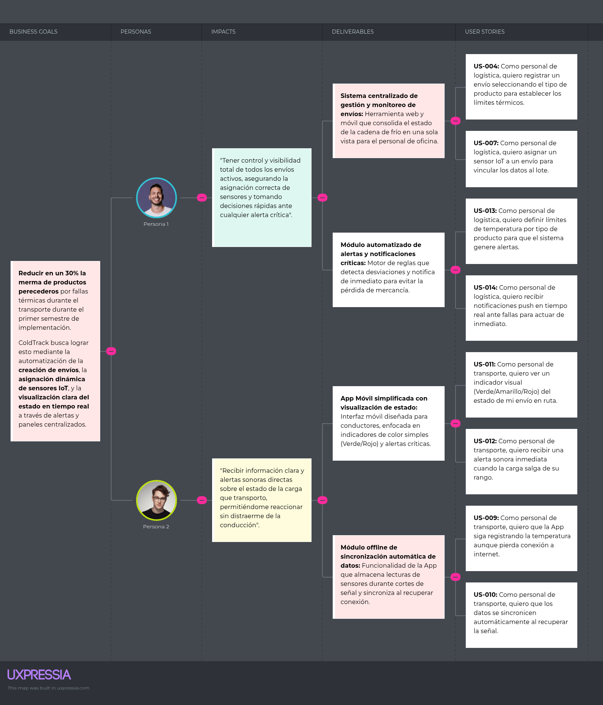

## 3.4. Product Backlog

| Prioridad | User Story ID | Título HU | Story Points |
|----------|--------------|----------|-------------|
| 1 | US-001 | Registro de usuario | 5 |
| 2 | US-002 | Inicio de sesión | 5 |
| 3 | US-004 | Crear envío | 8 |
| 4 | US-007 | Asignar sensor a envío | 8 |
| 5 | US-009 | Ver temperatura en tiempo real | 8 |
| 6 | US-010 | Ver humedad en tiempo real | 8 |
| 7 | US-013 | Alertas de temperatura | 8 |
| 8 | US-014 | Notificación al conductor | 5 |
| 9 | US-006 | Ver detalle del envío | 5 |
| 10 | US-011 | Estado del envío | 5 |
| 11 | US-005 | Ver envíos activos | 5 |
| 12 | US-008 | Finalizar envío | 5 |
| 13 | US-012 | Visualizar gráficos históricos | 8 |
| 14 | US-015 | Ver historial de alertas | 5 |
| 15 | US-016 | Ver historial de envíos | 5 |
| 16 | US-018 | Filtrar historial | 5 |
| 17 | US-003 | Recuperar contraseña | 3 |
| 18 | US-017 | Descargar reporte | 8 |
| 19 | US-019 | Ver información de la app (Landing) | 3 |
| 20 | US-020 | Ver testimonios | 3 |
| 21 | US-021 | Formulario de contacto | 3 |
| 22 | US-022 | Ver equipo de desarrollo | 2 |
| 23 | US-023 | Ver funcionalidades del sistema | 3 |


# Capítulo IV: Product Design

## 4.1. Style Guidelines

En esta sección, detallamos los lineamientos de diseño, estilo y apariencia visual de la plataforma ColdTrack. El objetivo es garantizar una interfaz intuitiva que permita a los supervisores logísticos y conductores monitorear datos críticos de temperatura sin distracciones. Para ello, hemos optado por una estética moderna y funcional, utilizando elementos visuales claros que facilitan la toma de decisiones rápida.

### 4.1.1. General Style Guidelines

**Branding:** El logotipo de **ColdTrack** ha sido diseñado para reflejar tecnología y seguridad en la cadena de frío. Los colores seleccionados transmiten profesionalismo y confianza, reforzando la identidad de una solución robusta.

<p align="center">
  
</p>

**Tono de Comunicación:**
- **Analítico y Profesional:** Para brindar seguridad sobre la precisión de los datos de los sensores.
- **Directo y Preventivo:** Uso de alertas claras para facilitar la reacción inmediata ante cambios en la temperatura.
- **Eficiente:** Enfocado en la reducción de mermas y la optimización de la logística.

**Tipografía:** Para garantizar un rendimiento óptimo y una apariencia integrada en cualquier sistema operativo, ColdTrack utiliza una **pila de fuentes nativas (System Fonts)**. Esto permite que la aplicación se sienta familiar y sea altamente legible tanto en dispositivos móviles como en escritorio, utilizando fuentes como -apple-system, BlinkMacSystemFont (macOS/iOS), Segoe UI (Windows) y Roboto (Android).

**Colores de Marca:**
Basándonos en la implementación actual de la Landing Page, la paleta se define por los siguientes códigos hexadecimales:
- **Primario (#0052CC):** Azul corporativo que representa confianza y frío controlado.
- **Secundario (#F5F5F5):** Gris claro para fondos de secciones y tarjetas.
- **Oscuro (#0F1117):** Color para el footer y elementos de alto contraste.
- **Éxito (#10B981):** Verde para estados "Normales" de los envíos.
- **Advertencia (#F59E0B):** Ámbar para alertas preventivas en el dashboard.

**Paleta de Colores:**

| Color | Código Hex | Uso Principal |
| :--- | :--- | :--- |
| Primario | #0052CC | Identidad de marca, botones CTA y navegación. |
| Secundario | #F5F5F5 | Fondos de secciones y tarjetas de características. |
| Oscuro | #0F1117 | Fondo de Footer y elementos de contraste. |
| Éxito | #10B981 | Indicadores de estado óptimo (Badge Normal). |
| Advertencia | #F59E0B | Alertas de temperatura (Badge Advertencia). |

**Espaciado y Distribución:** Se utiliza un diseño basado en contenedores (container) y una rejilla responsiva (shipments-grid). El espaciado generoso entre las tarjetas de "Envío" en el preview del dashboard asegura que el usuario pueda identificar rápidamente qué unidad requiere atención.

### 4.1.2. Web Style Guidelines

La plataforma **ColdTrack** está diseñada bajo un enfoque **Responsive**, asegurando que la visualización de los datos sea fluida en computadoras de escritorio, tablets y smartphones.

**Componentes Implementados:**

**Cabecera (Header):**
- **Navegación Fija (Sticky):** Permite acceso rápido a Características, Cómo Funciona y Beneficios.
- **Identidad:** Logo de ColdTrack y nombre de marca siempre visibles a la izquierda.
- **Acceso:** Botón de "Iniciar Sesión" destacado con fondo azul a la derecha.

**Hero Section:**
- **Propuesta de Valor:** Título principal centrado ("Monitoreo en Tiempo Real...") y descripción del impacto del producto en la calidad.
- **Dashboard Preview:** Representación visual con tarjetas individuales para envíos activos, mostrando métricas de temperatura en grados Celsius y porcentaje de humedad.

**Secciones Operativas:**
- **Características:** Tres pilares con iconos minimalistas: Monitoreo en Tiempo Real, Alertas Automáticas e Historial Detallado.
- **Cómo Funciona:** Proceso numerado del 1 al 4 (Instalación, Transmisión, Monitoreo y Reportes).
- **Beneficios:** Sección con fondo azul sólido y tarjetas translúcidas que destacan la Eficiencia, Reducción de Riesgos y Decisiones Rápidas.

---

## 4.2. Information Architecture

### 4.2.1. Organization Systems

Hemos implementado una **Estructura Jerárquica (Tree Structure)** basada en la navegación por secciones:

* **Estructura de la Landing Page:**
  * **Inicio (Hero):** Captación y visión general del dashboard.
  * **Características:** Detalle técnico de las capacidades del sistema.
  * **Proceso (Cómo Funciona):** Guía paso a paso de la implementación IoT.
  * **Valor (Beneficios):** Impacto directo en la operación logística.

* **Estructura del Dashboard:**
  * **Raíz:** Monitoreo en Vivo (Resumen de envíos activos).
  * **Nivel 1:** Tarjetas de Envío (ID, Estado con Badges de color, Temperatura, Humedad).

### 4.2.2. Labeling Systems

El sistema de etiquetado utiliza términos claros para evitar ambigüedades operativas:
- **"Dashboard - Monitoreo en Vivo":** Define el área de trabajo en tiempo real.
- **"Normal" / "Advertencia":** Etiquetas de estado (Badges) con colores verde y naranja respectivamente.
- **"Envío #XXXX":** Identificador único para trazabilidad de carga.

### 4.2.3. SEO Tags and Meta Tags

- **Title:** ColdTrack - Monitoreo en Tiempo Real para el Transporte de Alimentos.
- **Description:** Asegura la calidad de tus productos con control de temperatura y humedad en cada etapa del transporte.
- **Keywords:** monitoreo de alimentos, cadena de frío, sensores IoT, transporte refrigerado.
- **Meta Tags:** Viewport configurado para escalabilidad (width=device-width, initial-scale=1.0).

### 4.2.4. Searching Systems

- **Navegación Anclada:** Enlaces internos en el Header (#caracteristicas, #como-funciona, #beneficios) que permiten un desplazamiento suave (smooth scroll) hacia las secciones correspondientes.

### 4.2.5. Navigation Systems

- **Sticky Navbar:** Menú superior fijo que mantiene el acceso al login y a las secciones durante todo el recorrido.
- **Call to Action (CTA):** Botones principales ("Comenzar Ahora") con alta visibilidad para guiar la conversión del usuario.


## 4.3. Landing Page UI Design

### 4.3.1. Landing Page Wireframe

<p align="center">
  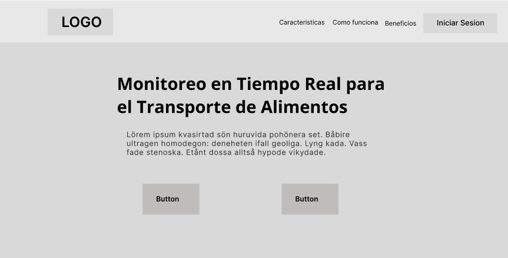
</p>


<p align="center">
  
</p>

### 4.3.2. Landing Page Mock-up

**Sección Hero y Detalles del Dashboard:**
Visualización principal de la propuesta de valor y estados de monitoreo activos.

<p align="center">
  
</p>

**Características y Funcionamiento:**
Explicación de las capacidades técnicas y el flujo de implementación del sistema.

<p align="center">
  
</p>

**Beneficios y Footer:**
Sección de impacto operativo y enlaces de navegación secundaria.

<p align="center">
  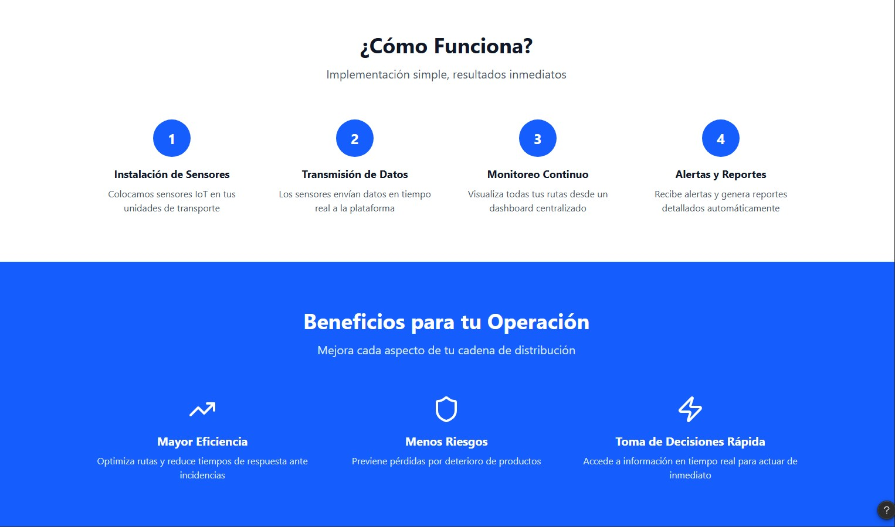
</p>

<p align="center">
  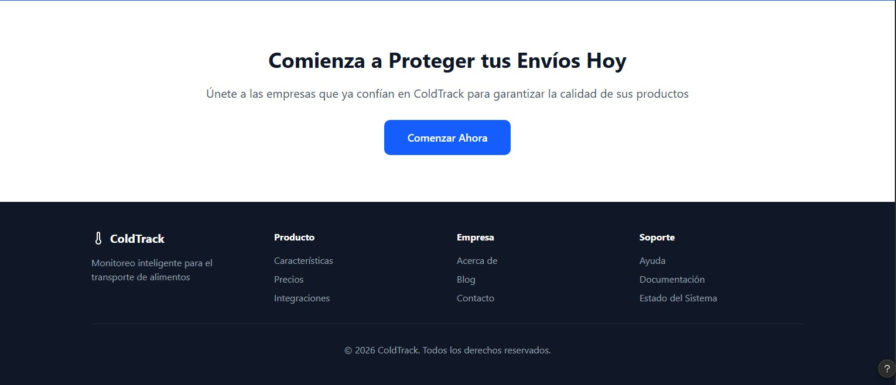
</p>

## 4.4. Web Applications UX/UI Design

### 4.4.1. Web Applications Wireframes

<p align="center">
  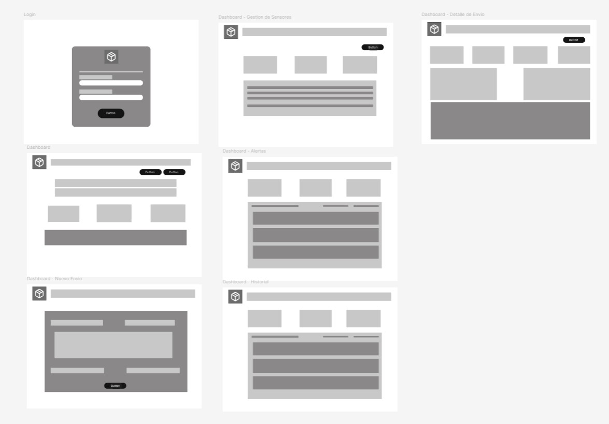
</p>

### 4.4.2. Web Applications Wireflow Diagrams

<p align="center">
  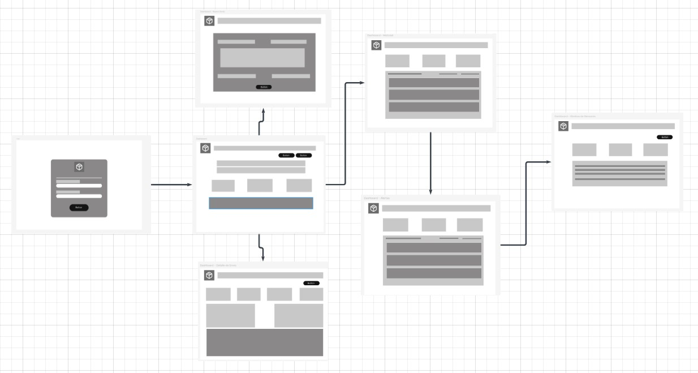
</p>

### 4.4.3. Web Applications Mock-ups

<p align="center">
  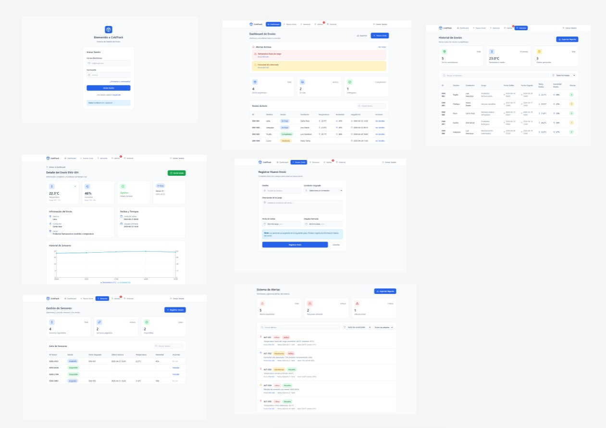
</p>

### 4.4.4. Web Applications User Flow Diagrams

<p align="center">
  
</p>

<p align="center">
  
</p>

<p align="center">
  
</p>

## 4.5. Web Applications Prototyping

<p align="center">
  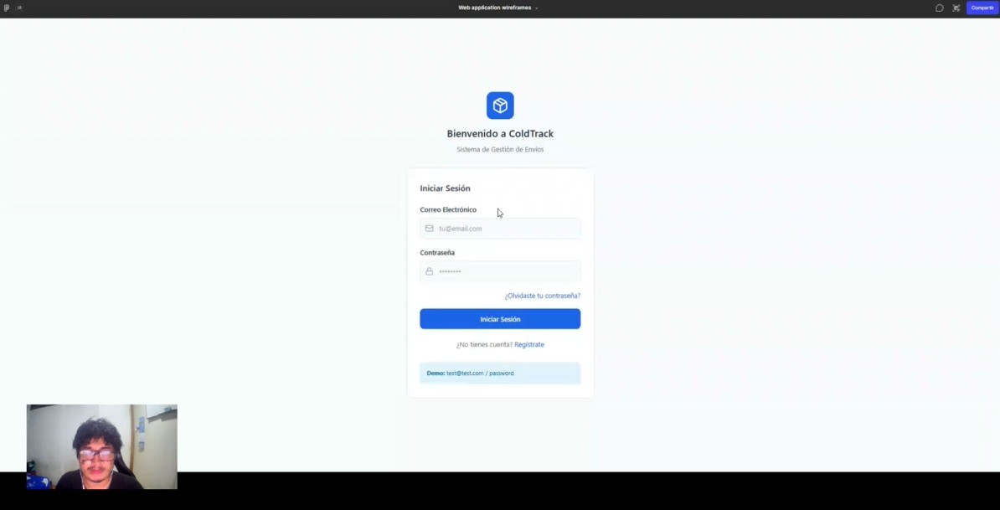
</p>

#### Link del video explicativo: https://upcedupe-my.sharepoint.com/:v:/g/personal/u202320699_upc_edu_pe/IQACBR9pDoCKSIpvd7NcFc3CAcul48K88RqMf49wIC2AbMA?nav=eyJyZWZlcnJhbEluZm8iOnsicmVmZXJyYWxBcHAiOiJPbmVEcml2ZUZvckJ1c2luZXNzIiwicmVmZXJyYWxBcHBQbGF0Zm9ybSI6IldlYiIsInJlZmVycmFsTW9kZSI6InZpZXciLCJyZWZlcnJhbFZpZXciOiJNeUZpbGVzTGlua0NvcHkifX0&e=Ji22ya

## 4.6. Domain-Driven Software Architecture
En esta sección, el equipo profundiza en la arquitectura de software para la solución ColdTrack, tomando como base los hitos alcanzados durante el Big Picture Event Storming. 
El objetivo es realizar una transición desde el entendimiento del negocio hacia un modelo técnico riguroso bajo la perspectiva de Domain-Driven Design (DDD).

Este enfoque permite delimitar los Bounded Contexts necesarios para separar responsabilidades críticas, como el monitoreo IoT en tiempo real, la gestión logística de los envíos y el motor automatizado de alertas tempranas. 
A través de esta metodología, se han identificado los Aggregates, Events, Commands y Queries que garantizan la integridad de la lógica de negocio en cada etapa del transporte de carga refrigerada y la conservación de la cadena de frío.

Finalmente, se presenta y explica la representación visual de la arquitectura utilizando el C4 Model. 
Esta estructura jerárquica nos permite comunicar de manera efectiva la solución a través de tres niveles de detalle: el Software Architecture Context Level Diagram, los Software Architecture Container Level Diagrams y los Software Architecture Component Diagrams.

### 4.6.1. Design-Level Event Storming
La sesión se llevó a cabo de manera colaborativa utilizando la herramienta Lucidchart y se estructuró en las siguientes actividades clave: 

1. Refinamiento de Eventos de Dominio
2. Identificación de Comandos y Actores
3. Definición de Agregados (Aggregates)
4. Delimitación de Bounded Contexts
5. Integración de Sistemas Externos y Queries

<p align="center">
  
</p>

<p align="center">
  
</p>

<p align="center">
  
</p>

<p align="center">
  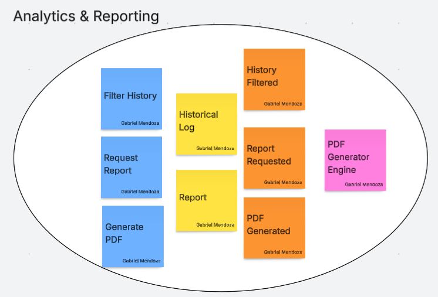
</p>

<p align="center">
  
</p>


### 4.6.2. Software Architecture Context Diagram
<p align="center">
  
</p>

### 4.6.3. Software Architecture Container Diagram

<p align="center">
  
</p>

### 4.6.3. Software Architecture Components Diagram

<p align="center">
  
</p>

## 4.7. Software Object-Oriented Design

### 4.7.1. Class Diagrams

<p align="center">
  
</p>

<p align="center">
  
</p>

<p align="center">
  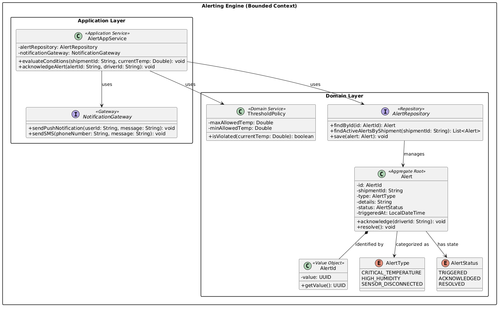
</p>

<p align="center">
  
</p>

<p align="center">
  
</p>


### 4.7.2. Class Dictionary

A continuación, se detalla el diccionario de clases, el cual describe la responsabilidad y el propósito de las entidades, objetos de valor, agregados y servicios definidos en el diseño orientado a objetos del sistema ColdTrack.

#### 1. Shipment Management (Gestión de Envíos)
Este módulo centraliza la planificación y el estado logístico de los traslados físicos de los alimentos.

| Clase / Interfaz | Estereotipo (DDD) | Descripción y Responsabilidad |
| :--- | :--- | :--- |
| **ShipmentAppService** | Application Service | Orquesta los casos de uso logísticos. Coordina la creación de envíos, la asignación de sensores físicos y la finalización de las rutas, delegando la persistencia al repositorio. |
| **Shipment** | Aggregate Root | Representa un envío físico de alimentos. Gestiona su propio ciclo de vida (estado) y protege la invariante de negocio de que cada envío debe estar asociado a un sensor físico en la ruta. |
| **Route** | Value Object | Encapsula la información de origen y destino del transporte. Al ser inmutable, cualquier cambio en la ruta requiere la creación de un nuevo objeto de valor. |
| **ShipmentId** | Value Object | Identificador único y tipado del envío, evitando errores comunes al usar cadenas de texto (`String`) genéricas. |
| **ShipmentStatus** | Enum | Define los estados posibles del envío: `REGISTERED` (creado), `IN_TRANSIT` (en ruta), `COMPLETED` (finalizado con éxito) y `CANCELLED`. |
| **ShipmentRepository** | Repository | Abstracción de acceso a datos para persistir y recuperar los agregados `Shipment` de la base de datos SQL Server. |

#### 2. Real-Time IoT Monitoring (Monitoreo de Telemetría)
Este contexto está enfocado exclusivamente en la ingesta, validación e hidratación de los datos capturados por el hardware.

| Clase / Interfaz | Estereotipo (DDD) | Descripción y Responsabilidad |
| :--- | :--- | :--- |
| **TelemetryAppService** | Application Service | Expone los puertos de entrada para recibir la data en tiempo real desde los sensores vía WebSockets o API REST, y facilita la consulta del historial de un sensor. |
| **TelemetryStream** | Aggregate Root | Actúa como un contenedor lógico de todas las lecturas de un sensor específico. Garantiza el orden cronológico y la agrupación de los datos durante un viaje. |
| **TelemetryLog** | Entity | Representa una captura de telemetría individual en un momento exacto del tiempo. |
| **Temperature** | Value Object | Encapsula el valor numérico de la temperatura y su unidad (Celsius). Contiene lógica intrínseca para validar si el valor se encuentra dentro de un rango seguro establecido. |
| **Humidity** | Value Object | Encapsula el porcentaje de humedad relativa, validando que el valor matemático ingresado tenga sentido (por ejemplo, entre 0% y 100%). |
| **TelemetryRepository** | Repository | Interfaz encargada de la persistencia de alto rendimiento para el gran volumen de logs de telemetría generados durante la ruta. |

#### 3. Alerting Engine (Motor de Alertas)
Responsable de evaluar anomalías en las condiciones ambientales e interactuar con servicios externos para notificar a los actores.

| Clase / Interfaz | Estereotipo (DDD) | Descripción y Responsabilidad |
| :--- | :--- | :--- |
| **AlertAppService** | Application Service | Ejecuta el flujo de evaluación. Si detecta una anomalía mediante el `ThresholdPolicy`, crea una alerta y coordina con el `NotificationGateway` el envío del mensaje. |
| **Alert** | Aggregate Root | Entidad principal que registra una incidencia crítica (ej. ruptura de cadena de frío). Controla cuándo fue disparada, si el conductor ya la reconoció y si fue resuelta. |
| **ThresholdPolicy** | Domain Service | Contiene la lógica de dominio pura (umbrales permitidos) para determinar si las condiciones de temperatura actuales violan la seguridad alimentaria. |
| **AlertId** | Value Object | Identidad única inmutable de la alerta generada. |
| **AlertType** | Enum | Categoriza la anomalía: `CRITICAL_TEMPERATURE`, `HIGH_HUMIDITY` o `SENSOR_DISCONNECTED`. |
| **AlertStatus** | Enum | Gestiona el ciclo de atención: `TRIGGERED` (disparada), `ACKNOWLEDGED` (vista por el conductor) y `RESOLVED` (solucionada). |
| **NotificationGateway** | Gateway (Interface) | Abstracción (Puerto) para integrarse con servicios externos como Twilio o Firebase para disparar SMS o notificaciones Push. |

#### 4. Analytics & Reporting (Analítica y Reportes)
Módulo encargado de consolidar la información histórica para facilitar la toma de decisiones gerenciales.

| Clase / Interfaz | Estereotipo (DDD) | Descripción y Responsabilidad |
| :--- | :--- | :--- |
| **AnalyticsAppService** | Application Service | Coordina la solicitud de reportes. Filtra el historial de un envío y delega la construcción del archivo físico al motor generador de PDF. |
| **Report** | Aggregate Root | Un consolidado del rendimiento de un envío finalizado. Almacena métricas pre-calculadas (como el total de alertas disparadas) para consultas eficientes. |
| **HistoricalLog** | Entity | Un registro plano, desnormalizado y optimizado para la lectura, diseñado para conformar las filas de datos en los reportes exportables. |
| **DateRange** | Value Object | Encapsula una fecha de inicio y una de fin, garantizando que el inicio no sea posterior al fin del rango temporal. |
| **PdfGeneratorService** | Domain Service | Motor interno que se encarga de formatear la data de dominio y compilarla en un documento PDF descargable. |

#### 5. Identity & Access (Gestión de Identidad y Accesos)
Maneja la seguridad, controlando quién puede interactuar con el sistema según su rol.

| Clase / Interfaz | Estereotipo (DDD) | Descripción y Responsabilidad |
| :--- | :--- | :--- |
| **AuthAppService** | Application Service | Procesa las solicitudes de registro, inicio de sesión y recuperación de contraseña, apoyándose en el `TokenProvider`. |
| **UserAccount** | Aggregate Root | Representa las credenciales y el estado (activo/inactivo) de un trabajador. Controla el acceso basado en sus roles y protege la seguridad de la contraseña cifrada. |
| **EmailAddress** | Value Object | Asegura que toda cadena de texto utilizada como correo electrónico pase una validación de formato (Regex) antes de interactuar con el sistema. |
| **UserRole** | Enum | Define los niveles de acceso del sistema. Principalmente `LOGISTICS_ADMIN` (para el dashboard web) y `DRIVER` (para recibir alertas). |
| **TokenProvider** | Domain Service | Servicio responsable de emitir los JWT (JSON Web Tokens) que las aplicaciones web y móviles usarán para mantener la sesión abierta de manera segura. |

## 4.8. Database Design

En esta sección se presenta el modelo relacional de la base de datos de ColdTrack. El esquema detalla las entidades principales del sistema, sus atributos y las relaciones entre ellas. Este diseño asegura la integridad referencial y soporta los módulos clave definidos en la arquitectura, como la gestión de usuarios, el registro de vehículos, la asignación de sensores y el historial de telemetría y alertas.

### 4.8.1. Database Diagram

<p align="center">
  
</p>


# Capitulo V: Product Implementation, Validation & Deployment

## 5.1. Software Configuration Management

A continuación, se describe el proceso por el cual organizamos, gestionamos y controlamos los cambios de desarrollo de ColdTrack.

### 5.1.1. Software Development Environment Configuration.

En esta sección se describen las herramientas utilizadas durante el desarrollo de la landing page de ColdTrack, producto digital de la startup FreshGuard Technologies. El objetivo de esta solución fue presentar de forma clara la propuesta de valor del sistema, mostrar sus principales funcionalidades y ofrecer una experiencia visual moderna, accesible y responsiva.

Las herramientas empleadas en el proyecto se clasifican en el siguiente orden:

- Product UX/UI Design
- Software Development
- Software Deployment

**Product UX/UI Design**

- Figma: utilizado como referencia visual para definir la estructura, distribución de secciones y estilo general de la landing page.

**Software Development**

- Visual Studio Code: editor de código utilizado para implementar el proyecto.
- Git: sistema de control de versiones empleado para registrar y organizar los cambios.
- GitHub: plataforma utilizada para alojar el repositorio remoto del proyecto.
- HTML5: lenguaje de marcado usado para estructurar el contenido de la página.
- CSS3: lenguaje de estilos utilizado para el diseño visual, la responsividad y las animaciones.
- JavaScript: lenguaje usado para añadir interactividad en la navegación y animaciones visuales.
- Navegador web moderno: entorno de validación para revisar visualización, comportamiento e interacción.

**Software Deployment**

- GitHub Pages: servicio de despliegue utilizado para publicar la landing page como sitio estático.

### 5.1.2. Source Code Management

Para la gestión del código fuente se utilizó GitHub como plataforma central de versionamiento y almacenamiento del proyecto. El repositorio principal identificado para la landing page es el siguiente:

Repositorio de la Landing Page: https://github.com/1ASI0730-2610-10215/Landing-Page

El proyecto fue desarrollado mediante una estrategia de trabajo basada en ramas, permitiendo separar mejoras funcionales, optimizaciones visuales y correcciones específicas antes de su integración a la rama principal.

**Modelo de ramificación**

La estructura de ramas encontrada en el repositorio es la siguiente:

- main: rama principal del proyecto, donde se consolida la versión estable.
- features/dashboard-improvements: rama orientada a mejorar la apariencia y comportamiento del dashboard preview mostrado en la hero section.
- features/seo-enhancements: rama dedicada a la incorporación de mejoras SEO y etiquetas Open Graph.
- bugfix/accessibility-improvements: rama destinada a correcciones de accesibilidad, incluyendo estilos de foco y atributos ARIA.

Este enfoque permitió mantener el desarrollo organizado y evidenciar una evolución progresiva del producto.

**Estilo de commits**

El historial del repositorio muestra el uso de mensajes de commit consistentes, alineados con una convención tipo Conventional Commits. Algunos ejemplos reales del proyecto son:

- feat: initial project setup
- feat: add hero section with title and CTA
- feat: add responsive CSS styles
- feat: add JavaScript interactivity
- fix: improve mobile responsiveness and add mobile-specific styles
- fix: add ARIA labels for accessibility

Los prefijos observados se interpretan de la siguiente forma:

- feat: incorporación de una nueva funcionalidad o mejora visible.
- fix: corrección de errores o ajustes sobre funcionalidades existentes.
  
### 5.1.3. Source Code Style Guide & Conventions

Para garantizar coherencia, mantenibilidad y escalabilidad del código, se establecen las siguientes normas de estilo:

**HTML**

- El archivo principal del proyecto es index.html.
- Se utilizan etiquetas semánticas como header, nav, section y footer.
- Las secciones de la página están organizadas de forma clara: encabezado, hero, características, cómo funciona, beneficios, CTA y footer.
- Se añadieron metadatos como description, keywords, author y propiedades Open Graph.
- Se incorporaron atributos de accesibilidad en elementos clave del documento.

**CSS**

- Los estilos están centralizados en el archivo css/styles.css.
- Se emplean variables CSS en :root para colores, espaciados y transiciones.
- Las clases siguen nombres semánticos con palabras separadas por guiones, por ejemplo: header-content, nav-menu, feature-card, shipment-card.
- Se incluyen estilos responsivos para escritorio, tableta y móvil.
- Se aplican efectos visuales como transiciones, hover states, sombras y focus styles.

**JavaScript**

- La lógica de interacción se implementa en js/script.js.
- Se usa DOMContentLoaded para iniciar la carga de eventos una vez disponible el DOM.
- Se utilizan nombres descriptivos en camelCase como navLinks, featureCards, shipmentCards y observerOptions.
- La funcionalidad incluye smooth scrolling, animaciones de entrada y actualización visual del dashboard preview.

**Vue.js**

Reglas clave:

- Nombres de componentes: PascalCase, por ejemplo, UserProfile.vue.
- Props: definir tipos y valores por defecto.
      
### 5.1.4. Software Deployment Configuration

La estrategia de despliegue adoptada para ColdTrack corresponde a la publicación de una landing page estática mediante GitHub Pages. Esta decisión fue adecuada debido a que el proyecto está compuesto únicamente por archivos HTML, CSS y JavaScript, sin dependencias de servidor, base de datos o procesamiento backend.

**Despliegue de la Landing Page en GitHub Pages**

GitHub Pages fue seleccionado como mecanismo de publicación por su integración directa con el repositorio, facilidad de configuración y compatibilidad con sitios estáticos. Esto permite que la landing page pueda ser publicada desde la rama principal del proyecto y visualizada mediante una URL pública.

**Consideraciones previas al despliegue**

Antes del despliegue, se consideraron los siguientes aspectos:

- mantener una estructura de archivos estática y ordenada,
- asegurar rutas relativas correctas entre HTML, CSS y JavaScript,
- conservar en main la versión estable del proyecto,
- validar el comportamiento responsivo y la correcta carga visual de la página.

**Pasos de despliegue**

1. Crear o actualizar el repositorio remoto en GitHub.
2. Subir los archivos principales del proyecto: index.html, css/styles.css y js/script.js.
3. Ingresar a la configuración del repositorio.
4. Habilitar GitHub Pages.
5. Seleccionar la rama main y la carpeta raíz como fuente de publicación.
6. Esperar la generación de la URL pública del sitio.

Repositorio: https://github.com/1ASI0730-2610-10215/Landing-Page

URL desplegada: https://1asi0730-2610-10215.github.io/Landing-Page
   
## 5.2. Landing Page, Services & Applications Implementation 

La presente implementación corresponde al desarrollo de la landing page de ColdTrack, enfocada en comunicar la propuesta de valor del producto: monitoreo en tiempo real para el transporte de alimentos. La solución fue construida como una página estática, moderna y responsiva, diseñada para presentar de forma clara las capacidades del sistema.

### 5.2.1. Sprint 1

Dado que la evidencia disponible del proyecto se concentra en el repositorio, el historial de commits y la documentación técnica local, esta sección adapta el desarrollo realizado en un único sprint principal orientado a la implementación progresiva de la landing page.

#### 5.2.1.1. Sprint Planning 1

El equipo de desarrollo se reunió virtualmente para definir los objetivos, tareas y entregables del primer sprint, el cual tendrá una duración de una semana. El enfoque principal será el desarrollo y despliegue de la landing page del proyecto en GitHub Pages, asegurando que el producto inicial esté operativo y sirva como base sólida para las siguientes iteracciones.

| Sprint                             | Sprint 1                                                                                                                                                                                     |
| ---------------------------------- | -------------------------------------------------------------------------------------------------------------------------------------------------------------------------------------------- |
|                                    | Sprint Planning Background                                                                                                                                                                   |
| Date                               | 2026/04/17                                                                                                                                                                                   |
| Time                               | 19:28 PM                                                                                                                                                                                     |
| Location                           | El desarrollo de la reunión se hizo virtualmente por medio de Discord                                                                                                                        |
| Prepared By                        | Eslander Celis Berrospi                                                                                                                                                                      |
| Attendees (to planning meeting)    | Eslander Celis Berrospi, Gabriel Mendoza Palacios, Rodrigo Oblitas Alcalde, Aarón Avila Palacios, Mathias Arechaga Saavedra	                                                               |
| Sprint n – 1 Review Summary        | En este primer sprint se asignaron responsabilidades a cada integrante y se planteó los requerimientos para el desarrollo de la Landing Page.                                                |
| Sprint n – 1 Retrospective Summary | En esta sección todos los integrantes mencionaron tener aciertos en partes del código y en otras partes poder mejorar sus habilidades realizando la Landing Page                             |
|                                    |Sprint Goal & User Stories                                                                                                                                                                    |
| Sprint 1 Goal                      | Desarrollar y desplegar la landing page funcional en Github Pages, garantizando que cumpla con los requisitos básicos de diseño, contenido y accesibilidad para servir como base de proyecto |
| Sprint 1 Velocity                  | 8                                                                                                                                                                                            |
| Sum of Story Points                | 8                                                                                                                                                                                            |

#### 5.2.1.2. Aspect Leaders and Collaborators


| Team Member | Referencia | Landing Page |
|------------|------------|--------------|
| Rodrigo Oblitas Alcalde | Repositorio `1ASI0730-2610-10215/Landing-Page` | L |
| Eslander Celis | Colaborador de accesibilidad y soporte documental | C |
| Mathias Aréchaga | Colaborador en mejoras visuales del dashboard preview | C |
| Aarón Avila | Colaborador en optimizaciones SEO y metadatos | C |
| Mariano Vilela | Colaborador en secciones visuales y estilos responsivos | C |
| Gabriel Mendoza | Colaborador en mejoras visuales complementarias e iconografía | C |

#### 5.2.1.3. Sprint Backlog 1

Tomando como referencia las User Stories definidas en el Product Backlog, las historias trabajadas durante el Sprint 1 para la landing page pueden resumirse de la siguiente manera:

| User Story Id | User Story Title | Task Id | Task Description | Status |
|---------------|------------------|---------|------------------|--------|
| US-019 | Ver información de la app (Landing) | T01 | Configurar la estructura inicial del proyecto de landing page. | Done |
| US-019 | Ver información de la app (Landing) | T02 | Implementar el header con navegación principal e identidad visual del producto. | Done |
| US-019 | Ver información de la app (Landing) | T03 | Desarrollar la hero section con propuesta de valor y llamada a la acción. | Done |
| US-023 | Ver funcionalidades del sistema | T04 | Implementar la sección de características principales del sistema. | Done |
| US-023 | Ver funcionalidades del sistema | T05 | Desarrollar la sección explicativa sobre el funcionamiento de ColdTrack. | Done |
| US-023 | Ver funcionalidades del sistema | T06 | Implementar la sección de beneficios operativos para los usuarios. | Done |
| US-021 | Formulario de contacto | T07 | Incorporar el CTA final y el footer con información de contacto. | Done |
| US-019 | Ver información de la app (Landing) | T08 | Desarrollar estilos responsivos para adaptar la landing page a distintos dispositivos. | Done |
| US-019 | Ver información de la app (Landing) | T09 | Incorporar animaciones e interacciones mediante JavaScript. | Done |
| US-023 | Ver funcionalidades del sistema | T10 | Mejorar la vista previa del dashboard para mostrar el valor del monitoreo. | Done |
| US-019 | Ver información de la app (Landing) | T11 | Agregar meta tags y Open Graph para optimizar la presentación del sitio. | Done |
| US-019 | Ver información de la app (Landing) | T12 | Realizar ajustes de accesibilidad y navegación por teclado. | Done |
| US-020 | Ver testimonios | T13 | Incorporar una sección de testimonios para reforzar la confianza en la solución. | Done |
| US-022 | Ver equipo de desarrollo | T14 | Incorporar una sección para presentar a los integrantes del equipo de desarrollo. | Done |

Link del Trello: https://trello.com/invite/b/69e82f5d88b7df3fa977adbe/ATTId31bae723ab545af9d3a4c721a1b848443078604/sprint-1-freshguard-coldtrack

#### 5.2.1.4. Development Evidence for Sprint Review

El desarrollo del producto se realizó de forma incremental. A continuación, se presentan algunos de los commits más representativos del proceso:

| Repository | Branch | Commit Id | Autor | Commit Message | Fecha |
|------------|--------|-----------|-------|----------------|-------|
| Landing-Page | `main` | `5ce9ead` | Rodrigo Oblitas | `feat: initial project setup` | 12/05/2025 |
| Landing-Page | `main` | `0fd3953` | Rodrigo Oblitas | `feat: add basic HTML structure with header` | 13/05/2025 |
| Landing-Page | `main` | `b0f9279` | Rodrigo Oblitas | `feat: add hero section with title and CTA` | 13/05/2025 |
| Landing-Page | `main` | `be25150` | Mariano Vilela | `feat: add features section` | 14/05/2025 |
| Landing-Page | `main` | `388e262` | Mathias Aréchaga | `feat: add CTA and footer sections` | 14/05/2025 |
| Landing-Page | `main` | `5a9590e` | Mariano Vilela | `feat: add responsive CSS styles` | 15/05/2025 |
| Landing-Page | `main` | `a9e7c80` | Eslander Celis | `feat: add JavaScript interactivity` | 15/05/2025 |
| Landing-Page | `main` | `fea423b` | Gabriel Mendoza | `feat: add icons to feature cards` | 16/05/2025 |
| Landing-Page | `features/dashboard-improvements` | `d72c4a6` | Mathias Aréchaga | `feat: improve dashboard styling` | 18/05/2025 |
| Landing-Page | `features/seo-enhancements` | `df123a2` | Aarón Avila | `feat: add SEO meta tags` | 19/05/2025 |
| Landing-Page | `bugfix/accessibility-improvements` | `0cd942e` | Eslander Celis | `fix: add ARIA labels for accessibility` | 20/05/2025 |

Estas evidencias muestran una evolución progresiva desde la estructura base del sitio hasta una versión más completa, optimizada y accesible.

#### 5.2.1.5. Execution Evidence for Sprint Review

La implementación final de ColdTrack quedó organizada en una sola página principal compuesta por secciones claramente diferenciadas:

- **Header**: navegación principal con identidad visual del producto.
  
  
  
- **Hero Section**: presentación de la propuesta de valor y botones de llamada a la acción.
  
  
  
- **Dashboard Preview**: simulación visual de monitoreo en tiempo real mediante tarjetas de envíos activos.

  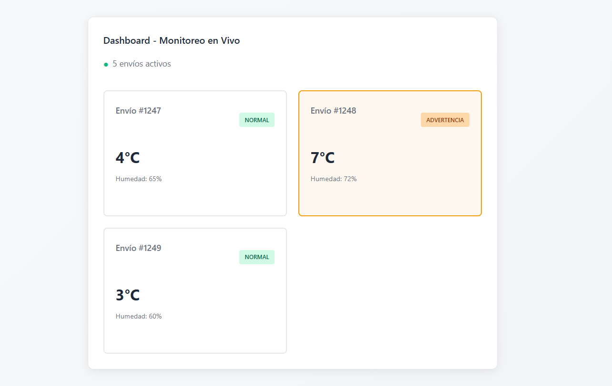
  
- **Features Section**: exposición de las capacidades principales del sistema.

  
  
- **How It Works Section**: explicación resumida del flujo operativo del producto.

   
  
- **Benefits Section**: presentación de ventajas operativas para el usuario.

   
  
- **CTA Section**: sección final orientada a reforzar el interés en la solución.

  
  
- **Footer**: bloque final con navegación complementaria e información general.

  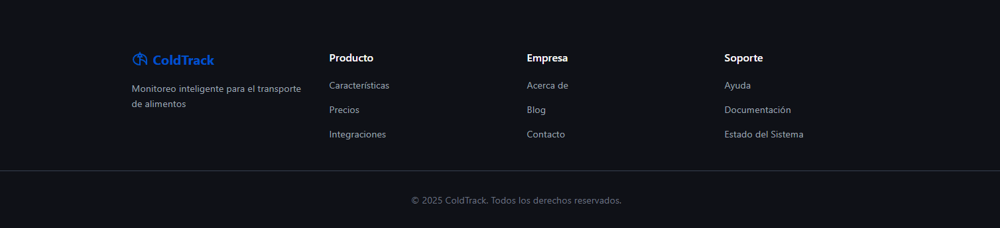

Desde el punto de vista técnico, la implementación se concentra en:

- `index.html` como archivo estructural principal,
- `css/styles.css` como archivo de estilos,
- `js/script.js` como archivo de interactividad.

Además, el proyecto incluye una estructura HTML semántica, aproximadamente **595 líneas de CSS** y aproximadamente **97 líneas de JavaScript**, con separación clara entre contenido, presentación y comportamiento.

#### 5.2.1.6. Services Documentation Evidence for Sprint Review

Esta sección no aplica a la presente entrega, ya que el proyecto desarrollado corresponde únicamente a una landing page estática y no incorpora APIs, endpoints ni servicios backend documentados.

#### 5.2.1.7. Software Deployment Evidence for Sprint Review

La landing page fue preparada para su publicación mediante **GitHub Pages**, utilizando la rama `main` como base del despliegue.

- Plataforma de despliegue: **GitHub Pages**
- Rama de publicación: **main**
- Tipo de aplicación: **sitio web estático**
- Repositorio fuente: https://github.com/1ASI0730-2610-10215/Landing-Page
- desplegue de la landing page: https://1asi0730-2610-10215.github.io/Landing-Page/

pasos para el despliegue:

1. **Creación del Repositorio en GitHub:** Iniciamos creando un repositorio dedicado en GitHub para nuestro proyecto de landing page.
2. **Configuración de la Rama de despliegue:** Aseguramos que la rama principal del repositorio se llamara `gh-pages`, ya que GitHub Pages toma esta rama como base para el despliegue automático.
3. **Generación del Enlace de GitHub Pages:** Navegamos a la sección "Pages" en la configuración del repositorio en GitHub. Configuramos la fuente de GitHub Pages para que tomara el contenido de la rama `gh-pages`.
4. **Despliegue Automático:** GitHub Pages automáticamente detectó los cambios en la rama `gh-pages` y desplegó la landing page en la URL proporcionada por GitHub Pages.
   
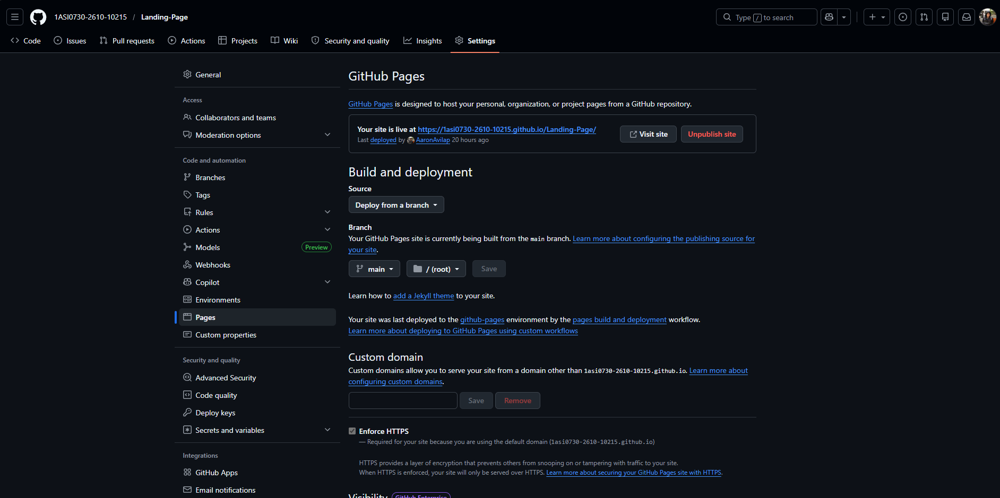

#### 5.2.1.8. Team Collaboration Insights during Sprint
Durante el Sprint 1, el equipo de desarrollo en implementar todas las funcionalidades de la landing page y la realización del documento.

#### Colaboración y Desarrollo de Actividades

1. **Asignación de Tareas**:

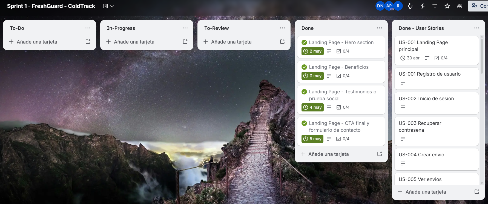

2. **Evidencia de commits**:

Repositorio:

**Documento**

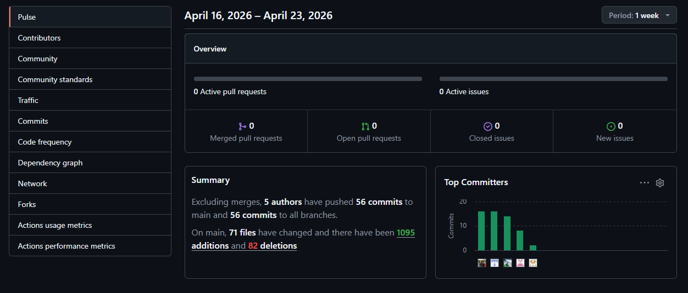

**Landing Page**

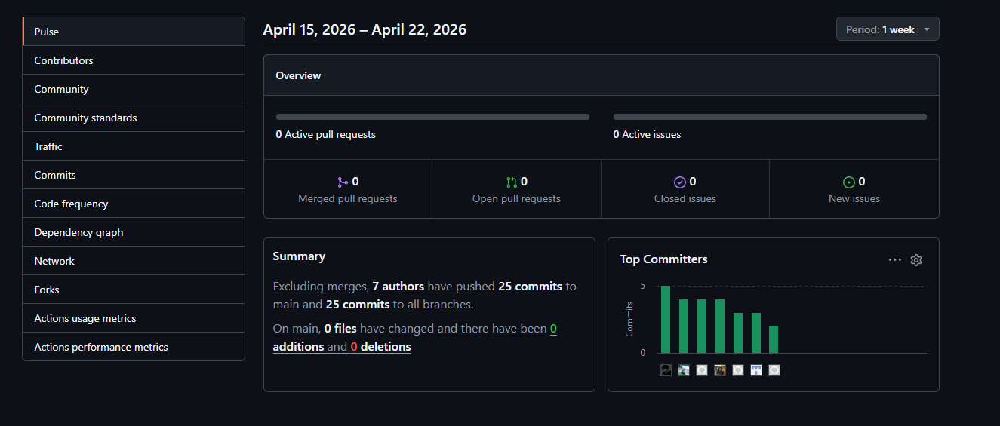

3. **Evidencia de Nertwork**:

Repositorio:

**Documento**

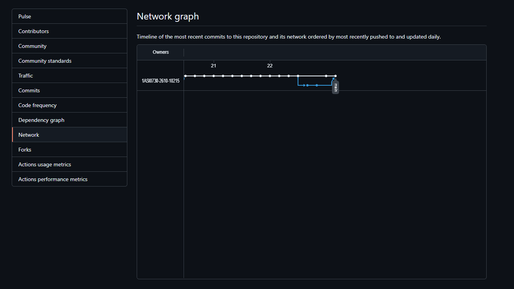

**Landing Page**

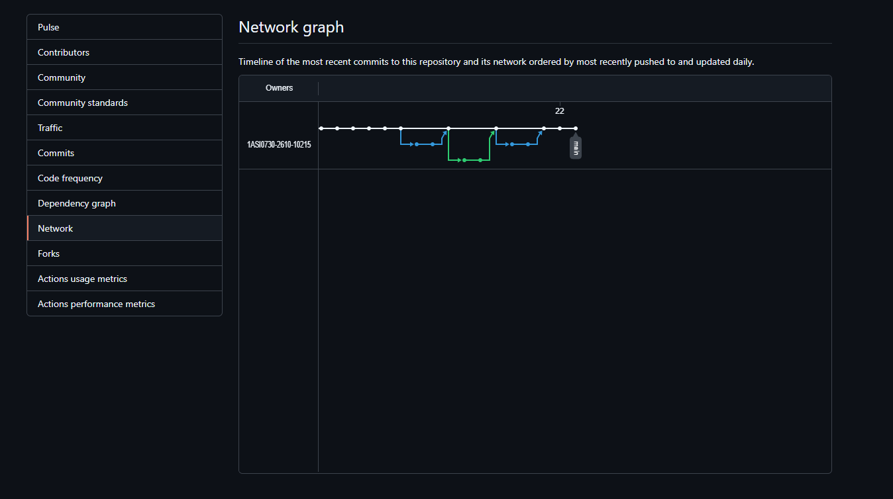

4.**Contributions**

Repositorios:

**Documento**

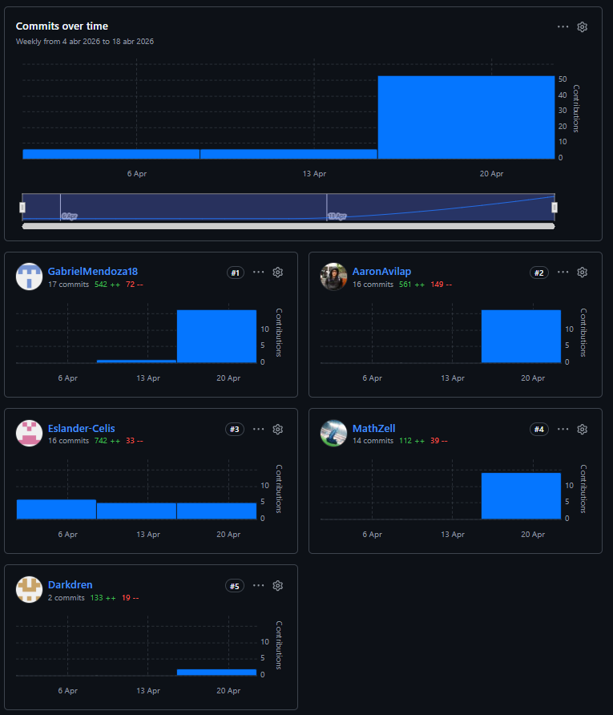

**Landing Page**

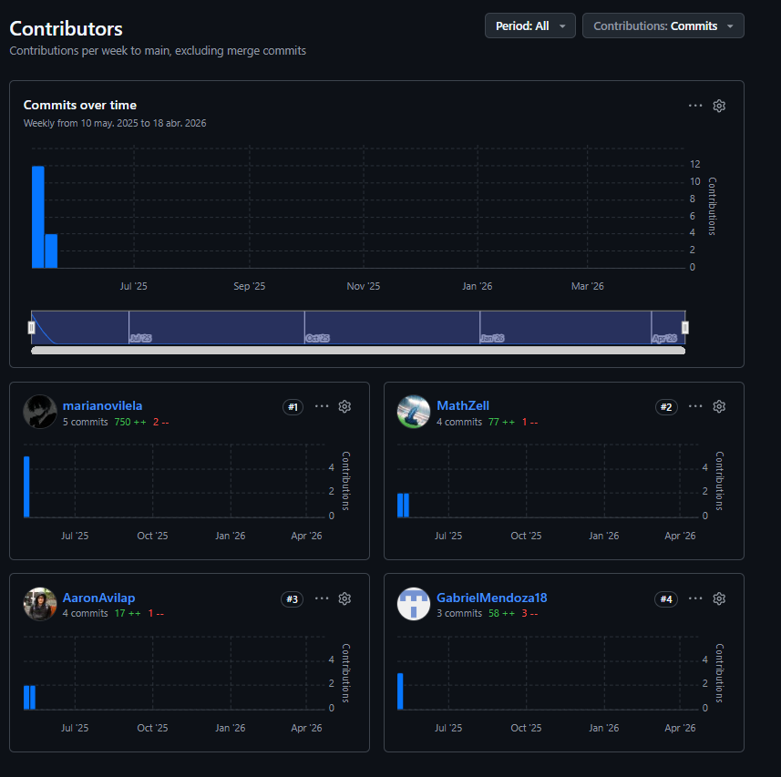

### 5.2.2. Sprint 2

Durante el Sprint 2, el equipo avanzó desde la landing page inicial hacia la integración del ecosistema ColdTrack, incorporando la Web Application desplegada, la conexión con una fake API pública y la actualización de la landing page para redirigir a los usuarios hacia la aplicación operativa. En esta entrega, las evidencias asignadas corresponden a la ejecución funcional de los principales flujos implementados y a la evidencia del despliegue de los productos desarrollados.

#### 5.2.2.1. Sprint Planning 2. 
El equipo de desarrollo se reunió virtualmente para definir los objetivos, tareas y entregables del segundo sprint, el cual tendrá una duración de una semana. El enfoque principal será el desarrollo del frontend de la aplicación, implementando las interfaces principales, navegación y componentes necesarios para la interacción del usuario con el sistema.

| Sprint                             | Sprint 2                                                                                                                                                                                                |
| ---------------------------------- | ------------------------------------------------------------------------------------------------------------------------------------------------------------------------------------------------------- |
|                                    | Sprint Planning Background                                                                                                                                                                              |
| Date                               | 2026/05/01                                                                                                                                                                                              |
| Time                               | 19:30 PM                                                                                                                                                                                                |
| Location                           | El desarrollo de la reunión se hizo virtualmente por medio de Discord                                                                                                                                   |
| Prepared By                        | Eslander Celis Berrospi                                                                                                                                                                                 |
| Attendees (to planning meeting)    | Eslander Celis Berrospi, Gabriel Mendoza Palacios, Rodrigo Oblitas Alcalde, Aarón Avila Palacios                                                      |
| Sprint n – 1 Review Summary        | En el sprint anterior se logró desarrollar y desplegar correctamente la Landing Page en GitHub Pages, cumpliendo con los requisitos básicos establecidos para el proyecto.                             |
| Sprint n – 1 Retrospective Summary | En esta sección los integrantes identificaron mejoras en la organización del código, distribución de tareas y optimización del tiempo para el desarrollo de las interfaces del sistema.               |
|                                    | Sprint Goal & User Stories                                                                                                                                                                             |
| Sprint 2 Goal                      | Desarrollar el frontend funcional de la aplicación, implementando las principales vistas, componentes y navegación necesarias para permitir la interacción inicial de los usuarios con el sistema. |
| Sprint 2 Velocity                  | 12                                                                                                                                                                                                      |
| Sum of Story Points                | 12                                                                                                                                                                                                     |

#### 5.2.2.2. Aspect Leaders and Collaborators

Durante el Sprint 2, el equipo organizó el trabajo tomando como principales aspectos la implementación del frontend de ColdTrack, la integración con datos simulados, la construcción de los módulos funcionales principales y la preparación del despliegue de la Web Application. Para asegurar una mejor coordinación, se definieron líderes por aspecto y colaboradores de apoyo según el alcance de las tareas desarrolladas.

En esta matriz, `L` representa al líder del aspecto y `C` representa a los colaboradores que participaron en la implementación, revisión o integración de dicho aspecto.

| Team Member | GitHub Username | Frontend Setup & Routing | Authentication | Shipments Management | Dashboard & Fake API | Sensors Module | Alerts Module | History & i18n | Deployment & Integration |
|-------------|-----------------|--------------------------|----------------|----------------------|----------------------|----------------|---------------|----------------|--------------------------|
| Avila Palacios, Aarón | u201823654 | C | L | C | L | C | L | L | C |
| Oblitas Alcalde, Rodrigo | rodri-ob | L | C | L | C | L | C | C | L |
| Celis Berrospi, Eslander | Eslander-Celis | C | C | L | C | C | C | L | C |
| Mendoza Palacios, Gabriel | GabrielMendoza18 | C | C | C | L | C | C | C | C |
| Arechaga Saavedra, Mathias | mathiasarechaga62 | C | C | C | C | C | L | C | C |

La asignación de liderazgo se relaciona con la organización del Sprint Backlog 2: Aarón lideró los aspectos vinculados con autenticación, dashboard, alertas, historial e internacionalización, mientras que Rodrigo lideró la configuración base, la gestión de envíos, sensores y despliegue. Además, Eslander asumió liderazgo en actividades de gestión de envíos e historial, Gabriel en la integración con la fake API y soporte de datos del dashboard, y Mathias en la definición visual de alertas. Todos los integrantes también colaboraron en la revisión, documentación, pruebas funcionales e integración de los módulos.

#### 5.2.2.3. Sprint Backlog 2

El Sprint Backlog 2 se construyó a partir de las User Stories priorizadas en el Product Backlog para la primera versión funcional de la Web Application. El objetivo principal fue habilitar los flujos iniciales de ColdTrack: registro e inicio de sesión, visualización de envíos activos, creación de envíos, monitoreo de temperatura y humedad, gestión de sensores, generación de alertas e historial de eventos.

El tablero de trabajo utilizado para organizar las tareas del Sprint 2 permitió distribuir las actividades por módulo, dar seguimiento al avance y preparar la integración final del frontend desplegado.

- Board URL: pendiente por agregar.
- Board screenshot: pendiente por agregar en `images/sprint-2-board.png`.

| Sprint # | User Story Id | User Story Title | Task Id | Task Title | Task Description | Estimation (Hours) | Assigned To | Status |
|----------|---------------|------------------|---------|------------|------------------|--------------------|-------------|--------|
| Sprint 2 | US-001 | Registro de usuario | T01 | Implementar vista de registro | Desarrollar la interfaz de creación de cuenta con campos básicos, validación visual y navegación hacia el flujo de acceso. | 3 | Rodrigo Oblitas Alcalde | Done |
| Sprint 2 | US-001 | Registro de usuario | T02 | Integrar registro con datos simulados | Conectar la vista de registro con la estructura de datos simulada para validar el flujo inicial de creación de usuario. | 2 | Aarón Avila Palacios | Done |
| Sprint 2 | US-002 | Inicio de sesión | T03 | Implementar vista de inicio de sesión | Construir la pantalla de sign in con formulario, estados visuales y redirección hacia el dashboard principal. | 3 | Rodrigo Oblitas Alcalde | Done |
| Sprint 2 | US-002 | Inicio de sesión | T04 | Configurar navegación protegida | Definir rutas principales de la aplicación y controlar el acceso inicial a las vistas operativas. | 2 | Aarón Avila Palacios | Done |
| Sprint 2 | US-004 | Crear envío | T05 | Crear formulario de nuevo envío | Implementar el formulario para registrar un envío con datos de origen, destino, producto, conductor y condiciones requeridas. | 4 | Rodrigo Oblitas Alcalde | Done |
| Sprint 2 | US-004 | Crear envío | T06 | Registrar envío en fake API | Conectar el formulario de nuevo envío con el recurso simulado para almacenar y consultar información durante la ejecución. | 3 | Gabriel Mendoza Palacios | Done |
| Sprint 2 | US-005 | Ver envíos activos | T07 | Construir listado de envíos activos | Desarrollar la vista de envíos activos mostrando identificador, estado, temperatura, humedad y datos principales de cada envío. | 3 | Aarón Avila Palacios | Done |
| Sprint 2 | US-006 | Ver detalle del envío | T08 | Implementar detalle de envío | Agregar una vista de detalle para revisar información operativa y condiciones asociadas a un envío seleccionado. | 3 | Eslander Celis Berrospi | Done |
| Sprint 2 | US-007 | Asignar sensor a envío | T09 | Implementar módulo de sensores | Crear la interfaz para visualizar sensores disponibles y asociarlos a envíos registrados. | 4 | Rodrigo Oblitas Alcalde | Done |
| Sprint 2 | US-009 | Ver temperatura en tiempo real | T10 | Mostrar temperatura en dashboard | Presentar datos de temperatura en tarjetas de monitoreo para facilitar la supervisión rápida de la cadena de frío. | 3 | Aarón Avila Palacios | Done |
| Sprint 2 | US-010 | Ver humedad en tiempo real | T11 | Mostrar humedad en dashboard | Incorporar lectura de humedad dentro del dashboard y relacionarla con cada envío activo. | 3 | Aarón Avila Palacios | Done |
| Sprint 2 | US-013 | Alertas de temperatura | T12 | Implementar módulo de alertas | Desarrollar una vista de alertas para identificar variaciones críticas de temperatura y humedad. | 4 | Aarón Avila Palacios | Done |
| Sprint 2 | US-014 | Notificación al conductor | T13 | Definir estados visuales de alerta | Agregar indicadores visuales para comunicar condiciones normales, advertencias o incidencias durante el transporte. | 2 | Mathias Arechaga Saavedra | Done |
| Sprint 2 | US-015 | Ver historial de alertas | T14 | Crear historial de alertas | Implementar consulta de eventos anteriores para revisar incidencias registradas durante los envíos. | 3 | Aarón Avila Palacios | Done |
| Sprint 2 | US-016 | Ver historial de envíos | T15 | Crear vista de historial de envíos | Desarrollar la pantalla de historial para consultar envíos finalizados o previamente registrados. | 3 | Eslander Celis Berrospi | Done |
| Sprint 2 | US-018 | Filtrar historial | T16 | Agregar soporte de búsqueda y filtro | Incorporar filtros básicos para consultar información histórica por estado, envío o criterio operativo. | 2 | Gabriel Mendoza Palacios | Done |
| Sprint 2 | US-019 | Ver información de la app (Landing) | T17 | Actualizar enlace hacia Web Application | Modificar la landing page para redirigir a los usuarios hacia la aplicación web desplegada. | 2 | Rodrigo Oblitas Alcalde | Done |
| Sprint 2 | Task adicional | Configuración de despliegue | T18 | Configurar variables y endpoints | Definir endpoints de entorno y preparar la aplicación para consumir la fake API pública durante el despliegue. | 2 | Rodrigo Oblitas Alcalde | Done |
| Sprint 2 | Task adicional | Integración del frontend | T19 | Integrar ramas feature en develop | Fusionar los módulos desarrollados en ramas de característica y validar que la aplicación funcione como una experiencia unificada. | 3 | Aarón Avila Palacios | Done |

#### 5.2.2.4. Development Evidence for Sprint Review

Durante el Sprint 2, el equipo se enfocó en el desarrollo del frontend de la aplicación ColdTrack, implementando las principales vistas, componentes reutilizables y funcionalidades necesarias para la interacción inicial de los usuarios con el sistema. Asimismo, se trabajó en la organización de rutas, consumo de datos simulados y mejoras visuales orientadas a la experiencia del usuario.

| Repository | Branch | Commit Id | Commit Message | Commit Message Body | Commited on (Date) |
|------------|--------|-----------|----------------|---------------------|--------------------|
| ColdTrack-Front | `main` | `ba713ca` | `chore: initialize clean Vue project` | Se inicializó el proyecto frontend utilizando Vue y se configuró la estructura base de desarrollo. | 12/05/2026 |
| ColdTrack-Front | `feature/dashboard-module` | `8ecbb74` | `feat: add fake api and dashboard module` | Se implementó un módulo de dashboard y una API simulada para pruebas iniciales del sistema. | 12/05/2026 |
| ColdTrack-Front | `feature/sign-in-new-shipment` | `517cd52` | `feat: add sign in and shipment registration views` | Se desarrollaron las vistas de inicio de sesión y registro de envíos para el sistema ColdTrack. | 12/05/2026 |
| ColdTrack-Front | `feature/sign-up-sensors` | `3ed397f` | `feat: add account creation and sensors module` | Se añadieron funcionalidades de creación de cuentas y gestión de sensores IoT. | 12/05/2026 |
| ColdTrack-Front | `feature/alerts` | `acd14fd` | `feat: add alerts module` | Se implementó el módulo de alertas para monitorear condiciones críticas de temperatura y humedad. | 12/05/2026 |
| ColdTrack-Front | `develop/history-module` | `ff63f97` | `feat: add history view, i18n` | Se agregó la vista de historial y soporte de internacionalización para múltiples idiomas. | 13/05/2026 |
| ColdTrack-Front | `develop` | `8491c05` | `merge: integrate sign-in-new-shipment branch into develop` | Se integró la rama de autenticación y registro de envíos dentro de la rama develop. | 13/05/2026 |
| ColdTrack-Front | `develop` | `a37a975` | `feat: merge sign-up-sensors branch into develop` | Se realizó la integración del módulo de sensores y creación de cuentas en la rama develop. | 13/05/2026 |
| ColdTrack-Front | `develop` | `44a026f` | `feat: merge alerts branch into develop` | Se integró el módulo de alertas y monitoreo en tiempo real dentro de develop. | 13/05/2026 |
| ColdTrack-Front | `develop/history-module` | `6ca885a` | `merge: integrate history i18n shell` | Se integró la configuración de historial e internacionalización en la estructura principal del proyecto. | 13/05/2026 |
| ColdTrack-Front | `main` | `c6971f6` | `chore: add index.html to the project` | Se añadió el archivo index.html principal para la configuración base de la aplicación frontend. | 13/05/2026 |
| ColdTrack-Front | `main` | `04d29b7` | `chore: add project root configuration files` | Se agregaron archivos de configuración raíz necesarios para el entorno de desarrollo y compilación. | 13/05/2026 |
| ColdTrack-Front | `main` | `a5daac9` | `chore: remove vscode settings` | Se eliminaron configuraciones específicas de VSCode para mantener un entorno más limpio y portable. | 13/05/2026 |
| ColdTrack-Front | `main` | `f8ef8a9` | `chore: configure environment api endpoints` | Se configuraron endpoints de API y variables de entorno para conexión con servicios backend. | 13/05/2026 |

#### 5.2.2.5. Execution Evidence for Sprint Review

La ejecución del Sprint 2 se centró en validar que la solución ColdTrack pueda ser utilizada como una aplicación web funcional para la gestión de envíos refrigerados. La aplicación implementada permite iniciar sesión, registrar usuarios, administrar envíos, consultar sensores, revisar alertas y visualizar historial de envíos completados. Además, la landing page fue actualizada para conectar sus call-to-action con la Web Application desplegada en Firebase.

Las principales funcionalidades ejecutadas y validadas durante el Sprint 2 fueron las siguientes:

- **Inicio de sesión**: la aplicación presenta una vista inicial de autenticación y permite ingresar con el usuario de demostración registrado en la fuente de datos. Este flujo restringe el acceso a las vistas internas hasta que exista una sesión activa.

  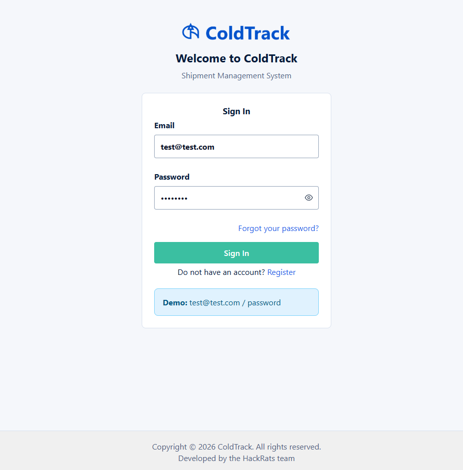

- **Creación de cuenta**: la aplicación permite registrar nuevos usuarios mediante el formulario de creación de cuenta. Los datos ingresados se envían a la fake API configurada, permitiendo simular el almacenamiento de usuarios.

  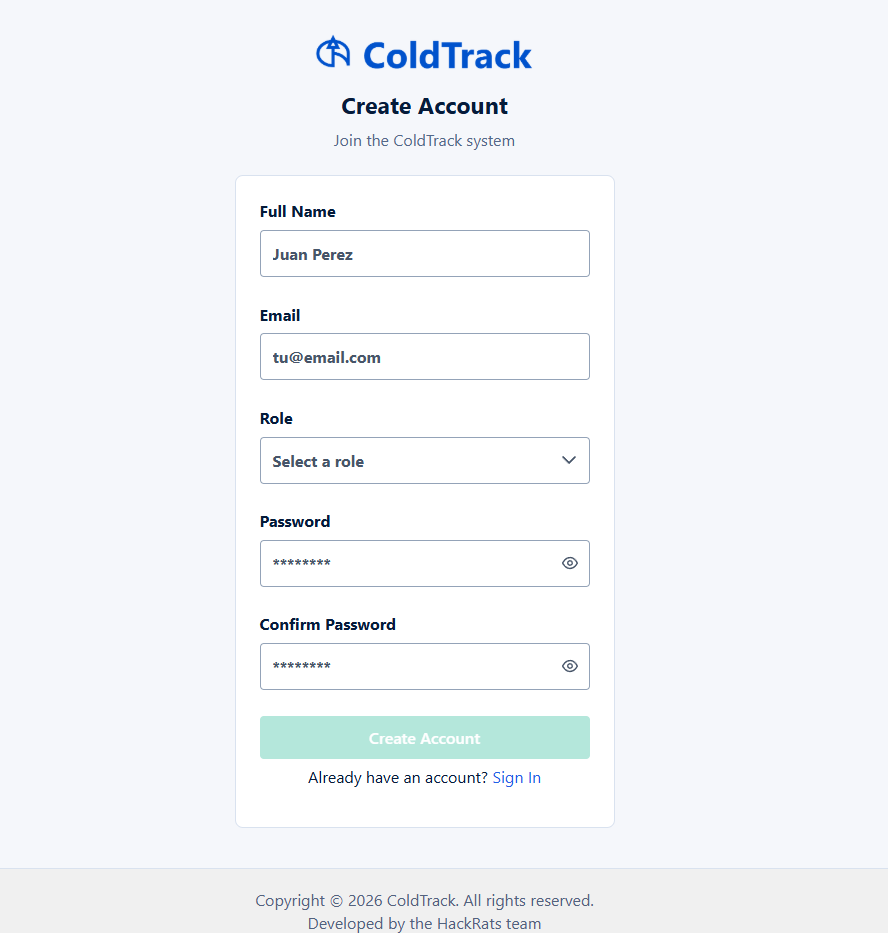

- **Dashboard de envíos**: luego de iniciar sesión, el usuario accede al dashboard principal, donde se visualizan métricas de envíos, alertas activas y una tabla con información operativa de los envíos registrados.

  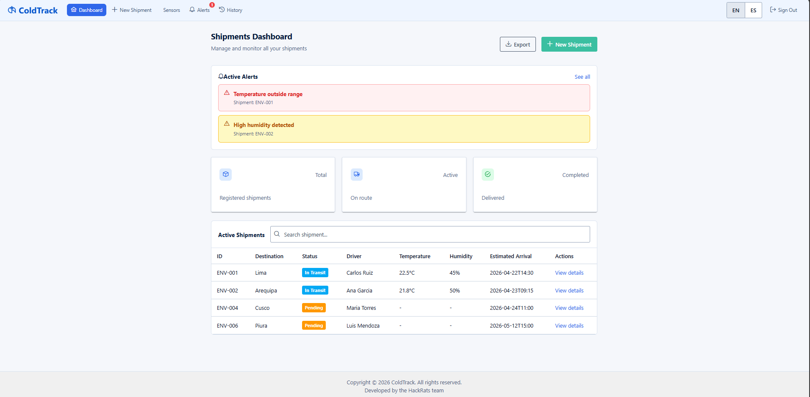

- **Registro de nuevo envío**: la aplicación permite crear un nuevo envío ingresando destino, conductor asignado, descripción de carga, fecha de salida y llegada estimada. Esta funcionalidad permite alimentar la fuente de datos desde la interfaz web.

  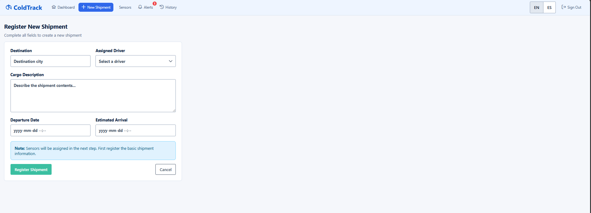

- **Gestión de sensores**: se implementó una vista para revisar sensores registrados, su estado de asignación, última lectura, temperatura, humedad y acción disponible. También se incorporó la opción de registrar nuevos sensores.

  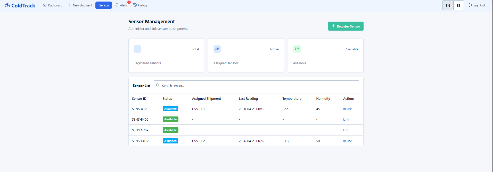

- **Sistema de alertas**: la aplicación muestra alertas generadas por variaciones críticas o de advertencia, permitiendo filtrar por severidad y estado. Esta vista facilita el monitoreo de incidencias durante el transporte.

  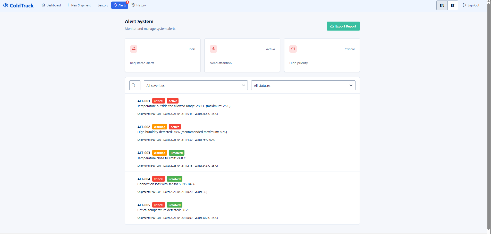

- **Historial de envíos**: se incorporó una vista de historial para revisar envíos completados, temperatura promedio, humedad promedio y alertas generadas.

  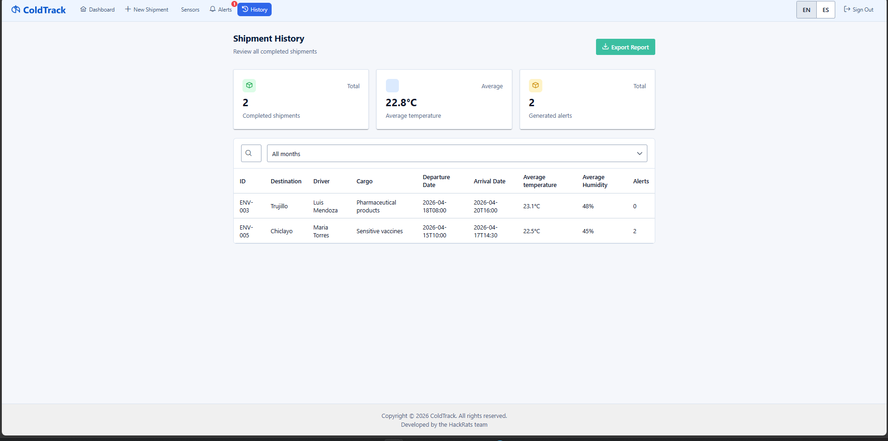

- **Internacionalización de interfaz**: se validó el cambio de idioma entre inglés y español mediante el selector `EN | ES`, afectando textos fijos de navegación, formularios, títulos, etiquetas y footer.

  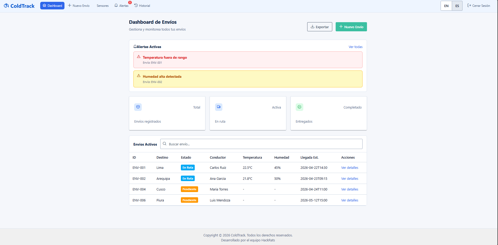

- **Integración Landing Page - Web Application**: la landing page fue actualizada para que sus botones de acción redirijan hacia la aplicación web desplegada, manteniendo continuidad entre la presentación comercial del producto y el uso de la plataforma.

  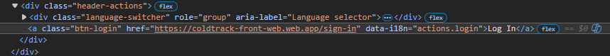

Desde el punto de vista técnico, la Web Application se implementó con JavaScript y Vue 3, utilizando Composition API, Vue Router, Vue I18n, PrimeVue y axios. La aplicación consume recursos desde una fake API expuesta públicamente, lo que permite validar el flujo de lectura y registro de información sin depender todavía de un backend propio.

#### 5.2.2.6. Services Documentation Evidence for Sprint Review

Durante el Sprint 2, ColdTrack aún no incorporó un backend propio completamente implementado. Sin embargo, para validar la comunicación entre la Web Application y una fuente de datos externa, el equipo configuró una fake API pública mediante MockAPI.io. Esta API permitió simular servicios REST para los principales recursos del sistema y validar operaciones de lectura y registro desde el frontend desplegado.

La Web Application consume los servicios desde la siguiente URL base:

- Base URL: https://6a0490212afe8349b4b6d716.mockapi.io/api/v1
- Plataforma: MockAPI.io
- Tipo de servicio: Fake REST API
- Formato de intercambio: JSON

Los recursos configurados para el Sprint 2 fueron los siguientes:

| Resource | Endpoint | HTTP Methods Used | Purpose |
|----------|----------|-------------------|---------|
| Users | `/users` | `GET`, `POST` | Permite consultar usuarios de prueba y registrar nuevas cuentas desde la aplicación. |
| Shipments | `/shipments` | `GET`, `POST` | Permite listar envíos activos y registrar nuevos envíos refrigerados. |
| Drivers | `/drivers` | `GET` | Permite consultar conductores disponibles para asignarlos a los envíos. |
| Sensors | `/sensors` | `GET`, `POST` | Permite visualizar sensores disponibles y registrar nuevos sensores IoT simulados. |
| Alerts | `/alerts` | `GET` | Permite consultar alertas asociadas a variaciones de temperatura o humedad. |

La documentación de estos servicios permitió conectar los módulos principales de la Web Application con datos simulados. El módulo de autenticación utiliza el recurso `users`, el dashboard y la vista de historial consumen información de `shipments`, la creación de envíos se apoya en `drivers`, la gestión de sensores utiliza `sensors` y la vista de alertas consulta el recurso `alerts`.

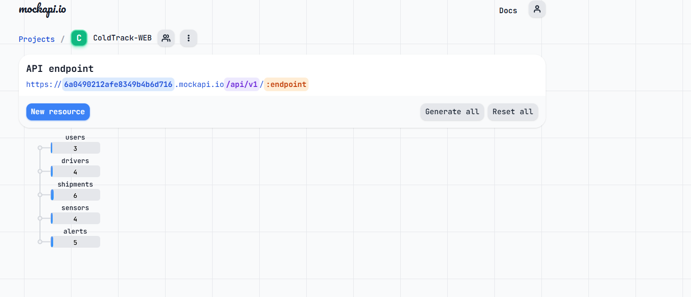

Además, se configuraron variables de entorno para separar el consumo de datos entre desarrollo y producción. Durante el desarrollo local se utilizó una fuente local basada en `db.js` o JSON Server, mientras que en producción la aplicación consume la fake API pública de MockAPI.io.

| Environment | API Source | Purpose |
|-------------|------------|---------|
| Development | `http://localhost:3000` | Pruebas locales con datos simulados. |
| Production | `https://6a0490212afe8349b4b6d716.mockapi.io/api/v1` | Consumo público de datos desde la Web Application desplegada. |

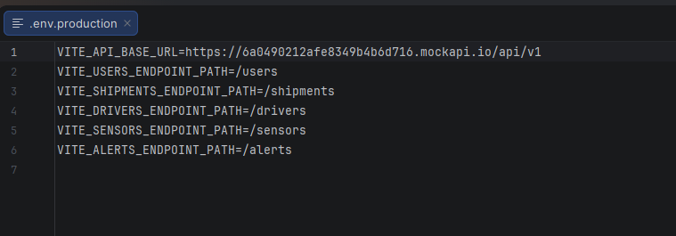

Esta documentación de servicios evidencia que, aunque el backend propio será desarrollado en una iteración posterior, el equipo ya validó la integración inicial entre frontend y servicios REST simulados. Esto permitió probar los flujos principales de ColdTrack, reducir riesgos técnicos y preparar la arquitectura para una futura migración hacia Web Services propios.

#### 5.2.2.7. Software Deployment Evidence for Sprint Review

Durante el Sprint 2 se completó el despliegue de los principales productos de software del ecosistema ColdTrack: la landing page, la Web Application y la fake API utilizada como fuente de datos para la aplicación. Estos despliegues permiten validar públicamente la navegación entre productos, el consumo de datos y el funcionamiento de los flujos principales.

**Landing Page Deployment**

La landing page se mantiene desplegada mediante **GitHub Pages**, utilizando el repositorio de la organización como fuente del sitio estático. En el Sprint 2 se actualizó para enlazar sus call-to-action con la aplicación web desplegada.

- Repositorio: https://github.com/1ASI0730-2610-10215/Landing-Page
- URL desplegada: https://1asi0730-2610-10215.github.io/Landing-Page/
- Rama de despliegue: `main`
- Plataforma: GitHub Pages

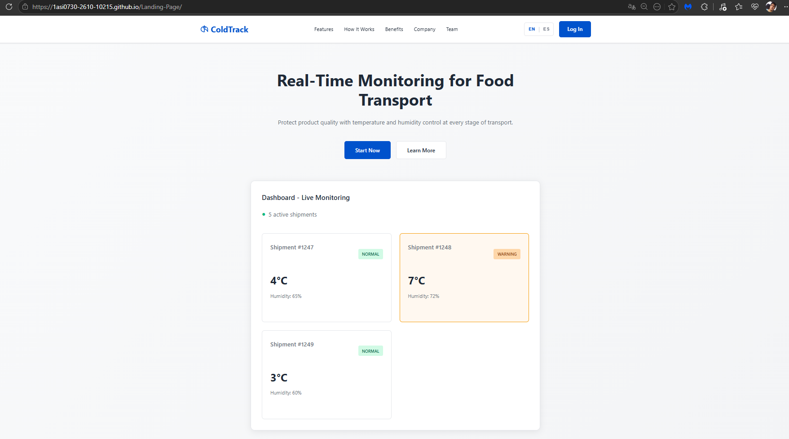

**Web Application Deployment**

La Web Application de ColdTrack fue desplegada mediante **Firebase Hosting**, permitiendo acceso público a la interfaz operativa de la plataforma. La aplicación contiene los módulos de autenticación, dashboard, registro de envíos, sensores, alertas, historial e internacionalización.

- Repositorio: https://github.com/1ASI0730-2610-10215/ColdTrack-Front
- URL desplegada principal: https://coldtrack-front-web.web.app/
- URL alternativa: https://coldtrack-front-web.firebaseapp.com/
- Plataforma: Firebase Hosting
- Comando de construcción: `npm run build`
- Carpeta pública de despliegue: `dist`
- Configuración SPA: redirección de rutas hacia `index.html`

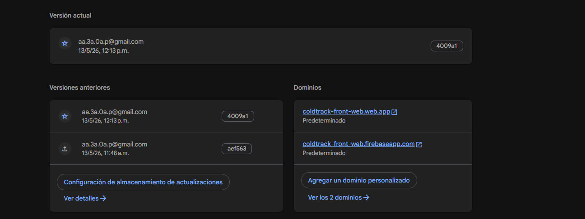

**Fake API Deployment**

Para simular la persistencia y consulta de datos, se configuró una fake API pública en **MockAPI.io**. Esta API funciona como reemplazo desplegado del `db.js` local durante las pruebas de producción, permitiendo consumir recursos como usuarios, envíos, conductores, sensores y alertas desde la Web Application.

- URL base: https://6a0490212afe8349b4b6d716.mockapi.io/api/v1
- Plataforma: MockAPI.io
- Recursos esperados:
  - `/users`
  - `/shipments`
  - `/drivers`
  - `/sensors`
  - `/alerts`


**Configuración de entorno para despliegue**

La Web Application utiliza variables de entorno para separar la configuración de desarrollo y producción:

- `.env.development`: apunta al entorno local `http://localhost:3000`
- `.env.production`: apunta al endpoint público de MockAPI.io

De esta forma, el equipo puede ejecutar la aplicación localmente con JSON Server durante el desarrollo y compilarla para producción consumiendo la fake API desplegada.


**Pasos de despliegue ejecutados**

1. Se integraron los cambios de la aplicación en el repositorio `ColdTrack-Front` siguiendo GitFlow.
2. Se configuraron variables de entorno para diferenciar desarrollo local y producción.
3. Se ejecutó el build de producción con `npm run build`.
4. Se configuró Firebase Hosting usando la carpeta `dist` como salida pública.
5. Se habilitó el comportamiento de single-page application para redirigir rutas internas hacia `index.html`.
6. Se desplegó la aplicación en Firebase Hosting.
7. Se configuraron los recursos necesarios en MockAPI.io para simular el backend.
8. Se actualizó la landing page para enlazar con la aplicación desplegada.
9. Se validó el acceso público a la landing page y a la Web Application.

Con estos despliegues, ColdTrack cuenta con una landing page pública, una Web Application accesible en la nube y una fake API disponible para validar los flujos principales desarrollados en el Sprint 2.

#### 5.2.2.8. Team Collaboration Insights during Sprint

<p>
Durante el Sprint 2, los analíticos de colaboración del repositorio ColdTrack-Front evidencian la participación de los integrantes del equipo sobre el código de la aplicación web ColdTrack. A lo largo del sprint se registran commits asociados a la configuración inicial del proyecto con Vue.js, así como a la implementación de los módulos de dashboard, autenticación, registro de envíos, gestión de sensores, alertas e historial. Esta actividad confirma que la construcción de la Web Application (Frontend) se realizó de forma incremental, alineada a los objetivos definidos en el Sprint 2 Goal.
</p>

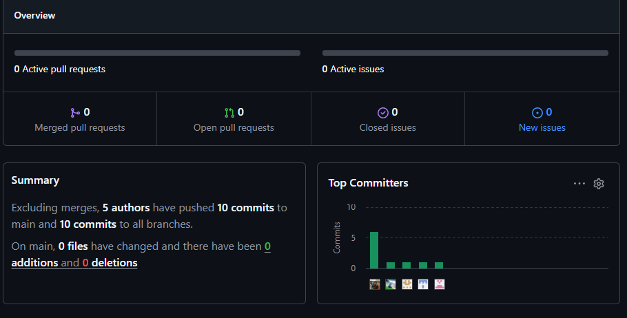

<p>
El Network Graph correspondiente al Sprint 2 muestra un uso activo del flujo de trabajo basado en GitFlow, con ramas de características (features como <code>feature/dashboard-module</code>, <code>feature/alerts</code>, <code>feature/sign-in-new-shipment</code>) creadas para la interfaz y componentes, que luego son fusionadas a la rama <code>develop</code> y posteriormente integradas tras el desarrollo. Este patrón de ramas indica que los integrantes coordinaron el trabajo de forma estructurada, alineados con las prácticas definidas para el proyecto (feature branches y consolidación en develop), reforzando la trazabilidad y la calidad del código entregado durante el sprint.
</p>

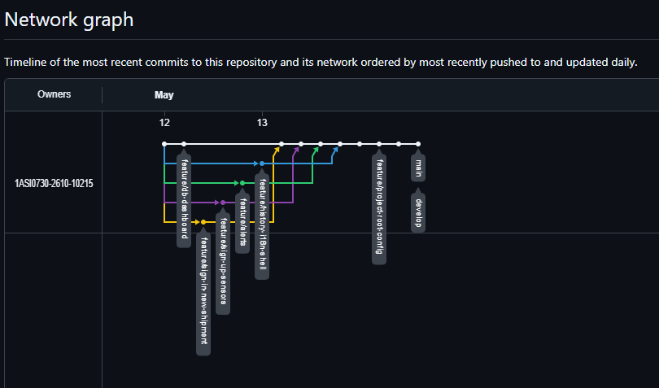

<p>
En conjunto, la evidencia recopilada en el repositorio demuestra que el equipo mantuvo una dinámica de trabajo constante conforme avanzaban las fechas de integración de los distintos módulos de la aplicación. La consolidación exitosa de las vistas y componentes sugiere un alto nivel de organización para preparar la Sprint Review. Estos analíticos y la correcta ejecución del GitFlow confirman que, durante el Sprint 2, los miembros del equipo participaron efectivamente en la implementación de la Web Application (Frontend) según el alcance establecido, cumpliendo con el principio de trabajo colaborativo.
</p>

### 5.2.3. Sprint 3

#### 5.2.3.1. Sprint Planning 3
| Sprint                             | Sprint 3                                                                                                                                                                                                                                                                                                                              |
| ---------------------------------- |---------------------------------------------------------------------------------------------------------------------------------------------------------------------------------------------------------------------------------------------------------------------------------------------------------------------------------------|
|                                    | Sprint Planning Background                                                                                                                                                                                                                                                                                                            |
| Date                               | 2026/06/01                                                                                                                                                                                                                                                                                                                            |
| Time                               | 19:30 PM                                                                                                                                                                                                                                                                                                                              |
| Location                           | El desarrollo de la reunión se hizo virtualmente por medio de Discord                                                                                                                                                                                                                                                                 |
| Prepared By                        | Eslander Celis Berrospi                                                                                                                                                                                                                                                                                                               |
| Attendees (to planning meeting)    | Eslander Celis Berrospi, Gabriel Mendoza, Rodrigo Oblitas Alcalde, Aarón Avila Palacios, Mathias Aréchaga Saavedra                                                                                                                                                                                                                    |
| Sprint n – 1 Review Summary        | En el Sprint 2 se desarrolló exitosamente el frontend de la aplicación, implementando las principales vistas, componentes y mecanismos de navegación necesarios para la interacción de los usuarios con el sistema.                                                                                                                   |
| Sprint n – 1 Retrospective Summary | Durante la retrospectiva del Sprint 2, el equipo identificó oportunidades de mejora en la integración entre frontend y backend, la organización del código y la distribución de tareas para optimizar el desarrollo del proyecto.                                                                                                     |
|                                    | Sprint Goal & User Stories                                                                                                                                                                                                                                                                                                            |
| Sprint 3 Goal                      | Implementar nuevas historias de usuario relacionadas con el backend, iniciar el desarrollo de la API REST, configurar mecanismos de autenticación, establecer procedimientos para el reporte y monitoreo de servicios backend, y continuar con las tareas pendientes del frontend para lograr una integración progresiva del sistema. |
| Sprint 3 Velocity                  | 14                                                                                                                                                                                                                                                                                                                                    |
| Sum of Story Points                | 14                                                                                                                                                                                                                                                                                                                                    |

#### 5.2.3.2. Aspect Leaders and Collaborators

#### 5.2.3.3. Sprint Backlog 3

El Sprint Backlog 3 se construyó a partir de las User Stories priorizadas en el Product Backlog para consolidar la integración del ecosistema ColdTrack. El objetivo principal fue reemplazar la fake API por un backend productivo desarrollado en ASP.NET Core, conectar la Web Application con Web Services persistentes en MySQL, implementar el motor de alertas, completar la gestión de reportes e integrar todos los módulos en un flujo de extremo a extremo.

| User Story Id | User Story Title | Task Id | Task Description | Status |
|---------------|------------------|---------|------------------|--------|
| TS-001 | Crear usuario | T01 | Implementar modelo de usuario en ASP.NET Core con entidad User, ValueObjects de autenticación y repositorio para persistencia en MySQL. | Done |
| TS-002 | Autenticación | T02 | Implementar endpoints `/api/v1/authentication/sign-up` y `/api/v1/authentication/sign-in` con validación y emisión de JWT. | Done |
| TS-002 | Autenticación | T03 | Configurar JWT Bearer, políticas de autorización y middleware de autenticación para proteger endpoints sensibles. | Done |
| TS-003 | CRUD envíos | T04 | Implementar modelo Shipment como Aggregate Root, ValueObjects (ShipmentId, Route, Status) y operaciones de lectura-escritura. | Done |
| TS-003 | CRUD envíos | T05 | Implementar endpoints CRUD: `GET /shipments`, `POST /shipments`, `GET /shipments/{id}`, `PATCH /shipments/{id}/status`. | Done |
| TS-004 | Asignación sensor | T06 | Implementar modelo de Sensor IoT con entidades Sensor, SensorId, SensorStatus y relación con Shipment. | Done |
| TS-004 | Asignación sensor | T07 | Implementar endpoints de sensores: `GET /sensors`, `POST /sensors`, `PATCH /sensors/{id}/assignment` para vinculación. | Done |
| TS-005 | Integración IoT | T08 | Implementar modelos de telemetría: TelemetryStream, TelemetryLog, Temperature y Humidity como ValueObjects con validación. | Done |
| TS-005 | Integración IoT | T09 | Implementar endpoint `POST /api/v1/telemetry` para recibir y almacenar lecturas de sensores en MySQL. | Done |
| TS-005 | Integración IoT | T10 | Implementar endpoint `GET /shipments/{shipmentId}/telemetry` para recuperar historial de lecturas. | Done |
| TS-006 | Tiempo real | T11 | Documentar contrato REST y exponer Swagger/OpenAPI para validación del frontend. | Done |
| TS-007 | Motor alertas | T12 | Implementar ThresholdPolicy como Domain Service para evaluar temperatura (2-8°C) y humedad (0-60%). | Done |
| TS-008 | Notificaciones | T14 | Integrar motor de alertas con telemetría para evaluación automática de umbrales y creación de alertas. | Done |
| TS-008 | Notificaciones | T15 | Implementar endpoints de gestión: `GET /alerts`, `PATCH /alerts/{id}/acknowledgment`, `PATCH /alerts/{id}/resolution`. | Done |
| TS-009 | Guardar historial | T16 | Implementar modelo Report y HistoricalLog para consolidar envíos completados con métricas agregadas. | Done |
| TS-009 | Guardar historial | T17 | Implementar endpoint `GET /api/v1/analytics/shipment-history` para listar envíos completados con filtros. | Done |
| Task adicional | Swagger y documentación | T20 | Configurar Swashbuckle para publicar documentación OpenAPI en `/swagger/index.html`. | Done |
| Task adicional | Health check y resiliencia | T21 | Implementar endpoint `GET /health` para verificar disponibilidad de API y dependencias (MySQL). | Done |
| Task adicional | Configuración de despliegue | T22 | Crear Dockerfile multi-stage y definir variables de entorno para MySQL, JWT y URLs de API. | Done |
| Task adicional | Despliegue en Render | T23 | Conectar repositorio backend a Render, compilar imagen Docker y publicar Web Services públicamente. | Done |
| Task adicional | Base de datos MySQL | T24 | Provisionar instancia MySQL en Filess.io, crear esquema y configurar conexión con TLS. | Done |
| Task adicional | Actualización del frontend | T25 | Reemplazar URLs de MockAPI por endpoints de Render en variables de entorno de la Web Application. | Done |
| Task adicional | Integración completa | T26 | Validar flujo de extremo a extremo: autenticación, envíos, sensores, telemetría, alertas, historial y reportes. | Done |
| Task adicional | Implementación de data de demostración | T27 | Crear seeding de datos iniciales (usuarios, envíos, sensores, lecturas) al iniciar aplicación en producción. | Done |

Link del Trello: https://trello.com/b/IcxxPY0t/sprint-backlog-3-coldtrack

#### 5.2.3.4. Development Evidence for Sprint Review
Durante el Sprint 3, el equipo se enfocó en el desarrollo del backend de ColdTrack siguiendo una arquitectura basada en Domain-Driven Design (DDD). Se implementaron los principales bounded contexts del sistema, incluyendo autenticación (IAM), gestión de envíos (Shipments), monitoreo de sensores y telemetría (Telemetry), alertas (Alerting), analítica (Analytics) y generación de reportes (Reporting). Además, se avanzó en la configuración de despliegue, documentación técnica y preparación de versiones funcionales de la plataforma.

| Repository | Branch | Commit Id | Commit Message | Commit Message Body | Commited on (Date) |
|------------|--------|-----------|----------------|---------------------|--------------------|
| FreshGuard.ColdTrack.Platform | `feature/iam-authentication` | `00e489f6` | `feat(iam): add email and authentication security tests` | Se implementaron pruebas de seguridad para el módulo de autenticación y validación de usuarios. | 13/06/2026 |
| FreshGuard.ColdTrack.Platform | `feature/create-shipment` | `c59d4007` | `feat(shipments): add shipment domain errors` | Se desarrolló la lógica inicial para la creación de envíos y validaciones de dominio. | 13/06/2026 |
| FreshGuard.ColdTrack.Platform | `feature/get-shipments` | `0fb3b8d3` | `feat(shipments): implement shipment query service` | Se implementaron consultas y recuperación de información de envíos. | 13/06/2026 |
| FreshGuard.ColdTrack.Platform | `feature/update-shipment-status` | `cabbc1a8` | `feat(shipments): implement shipment command service` | Se desarrolló la funcionalidad para actualizar estados de los envíos. | 13/06/2026 |
| FreshGuard.ColdTrack.Platform | `feature/register-sensor` | `cb855649` | `feat(telemetry): add sensor repository contract` | Se implementó el registro y gestión de sensores dentro del sistema. | 13/06/2026 |
| FreshGuard.ColdTrack.Platform | `feature/record-telemetry` | `95cec308` | `feat(telemetry): implement telemetry command service` | Se desarrolló el registro de datos de telemetría provenientes de sensores. | 13/06/2026 |
| FreshGuard.ColdTrack.Platform | `feature/get-telemetry` | `ce9a191b` | `feat(telemetry): implement telemetry query services` | Se implementaron servicios de consulta para datos históricos de telemetría. | 13/06/2026 |
| FreshGuard.ColdTrack.Platform | `feature/alerting-api` | `e4ae8e61` | `feat(alerting): add alert lifecycle endpoints` | Se desarrollaron endpoints para la gestión completa del ciclo de vida de alertas. | 13/06/2026 |
| FreshGuard.ColdTrack.Platform | `feature/analytics-dashboard` | `0195d31c` | `feat(analytics): implement dashboard analytics queries` | Se implementaron consultas para métricas y paneles analíticos del sistema. | 13/06/2026 |
| FreshGuard.ColdTrack.Platform | `feature/generate-report` | `a575aa8a` | `feat(reporting): implement report generation service` | Se desarrolló el servicio encargado de generar reportes operativos. | 13/06/2026 |
| FreshGuard.ColdTrack.Platform | `feature/pdf-report` | `e5116149` | `feat(reporting): implement QuestPDF report generation` | Se implementó la generación de reportes en formato PDF mediante QuestPDF. | 13/06/2026 |
| FreshGuard.ColdTrack.Platform | `feature/fix-swagger-bearer-security` | `1c0a3aac` | `fix(api): apply bearer security to Swagger operations` | Se configuró la autenticación Bearer para las pruebas de endpoints desde Swagger. | 16/06/2026 |


#### 5.2.3.5. Execution Evidence for Sprint Review

Durante el Sprint 3 se ejecutó la solución integrada de ColdTrack utilizando la Web Application desplegada y los Web Services conectados a una base de datos MySQL persistente. Las pruebas funcionales se realizaron sobre los flujos principales de autenticación, gestión de envíos, asignación de sensores, registro de telemetría, generación de alertas, consulta del historial y exportación de reportes. Esta ejecución permitió comprobar que el frontend consume correctamente los contratos REST del backend y que los cambios se conservan en la base de datos remota.

| Componente | Entorno de ejecución | Resultado observado |
|---|---|---|
| Web Application | Firebase Hosting | La interfaz se encuentra disponible públicamente y consume la API de producción. |
| Web Services | Render | La API ASP.NET Core responde mediante HTTPS y expone sus operaciones con Swagger/OpenAPI. |
| Persistencia | MySQL en Filess.io | Los usuarios, envíos, sensores, lecturas y alertas permanecen disponibles entre sesiones. |
| Seguridad | JWT Bearer | Los recursos protegidos requieren un token obtenido mediante el inicio de sesión. |

#### 5.2.3.6. Services Documentation Evidence for Sprint Review.

Durante el Sprint 3, el equipo concentró sus esfuerzos en la construcción de la capa de backend del sistema, abarcando la implementación de la lógica de dominio, la configuración de persistencia de datos y la exposición de servicios a través de endpoints REST, sentando así las bases funcionales de los principales módulos de la aplicación. 
En lo que respecta al módulo de gestión de identidad y acceso, se llevó a cabo la implementación del agregado UserAccount junto con sus reglas de negocio, el value object Email con validación de formato, y la configuración del repositorio de usuarios sobre MySQL. 
Adicionalmente, se desarrolló el servicio de hashing y verificación segura de contraseñas, los casos de uso correspondientes al registro e inicio de sesión de usuarios con generación de token JWT, y los endpoints REST necesarios para exponer dichas funcionalidades, incluyendo la consulta del perfil del usuario autenticado. 
En cuanto al módulo de gestión de envíos, se implementó el agregado Shipment con sus respectivas reglas de negocio, la capa de persistencia en MySQL, y los casos de uso para el registro y actualización de envíos refrigerados. Asimismo, 
se desarrollaron los endpoints REST bajo los métodos POST, GET y PATCH para permitir el registro, consulta y actualización del estado de los envíos, apoyándose en el value object ShipmentStatus para modelar correctamente el ciclo de vida de cada envío. 
Finalmente, en el módulo de monitoreo de temperatura, se implementaron los endpoints del controlador de alertas de temperatura, así como el servicio encargado de registrar y preservar el historial de alertas generadas por el sistema.

##### Scope and execution criteria

La revisión se concentró en comprobar el flujo de negocio de extremo a extremo y no solamente la disponibilidad aislada de cada endpoint. Para considerar satisfactoria la ejecución se establecieron los siguientes criterios:

1. La Web Application debe cargar desde Firebase Hosting y comunicarse con la URL productiva del backend.
2. El usuario debe poder autenticarse y utilizar el token JWT para acceder a recursos protegidos.
3. Los envíos, sensores y lecturas deben persistir en MySQL y permanecer disponibles en consultas posteriores.
4. Una lectura fuera de los umbrales de 2 °C a 8 °C o por encima de 60 % de humedad debe reflejarse como una alerta operativa.
5. El cambio de estado de un envío debe respetar el ciclo de vida soportado por la API.
6. Los envíos completados deben aparecer en el historial y poder incluirse en un reporte PDF.

El siguiente diagrama resume la secuencia ejecutada durante la Sprint Review:

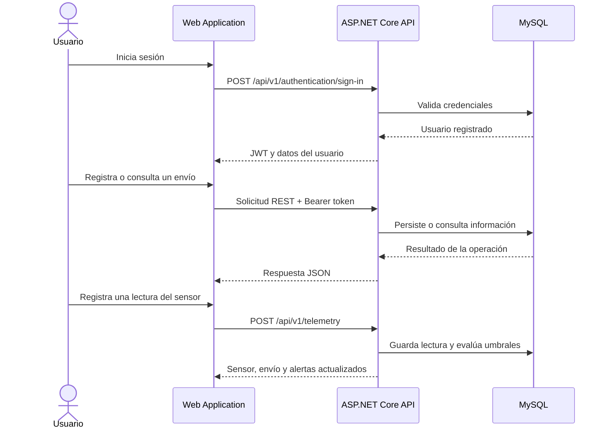
```mermaid
sequenceDiagram
    actor U as Usuario
    participant W as Web Application
    participant A as ASP.NET Core API
    participant D as MySQL
    U->>W: Inicia sesión
    W->>A: POST /api/v1/authentication/sign-in
    A->>D: Valida credenciales
    D-->>A: Usuario registrado
    A-->>W: JWT y datos del usuario
    U->>W: Registra o consulta un envío
    W->>A: Solicitud REST + Bearer token
    A->>D: Persiste o consulta información
    D-->>A: Resultado de la operación
    A-->>W: Respuesta JSON
    U->>W: Registra una lectura del sensor
    W->>A: POST /api/v1/telemetry
    A->>D: Guarda lectura y evalúa umbrales
    A-->>W: Sensor, envío y alertas actualizados
```

##### API operations included in the review

| Módulo | Método y ruta | Propósito verificado |
|---|---|---|
| Authentication | `POST /api/v1/authentication/sign-up` | Registrar una cuenta de ColdTrack. |
| Authentication | `POST /api/v1/authentication/sign-in` | Autenticar al usuario y emitir un JWT. |
| Users | `GET /api/v1/users/me` | Recuperar el usuario identificado por el token. |
| Shipments | `POST /api/v1/shipments` | Registrar un envío refrigerado. |
| Shipments | `GET /api/v1/shipments` | Listar envíos y aplicar el filtro opcional de estado. |
| Shipments | `GET /api/v1/shipments/{shipmentId}` | Consultar el detalle técnico de un envío. |
| Shipments | `PATCH /api/v1/shipments/{shipmentId}/status` | Actualizar el estado del ciclo de vida. |
| Sensors | `GET /api/v1/sensors` y `POST /api/v1/sensors` | Consultar y registrar sensores. |
| Sensors | `PATCH /api/v1/sensors/{sensorId}/assignment` | Asignar un sensor disponible a un envío. |
| Telemetry | `POST /api/v1/telemetry` | Registrar una lectura de temperatura y humedad. |
| Telemetry | `GET /api/v1/shipments/{shipmentId}/telemetry` | Consultar las lecturas asociadas a un envío. |
| Alerts | `GET /api/v1/alerts` | Listar alertas por estado y severidad. |
| Alerts | `PATCH /api/v1/alerts/{alertId}/acknowledgment` | Reconocer una alerta activa. |
| Alerts | `PATCH /api/v1/alerts/{alertId}/resolution` | Resolver una alerta. |
| Analytics | `GET /api/v1/analytics/dashboard` | Obtener indicadores consolidados del dashboard. |
| Analytics | `GET /api/v1/analytics/shipment-history` | Consultar el historial de envíos completados. |
| Reports | `POST /api/v1/reports` | Generar y registrar un reporte analítico. |
| Reports | `GET /api/v1/reports/{reportId}/file` | Descargar el reporte generado en PDF. |
| Health | `GET /health` | Comprobar que el proceso de la API está disponible. |

La documentación interactiva de Swagger permitió revisar y ejecutar los endpoints implementados. Se verificaron las operaciones de alertas, analítica, autenticación, reportes, sensores, envíos, telemetría y consulta del usuario autenticado.

<p align="center">
  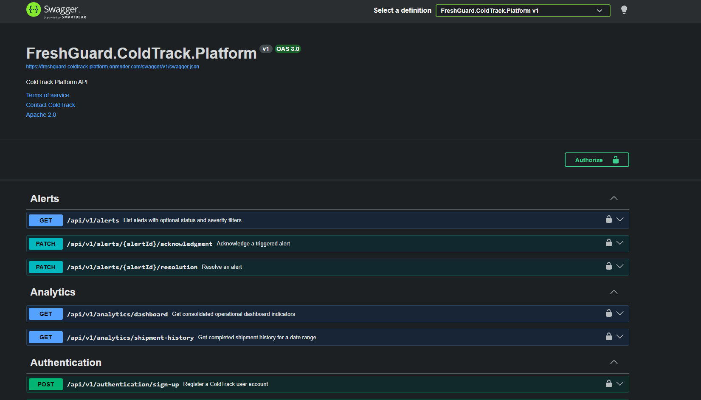
</p>

<p align="center"><em>Figura 1. Documentación Swagger desplegada para los Web Services de ColdTrack.</em></p>

<p align="center">
  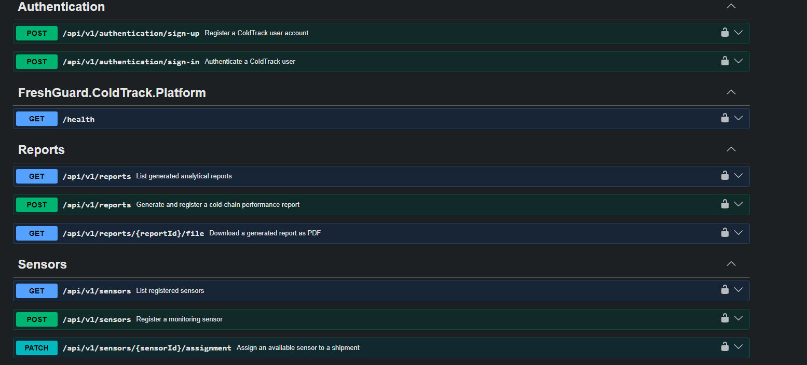
</p>

<p align="center"><em>Figura 2. Operaciones de autenticación, generación de reportes y gestión de sensores.</em></p>

<p align="center">
  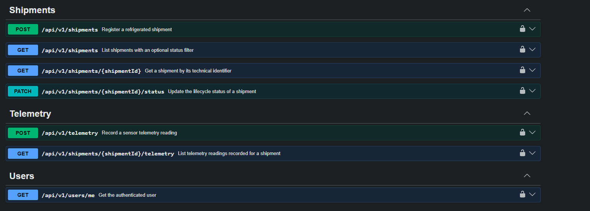
</p>

<p align="center"><em>Figura 3. Operaciones protegidas para envíos, telemetría y usuario autenticado.</em></p>

En la Web Application se comprobó que el dashboard consolida los envíos y presenta las alertas activas. El flujo de registro permite crear un envío con destino, conductor, descripción de carga y fechas de salida y llegada estimada.

<p align="center">
  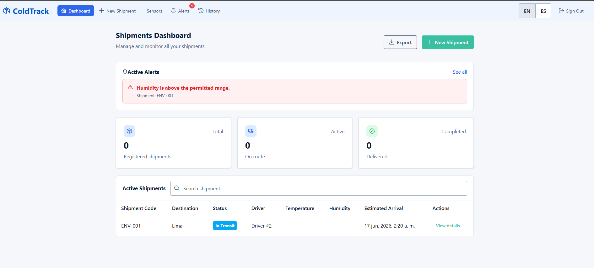
</p>

<p align="center"><em>Figura 4. Dashboard conectado a los indicadores y alertas del backend.</em></p>

<p align="center">
  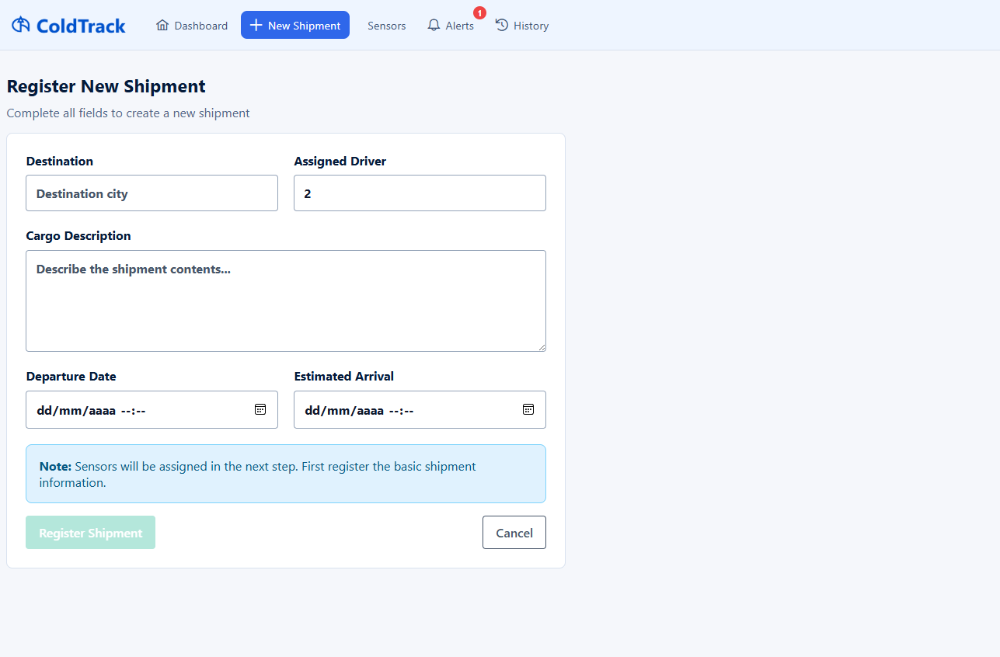
</p>

<p align="center"><em>Figura 5. Formulario de creación de un envío refrigerado.</em></p>

La gestión de sensores permitió consultar los dispositivos registrados, identificar su estado, asociarlos con envíos y registrar nuevas lecturas de temperatura y humedad. Las lecturas fuera de los límites configurados generaron alertas relacionadas con el envío correspondiente.

<p align="center">
  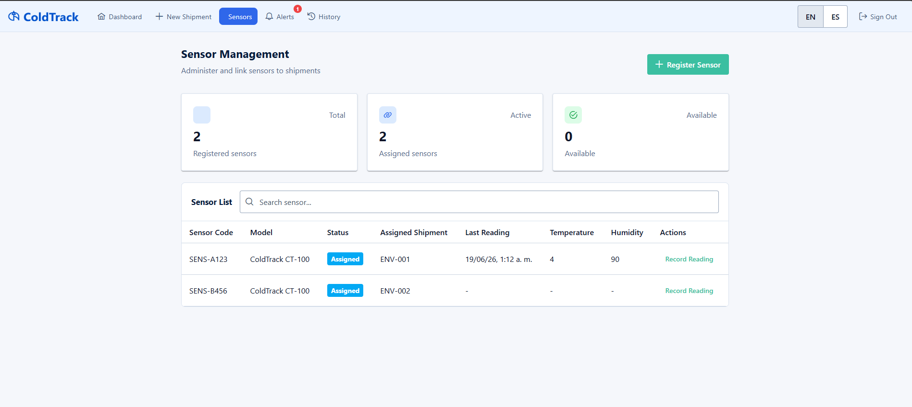
</p>

<p align="center"><em>Figura 6. Sensores registrados, asignación y acceso al registro de telemetría.</em></p>

<p align="center">
  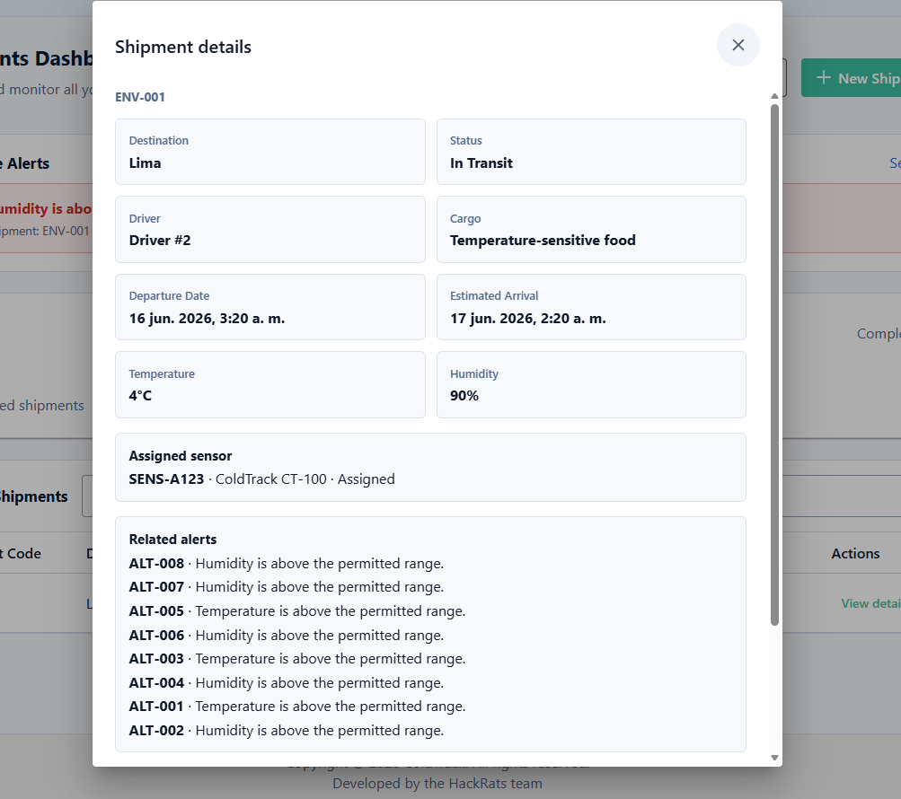
</p>

<p align="center"><em>Figura 7. Detalle integrado del envío, sensor asignado y alertas relacionadas.</em></p>

El módulo de alertas mostró los eventos generados por temperatura o humedad fuera del rango permitido, incluyendo severidad, estado, valor registrado y límite. También se verificaron las acciones para reconocer y resolver una alerta.

<p align="center">
  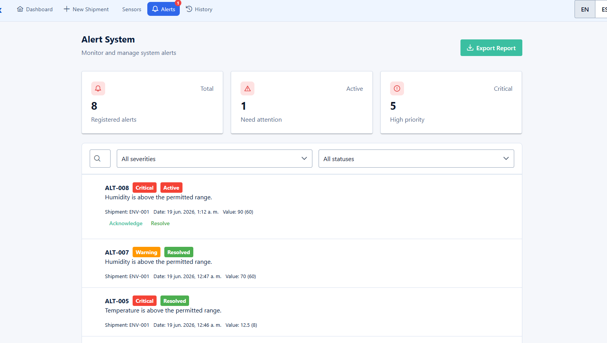
</p>

<p align="center"><em>Figura 8. Alertas generadas a partir de las lecturas de telemetría.</em></p>

Finalmente, se completó un envío para comprobar su incorporación al historial y se ejecutó la exportación de un reporte PDF. El documento generado incluyó los indicadores del período y el detalle del envío completado.

<p align="center">
  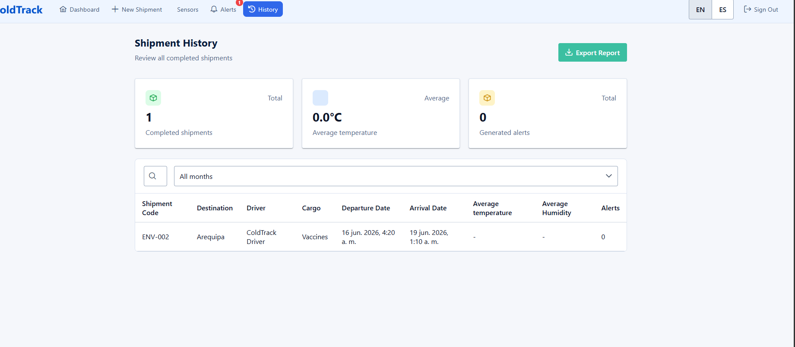
</p>

<p align="center"><em>Figura 9. Historial de envíos completados consultado desde la Web Application.</em></p>

<p align="center">
  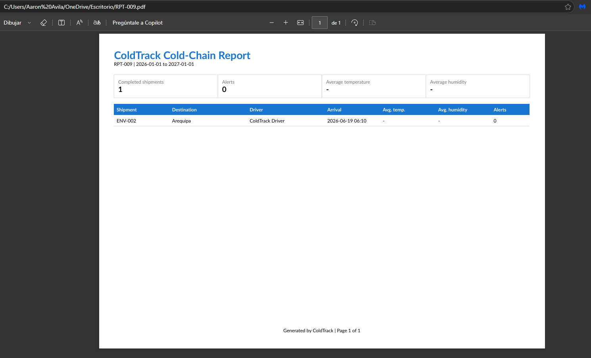
</p>

<p align="center"><em>Figura 10. Reporte PDF generado por ColdTrack para el período seleccionado.</em></p>

##### Integrated functional scenarios

| ID | Escenario ejecutado | Evidencia esperada | Resultado |
|---|---|---|---|
| EX-01 | Autenticar una cuenta registrada | La API devuelve un JWT y las solicitudes protegidas incluyen `Authorization: Bearer` | Conforme |
| EX-02 | Consultar el dashboard | Se muestran indicadores, envíos y alertas recuperados desde la API | Conforme |
| EX-03 | Registrar un nuevo envío | El envío se guarda y queda disponible para consultas posteriores | Conforme |
| EX-04 | Consultar el detalle del envío | Se muestran carga, conductor, fechas, condiciones, sensor y alertas relacionadas | Conforme |
| EX-05 | Consultar y asignar sensores | La tabla muestra el sensor y el envío vinculado | Conforme |
| EX-06 | Registrar telemetría fuera del rango | Se actualiza la última lectura y se genera una alerta asociada | Conforme |
| EX-07 | Reconocer y resolver alertas | El estado de la alerta cambia y se conserva en MySQL | Conforme |
| EX-08 | Completar un envío | El envío se incorpora al historial de completados | Conforme |
| EX-09 | Exportar información | Se genera un archivo PDF con indicadores y detalle del período | Conforme |
| EX-10 | Cambiar el idioma de la interfaz | Los textos fijos se presentan en inglés o español | Conforme |

##### Technical verification commands

Antes de publicar los incrementos se utilizaron las validaciones disponibles en cada repositorio:

```bash
# Web Application
npm install
npm run build

# Web Services
dotnet restore
dotnet build cold-track-platform.sln
dotnet test cold-track-platform.sln
```

En conjunto, estas evidencias demuestran que el incremento del Sprint 3 funciona como una solución integrada: la interfaz ejecuta los casos de uso, la API aplica las reglas de negocio y MySQL conserva el estado resultante. Las capturas complementan la demostración en vivo y permiten rastrear el resultado de cada escenario revisado.

#### 5.2.3.6. Services Documentation Evidence for Sprint Review

#### 5.2.3.7. Software Deployment Evidence for Sprint Review

El despliegue del Sprint 3 se organizó en tres servicios independientes: MySQL para la persistencia, Render para los Web Services y Firebase Hosting para la Web Application. Esta separación permite actualizar cada componente de manera controlada y mantener las credenciales de producción fuera de los repositorios.

##### Deployed architecture

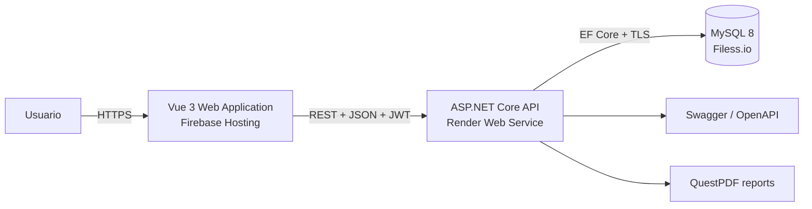
```mermaid
flowchart LR
    U[Usuario] -->|HTTPS| F[Vue 3 Web Application<br/>Firebase Hosting]
    F -->|REST + JSON + JWT| B[ASP.NET Core API<br/>Render Web Service]
    B -->|EF Core + TLS| D[(MySQL 8<br/>Filess.io)]
    B --> O[Swagger / OpenAPI]
    B --> P[QuestPDF reports]
```

| Componente | Tecnología y plataforma | Dirección o configuración principal |
|---|---|---|
| Web Application | Vue 3.5, Vite y Firebase Hosting | https://coldtrack-front-web.web.app/ |
| Web Application alternativa | Firebase Hosting | https://coldtrack-front-web.firebaseapp.com/ |
| Web Services | ASP.NET Core sobre .NET 10 y Render | https://freshguard-coldtrack-platform.onrender.com |
| Swagger UI | Swashbuckle en Render | https://freshguard-coldtrack-platform.onrender.com/swagger/index.html |
| Health check | ASP.NET Core | https://freshguard-coldtrack-platform.onrender.com/health |
| Persistencia | Entity Framework Core y MySQL 8.0.29 | Filess.io mediante conexión TLS |
| Reportes | QuestPDF | Generación y descarga desde los endpoints de reportes |

##### Database deployment

La base de datos MySQL 8.0.29 fue aprovisionada en Filess.io mediante una instancia compartida. La configuración remota utiliza un host y puerto asignados por el proveedor, mientras que el nombre de la base de datos y el usuario se gestionan como variables de entorno en el servicio backend. La contraseña no se publica en el informe ni en GitHub.

<p align="center">
  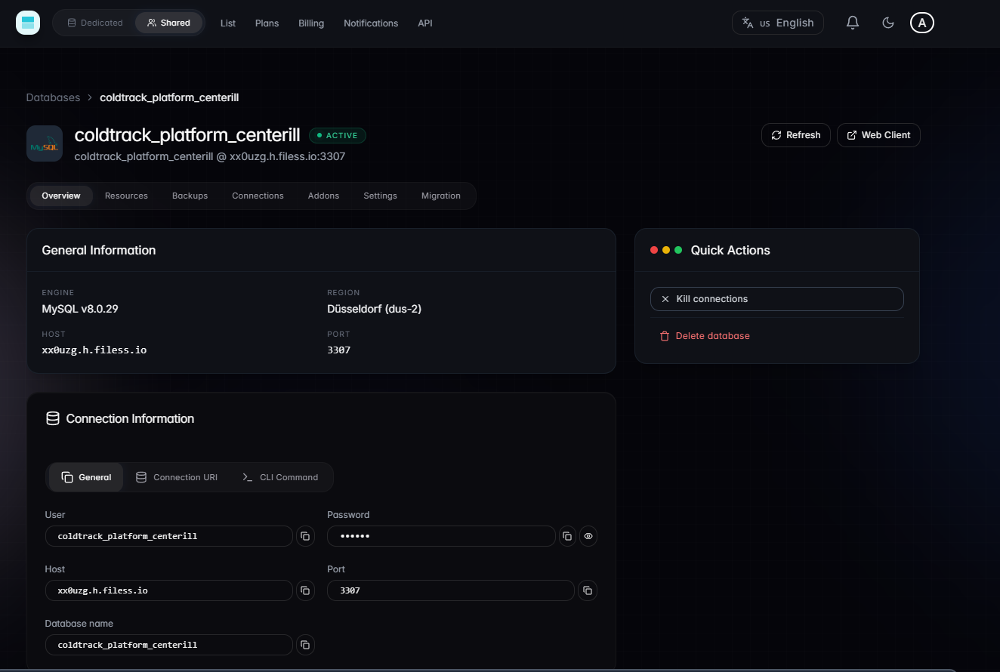
</p>

<p align="center"><em>Figura 11. Instancia MySQL de producción activa en Filess.io.</em></p>

La configuración productiva de ASP.NET Core construye la cadena de conexión a partir de variables de entorno y exige `SslMode=Required`. De este modo, el repositorio conserva solamente los nombres de las variables y Render almacena sus valores sensibles.

| Variable | Propósito |
|---|---|
| `DATABASE_HOST` | Host asignado por Filess.io. |
| `DATABASE_PORT` | Puerto de la instancia MySQL. |
| `DATABASE_NAME` | Esquema productivo de ColdTrack. |
| `DATABASE_USER` | Usuario con permisos sobre el esquema. |
| `DATABASE_PASSWORD` | Contraseña almacenada como secreto. |
| `TokenSettings__Secret` | Clave utilizada para firmar los JWT. |
| `TokenSettings__Issuer` | Emisor esperado por la validación del token. |
| `TokenSettings__Audience` | Audiencia autorizada para consumir el token. |

La API aplica las migraciones pendientes al iniciar mediante `Database.MigrateAsync()`. En el entorno preparado para la Sprint Review también se habilitó la carga controlada de datos de demostración, lo que permitió disponer de cuentas, envíos y sensores iniciales sin ejecutar scripts manuales sobre producción.

La persistencia se comprobó registrando y consultando usuarios, envíos, sensores, lecturas, alertas y reportes. Los datos permanecieron disponibles después de recargar la Web Application y después de nuevos despliegues del frontend.

##### Web Services deployment

Los Web Services de FreshGuard.ColdTrack.Platform fueron desplegados en Render como un Web Service basado en Docker y conectado al repositorio del backend. El servicio se ejecuta en el entorno Production, escucha en el puerto proporcionado por Render y publica la API mediante HTTPS. La evidencia del log confirma que la aplicación inició correctamente y que el servicio quedó disponible en su URL pública.

- Backend URL: https://freshguard-coldtrack-platform.onrender.com
- Swagger URL: https://freshguard-coldtrack-platform.onrender.com/swagger/index.html

<p align="center">
  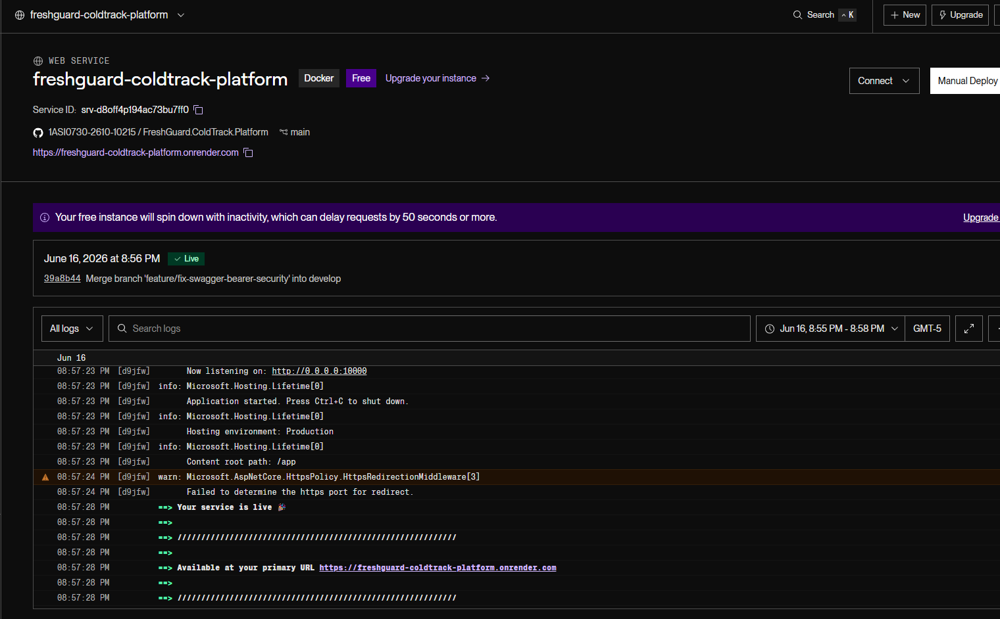
</p>

<p align="center"><em>Figura 12. Web Service de ColdTrack ejecutándose en el entorno de producción de Render.</em></p>

El backend utiliza un `Dockerfile` multi-stage. La primera etapa restaura y publica la solución con el SDK de .NET 10; la segunda ejecuta únicamente los artefactos publicados sobre la imagen de ASP.NET Core, reduciendo el contenido del contenedor final.

```dockerfile
FROM mcr.microsoft.com/dotnet/sdk:10.0 AS build
WORKDIR /src
COPY . .
RUN dotnet restore cold-track-platform.sln
RUN dotnet publish FreshGuard.ColdTrack.Platform/FreshGuard.ColdTrack.Platform.csproj \
    -c Release -o /app/publish /p:UseAppHost=false

FROM mcr.microsoft.com/dotnet/aspnet:10.0 AS runtime
WORKDIR /app
COPY --from=build /app/publish .
EXPOSE 10000
ENTRYPOINT ["sh", "-c", "dotnet FreshGuard.ColdTrack.Platform.dll --urls http://0.0.0.0:${PORT:-10000}"]
```

Proceso aplicado para publicar los Web Services:

1. Las ramas funcionales del backend se integraron en `develop` y se validaron antes de llegar a `main`.
2. Render se conectó al repositorio `FreshGuard.ColdTrack.Platform` y utilizó la rama estable para construir la imagen Docker.
3. Se configuraron como variables protegidas la conexión MySQL y los parámetros de firma JWT.
4. El proceso tomó el puerto dinámico `PORT` proporcionado por Render; en ausencia de este valor utiliza el puerto 10000.
5. Al iniciar, Entity Framework Core aplicó las migraciones pendientes y preparó los datos de demostración configurados.
6. Se verificaron `/health`, Swagger UI, autenticación y consultas protegidas desde la URL pública.

Swagger permanece habilitado en producción para la revisión académica. La captura de Render confirma que el servicio inició en el entorno `Production` y quedó disponible en el dominio público. Debido al plan gratuito, una instancia inactiva puede suspenderse temporalmente y la primera solicitud puede tardar aproximadamente 50 segundos en reactivarla.

##### Web Application deployment

La Web Application fue construida con Vite y desplegada en Firebase Hosting. La versión publicada utiliza la URL del backend de Render configurada para producción, lo cual permite ejecutar el flujo completo desde el navegador sin depender de la API simulada utilizada en incrementos anteriores.

- Production URL: https://coldtrack-front-web.web.app/
- Alternative URL: https://coldtrack-front-web.firebaseapp.com/

<p align="center">
  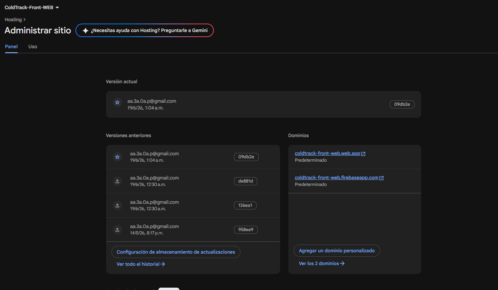
</p>

<p align="center"><em>Figura 13. Versión de la Web Application publicada en Firebase Hosting.</em></p>

La configuración de Firebase publica el directorio generado por Vite y redirige cualquier ruta hacia `index.html`, condición necesaria para que Vue Router mantenga la navegación de la Single Page Application después de una recarga.

```json
{
  "hosting": {
    "public": "dist",
    "ignore": ["firebase.json", "**/.*", "**/node_modules/**"],
    "rewrites": [
      { "source": "**", "destination": "/index.html" }
    ]
  }
}
```

El entorno productivo del frontend separa la URL base de las rutas semánticas de cada recurso:

```dotenv
VITE_API_BASE_URL=https://freshguard-coldtrack-platform.onrender.com
VITE_AUTHENTICATION_ENDPOINT_PATH=/api/v1/authentication
VITE_SHIPMENTS_ENDPOINT_PATH=/api/v1/shipments
VITE_SENSORS_ENDPOINT_PATH=/api/v1/sensors
VITE_TELEMETRY_ENDPOINT_PATH=/api/v1/telemetry
VITE_ALERTS_ENDPOINT_PATH=/api/v1/alerts
VITE_ANALYTICS_ENDPOINT_PATH=/api/v1/analytics
VITE_REPORTS_ENDPOINT_PATH=/api/v1/reports
```

Los comandos utilizados para construir y publicar la aplicación fueron:

```bash
npm install
npm run build
firebase deploy --only hosting
```

##### Release strategy and post-deployment verification

Los tres repositorios mantuvieron el flujo `feature/* → develop → release/* → main`. Las ramas de característica aislaron cada incremento, `develop` concentró la integración y `main` representó la versión publicada. Cada release se identificó mediante un tag para conservar la relación entre código, evidencia y despliegue.

La disponibilidad pública se volvió a comprobar el 19 de junio de 2026. Firebase Hosting respondió con estado HTTP `200`, el health check de Render devolvió `{"status":"Healthy"}` y Swagger UI respondió con estado HTTP `200` después de la reactivación de la instancia gratuita.

| Verificación posterior al despliegue | Resultado observado |
|---|---|
| El contenedor de Render inicia con el puerto asignado | Conforme |
| `GET /health` responde desde el dominio público | `200 OK` y estado `Healthy` |
| Swagger UI expone los contratos de la API | `200 OK` |
| El inicio de sesión emite un JWT utilizable | Conforme |
| Los endpoints protegidos rechazan solicitudes sin credenciales válidas | Conforme |
| Firebase Hosting entrega la Web Application | `200 OK` |
| La recarga de rutas internas conserva la navegación SPA | Conforme |
| El frontend consume la API de Render | Conforme |
| MySQL conserva la información entre solicitudes | Conforme |
| El reporte PDF se genera y descarga correctamente | Conforme |

Como aspecto de seguridad pendiente, la política CORS del backend se encuentra configurada actualmente para aceptar cualquier origen durante la demostración. Para una siguiente versión productiva se recomienda restringirla a los dominios autorizados de Firebase y a los entornos locales de desarrollo.

Las tres evidencias confirman que la solución fue desplegada de extremo a extremo: Firebase entrega la interfaz, Render procesa las solicitudes de negocio y Filess.io conserva la información en MySQL. Los secretos de conexión y autenticación se administran mediante variables de entorno y no forman parte de los archivos versionados.

#### 5.2.3.8. Team Collaboration Insights during Sprint

## 5.3. Validation Interviews

### 5.3.1. Diseño de Entrevistas

### 5.3.2. Registro de Entrevistas

### 5.3.3. Evaluaciones según heurísticas

## 5.4. Video About-the-Product

Esta sección presentará el Video About-the-Product de ColdTrack. Su propósito será comunicar de manera breve el problema de la cadena de frío, los segmentos objetivo, la propuesta de valor y el funcionamiento del producto digital integrado. El contenido estará dirigido a responsables de logística, control de calidad, transportistas y organizaciones que necesitan supervisar productos sensibles durante su traslado.

El video deberá mostrar el vínculo entre la propuesta comunicada en la Landing Page y las capacidades disponibles en la Web Application. El recorrido incluirá el inicio de sesión, dashboard, registro y seguimiento de envíos, gestión de sensores, telemetría, alertas, historial y exportación de reportes. También explicará que la solución utiliza Web Services desplegados y persistencia MySQL para conservar la información operativa.

### Planned video structure

| Bloque | Contenido esperado |
|---|---|
| Problem statement | Riesgo de pérdida de calidad por falta de visibilidad sobre temperatura y humedad. |
| Target segments | Empresas distribuidoras, responsables de logística, control de calidad y transportistas. |
| Value proposition | Monitoreo centralizado, alertas oportunas, trazabilidad e historial de envíos. |
| Landing Page | Presentación de la startup, beneficios y acceso a la aplicación. |
| Web Application | Demostración de envíos, sensores, lecturas, alertas, historial y reportes. |

### Video evidence

**Microsoft Stream o SharePoint URL:**
https://1drv.ms/v/c/466c954577703c8e/IQDBRgrAHfY5SZuIpmjrplS_AfoB8JxUMlgs1fC9S-F4XKc?e=4ikZuD

**YouTube URL:**
https://youtu.be/uSd4PrDiAcs

**Duración:**
02:22 minutos

**Captura del video:**
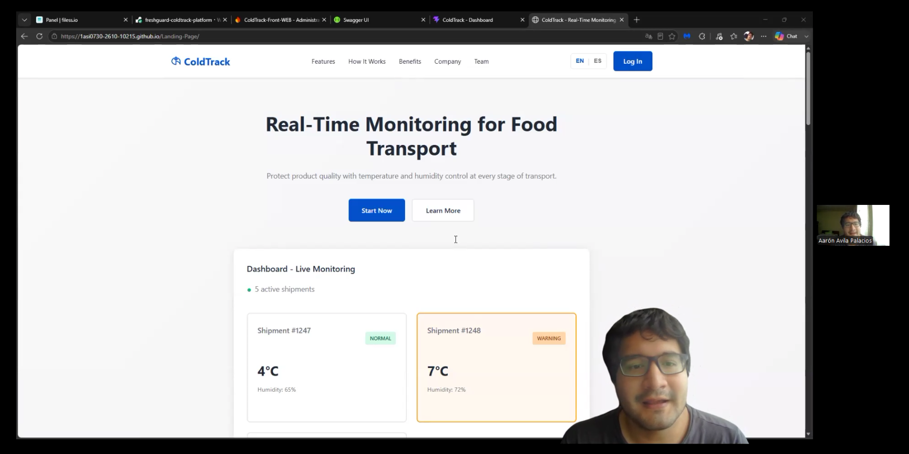

# Conclusiones

## Conclusiones y recomendaciones

Como equipo, concluimos que ColdTrack responde a una problemática real dentro de la cadena de frío: la falta de visibilidad oportuna sobre las condiciones de temperatura y humedad durante el transporte de productos sensibles. A partir de los Problem Statements definidos en Lean UX, confirmamos que los usuarios vinculados a logística, control de calidad y transporte necesitan una herramienta centralizada que reduzca la dependencia de controles manuales, permita reaccionar ante incidencias y facilite la trazabilidad de cada envío.

En relación con los assumptions planteados, validamos que los segmentos objetivo valoran especialmente la supervisión en tiempo real, el registro histórico de envíos y las alertas visibles ante condiciones fuera de rango. Si bien inicialmente asumimos que la principal necesidad era solo registrar datos de temperatura, el desarrollo del producto nos permitió observar que el valor percibido aumenta cuando el sistema también organiza conductores, sensores, estados de envío, historial y evidencias operativas en una sola interfaz. Esto refuerza la importancia de diseñar ColdTrack como una plataforma de gestión y no únicamente como un panel de lectura de sensores.

Respecto a los Hypothesis Statements, consideramos que los avances de los Sprints 2 y 3 respaldan la hipótesis de que una aplicación web con autenticación, dashboard, registro de envíos, gestión de sensores, telemetría, alertas e historial puede mejorar el control operativo de la cadena de frío. Los criterios de éxito definidos en el proceso Lean UX se contrastaron mediante la implementación y validación funcional de los flujos principales: ingreso a la aplicación, creación y seguimiento de envíos, consulta de sensores y lecturas, actualización de estados, generación de alertas y revisión del historial. Aunque todavía se requiere una validación más profunda con usuarios reales, la evidencia obtenida demuestra que el producto ya cuenta con una base funcional e integrada para futuras iteraciones.

También concluimos que la integración entre landing page, Web Application y Web Services fue clave para presentar una experiencia completa del modelo de negocio digital. La landing page comunica la propuesta de valor, mientras que la aplicación desplegada en Firebase evidencia el funcionamiento operativo de ColdTrack. En AV2 se reemplazó la dependencia principal de MockAPI por una API REST desarrollada con ASP.NET Core, protegida con autenticación JWT y desplegada en Render. La persistencia en MySQL permitió conservar usuarios, envíos, sensores, lecturas y alertas, con lo cual la solución dejó de depender de datos exclusivamente simulados y se aproximó a un escenario operativo real.

La integración alcanzada en el Sprint 3 también permitió comprobar que la separación del backend en bounded contexts facilita distribuir responsabilidades y evolucionar las capacidades de negocio sin concentrar toda la lógica en un solo módulo. El uso de Swagger/OpenAPI hizo posible verificar los contratos de los endpoints antes de conectarlos al frontend, mientras que GitFlow y los releases versionados aportaron trazabilidad sobre los incrementos incorporados. Como equipo, reconocemos que estas decisiones redujeron el riesgo de integración y facilitaron que todos los integrantes comprendieran y probaran el flujo completo del producto.

Como recomendaciones para los siguientes pasos del roadmap, proponemos priorizar la conexión con sensores reales o simuladores más cercanos al contexto operativo, completar la autorización por roles, incorporar comunicación en tiempo real para telemetría y alertas, y mejorar los reportes exportables para supervisores. También recomendamos automatizar pruebas y despliegues mediante integración continua, incorporar observabilidad y copias de seguridad, y ejecutar pruebas de seguridad, rendimiento y resiliencia sobre el backend y la base de datos.

Finalmente, recomendamos ampliar las Validation Interviews con empresas que gestionen productos refrigerados y definir métricas verificables, como tiempo de detección de incidencias, porcentaje de envíos dentro del rango permitido, reducción de registros manuales y facilidad de uso percibida. Estos resultados deberán compararse con los criterios de éxito de Lean UX para priorizar el siguiente incremento y evitar que las decisiones del roadmap se basen únicamente en supuestos técnicos del equipo.

# Bibliografía

Axios. (2026). *Axios documentation*. Recuperado el 13 de mayo de 2026, de https://axios-http.com/

Evans, E. (2003). *Domain-driven design: Tackling complexity in the heart of software*. Addison-Wesley.

Firebase. (2026). *Firebase Hosting documentation*. Recuperado el 13 de mayo de 2026, de https://firebase.google.com/docs/hosting

Filess.io. (2026). *Managed database hosting*. Recuperado el 19 de junio de 2026, de https://filess.io/

GitHub Docs. (2026). *GitHub Pages documentation*. Recuperado el 13 de mayo de 2026, de https://docs.github.com/en/pages

GitHub Docs. (2026). *Managing branches in your repository*. Recuperado el 19 de junio de 2026, de https://docs.github.com/en/repositories/configuring-branches-and-merges-in-your-repository/managing-branches-in-your-repository

Gothelf, J., & Seiden, J. (2021). *Lean UX: Designing great products with agile teams* (3rd ed.). O'Reilly Media.

Microsoft. (2026). *ASP.NET Core documentation*. Recuperado el 19 de junio de 2026, de https://learn.microsoft.com/aspnet/core/

Microsoft. (2026). *Entity Framework Core documentation*. Recuperado el 19 de junio de 2026, de https://learn.microsoft.com/ef/core/

MockAPI. (2026). *MockAPI documentation*. Recuperado el 13 de mayo de 2026, de https://mockapi.io/docs

MySQL. (2026). *MySQL 8.0 reference manual*. Recuperado el 19 de junio de 2026, de https://dev.mysql.com/doc/refman/8.0/en/

OpenAPI Initiative. (2026). *OpenAPI Specification*. Recuperado el 19 de junio de 2026, de https://spec.openapis.org/oas/latest.html

PrimeTek. (2026). *PrimeVue documentation*. Recuperado el 13 de mayo de 2026, de https://primevue.org/

Render. (2026). *Render documentation*. Recuperado el 19 de junio de 2026, de https://render.com/docs

Trello. (2026). *Trello guide*. Recuperado el 19 de junio de 2026, de https://trello.com/guide

Vue.js. (2026). *Vue.js documentation*. Recuperado el 13 de mayo de 2026, de https://vuejs.org/

Vue I18n. (2026). *Vue I18n documentation*. Recuperado el 13 de mayo de 2026, de https://vue-i18n.intlify.dev/

Vite. (2026). *Vite documentation*. Recuperado el 13 de mayo de 2026, de https://vite.dev/

# Anexos

## Exposición grupal

Video de exposición grupal del proyecto ColdTrack: https://upcedupe-my.sharepoint.com/:v:/g/personal/u201911249_upc_edu_pe/IQBzHTo9GCR1RpI0WITzlzTLAdLiHay8hkvnxDjYvTBgo5E?e=RgyzPP&nav=eyJyZWZlcnJhbEluZm8iOnsicmVmZXJyYWxBcHAiOiJTdHJlYW1XZWJBcHAiLCJyZWZlcnJhbFZpZXciOiJTaGFyZURpYWxvZy1MaW5rIiwicmVmZXJyYWxBcHBQbGF0Zm9ybSI6IldlYiIsInJlZmVycmFsTW9kZSI6InZpZXcifX0%3D
