<div align="center">
   <br><br>
   

   <p>Universidad Peruana de Ciencias Aplicadas</p>
   <p>Carrera de Ingeniería de Software</p>

   <br>
   <p><strong>1ASI0730</strong></p>
   <p><strong>Aplicaciones Web</strong></p>
   <p>NRC</p>
   <p><strong>10215</strong></p>
   <h3>Informe del Trabajo Final</h3>
   <p>Docente</p>
   <p><strong>Velásquez Núñez, Ángel Augusto</strong></p>
   <p>Equipo</p>
   <p><strong>FreshGuard</strong></p>

   <br>
   <p>Proyecto</p>
   <p><strong>ColdTrack</strong></p>

   <br>
   <p><strong>Integrantes</strong></p>
   <p><strong>Código&nbsp;&nbsp;&nbsp;&nbsp;&nbsp;&nbsp;&nbsp;&nbsp;Apellidos y Nombres</strong></p>
   <p>U201911249&nbsp;&nbsp;&nbsp;&nbsp;Celis Berrospi, Eslander</p>
   <p>U202416908&nbsp;&nbsp;&nbsp;&nbsp;Mendoza Palacios, Gabriel</p>
   <p>U20221G185&nbsp;&nbsp;&nbsp;&nbsp;Oblitas Alcalde, Rodrigo</p>
   <p>U201823654&nbsp;&nbsp;&nbsp;&nbsp;Avila Palacios, Aarón</p>
   <p>U202320699&nbsp;&nbsp;&nbsp;&nbsp;Arechaga Saavedra, Mathias</p>

   <br>
   <p><strong>Período 202610</strong></p>

   <br>
   <p><strong>Junio 2026</strong></p>
</div>

<div style="page-break-before: always;"></div>

# Registro de Versiones del Informe
| Versión | Fecha      | Autor(es)                 | Descripción                                                                                                                                                             |
|---------|------------|---------------------------|-------------------------------------------------------------------------------------------------------------------------------------------------------------------------|
| 1.1     | 12/04/2026 | Eslander Celis Berrospi   | Desarrollo del capítulo I: Introducción                                                                                                                                 |
| 1.2     | 30/04/2026 | Gabriel Mendoza Palacios  | Desarrollo del capítulo II: Requirements Elicitation & Analysis                                                                                                         |
| 1.3     | 18/04/2026 | Eslander Celis Berrospi   | Desarrollo del capítulo III: Requirements specification                                                                                                                 |
| 1.4     | 19/04/2026 | Rodrigo Oblitas Alcalde   | Desarrollo del capítulo VI: Landing Page                                                                                                                                |
| 1.5     | 19/04/2026 | Aarón Avila Palacios      | Desarrollo del capítulo V                                                                                                                                               |
| 1.6     | 21/04/2026 | Mathias Arechaga Saavedra | Desarrollo del capitulo IV: Wireframes                                                                                                                                  |
| 2.1     | 13/05/2026 | Aarón Avila Palacios      | Desarrollo de las evidencias de ejecución y despliegue del Sprint 2, actualización del índice e incorporación de capturas del reporte.                                  |
| 3.0     | 19/06/2026 | Aarón Avila Palacios      | Incorporación de la estructura base del Sprint 3 y evidencias iniciales de commits para AV2.                                                                            |
| 3.1     | 19/06/2026 | Aarón Avila Palacios      | Corrección de la carátula, actualización del Student Outcome para AV2 e incorporación de conclusiones, recomendaciones y referencias bibliográficas de la entrega.      |
| 3.2     | 19/06/2026 | Aarón Avila Palacios      | Desarrollo de las evidencias de ejecución y despliegue del Sprint 3, documentación de los flujos integrados y preparación de la sección Video About-the-Product.        |
| 3.3     | 19/06/2026 | Aarón Avila Palacios      | Ampliación de las evidencias de ejecución y despliegue mediante escenarios verificables, arquitectura productiva, configuración reproducible y criterios de aceptación. |
| 3.4     | 19/06/2026 | Aarón Avila Palacios      | Actualización de enlaces del Video About-the-Product y soporte técnico del producto.                                                                                    |
| 3.5     | 19/06/2026 | Aarón Avila Palacios      | Incorporación de la evidencia visual del Video About-the-Product.                                                                                                       |
| 3.6     | 19/06/2026 | Eslander Celis Berrospi   | Registro de evidencias de commits del Sprint 3 en el informe.                                                                                                           |
| 3.7     | 19/06/2026 | Mathias Arechaga Saavedra | Actualización de la documentación de servicios del Sprint 3 y del Sprint Backlog 3.                                                                                     |
| 3.8     | 19/06/2026 | Gabriel Mendoza Palacios  | Actualización de Aspect Leaders and Collaborators y Team Collaboration Insights del Sprint 3.                                                                           |
| 3.9     | 19/06/2026 | Eslander Celis Berrospi   | Incorporación de la sección Video About-the-Team y actualización del Student Outcome.                                                                                   |
| 3.10    | 19/06/2026 | Rodrigo Oblitas Alcalde   | Desarrollo y cierre de las entrevistas de validación del producto.                                                                                                      |
| 3.11    | 6/07/2026  | Mathias Arechaga Saavedra | Desarrollo de la documentación de servicios del Sprint4 y del Sprint Backlog 4.                                                                                         |


# Project Report Collaboration Insights

#### Repositorio del informe del proyecto
El informe del proyecto se encuentra alojado en el siguiente repositorio de la organización de GitHub del equipo:

- 🔗 Enlace de la organización: https://github.com/1ASI0730-2610-10215
- 🔗 Enlace de repositorios: https://github.com/orgs/1ASI0730-2610-10215/repositories

A continuación, se detallan las actividades realizadas en cada entrega, la participación de los miembros del equipo, y las evidencias correspondientes.

## AV1
Para la primera entrega (AV1) se trabajó en la estructura inicial del informe, definiendo el índice, la organización del repositorio y la distribución de responsabilidades entre los miembros del equipo. En esta etapa se consolidó la presentación inicial de la startup FreshGuard y del producto ColdTrack, así como la descripción del problema, los segmentos objetivo y los primeros artefactos de análisis requeridos para sustentar la solución.

También se avanzó con el Lean UX Process, la identificación de necesidades de los usuarios, los primeros elementos de Requirements Elicitation & Analysis y la planificación de entregables para las siguientes fases. Esta entrega permitió establecer una base común de trabajo, ordenar el contenido del informe y alinear al equipo sobre el alcance funcional y documental del proyecto.


## TB1
Para la entrega TB1 se desarrolló el avance correspondiente al Sprint 2, enfocado principalmente en la implementación de la Web Application de ColdTrack. El equipo trabajó en la construcción del frontend con Vue.js, la navegación entre vistas, el registro e inicio de sesión, la gestión de envíos, el dashboard operativo, el módulo de sensores, las alertas, el historial y el soporte de internacionalización.

Asimismo, se documentaron las evidencias de desarrollo, ejecución y despliegue, incluyendo capturas de la aplicación, configuración de entorno, conexión con datos simulados y publicación del producto para su revisión. Esta etapa permitió transformar los artefactos de diseño y requerimientos en una aplicación funcional inicial, preparada para integrarse posteriormente con los Web Services del Sprint 3.


## AV2
Para la segunda entrega (AV2) se completó la integración del producto ColdTrack, consolidando el trabajo realizado en el Sprint 3. Durante esta etapa se documentaron las evidencias de ejecución y despliegue, la conexión entre la Web Application y los Web Services, la persistencia en MySQL, la autenticación, los flujos de envíos, sensores, telemetría, alertas, historial y generación de reportes.

Además, se actualizaron las secciones de Student Outcome, conclusiones, recomendaciones, Video About-the-Product, Video About-the-Team y entrevistas de validación. La participación del equipo quedó reflejada en el historial de Git, donde se registraron contribuciones de los cinco integrantes mediante commits, documentación, capturas, evidencias de despliegue y ajustes finales del informe.

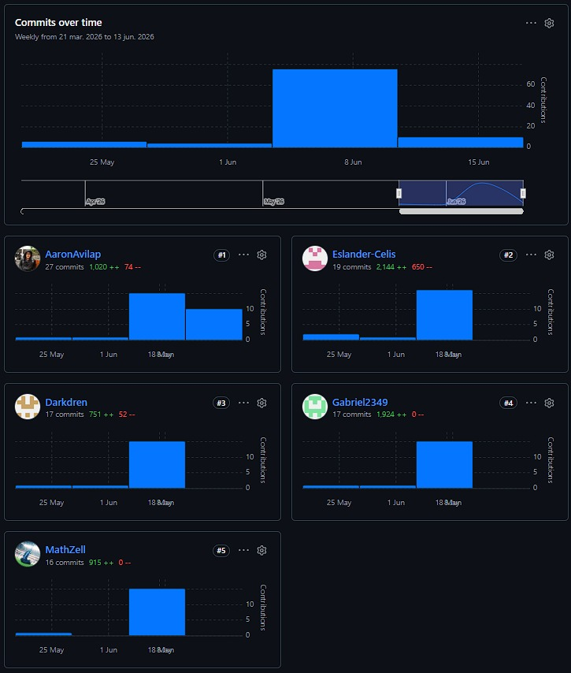


## Contenido

* [Registro de Versiones del Informe](#registro-de-versiones-del-informe)

* [Project Report Collaboration Insights](#project-report-collaboration-insights)

* [Student Outcome](#student-outcome)

* [Capitulo I: Introducción](#capitulo-i-introducción)

  * [1.1. Startup Profile](#11-startup-profile)

    * [1.1.1. Descripcion de la Startup](#111-descripcion-de-la-startup)
    * [1.1.2. Perfiles de integrantes del equipo](#112-perfiles-de-integrantes-del-equipo)
  * [1.2. Solution Profile](#12-solution-profile)

    * [1.2.1. Antecedentes y problematica](#121-antecedentes-y-problematica)
    * [1.2.2. Lean UX Process](#122-lean-ux-process)

      * [1.2.2.1. Lean UX Problem Statements](#1221-lean-ux-problem-statements)
      * [1.2.2.2. Lean UX Assumptions](#1222-lean-ux-assumptions)
      * [1.2.2.3. Lean UX Hypothesis Statements](#1223-lean-ux-hypothesis-statements)
      * [1.2.2.4. Lean UX Canvas](#1224-lean-ux-canvas)
  * [1.3. Segmentos Objetivo](#13-segmentos-objetivo)

    * [Segmento Objetivo 1: Personal de Logística y Operaciones](#segmento-objetivo-1-personal-de-logística-y-operaciones)
    * [Segmento Objetivo 2: Personal de Transporte](#segmento-objetivo-2-personal-de-transporte)

* [Capitulo II: Requirements Elicitation & Analysis](#capitulo-ii-requirements-elicitation--analysis)

  * [2.1. Competidores](#21-competidores)

    * [2.1.1. Analisis competitivo](#211-analisis-competitivo)
    * [2.1.2. Estrategias y tacticas frente a competidores](#212-estrategias-y-tacticas-frente-a-competidores)
  * [2.2. Entrevistas](#22-entrevistas)

    * [2.2.1. Diseno de entrevistas](#221-diseno-de-entrevistas)
    * [2.2.2. Registro de entrevistas](#222-registro-de-entrevistas)
    * [2.2.3. Analisis de entrevistas](#223-analisis-de-entrevistas)
  * [2.3. Needfinding](#23-needfinding)

    * [2.3.1. User Personas](#231-user-personas)
    * [2.3.2. User Task Matrix](#232-user-task-matrix)
    * [2.3.3. User Journey Mapping](#233-user-journey-mapping)
    * [2.3.4. Empathy Mapping](#234-empathy-mapping)
    * [2.3.5. As-is Scenario Mapping](#235-as-is-scenario-mapping)
    * [2.3.6. Big Picture EventStorming](#236-big-picture-eventstorming)
  * [2.4. Ubiquitous Language](#24-ubiquitous-language)

* [Capitulo III: Requirements specification](#capitulo-iii-requirements-specification)

  * [3.1. To-Be Scenario Mapping](#31-to-be-scenario-mapping)
  * [3.2. User Stories](#32-user-stories)
  * [3.3. Impact Mapping](#33-impact-mapping)
  * [3.4. Product Backlog](#34-product-backlog)

* [Capitulo IV: Product Design](#capitulo-iv-product-design)

  * [4.1. Style Guidelines](#41-style-guidelines)

    * [4.1.1. General Style Guidelines](#411-general-style-guidelines)
    * [4.1.2. Web Style Guidelines](#412-web-style-guidelines)
  * [4.2. Information Architecture](#42-information-architecture)

    * [4.2.1. Organization Systems](#421-organization-systems)
    * [4.2.2. Labeling Systems](#422-labeling-systems)
    * [4.2.3. SEO Tags and Meta Tags](#423-seo-tags-and-meta-tags)
    * [4.2.4. Searching Systems](#424-searching-systems)
    * [4.2.5. Navigation Systems](#425-navigation-systems)
  * [4.3. Landing Page UI Design](#43-landing-page-ui-design)

    * [4.3.1. Landing Page Wireframe](#431-landing-page-wireframe)
    * [4.3.2. Landing Page Mock-up](#432-landing-page-mock-up)
  * [4.4. Web Applications UX/UI Design](#44-web-applications-uxui-design)

    * [4.4.1. Web Applications Wireframes](#441-web-applications-wireframes)
    * [4.4.2. Web Applications Wireflow Diagrams](#442-web-applications-wireflow-diagrams)
    * [4.4.2. Web Applications Mock-ups](#442-web-applications-mock-ups)
    * [4.4.3. Web Applications User Flow Diagrams](#443-web-applications-user-flow-diagrams)
  * [4.5. Web Applications Prototyping](#45-web-applications-prototyping)
  * [4.6. Domain-Driven Software Architecture](#46-domain-driven-software-architecture)

    * [4.6.1. Design-Level EventStorming](#461-design-level-eventstorming)
    * [4.6.2. Software Architecture Context Diagram](#462-software-architecture-context-diagram)
    * [4.6.3. Software Architecture Container Diagrams](#463-software-architecture-container-diagrams)
    * [4.6.4. Software Architecture Components Diagrams](#464-software-architecture-components-diagrams)
  * [4.7. Software Object-Oriented Design](#47-software-object-oriented-design)

    * [4.7.1. Class Diagrams](#471-class-diagrams)
    * [4.7.2. Class Dictionary](#472-class-dictionary)
  * [4.8. Database Design](#48-database-design)

    * [4.8.1. Database Diagram](#481-database-diagram)

* [Capitulo V: Product Implementation, Validation & Deployment](#capitulo-v-product-implementation-validation--deployment)

  * [5.1. Software Configuration Management](#51-software-configuration-management)

    * [5.1.1. Software Development Environment Configuration](#511-software-development-environment-configuration)
    * [5.1.2. Source Code Management](#512-source-code-management)
    * [5.1.3. Source Code Style Guide & Conventions](#513-source-code-style-guide--conventions)
    * [5.1.4. Software Deployment Configuration](#514-software-deployment-configuration)

  * [5.2. Landing Page, Services & Applications Implementation](#52-landing-page-services--applications-implementation)

    * [5.2.1. Sprint 1](#521-sprint-1)

      * [5.2.1.1. Sprint Planning 1](#5211-sprint-planning-1)
      * [5.2.1.2. Aspect Leaders and Collaborators](#5212-aspect-leaders-and-collaborators)
      * [5.2.1.3. Sprint Backlog 1](#5213-sprint-backlog-1)
      * [5.2.1.4. Development Evidence for Sprint Review](#5214-development-evidence-for-sprint-review)
      * [5.2.1.5. Execution Evidence for Sprint Review](#5215-execution-evidence-for-sprint-review)
      * [5.2.1.6. Services Documentation Evidence for Sprint Review](#5216-services-documentation-evidence-for-sprint-review)
      * [5.2.1.7. Software Deployment Evidence for Sprint Review](#5217-software-deployment-evidence-for-sprint-review)
      * [5.2.1.8. Team Collaboration Insights during Sprint](#5218-team-collaboration-insights-during-sprint)

    * [5.2.2. Sprint 2](#522-sprint-2)

      * [5.2.2.1. Sprint Planning 2](#5221-sprint-planning-2)
      * [5.2.2.2. Aspect Leaders and Collaborators](#5222-aspect-leaders-and-collaborators)
      * [5.2.2.3. Sprint Backlog 2](#5223-sprint-backlog-2)
      * [5.2.2.4. Development Evidence for Sprint Review](#5224-development-evidence-for-sprint-review)
      * [5.2.2.5. Execution Evidence for Sprint Review](#5225-execution-evidence-for-sprint-review)
      * [5.2.2.6. Services Documentation Evidence for Sprint Review](#5226-services-documentation-evidence-for-sprint-review)
      * [5.2.2.7. Software Deployment Evidence for Sprint Review](#5227-software-deployment-evidence-for-sprint-review)
      * [5.2.2.8. Team Collaboration Insights during Sprint](#5228-team-collaboration-insights-during-sprint)

    * [5.2.3. Sprint 3](#523-sprint-3)

      * [5.2.3.1. Sprint Planning 3](#5231-sprint-planning-3)
      * [5.2.3.2. Aspect Leaders and Collaborators](#5232-aspect-leaders-and-collaborators)
      * [5.2.3.3. Sprint Backlog 3](#5233-sprint-backlog-3)
      * [5.2.3.4. Development Evidence for Sprint Review](#5234-development-evidence-for-sprint-review)
      * [5.2.3.5. Execution Evidence for Sprint Review](#5235-execution-evidence-for-sprint-review)
      * [5.2.3.6. Services Documentation Evidence for Sprint Review](#5236-services-documentation-evidence-for-sprint-review)
      * [5.2.3.7. Software Deployment Evidence for Sprint Review](#5237-software-deployment-evidence-for-sprint-review)
      * [5.2.3.8. Team Collaboration Insights during Sprint](#5238-team-collaboration-insights-during-sprint)

    * [5.2.4. Sprint 4](#524-sprint-4)

      * [5.2.4.1. Sprint Planning 4](#5241-sprint-planning-4)
      * [5.2.4.2. Aspect Leaders and Collaborators](#5242-aspect-leaders-and-collaborators)
      * [5.2.4.3. Sprint Backlog 4](#5243-sprint-backlog-4)
      * [5.2.4.4. Development Evidence for Sprint Review](#5244-development-evidence-for-sprint-review)
      * [5.2.4.5. Execution Evidence for Sprint Review](#5245-execution-evidence-for-sprint-review)
      * [5.2.4.6. Services Documentation Evidence for Sprint Review](#5246-services-documentation-evidence-for-sprint-review)
      * [5.2.4.7. Software Deployment Evidence for Sprint Review](#5247-software-deployment-evidence-for-sprint-review)
      * [5.2.4.8. Team Collaboration Insights during Sprint](#5248-team-collaboration-insights-during-sprint)

  * [5.3. Validation Interviews](#53-validation-interviews)

    * [5.3.1. Diseño de Entrevistas](#531-diseño-de-entrevistas)
    * [5.3.2. Registro de Entrevistas](#532-registro-de-entrevistas)
    * [5.3.3. Evaluaciones según heurísticas](#533-evaluaciones-según-heurísticas)

  * [5.4. Video About-the-Product](#54-video-about-the-product)

* [Conclusiones](#conclusiones)

  * [Conclusiones y recomendaciones](#conclusiones-y-recomendaciones)

* [Bibliografía](#bibliografía)

* [Anexos](#anexos)

# Student Outcome
ABET – EAC - Student Outcome 5

La capacidad de funcionar efectivamente en un equipo cuyos miembros juntos proporcionan liderazgo, crean un entorno de colaboración e inclusivo, establecen objetivos, planifican tareas y cumplen objetivos. 

<table>
    <tr>
        <th>CRITERIO ESPECIFICO</th>
        <th>ACCIONES REALIZADAS</th>
        <th>CONCLUSIONES</th>
    </tr>
    <tr>
        <th> Trabaja en equipo para
             proporcionar liderazgo en
             forma conjunta</th>
        <td>
         <b>Aarón Avila</b>
         <ul>
           <li><b>AV1:</b> Durante el desarrollo del proyecto, trabajé de manera autónoma asumiendo un rol activo en la organización de las actividades y la gestión del proyecto, ejerciendo liderazgo en la planificación y ejecución de cada etapa. Participé en la toma de decisiones relacionadas con la definición de la startup, la identificación de la problemática, la segmentación de usuarios y la elaboración de artefactos como User Personas, Empathy Maps, As-Is Scenario Mapping y Ubiquitous Language, demostrando capacidad para dirigir el proyecto de manera integral.</li>
           <li><b>TB1:</b> Durante el Sprint 2 (TB1), ejercí liderazgo en la estructuración técnica del proyecto frontend y la configuración de variables de entorno. Coordiné con el equipo la adopción de Vue.js y apoyé en la toma de decisiones arquitectónicas, asegurando que el desarrollo de los módulos principales estuviera alineado con los requerimientos técnicos y de diseño.</li>
           <li><b>AV2:</b> Durante el Sprint 3 lideré la integración entre la Web Application y los Web Services de ColdTrack. Coordiné la sustitución de la API simulada por el backend desplegado, la validación de los flujos de autenticación, envíos, sensores, telemetría, alertas e historial, y la preparación de releases trazables mediante GitFlow. Este trabajo permitió al equipo consolidar una solución integrada y demostrable para la Sprint Review.</li>
         </ul>
         <b>Eslander Celis</b>
         <ul>
           <li><b>AV1:</b> Durante el desarrollo del proyecto, trabajé en equipo aportando ideas y asumiendo un rol activo en la organización de las actividades, contribuyendo al liderazgo compartido dentro del grupo. Participé en la toma de decisiones relacionadas con la definición de la startup, la problemática, los segmentos objetivos y la estructuración de los User Stories, Product Backlog e Impact Map. Además, mantuve una comunicación constante con mis compañeros, apoyando cuando era necesario y asegurando que todos estuviéramos alineados con los objetivos del proyecto.</li>
           <li><b>TB1:</b> En esta fase, asumí un rol activo organizando las tareas de desarrollo frontend. Promoví el liderazgo compartido guiando al equipo en la implementación del entorno de desarrollo y asegurando que las ramas de GitFlow se manejaran adecuadamente para la correcta integración continua de las vistas de la aplicación web.</li>
           <li><b>AV2:</b> Durante el Sprint 3 participé en el desarrollo del backend del sistema, contribuyendo en la implementación de servicios REST y la integración con la base de datos. Colaboré con el equipo en la validación de endpoints y en la integración con el frontend, asegurando la correcta comunicación entre módulos y apoyando la toma de decisiones técnicas para mantener una arquitectura consistente.</li>
         </ul>
         <b>Gabriel Mendoza Palacios</b>
         <ul>
           <li><b>AV1:</b> Durante el desarrollo del proyecto, asumí un rol proactivo enfocado en el liderazgo compartido, coordinando la ejecución del análisis de requerimientos. Participé activamente en la evaluación del mercado mediante el análisis competitivo, la estructuración de entrevistas y la consolidación del Needfinding de ColdTrack. Promoví el debate constructivo y el intercambio de ideas con mis compañeros para asegurar que nuestra propuesta técnica estuviera perfectamente alineada con las necesidades logísticas de los usuarios.</li>
           <li><b>TB1:</b> Durante el Sprint 2, lideré aspectos clave de la integración del diseño UI en los componentes de Vue.js. Mantuve una actitud proactiva, promoviendo sesiones de revisión de código (Pull Requests) para garantizar la calidad visual y técnica de las vistas antes de su integración a la rama principal.</li>
           <li><b>AV2:</b> En esta etapa del proyecto, asumí un rol técnico y colaborativo enfocado en el desarrollo del backend. Participé activamente en la implementación de uno de los Bounded Contexts (BC) fundamentales del sistema, encargándome del diseño y programación de sus respectivos endpoints. Promoví la comunicación constante con el resto del equipo de desarrollo para asegurar que la lógica de negocio estuviera correctamente desacoplada, cumpliendo con los estándares de arquitectura y garantizando una integración fluida de nuestras APIs.</li>
         </ul>
         <b>Rodrigo Oblitas</b>
         <ul>
           <li><b>AV1:</b> Durante el desarrollo del proyecto, asumí un rol activo en el trabajo en equipo, participando en la elaboración del Lean UX Process, incluyendo Problem Statement, Assumptions e Hypothesis, así como en el desarrollo de la Landing Page. Contribuí en la toma de decisiones y en la organización de las tareas, promoviendo la colaboración entre los integrantes y asegurando que el equipo avance de manera alineada hacia los objetivos establecidos.</li>
           <li><b>TB1:</b> Mantuve mi compromiso con el trabajo colaborativo asumiendo el liderazgo en la implementación de la autenticación y la gestión de envíos. Facilité la comunicación entre los miembros del equipo para resolver bloqueos técnicos, asegurando un progreso constante hacia el cumplimiento del Sprint Goal de desarrollo frontend.</li>
           <li><b>AV2:</b> Participé en la validación final del producto mediante el desarrollo y cierre de las entrevistas de validación, organizando la información obtenida de los usuarios y relacionándola con las oportunidades de mejora de la experiencia. Además, contribuí en el diseño y revisión de los flujos principales de la aplicación, asegurando que la presentación del producto, las evidencias y la documentación reflejaran de manera clara las necesidades detectadas durante la entrega.</li>
         </ul>
         <b>Mathias Arechaga</b>
         <ul>
           <li><b>AV1:</b> Durante el proyecto, participé activamente en el desarrollo de artefactos de diseño centrados en el usuario, como User Personas, User Journey Mapping y prototipos de la aplicación. Colaboré en la coordinación de tareas relacionadas con el diseño y la experiencia de usuario, aportando ideas y apoyando al equipo para mantener una organización eficiente y un liderazgo compartido en el desarrollo del proyecto.</li>
           <li><b>TB1:</b> Durante el desarrollo del Sprint 2, aporté liderazgo en el diseño e implementación del dashboard y los componentes interactivos. Coordiné la transformación de nuestros wireframes previos en interfaces funcionales, asegurando que el producto final cumpliera con la experiencia de usuario proyectada.</li>
           <li><b>AV2:</b> Durante el desarrollo del Sprint 3, Colaboré en el desarrollo del sprint backlog 3 y la implementación de los Services Documentation Evidence for Sprint Review.</li>
         </ul>
        </td>
        <td>
          <ul>
             <li><b>AV1:</b> El equipo logró trabajar de manera conjunta, compartiendo responsabilidades y asumiendo un liderazgo distribuido que permitió organizar mejor las actividades y tomar decisiones de forma eficiente. La participación activa de todos los integrantes facilitó la coordinación en el desarrollo de entregables como los User Stories, el Product Backlog y el Impact Map, generando un ambiente de confianza y compromiso. Esto contribuyó a mantener al equipo alineado y enfocado en los objetivos del proyecto.</li>
             <li><b>TB1:</b> Durante el Sprint 2, el equipo demostró madurez al aplicar un liderazgo técnico y organizativo conjunto. La implementación de la aplicación en Vue.js exigió una alta coordinación mediante GitFlow, donde cada integrante lideró el desarrollo de módulos específicos (dashboard, alertas, envíos) mientras se apoyaban mutuamente en las revisiones de código, logrando consolidar la Web Application con éxito.</li>
             <li><b>AV2:</b> En el Sprint 3, el liderazgo compartido permitió integrar frontend, backend y base de datos sin perder la separación entre bounded contexts. La coordinación de despliegues, pruebas de endpoints y releases facilitó que cada integrante aportara desde su responsabilidad técnica y que el equipo presentara una solución consistente, trazable y disponible públicamente.</li>
          </ul>
        </td>
    </tr>
    <tr>
        <th>Crea un entorno colaborativo e
            inclusivo, establece metas,
            planifica tareas y cumple
            objetivos.</th>
        <td>
         <b>Aarón Avila</b>
         <ul>
           <li><b>AV1:</b> Durante el desarrollo del proyecto, mantuve un enfoque basado en la autoevaluación y la mejora continua, considerando diferentes perspectivas en la toma de decisiones y asegurando la coherencia del trabajo realizado. Esto me permitió simular un entorno colaborativo mediante la revisión constante de los avances, organizando las tareas de manera eficiente y garantizando el cumplimiento de los objetivos y entregables dentro de los plazos establecidos.</li>
           <li><b>TB1:</b> Para el Sprint 2, ayudé a establecer metas de desarrollo claras, dividiendo los requerimientos en tareas manejables. Fomenté un entorno inclusivo al apoyar a mis compañeros con dudas sobre el nuevo stack tecnológico (Vue.js, Vite), asegurando que todos cumpliéramos con los entregables dentro de los tiempos estipulados para el despliegue.</li>
           <li><b>AV2:</b> Organicé las correcciones y validaciones de la entrega en ramas funcionales creadas desde <code>develop</code>, documenté los pasos de integración y despliegue, y apoyé al equipo en el uso de Swagger, MySQL y los servicios publicados. La planificación por incrementos y la revisión previa a cada merge ayudaron a reducir conflictos y a cumplir las metas técnicas y documentales de AV2.</li>
         </ul>
         <b>Eslander Celis</b>
         <ul>
           <li><b>AV1:</b> Contribuí a crear un entorno colaborativo e inclusivo al respetar las ideas de cada integrante y fomentar la participación de todos. Ayudé a establecer metas claras y a planificar las tareas de manera organizada, distribuyendo responsabilidades de forma equitativa. Me aseguré de cumplir con mis entregables en los tiempos acordados, lo que permitió avanzar de manera constante y alcanzar los objetivos planteados como equipo.</li>
           <li><b>TB1:</b> Contribuí a la planificación ágil del Sprint 2 distribuyendo las historias de usuario de forma equitativa. Mantuve un ambiente colaborativo promoviendo reuniones breves de sincronización para identificar bloqueos a tiempo, lo que garantizó que todos lográramos completar nuestras tareas de programación en los plazos acordados.</li>
           <li><b>AV2:</b> Durante el Sprint 3 contribuí a la planificación y organización de tareas del backend, estableciendo acuerdos con el equipo para la distribución de módulos y objetivos del sprint. Mantuve una comunicación constante para resolver bloqueos, cumplir los plazos establecidos y asegurar la correcta integración de los servicios desarrollados, favoreciendo el cumplimiento de los objetivos del proyecto.</li>
         </ul>
         <b>Gabriel Mendoza Palacios</b>
         <ul>
           <li><b>AV1:</b> Fomenté un ambiente de trabajo integrador al mantener una actitud receptiva frente a las propuestas del equipo y comunicarme de manera clara y constante. Me encargué de estructurar mis responsabilidades con orden, cumpliendo estrictamente con los plazos establecidos para el desarrollo de mis asignaciones. Colaboré activamente en la planificación de nuestras metas a corto plazo, ayudando a resolver bloqueos técnicos y asegurando que avanzáramos en sintonía hacia el objetivo final del proyecto.</li>
           <li><b>TB1:</b> Durante esta fase, cumplí rigurosamente con mis objetivos de desarrollo de componentes visuales. Planifiqué mis commits y revisiones de forma estructurada, colaborando con los demás para integrar nuestras vistas sin generar conflictos en el repositorio, manteniendo siempre una comunicación respetuosa y resolutiva.</li>
           <li><b>AV2:</b> Durante el desarrollo del backend, me enfoqué en crear un entorno colaborativo e inclusivo, fomentando la participación activa y el intercambio de conocimientos entre todos los miembros del equipo. Para lograrlo, establecí metas claras y planifiqué las tareas necesarias para la implementación técnica de uno de los Bounded Contexts (BC) principales del sistema. Gracias a esta organización, logré desarrollar e integrar los endpoints correspondientes, cumpliendo con éxito los objetivos técnicos trazados para el sprint y asegurando que nuestra arquitectura backend mantuviera los estándares requeridos..</li>
         </ul>
         <b>Rodrigo Oblitas</b>
         <ul>
           <li><b>AV1:</b> Contribuí a mantener un entorno colaborativo al participar activamente en la planificación del Lean UX Process y el desarrollo de la Landing Page. Organicé mis tareas de manera eficiente, cumpliendo con los plazos establecidos y apoyando en la coordinación del equipo para asegurar el cumplimiento de los objetivos propuestos.</li>
           <li><b>TB1:</b> Fomenté la colaboración activa asegurándome de que el trabajo en mis ramas de características (features) estuviera bien documentado y organizado. Cumplí con las metas de desarrollo asignadas y mantuve la disposición para ayudar a otros integrantes a conectar sus módulos, garantizando un avance uniforme del equipo.</li>
           <li><b>AV2:</b> Apoyé la coordinación de la entrega final mediante la preparación de entrevistas, el registro de hallazgos y la revisión de elementos de diseño relacionados con la validación del producto. Este trabajo permitió conectar la evidencia obtenida con los ajustes documentales del informe y reforzar la coherencia entre la propuesta visual, los flujos de usuario y las conclusiones de la validación.</li>
         </ul>
         <b>Mathias Arechaga</b>
         <ul>
           <li><b>AV1:</b> Apoyé en la creación de un entorno colaborativo mediante el desarrollo organizado de los entregables de diseño, como wireframes, mock-ups y prototipos. Planifiqué mis actividades de manera estructurada y cumplí con los tiempos establecidos, contribuyendo a que el equipo avance de forma constante y alineada con las metas del proyecto.</li>
           <li><b>TB1:</b> Apoyé la colaboración del equipo cumpliendo puntualmente con mis tareas en la creación de las vistas interactivas. Al planificar mis actividades de desarrollo frontend en fases claras, logré no solo alcanzar mis metas individuales sino también facilitar el proceso de integración continua con el resto del equipo, fortaleciendo el cumplimiento del Sprint Goal.</li>
           <li><b>AV2:</b> Durante el sprint 3, realice mis objetivos de desarrollo del sprint backlog 3 y fomenté la activa colaboración en equipo.</li> 
         </ul>
        </td>
        <td>
          <ul>
             <li><b>AV1:</b> Se consolidó un entorno colaborativo e inclusivo donde se respetaron las ideas de cada integrante y se promovió la participación equitativa. El equipo estableció metas claras, planificó las tareas de manera organizada y cumplió con los plazos establecidos, lo que permitió avanzar de forma constante. Esta dinámica de trabajo favoreció la calidad de los resultados y aseguró el cumplimiento de los objetivos propuestos.</li>
             <li><b>TB1:</b> El equipo logró mantener un entorno altamente colaborativo bajo la presión del desarrollo técnico del Sprint 2. Las metas fueron claramente divididas a través de un tablero de gestión ágil, permitiendo a cada integrante planificar y ejecutar tareas de programación específicas. El cumplimiento estricto de estos objetivos individuales se reflejó en la exitosa integración y despliegue final de la Web Application frontend.</li>
             <li><b>AV2:</b> El equipo mantuvo un entorno colaborativo al distribuir el trabajo entre bounded contexts y ramas de característica, establecer criterios comunes de integración y revisar los cambios antes de incorporarlos. La sincronización entre desarrollo, despliegue y documentación permitió cumplir los objetivos del Sprint 3 y dejó una base compartida para continuar las validaciones con usuarios.</li>
          </ul>
        </td>
    </tr>
</table>

# Project: 
# Capitulo I: Introduccion

## 1.1. Startup Profile

### 1.1.1. Descripcion de la Startup
FreshGuard Technologies es una startup tecnológica enfocada en optimizar la calidad de los alimentos durante su transporte mediante el uso de tecnología de monitoreo en tiempo real. Su producto principal, ColdTrack, es una aplicación que se integra con sensores de temperatura y humedad instalados en las unidades de transporte, permitiendo a las empresas supervisar las condiciones de los productos desde los centros de distribución hasta su destino final. A través de esta solución, los usuarios pueden visualizar datos en tiempo real, recibir alertas ante variaciones críticas y acceder a un registro histórico de cada envío. De esta manera, FreshGuard Technologies busca reducir pérdidas, mejorar la eficiencia logística y garantizar que los alimentos lleguen en condiciones óptimas al consumidor.

- **Nombre de la startup:** FreshGuard Technologies

- **Producto:** ColdTrack

- **Misión:**
Nuestra misión es garantizar la calidad y seguridad de los alimentos durante su transporte mediante el uso de tecnología de monitoreo en tiempo real, permitiendo a las empresas tomar decisiones rápidas y efectivas para evitar pérdidas y asegurar condiciones óptimas.

- **Visión:**
Nuestra visión es convertirnos en la solución líder en monitoreo de condiciones de transporte de alimentos en Perú y Latinoamérica, destacando por nuestra innovación, confiabilidad y aporte a la seguridad alimentaria.

- **Valores:**
Responsabilidad, innovación y confiabilidad.

### 1.1.2. Perfiles de integrantes del equipo

<table border="1" cellspacing="0" cellpadding="8">
  <tr>
   <td style="text-align: center" align="center">
        <p align="center">
         Eslander Celis Berrospi - U201911249 
         <br>
         
         </p>
        </td>
        <td style="text-align: center" align="center">
         Soy Eslander, estudiante de Ingeniería de Software. Me considero una persona responsable y comprometida con mis objetivos, con una gran disposición para aprender y mejorar de manera continua. Valoro mucho la ética y el trabajo en equipo, aportando siempre ideas y soluciones para alcanzar resultados de calidad. Me esfuerzo por mantener un enfoque ordenado en mis tareas y contribuir activamente al desarrollo colectivo. Tengo conocimientos en Python, C++ y HTML, lo que me permite desarrollar soluciones tecnológicas y fortalecer mis habilidades en programación. Estoy motivado a seguir aprendiendo y asumir nuevos retos que me ayuden a crecer tanto profesional como personalmente.
        </td>
       
  </tr>
  <tr>
    <td style="text-align: center" align="center">
        <p align="center">
        Gabriel Mendoza Palacios - U202416908
         <br>
         
         </p>
        </td>
        <td style="text-align: center" align="center">
         Soy estudiante de Ingeniería de Software con interes en seguir desarrollando mis habilidades de manera constante. Suelo trabajar de forma ordenada y cumplir con mis responsabilidades, aportando en entornos colaborativos. Tengo conocimientos en C++ y Python, que utilizo para resolver problemas y entender mejor el desarrollo de software. Busco seguir aprendiendo a través de nuevos retos y experiencias que me permitan crecer tanto a nivel académico como profesional.
        </td>
       
  </tr>
  <tr>
    <td style="text-align: center" align="center">
        <p align="center">
        Rodrigo Oblitas Alcalde - U20221G185
         <br>
         
         </p>
        </td>
        <td style="text-align: center" align="center">
         Soy Rodrigo Oblitas, estudiante de Ingeniería de Software en el 6to ciclo. Soy una persona apasionada por la programación y el desarrollo de soluciones tecnológicas innovadoras. Me destaco por mi capacidad para trabajar en equipo, donde contribuyo con mis ideas y habilidades para lograr objetivos comunes de manera eficiente. Además de mi dedicación académica, soy una persona disciplinada que disfruta del entrenamiento físico como parte de mi estilo de vida, lo que refleja mi compromiso con la excelencia en todas las áreas. Tengo conocimientos en programación y busco constantemente mejorar mis habilidades técnicas para enfrentar nuevos desafíos en el desarrollo de software.
        </td>
       
  </tr>
  <tr>
    <td style="text-align: center" align="center">
        <p align="center">
        Aarón Avila Palacios - U201823654
         <br>
         
         </p>
        </td>
        <td style="text-align: center" align="center">
        Soy estudiante de Ingeniería de software y estoy cursando el quinto ciclo de la carrera. Tengo 23 años. Tengo conocimientos en programación orientada a objetos en lenguaje de programación C++, también en diseño de prototipos de aplicaciones, diseño gráfico, diseño e implementación de páginas web. Todas estas habilidades ayudan al desarrollo del proyecto, dado que son de vital importancia en este curso y en nuestra carrera. Soy capaz de desarrollar de manera eficaz cualquier tarea que se me asigne. 
        </td>
  
  <tr>
    <td style="text-align: center" align="center">
        <p align="center">
        Mathias Arechaga Saavedra - U202320699
         <br>
         
         </p>
        </td>
        <td style="text-align: center" align="center">
        Soy Mathias Arechaga, estudiante de Ingeniería de Software y actualmente cursando el quinto ciclo. Me considero una persona dedicada y orientada a crecer tanto en el ámbito académico como profesional. Me interesa el mundo de la programación porque me permite diseñar soluciones, afrontar retos y adquirir constantemente nuevos conocimientos tecnológicos. Cuento con manejo de HTML y conocimientos básicos de Python, lo que me facilita desarrollar proyectos simples mientras sigo perfeccionando mis competencias.
        </td>
  
</table>

## 1.2. Solution Profile
ColdTrack es una plataforma digital diseñada para monitorear en tiempo real las condiciones de temperatura y humedad durante el transporte de alimentos, asegurando que estos se mantengan dentro de los rangos adecuados desde los centros de distribución hasta su destino final. El sistema se integra con sensores instalados en las unidades de transporte, los cuales envían datos constantemente a la aplicación, permitiendo a los usuarios visualizar el estado de cada envío en todo momento.

La plataforma genera alertas automáticas cuando se detectan variaciones que podrían comprometer la calidad del producto, facilitando una rápida toma de decisiones para evitar pérdidas. Además, los usuarios pueden acceder a un historial detallado de cada transporte, lo que permite analizar el desempeño logístico y garantizar un mayor control en la cadena de distribución.

Con una interfaz intuitiva y fácil de usar, ColdTrack no solo mejora la supervisión del transporte de alimentos, sino que también incrementa la eficiencia operativa, reduce riesgos y asegura que los productos lleguen en condiciones óptimas al consumidor final.

### 1.2.1. Antecedentes y problematica

#### 1. What / ¿QUÉ?

##### ¿Cuál es el problema que se busca resolver?  
El problema es la falta de control y monitoreo en tiempo real de la temperatura y humedad durante el transporte de alimentos, lo que puede generar deterioro en los productos.

##### ¿Qué producto o servicio se propone?  
Se propone una aplicación llamada ColdTrack que permite monitorear en tiempo real las condiciones ambientales mediante sensores.

##### ¿Para qué se utiliza esta solución?  
Se utiliza para garantizar que los alimentos se mantengan en condiciones óptimas durante su traslado.

---

#### 2. When / ¿CUÁNDO?

##### ¿Cuándo ocurre el problema?  
El problema ocurre durante el transporte de alimentos desde los centros de distribución hasta su destino final.

##### ¿En qué momento del proceso es más crítico?  
Es más crítico durante trayectos largos o cuando ocurren fallas en los sistemas de refrigeración sin ser detectadas oportunamente.

---

#### 3. Where / ¿DÓNDE?

##### ¿Dónde surge el problema?  
El problema surge en el proceso logístico de distribución de alimentos, específicamente en las unidades de transporte.

##### ¿Dónde se utilizará la solución?  
La solución será utilizada en camiones y sistemas de transporte que trasladan alimentos desde centros de distribución.

---

#### 4. Who / ¿QUIÉN?

##### ¿Quiénes están involucrados en la situación?  
Están involucradas empresas distribuidoras de alimentos, operadores logísticos, conductores y el equipo de desarrollo de la startup.

##### ¿Quiénes son los usuarios del producto?  
Los usuarios principales son las empresas de distribución, supervisores logísticos y personal encargado del control de calidad.

---

#### 5. Why / ¿POR QUÉ?

##### ¿Por qué ocurre este problema?  
Ocurre debido a la falta de herramientas tecnológicas que permitan monitorear en tiempo real las condiciones ambientales durante el transporte.

##### ¿Por qué es importante resolverlo?  
Porque impacta directamente en la calidad de los alimentos, genera pérdidas económicas y puede afectar la salud de los consumidores.

---

#### 6. How / ¿CÓMO?

##### ¿Cómo se llevará a cabo la solución?  
Se implementará una aplicación conectada a sensores que registran temperatura y humedad en tiempo real.

##### ¿Cómo funcionará en la práctica?  
Los sensores enviarán datos constantemente a la app, la cual permitirá visualizar condiciones, generar alertas y almacenar un historial de cada transporte.

---

#### 7. How Much / ¿CUÁNTO?

##### ¿Cuánto impacta el problema?  
El problema puede generar pérdidas frecuentes de productos debido a condiciones inadecuadas durante el transporte.

##### ¿Cuánto costará implementar la solución?  
Para el prototipo, el costo será bajo, pero en una implementación real implicará inversión en sensores, infraestructura tecnológica y mantenimiento.


### 1.2.2. Lean UX Process

El Lean UX Process permite formular, validar y ajustar la propuesta de valor del producto a partir de problemas reales de los usuarios. En el caso de ColdTrack, este proceso se utiliza para analizar el modelo de negocio que será soportado por la aplicación web: una solución orientada al monitoreo de la cadena de frío durante el transporte de alimentos y productos sensibles.

La aplicación del proceso Lean UX ayuda a convertir el problema de negocio en aprendizajes accionables. Primero, se define el problema desde el dominio logístico y los segmentos de clientes involucrados. Luego, se plantean supuestos sobre usuarios, negocio, tecnología, mercado y diseño. Finalmente, estos supuestos se transforman en hipótesis que podrán validarse mediante entrevistas, prototipos, pruebas de usabilidad y evidencias de uso del producto.

Para ColdTrack, el objetivo principal es reducir el riesgo operativo asociado a la pérdida de control sobre temperatura y humedad durante el transporte. Por ello, el proceso Lean UX se enfoca en comprobar si una plataforma centralizada con sensores, alertas, historial y reportes puede mejorar la toma de decisiones de supervisores logísticos, responsables de calidad y conductores.

#### 1.2.2.1. Lean UX Problem Statements

Actualmente, las empresas que transportan productos refrigerados o sensibles a cambios ambientales enfrentan dificultades para supervisar en tiempo real las condiciones de temperatura y humedad durante la ruta. En muchos casos, el control se realiza con registros manuales, reportes posteriores o comunicación informal entre conductores y supervisores. Esto impide detectar incidentes en el momento adecuado y reduce la capacidad de reacción ante fallas del sistema de refrigeración, demoras, aperturas no previstas o variaciones fuera del rango permitido.

En este contexto, ColdTrack busca responder a una necesidad concreta dentro del dominio de logística refrigerada: brindar visibilidad, trazabilidad y alertas oportunas sobre el estado de cada envío. La solución se enfoca inicialmente en empresas distribuidoras de alimentos, operadores logísticos, supervisores de calidad y conductores que participan en el traslado de productos que deben conservar condiciones específicas para evitar deterioro, pérdida económica o incumplimiento de estándares de calidad.

##### Domain

El dominio del problema corresponde a la gestión logística de cadena de frío, especialmente durante el transporte de alimentos, insumos perecibles y productos sensibles a temperatura o humedad. Este dominio requiere supervisión constante, trazabilidad de eventos y capacidad de respuesta rápida para proteger la calidad del producto hasta su destino.

##### Customer Segments

- Empresas distribuidoras de alimentos que necesitan reducir pérdidas y mantener la calidad de sus productos durante la entrega.
- Responsables de logística y operaciones que supervisan rutas, unidades de transporte, estados de envío e incidencias.
- Personal de control de calidad que requiere evidencia histórica para verificar si el producto mantuvo condiciones adecuadas.
- Conductores o personal de transporte que necesita recibir instrucciones claras cuando ocurre una alerta durante la ruta.

##### Pain Points

- Falta de monitoreo en tiempo real de temperatura y humedad durante el transporte.
- Detección tardía de fallas en refrigeración o condiciones fuera de rango.
- Dependencia de registros manuales, llamadas o reportes posteriores.
- Dificultad para priorizar incidencias cuando existen varios envíos activos.
- Poca trazabilidad para explicar cuándo ocurrió una variación y qué acción se tomó.
- Riesgo de pérdidas económicas, reclamos de clientes y deterioro de productos.

##### Gap

El principal vacío identificado es la ausencia de una plataforma centralizada que conecte los datos de sensores con la gestión operativa de envíos. Las empresas pueden contar con controles aislados, pero no siempre tienen una solución que integre monitoreo, alertas, historial, reportes y visibilidad para diferentes roles. Esta brecha provoca que la información llegue tarde, se fragmente entre responsables o no quede registrada para análisis posterior.

##### Vision / Strategy

La visión de ColdTrack es convertirse en una plataforma web de monitoreo logístico que permita tomar decisiones rápidas y basadas en datos durante el transporte de productos sensibles. La estrategia inicial consiste en entregar una solución mínima viable que permita registrar envíos, asociar sensores, visualizar lecturas de temperatura y humedad, emitir alertas ante condiciones críticas y consultar historial operativo. A partir de la validación con usuarios, la solución podrá evolucionar hacia reportes avanzados, notificaciones en tiempo real, roles de acceso y conexión con sensores reales.

##### Initial Segment

El segmento inicial estará conformado por pequeñas y medianas empresas distribuidoras de alimentos que realizan entregas dentro de Lima Metropolitana y necesitan mejorar el control de sus envíos refrigerados sin implementar una infraestructura compleja. Este segmento permite validar rápidamente el valor del producto porque suele enfrentar problemas de trazabilidad, supervisión manual y reacción tardía ante incidentes.

##### Problem Statement

Hemos observado que las empresas distribuidoras de alimentos y sus equipos de logística no cuentan con una forma centralizada y oportuna de conocer las condiciones ambientales de sus envíos durante la ruta. Esto genera incertidumbre, retrasos en la toma de decisiones, pérdida de trazabilidad y riesgo de deterioro de productos. ¿Cómo podríamos ayudar a supervisores logísticos, responsables de calidad y conductores a monitorear los envíos en tiempo real, detectar alertas críticas y consultar evidencia histórica para reducir pérdidas y mejorar el control operativo de la cadena de frío?


#### 1.2.2.2. Lean UX Assumptions

En esta sección se registran los supuestos que guían la primera versión de ColdTrack. Estos supuestos deberán validarse con usuarios del segmento objetivo, entrevistas, prototipos y pruebas funcionales. Si los resultados contradicen alguna suposición, el producto deberá ajustarse antes de escalar la solución.

##### Business Outcomes

1. Reducir el riesgo de pérdida de productos durante el transporte.
   El objetivo principal de ColdTrack es ayudar a las empresas a identificar a tiempo condiciones ambientales fuera de rango. Si la plataforma permite detectar alertas y actuar oportunamente, se espera disminuir la cantidad de productos deteriorados por fallas de refrigeración o falta de control.

2. Mejorar la trazabilidad de los envíos refrigerados.
   ColdTrack debe permitir que los supervisores revisen el historial de temperatura, humedad, alertas y estados de cada envío. Esto facilitará la verificación posterior de incidentes y permitirá tomar decisiones basadas en evidencia.

3. Disminuir el tiempo de respuesta ante incidencias.
   Se asume que una alerta visible y centralizada permitirá que supervisores y conductores reaccionen más rápido que con reportes manuales o comunicación tardía. El éxito se reflejará en una respuesta operativa más rápida ante desviaciones críticas.

4. Aumentar la confianza del cliente en el proceso logístico.
   Si la empresa puede demostrar que sus envíos fueron monitoreados y que las incidencias quedaron registradas, podrá brindar mayor seguridad a sus clientes y reforzar su propuesta de calidad.

##### Users

Los usuarios principales de ColdTrack se dividen en dos grupos. El primero está compuesto por supervisores logísticos, responsables de operaciones y personal de control de calidad, quienes necesitan información centralizada para tomar decisiones y verificar el cumplimiento de condiciones. El segundo grupo está compuesto por conductores o personal de transporte, quienes requieren alertas simples y acciones claras durante la ruta.

1. Supervisores logísticos y responsables de operaciones.
   Necesitan revisar varios envíos activos, conocer el estado de cada unidad, priorizar incidencias y coordinar respuestas ante problemas durante el transporte.

2. Personal de control de calidad.
   Necesita acceder a registros históricos, verificar si los productos se mantuvieron dentro de los rangos adecuados y contar con evidencia para auditorías internas o reclamos.

3. Conductores y personal de transporte.
   Necesitan recibir información directa, comprensible y oportuna cuando ocurre una variación crítica, sin depender de pantallas complejas o procesos largos.

##### User Outcomes

Los beneficios esperados para los usuarios son los siguientes:

1. Los supervisores podrán visualizar en una sola plataforma el estado de los envíos activos.
2. El personal de calidad podrá revisar evidencias históricas de temperatura, humedad y alertas.
3. Los conductores podrán identificar rápidamente si existe una incidencia y actuar según indicaciones.
4. Las empresas podrán reducir la dependencia de registros manuales y mejorar la transparencia del proceso.
5. Los responsables de operación podrán priorizar envíos críticos y reducir tiempos de comunicación interna.

##### Features

1. ¿Qué características son importantes?
   - Registro y seguimiento de envíos.
   - Asociación de sensores a envíos.
   - Visualización de temperatura y humedad.
   - Alertas automáticas ante valores fuera de rango.
   - Dashboard con estados operativos.
   - Historial de envíos, sensores, lecturas y alertas.
   - Generación de reportes para revisión posterior.
   - Autenticación para proteger el acceso a la información.

2. ¿Cómo debe verse nuestro producto y comportarse?
   ColdTrack debe verse como una herramienta operativa, clara y confiable. La interfaz debe priorizar datos críticos, estados visibles y navegación simple. Los colores deben diferenciar condiciones normales, preventivas y críticas. La aplicación debe comportarse de forma rápida, responsiva y consistente, ya que sus usuarios pueden necesitar consultar información durante una operación logística real.

##### User Assumptions

- Creemos que los supervisores logísticos necesitan consultar el estado de los envíos durante la ruta, no solo al finalizar el traslado.
- Creemos que el personal de control de calidad necesita evidencia histórica para justificar decisiones sobre aceptación, rechazo o revisión de productos.
- Creemos que los conductores necesitan alertas claras y accionables, no reportes técnicos extensos.
- Creemos que los usuarios valorarán más una vista resumida con estados críticos que una pantalla saturada con todas las lecturas disponibles.
- Creemos que los usuarios estarán dispuestos a adoptar ColdTrack si reduce llamadas, registros manuales y verificaciones repetitivas.

##### Business Assumptions

- Creemos que las empresas distribuidoras de alimentos tienen una necesidad real de reducir pérdidas por mala conservación durante el transporte.
- Creemos que una plataforma web puede generar valor si centraliza monitoreo, alertas, historial y reportes en una sola solución.
- Creemos que el modelo de negocio podría basarse en suscripciones por empresa, por número de usuarios o por cantidad de unidades monitoreadas.
- Creemos que la propuesta será más atractiva para empresas que ya reconocen la importancia de la cadena de frío, pero aún dependen de controles manuales o herramientas aisladas.
- Creemos que ColdTrack puede diferenciarse de sistemas logísticos genéricos al enfocarse en condiciones ambientales y trazabilidad de productos sensibles.

##### Technical Assumptions

- Creemos que una aplicación web permite acceso suficiente para supervisores y personal operativo desde distintos dispositivos.
- Creemos que los sensores de temperatura y humedad podrán enviar lecturas periódicas al sistema mediante una API o simulador inicial.
- Creemos que una arquitectura backend con servicios REST y persistencia en base de datos permitirá registrar envíos, sensores, lecturas y alertas.
- Creemos que la solución debe estar preparada para manejar múltiples envíos activos y crecer progresivamente según la cantidad de unidades monitoreadas.
- Creemos que la disponibilidad del sistema es importante porque las alertas pierden valor si llegan tarde o no se registran.

##### Market Assumptions

- Creemos que el mercado inicial incluye empresas peruanas de distribución de alimentos, operadores logísticos y negocios que transportan productos sensibles.
- Creemos que la demanda por trazabilidad y control de calidad seguirá aumentando en operaciones alimentarias y logísticas.
- Creemos que existen soluciones IoT y plataformas de transporte, pero muchas no se ajustan al flujo específico de empresas pequeñas o medianas que necesitan una solución simple de cadena de frío.
- Creemos que la validación con usuarios reales permitirá identificar qué funciones son indispensables y cuáles pueden postergarse para futuras versiones.

##### Design Assumptions

- Creemos que el diseño debe priorizar claridad, contraste y lectura rápida de estados.
- Creemos que los usuarios entenderán mejor el estado de un envío mediante tarjetas, indicadores visuales y alertas diferenciadas por severidad.
- Creemos que el flujo principal debe permitir crear un envío, asociar sensores, monitorear lecturas y revisar alertas sin pasos innecesarios.
- Creemos que los reportes e historiales deben organizarse por envío, fecha, sensor y severidad para facilitar el análisis posterior.
- Creemos que la solución debe ser responsive porque los usuarios podrían revisarla desde laptops, tablets o celulares durante operaciones de campo.

#### 1.2.2.3. Lean UX Hypothesis Statements

Las hipótesis convierten los supuestos anteriores en afirmaciones comprobables. Cada una relaciona un resultado esperado, un segmento de usuario, una necesidad concreta y una funcionalidad del producto. Los porcentajes planteados funcionan como métricas objetivo iniciales para validar si ColdTrack aporta valor al proceso logístico y deberán contrastarse mediante entrevistas, pruebas de uso y futuras mediciones operativas.

##### Business Hypothesis Statement 01

Nosotros creemos que una reducción del 60% en el riesgo de pérdida de productos por condiciones inadecuadas se logrará si los supervisores logísticos monitorean temperatura y humedad durante la ruta con un dashboard que muestre el estado de cada envío en tiempo real.

Sabremos que estamos en lo correcto cuando al menos el 70% de los usuarios evaluados identifique rápidamente los envíos en riesgo y afirme que la plataforma le permite actuar antes de que el producto se deteriore.

##### Business Hypothesis Statement 02

Nosotros creemos que una disminución del 50% en el tiempo de respuesta ante incidencias se logrará si los supervisores y conductores reciben alertas automáticas cuando las lecturas superen los rangos permitidos.

Sabremos que estamos en lo correcto cuando al menos el 75% de los usuarios pueda explicar qué acción tomar ante una alerta y reduzca la dependencia de llamadas o revisiones manuales para detectar problemas.

##### Business Hypothesis Statement 03

Nosotros creemos que una mejora del 70% en la trazabilidad logística se logrará si el personal de calidad puede consultar el historial de envíos, sensores, lecturas y alertas desde una misma plataforma.

Sabremos que estamos en lo correcto cuando al menos el 80% de los usuarios considere que el historial le permite revisar incidentes, justificar decisiones de calidad y proponer mejoras en sus rutas o procesos.

##### Business Hypothesis Statement 04

Nosotros creemos que una adopción inicial del 80% de ColdTrack se logrará si los conductores y supervisores interactúan con una interfaz clara, visual y fácil de usar.

Sabremos que estamos en lo correcto cuando al menos el 80% de los usuarios pueda completar tareas principales, como revisar un envío o interpretar una alerta, sin requerir capacitación extensa.

##### Business Hypothesis Statement 05

Nosotros creemos que una mejora del 65% en el control operativo se logrará si las empresas pueden registrar envíos, asociar sensores y consultar su estado desde un flujo único.

Sabremos que estamos en lo correcto cuando al menos el 70% de los supervisores indique que la plataforma reduce tareas duplicadas y le permite organizar mejor la información de cada transporte.

##### Business Hypothesis Statement 06

Nosotros creemos que un aumento del 60% en la confianza sobre la calidad del servicio se logrará si ColdTrack genera reportes o evidencias consultables después de cada envío.

Sabremos que estamos en lo correcto cuando al menos el 75% del personal de calidad considere que los reportes son útiles para auditorías internas, reclamos, revisiones de desempeño o comunicación con clientes.

##### Business Hypothesis Statement 07

Nosotros creemos que una intención de adopción del 70% en el segmento inicial de pequeñas y medianas distribuidoras se logrará si ColdTrack ofrece una alternativa más simple que sistemas logísticos complejos o controles manuales.

Sabremos que estamos en lo correcto cuando al menos el 70% de los usuarios del segmento inicial reconozca valor en iniciar con un prototipo web que cubra monitoreo, alertas e historial antes de invertir en una solución más amplia.

##### Business Hypothesis Statement 08

Nosotros creemos que un aumento del 80% en la confiabilidad percibida del control ambiental se logrará si la integración futura con sensores reales registra lecturas de forma periódica y las relaciona con cada envío.

Sabremos que estamos en lo correcto cuando al menos el 80% de las empresas evaluadas perciba que los datos automáticos son más confiables que los registros manuales y permiten detectar patrones de riesgo durante el transporte.


#### 1.2.2.4. Lean UX Canvas

| Seccion | Descripcion |
| --- | --- |
| Business Problem | Las empresas distribuidoras de alimentos tienen dificultades para controlar en tiempo real las condiciones de temperatura y humedad durante el transporte, lo que puede ocasionar perdidas economicas, deterioro de productos y problemas de calidad. |
| Business Outcomes | Reducir perdidas de alimentos, mejorar la eficiencia logistica, aumentar la trazabilidad de los envios y fortalecer el control de calidad durante el transporte. |
| Users | Empresas distribuidoras de alimentos, supervisores logisticos, personal de control de calidad y conductores encargados del traslado de productos. |
| User Outcomes & Benefits | Los usuarios podran conocer el estado de los envios en tiempo real, recibir alertas ante condiciones criticas, actuar rapidamente y revisar historiales para mejorar sus procesos. |
| Solutions | Aplicacion web ColdTrack conectada a sensores de temperatura y humedad, con monitoreo en tiempo real, alertas automaticas, visualizacion de datos e historial de envios. |
| Hypotheses | Si las empresas utilizan ColdTrack para monitorear sus envios, entonces podran reducir riesgos de deterioro y tomar decisiones mas rapidas durante el transporte. |
| What is the most important thing we need to learn first? | Validar si los usuarios consideran critico recibir alertas en tiempo real y si el historial de datos aporta valor para la supervision y control de calidad. |
| What is the least amount of work we need to do to learn the next most important thing? | Crear un prototipo funcional con visualizacion de temperatura y humedad, alertas basicas y registro de un envio para probarlo con usuarios del sector logistico. |


## 1.3. Segmentos Objetivo
Para ColdTrack, se identifican dos segmentos objetivo principales que utilizan la aplicación para monitorear las condiciones de temperatura y humedad durante el transporte de alimentos.

---

### Segmento Objetivo 1: Personal de Logística y Operaciones

Este segmento está compuesto por los trabajadores encargados de supervisar y gestionar el transporte de alimentos dentro de una empresa.

**Aspectos Demográficos:**

- Edad: 25 a 50 años  
- Género: Todos los géneros  
- Nivel educativo: Técnico o universitario  
- Ocupación: Personal de logística, operaciones o control de calidad  

**Aspectos Geográficos:**

- Ubicación: Perú (principalmente zonas urbanas)  
- Lugar de uso: Oficinas y centros de distribución  

**Aspectos Psicográficos:**

- Buscan tener control y visibilidad sobre los envíos.  
- Valoran herramientas que les permitan tomar decisiones rápidas.  
- Están interesados en mejorar la eficiencia del transporte.  

**Necesidades:**

- Monitorear temperatura y humedad en tiempo real.  
- Recibir alertas ante fallas.  
- Tener registro histórico de los envíos.  

**Beneficios clave:**

- Mejor control del proceso logístico.  
- Reducción de pérdidas de productos.  
- Mayor eficiencia en la operación.  

---

### Segmento Objetivo 2: Personal de Transporte

Este segmento está compuesto por las personas encargadas de trasladar los alimentos durante las rutas de distribución.

**Aspectos Demográficos:**

- Edad: 25 a 55 años  
- Género: Todos los géneros  
- Nivel educativo: Secundaria completa o técnico  
- Ocupación: Conductores o personal de transporte  

**Aspectos Geográficos:**

- Ubicación: Perú  
- Lugar de uso: Durante el transporte (en ruta)  

**Aspectos Psicográficos:**

- Se enfocan en cumplir correctamente con la entrega.  
- Prefieren herramientas simples y fáciles de usar.  
- Valoran recibir información clara y directa.  

**Necesidades:**

- Recibir alertas sobre cambios en temperatura o humedad.  
- Saber cuándo actuar ante un problema.  
- Tener acceso rápido a la información del estado del envío.  

**Beneficios clave:**

- Respuesta rápida ante fallas.  
- Mayor seguridad en el transporte.  
- Facilidad de uso durante el trabajo.

# Capitulo II: Requirements Elicitation & Analysis

## 2.1. Competidores

### 2.1.1. Analisis competitivo

<table border="1" cellpadding="8" cellspacing="0" style="border-collapse:collapse; width:100%; font-family:Arial, sans-serif;">
    <tr>
        <th colspan="7">Competitive Analysis Landscape</th>
    </tr>
    <tr>
        <td colspan="2" rowspan="2"><strong>¿Por qué llevar a cabo este análisis?</strong></td>
        <td colspan="5">¿Cómo se posiciona nuestra startup frente a sus competidores en cuanto a propuesta de valor, tecnología, producto y estrategia?</td>
    </tr>
    <tr>
        <td colspan="5">
            Es un análisis comparativo que permite identificar fortalezas, debilidades, oportunidades y amenazas, así como entender mejor la posición de ColdTrack frente a otras soluciones de monitoreo de cadena de frío.
        </td>
    </tr>
    <tr>
        <td colspan="3"></td>
        <td style="text-align:center;">
            <strong>ColdTrack</strong><br>
            
        </td>
        <td style="text-align:center;">
            <strong>TSO Mobile Perú</strong><br>
            
        </td>
        <td style="text-align:center;">
            <strong>Sensitech</strong><br>
            
        </td>
        <td style="text-align:center;">
            <strong>Aranet</strong><br>
            
        </td>
    </tr>
    <tr>
        <td rowspan="2">Perfil</td>
        <td colspan="2">Overview</td>
        <td>Plataforma digital que monitorea temperatura y humedad en tiempo real durante el transporte de alimentos mediante sensores integrados, con alertas y registro histórico.</td>
        <td>Solución de monitoreo de flotas con sensores de temperatura y GPS para transporte en tiempo real.</td>
        <td>Plataforma global de monitoreo de cadena de frío con sensores IoT y análisis avanzado de datos.</td>
        <td>Sistema de sensores inalámbricos para monitoreo de temperatura y humedad en entornos controlados.</td>
    </tr>
    <tr>
        <td colspan="2">Ventaja competitiva ¿Qué valor ofrece a los clientes?</td>
        <td>Enfoque en transporte de alimentos, interfaz intuitiva, alertas en tiempo real y solución accesible para el mercado local.</td>
        <td>Integración con GPS y monitoreo de flotas en tiempo real.</td>
        <td>Alta precisión, tecnología avanzada y experiencia global.</td>
        <td>Implementación sencilla y sensores inalámbricos eficientes.</td>
    </tr>
    <tr>
        <td rowspan="2">Perfil de Marketing</td>
        <td colspan="2">Mercado objetivo</td>
        <td>Empresas de distribución de alimentos, operadores logísticos y supervisores de calidad.</td>
        <td>Empresas de transporte y logística en Perú.</td>
        <td>Empresas globales de logística, farmacéutica y alimentos.</td>
        <td>Empresas que requieren monitoreo ambiental (almacenes, industria).</td>
    </tr>
    <tr>
        <td colspan="2">Estrategias de marketing</td>
        <td>Enfoque en digitalización, eficiencia operativa y accesibilidad para empresas locales.</td>
        <td>Marketing B2B y soluciones integradas de flotas.</td>
        <td>Branding global, innovación tecnológica y posicionamiento premium.</td>
        <td>Marketing técnico enfocado en sensores y eficiencia.</td>
    </tr>
    <tr>
        <td rowspan="3">Perfil de Producto</td>
        <td colspan="2">Productos & Servicios.</td>
        <td>Aplicación web con monitoreo en tiempo real, alertas y registro histórico de envíos.</td>
        <td>Sistema de monitoreo con sensores y software de gestión de flotas.</td>
        <td>Dispositivos IoT + plataforma de monitoreo y análisis.</td>
        <td>Sensores inalámbricos + plataforma de monitoreo.</td>
    </tr>
    <tr>
        <td colspan="2">Precios & Costos</td>
        <td>Modelo accesible adaptable a empresas medianas y pequeñas.</td>
        <td>Costo medio-alto por implementación de hardware y software.</td>
        <td>Alto costo debido a tecnología avanzada.</td>
        <td>Costo medio dependiendo de sensores y sistema.</td>
    </tr>
    <tr>
        <td colspan="2">Canales de distribución (Web y/o Móvil)</td>
        <td>Web (escalable a móvil).</td>
        <td>Web y sistemas integrados.</td>
        <td>Web y plataformas empresariales.</td>
        <td>Web.</td>
    </tr>
    <tr>
        <td rowspan="5">Análisis SWOT</td>
    <tr>
        <td colspan="2">Fortalezas</td>
        <td>Fácil de usar, accesible, enfoque en transporte y monitoreo en tiempo real.</td>
        <td>Presencia local y monitoreo de flotas.</td>
        <td>Tecnología avanzada y reconocimiento global.</td>
        <td>Sensores precisos y fácil implementación.</td>
    </tr>
    <tr>
        <td colspan="2">Debilidades</td>
        <td>Startup nueva con baja presencia en el mercado.</td>
        <td>Enfoque técnico y menor usabilidad.</td>
        <td>Alto costo y complejidad.</td>
        <td>Menor enfoque en transporte.</td>
    </tr>
    <tr>
        <td colspan="2">Oportunidades</td>
        <td>Crecimiento del sector logístico y necesidad de control de calidad.</td>
        <td>Expansión en el mercado peruano.</td>
        <td>Expansión tecnológica global.</td>
        <td>Mayor adopción de IoT en industrias.</td>
    </tr>
    <tr>
        <td colspan="2">Amenazas</td>
        <td>Competidores consolidados y adopción lenta del mercado.</td>
        <td>Nuevas startups más accesibles.</td>
        <td>Competencia en precios y nuevas tecnologías.</td>
        <td>Competidores enfocados en transporte.</td>
    </tr>
</table>

### 2.1.2. Estrategias y tácticas frente a competidores

Para definir el posicionamiento de **ColdTrack** frente a la competencia, se ha desarrollado la siguiente matriz FODA Cruzada.

| **FODA CRUZADO** | &nbsp; | &nbsp; |
| :--- | :--- | :--- |
| **Factores Externos** | **Oportunidades (O)**<br>1. Crecimiento del sector logístico en Perú.<br>2. Regulaciones sanitarias más estrictas.<br>3. Disposición de Pymes para adoptar IoT.<br>4. Alianzas con gremios de transportistas. | **Amenazas (A)**<br>1. Competidores globales consolidados (Sensitech).<br>2. Resistencia al cambio tecnológico en conductores.<br>3. Competencia por precios bajos de sensores genéricos.<br>4. Inestabilidad de red móvil en zonas rurales. |
| **Fortalezas (F)**<br>1. Especialización exclusiva en alimentos.<br>2. Interfaz minimalista de fácil uso.<br>3. Costos reducidos para Pymes.<br>4. Soporte técnico local y personalizado. | **Estrategia (FO) — Ofensivas**<br>• **FO1 (F1, O2):** Posicionar a ColdTrack como el aliado para cumplir normativas sanitarias locales.<br>• **FO2 (F3, O3):** Capturar el mercado de Pymes con planes de suscripción accesibles.<br>• **FO3 (F2, O1):** Facilitar adopción en nuevas flotas con una interfaz sin fricciones técnicas. | **Estrategia (FA) — Defensivas**<br>• **FA1 (F1, A1):** Diferenciarse de generalistas destacando nuestro enfoque en la merma de alimentos.<br>• **FA2 (F2, A2):** Vencer la resistencia tecnológica con una app que facilite el trabajo del conductor.<br>• **FA3 (F4, A3):** Competir contra hardware genérico ofreciendo servicio post-venta local. |
| **Debilidades (D)**<br>1. Marca nueva con poca presencia.<br>2. Recursos limitados frente a corporaciones.<br>3. Dependencia de red en tiempo real.<br>4. Equipo de ventas reducido. | **Estrategia (DO) — Reorientación**<br>• **DO1 (D1, O4):** Ganar credibilidad rápida mediante convenios con asociaciones de transportistas.<br>• **DO2 (D3, O3):** Implementar almacenamiento offline en la app para sincronizar datos al recuperar señal.<br>• **DO3 (D4, O1):** Automatizar captación de clientes con marketing digital hiper-segmentado. | **Estrategia (DA) — Supervivencia**<br>• **DA1 (D2, A1):** Dominar nichos locales (ej. lácteos) antes de competir en licitaciones masivas.<br>• **DA2 (D1, A3):** Crear casos de éxito locales para generar confianza frente a opciones baratas.<br>• **DA3 (D3, A4):** Optimizar la app para que funcione con bajo consumo de datos en zonas rurales. |

## 2.2. Entrevistas

### 2.2.1. Diseno de entrevistas

<h4 id="Segment">Segmento objetivo: Personal de Logística y Operaciones</h4> 

<h4 id="PreguntPersonal">Preguntas Personales:</h4> 

¿Cuál es su nombre?

¿Cuál es su edad?

¿Cuál es su cargo o rol exacto dentro de la empresa?

¿Cuántos años de experiencia tiene en el sector logístico o control de calidad de alimentos?

---

<h4 id="PreguntEspe">Preguntas específicas:</h4> 

¿Cómo gestionan actualmente el monitoreo de temperatura y humedad en sus unidades de transporte?

¿Qué tipo de herramientas o sistemas utilizan en su día a día para este control (termómetros manuales, dataloggers, hojas de Excel, software)?

¿Cuáles son los principales problemas o frustraciones que enfrenta para garantizar que no se rompa la cadena de frío?

¿Ha tenido problemas recientes de pérdida de productos por fallas en la refrigeración que no se detectaron a tiempo?

¿Qué tan rápido pueden reaccionar actualmente frente a una emergencia de temperatura en medio de una ruta?

¿Qué información o métricas le resultaría más urgente visualizar en una plataforma en tiempo real?

¿Estaría dispuesto a implementar una nueva solución tecnológica si esta no requiere una instalación compleja de hardware?

¿Qué funcionalidades considera indispensables para que su equipo confíe en esta nueva plataforma?

---

<h4 id="Segment">Segmento objetivo: Personal de Transporte (Conductores)</h4> 

<h4 id="PreguntPersonal">Preguntas Personales:</h4> 

¿Cuál es su nombre?

¿Cuál es su edad?

¿Cuántos años de experiencia tiene manejando vehículos de transporte de carga refrigerada?

¿Qué tipo de alimentos perecibles suele transportar con mayor frecuencia?

---

<h4 id="PreguntEspe">Preguntas específicas:</h4> 

Durante un viaje, ¿cómo verifica actualmente que la temperatura de la cámara frigorífica se mantenga en los niveles correctos?

¿Qué tipo de aplicaciones móviles utiliza en su celular para facilitar su trabajo diario (GPS, WhatsApp, apps de la empresa)?

¿Cuáles son los principales problemas que enfrenta en la ruta respecto al cuidado de la carga?

¿Alguna vez se le ha dañado la mercadería por un cambio de temperatura que no notó a tiempo? ¿Cómo ocurrió?

Cuando ocurre una falla técnica con la refrigeración lejos de la base, ¿cuál es el protocolo que debe seguir?

¿Suele transitar por zonas donde la señal de internet o celular es inestable? ¿Cómo maneja la comunicación en esos casos?

Si tuviera una app que le avise de problemas con la temperatura, ¿cómo le gustaría que sea la alarma para que no lo distraiga mientras maneja?

¿Qué tendría que tener esta aplicación para que sienta que le ayuda en su trabajo y no que lo está complicando?

### 2.2.2. Registro de entrevistas
#### **Primer Segmento - Personal de Logística y Operaciones:** <br>

| **ENTREVISTA 1** |                            |
|------------------|----------------------------|
| **Nombre entrevistado** | Gianelly Vásquez |
| **Edad** | 27 |
| **Profesión** | supervisora de control de calidad |
| **Departamento** | Lima |
| **Inicio del video** | 00:00 |
| **Fin del video** | 03:58 |
| **Link del video** | https://upcedupe-my.sharepoint.com/:v:/g/personal/u202416908_upc_edu_pe/IQBXzX9sjMywR5oHRjJ8GAxeAdWlzKxOcQMLt52n6XrGGnc?e=VBNRJi&nav=eyJyZWZlcnJhbEluZm8iOnsicmVmZXJyYWxBcHAiOiJTdHJlYW1XZWJBcHAiLCJyZWZlcnJhbFZpZXciOiJTaGFyZURpYWxvZy1MaW5rIiwicmVmZXJyYWxBcHBQbGF0Zm9ybSI6IldlYiIsInJlZmVycmFsTW9kZSI6InZpZXcifX0%3D |
| **Foto entrevista** |  |
| **Resumen** | **Principales respuestas:** Expresó su frustración por la falta de visibilidad en ruta, dependiendo del conductor para el reporte. Señaló que las fallas se detectan tarde, causando mermas. Sugirió que la solución debe tener alertas automáticas y ubicación del vehículo en tiempo real.<br><br>**Características Objetivas:** Mujer, 27 años, vive en Lima. Trabaja gestionando calidad con procesos manuales (Excel, termómetros digitales).<br><br>**Características Subjetivas:** Orientada al detalle, busca eficiencia y reducir el riesgo de errores humanos. Su mayor frustración es la ceguera operativa.<br><br>**Personalidad e Influencias:** Analítica, proactiva, influenciada por marcas de gestión logística moderna y optimización de procesos (ej. SAP, Microsoft).<br><br>**Tecnología y Dispositivos:** Alta adopción tecnológica. Usa laptop (Windows/Chrome) en oficina y Smartphone (iOS/Android) para comunicación constante.<br><br>**Canales de interacción:** Principalmente WhatsApp, correo corporativo y llamadas. Estos datos fundamentan el arquetipo de "Logística" enfocado en el control y centralización de datos. |

| **ENTREVISTA 2**        |                                                                    |
|-------------------------|--------------------------------------------------------------------|
| **Nombre entrevistado** | Gianmarco Palacios                                                 |
| **Edad**                | 33                                                                 |
| **Profesión**           | Encargado de area de abastecimiento                                |
| **Departamento**        | Arequipa                                                           |
| **Inicio del video**    | 03:59                                                              |
| **Fin del video**       | 09:21                                                              |
| **Link del video**      | https://upcedupe-my.sharepoint.com/:v:/g/personal/u202416908_upc_edu_pe/IQBXzX9sjMywR5oHRjJ8GAxeAdWlzKxOcQMLt52n6XrGGnc?e=VBNRJi&nav=eyJyZWZlcnJhbEluZm8iOnsicmVmZXJyYWxBcHAiOiJTdHJlYW1XZWJBcHAiLCJyZWZlcnJhbFZpZXciOiJTaGFyZURpYWxvZy1MaW5rIiwicmVmZXJyYWxBcHBQbGF0Zm9ybSI6IldlYiIsInJlZmVycmFsTW9kZSI6InZpZXcifX0%3D                                                               |
| **Foto entrevista**     |  |
| **Resumen** | **Principales respuestas:** Indicó que pierde productos 1 o 2 veces al mes por fallas de conectividad en su sistema in-house. Recalcó que es indispensable recibir alertas multicanal (App y WhatsApp) para reaccionar a tiempo y evitar pérdidas.<br><br>**Características Objetivas:** Hombre, 33 años, radicado en Arequipa. 5 años de experiencia, lidiando con rutas interprovinciales y problemas de cobertura.<br><br>**Características Subjetivas:** Pragmático y enfocado en resultados. Su meta es una respuesta rápida a contingencias, y le frustra la pérdida económica por fallas de señal.<br><br>**Personalidad e Influencias:** Resolutivo, adaptable. Influenciado por marcas de hardware robusto e IoT.<br><br>**Tecnología y Dispositivos:** Usuario intermedio-avanzado. Utiliza PC de escritorio (Chrome) en almacén y Smartphone en campo.<br><br>**Canales de interacción:** WhatsApp es su canal primordial para reportes rápidos, seguido de llamadas. Estos datos justifican la necesidad de notificaciones push y alertas multicanal en el arquetipo gerencial. |

| **ENTREVISTA 3** | |
|------------------|----------------------------|
| **Nombre entrevistado** | Carlos Ramirez |
| **Edad** | 26 |
| **Profesión** | Jefe de operaciones de Logística |
| **Departamento** | Lima |
| **Inicio del video** | 09:22 |
| **Fin del video** | 15:11 |
| **Link del video** | https://upcedupe-my.sharepoint.com/:v:/g/personal/u202416908_upc_edu_pe/IQBXzX9sjMywR5oHRjJ8GAxeAdWlzKxOcQMLt52n6XrGGnc?e=VBNRJi&nav=eyJyZWZlcnJhbEluZm8iOnsicmVmZXJyYWxBcHAiOiJTdHJlYW1XZWJBcHAiLCJyZWZlcnJhbFZpZXciOiJTaGFyZURpYWxBcHBQbGF0Zm9ybSI6IldlYiIsInJlZmVycmFsTW9kZSI6InZpZXcifX0%3D |
| **Foto entrevista** |  |
| **Resumen** | **Principales respuestas:** Manifestó que la falta de monitoreo centralizado incrementa el riesgo de retrasos y errores, dependiendo enteramente de reportes manuales. Concluyó que una solución ideal debe integrar geolocalización y trazabilidad desde el celular.<br><br>**Características Objetivas:** Hombre, 26 años, Jefe de Operaciones en Lima. Toma decisiones bajo presión y gestiona múltiples flotas.<br><br>**Características Subjetivas:** Estresado por la desconexión con sus unidades, motivado por optimizar procesos y reducir márgenes de error.<br><br>**Personalidad e Influencias:** Líder joven, digitalmente nativo, influenciado por plataformas SaaS de logística y startups de movilidad (ej. Uber Freight, Drivin).<br><br>**Tecnología y Dispositivos:** "Heavy user" de tecnología. Usa múltiples pantallas, Tablet y Smartphone (iOS). Browser principal: Google Chrome/Safari.<br><br>**Canales de interacción:** Redes sociales profesionales (LinkedIn), apps de mensajería corporativa y correo. Estos aportes definen el rasgo de "Búsqueda de eficiencia y trazabilidad" del User Persona 1. |

#### **Segundo Segmento - Personal de Transporte:** <br>

| **ENTREVISTA 1** |                            |
|------------------|----------------------------|
| **Nombre entrevistado** | Edery Abanto |
| **Edad** | 30 |
| **Profesión** | personal de transporte |
| **Departamento** | Lima |
| **Inicio del video** | 15:12 |
| **Fin del video** | 20:42 |
| **Link del video** | https://upcedupe-my.sharepoint.com/:v:/g/personal/u202416908_upc_edu_pe/IQBXzX9sjMywR5oHRjJ8GAxeAdWlzKxOcQMLt52n6XrGGnc?e=VBNRJi&nav=eyJyZWZlcnJhbEluZm8iOnsicmVmZXJyYWxBcHAiOiJTdHJlYW1XZWJBcHAiLCJyZWZlcnJhbFZpZXciOiJTaGFyZURpYWxvZy1MaW5rIiwicmVmZXJyYWxBcHBQbGF0Zm9ybSI6IldlYiIsInJlZmVycmFsTW9kZSI6InZpZXcifX0%3D |
| **Foto entrevista** |  |
| **Resumen** | **Principales respuestas:** Explicó que los sistemas actuales en cabina no le dan alertas preventivas. Señaló que el clima y el tráfico afectan la mercadería. Solicitó explícitamente indicadores de colores y alertas sonoras para no distraerse.<br><br>**Características Objetivas:** Hombre, 30 años, Lima. Conductor de carga con 5 años de experiencia operando rutas exigentes.<br><br>**Características Subjetivas:** Siente presión y temor a ser culpado por mermas debido a fallas que no nota a tiempo. Busca seguridad operativa.<br><br>**Personalidad e Influencias:** Práctico, cuidadoso, acostumbrado al trabajo rudo. Influenciado por marcas automotrices y de transporte pesado (Volvo, Scania).<br><br>**Tecnología y Dispositivos:** Uso funcional de la tecnología. Maneja Smartphone (Android gama media). Browser: Google Chrome (uso básico).<br><br>**Canales de interacción:** Exclusivamente WhatsApp (notas de voz y mensajes rápidos) y llamadas telefónicas directas. Esta información fundamenta directamente el Arquetipo de "Transportista", que exige interfaces intuitivas, de baja fricción y alertas no intrusivas. |

| **ENTREVISTA 2**        |                                                                    |
|-------------------------|--------------------------------------------------------------------|
| **Nombre entrevistado** | Fernando Perez                                                     |
| **Edad**                | 51                                                                 |
| **Profesión**           | personal de transporte                                             |
| **Departamento**        | Lima                                                               |
| **Inicio del video**    | 20:43                                                              |
| **Fin del video**       | 22:53                                                              |
| **Link del video**      | https://upcedupe-my.sharepoint.com/:v:/g/personal/u202416908_upc_edu_pe/IQBXzX9sjMywR5oHRjJ8GAxeAdWlzKxOcQMLt52n6XrGGnc?e=VBNRJi&nav=eyJyZWZlcnJhbEluZm8iOnsicmVmZXJyYWxBcHAiOiJTdHJlYW1XZWJBcHAiLCJyZWZlcnJhbFZpZXciOiJTaGFyZURpYWxvZy1MaW5rIiwicmVmZXJyYWxBcHBQbGF0Zm9ybSI6IldlYiIsInJlZmVycmFsTW9kZSI6InZpZXcifX0%3D                                                               |
| **Foto entrevista**     |  |
| **Resumen** | **Principales respuestas:** Relató que debe hacer paradas manuales para revisar la carga porque carece de información inmediata. Indicó que los cambios bruscos de temperatura y el tráfico son sus mayores retos.<br><br>**Características Objetivas:** Hombre, 51 años, Lima. Transportista con gran experiencia empírica. Se apoya 100% en navegación por GPS de terceros.<br><br>**Características Subjetivas:** Frustrado por las herramientas arcaicas; valora la simplicidad y rechaza aplicaciones complejas que interrumpan su conducción.<br><br>**Personalidad e Influencias:** Tradicional, responsable, rutinario. Confía en marcas clásicas de telefonía y repuestos vehiculares.<br><br>**Tecnología y Dispositivos:** Usuario básico. Usa Smartphone (Android) principalmente para herramientas vitales (Google Maps, Waze).<br><br>**Canales de interacción:** Llamadas telefónicas y WhatsApp (principalmente audio). Esto consolida la necesidad del Arquetipo 2 de contar con una app que opere en segundo plano de manera autónoma y requiera cero curva de aprendizaje. |

### 2.2.3. Analisis de entrevistas

A continuación, se presenta un análisis detallado por cada segmento objetivo, sustentado estadísticamente en las respuestas de las entrevistas registradas. Se identifican las características objetivas (demográficas y conductuales) y subjetivas (frustraciones y motivaciones) que representan los aspectos más comunes de cada grupo y que son la base directa para la construcción de los arquetipos (User Personas).

#### **Análisis del Segmento 1: Personal de Logística y Operaciones**
*Total de entrevistados: 3 (Gianelly Vásquez, Gianmarco Palacios, Carlos Ramírez)*

**Características Objetivas:**
* **Perfil Demográfico:** El **100%** son profesionales jóvenes con cargos de supervisión o jefatura en la cadena de frío. La edad promedio es de **28.6 años**. El **66.6%** (2 personas) opera en Lima y el **33.3%** en Arequipa.
* **Dependencia de Herramientas Manuales:** El **66.6%** (Gianelly y Carlos) depende actualmente de procesos rudimentarios, empleando termómetros básicos, Excel y reportes manuales. Solo el **33.3%** (Gianmarco) cuenta con algún módulo in-house, el cual presenta fallas técnicas.
* **Incidencia de Mermas:** El **100%** lidia diariamente con el riesgo de fallas, pero destaca estadísticamente que un **33.3%** (caso Gianmarco) reporta pérdidas tangibles de productos de 1 a 2 veces al mes debido a fallas no detectadas a tiempo.

**Características Subjetivas:**
* **Frustración Principal (Ceguera Operativa):** El **100%** expresa frustración por la falta de visibilidad y monitoreo en tiempo real. Como se evidencia en los resúmenes de Gianelly y Carlos, esta dependencia ciega de la comunicación con los conductores retrasa la toma de decisiones y genera alta propensión al error humano.
* **Meta Principal (Automatización y Control Centralizado):** El **100%** persigue implementar una plataforma digital. Como indica explícitamente Gianmarco, tienen como meta obtener alertas automáticas multicanal (incluyendo WhatsApp) para reaccionar oportunamente ante contingencias y geolocalizar a la flota desde dispositivos móviles, lo cual es vital para construir su User Persona centrado en el control.

#### **Análisis del Segmento 2: Personal de Transporte**
*Total de entrevistados: 2 (Edery Abanto, Fernando Perez)*

**Características Objetivas:**
* **Perfil Demográfico:** Representan un grupo con mayor rango de edad y experiencia empírica. La edad promedio es de **40.5 años** (30 y 51 años respectivamente), y el **100%** opera rutas partiendo desde Lima.
* **Dinámica de Monitoreo:** El **100%** monitorea la temperatura directamente en cabina o haciendo paradas en la ruta para revisar el estado del contenedor manualmente. 
* **Uso de Soluciones de Terceros:** El **100%** emplea herramientas no especializadas en la cadena de frío para comunicarse, como WhatsApp y Google Maps para la navegación.

**Características Subjetivas:**
* **Frustración Principal (Vulnerabilidad ante Fallas Progresivas):** El **100%** se siente vulnerable y estresado ante las fallas del sistema de refrigeración que no pueden detectar. Como detalla el resumen de Edery Abanto, sufren por la inestabilidad de temperatura frente a factores externos (clima, tráfico, paradas) y la pérdida de mercadería por no notar la avería a tiempo, lo que moldea su arquetipo en torno a la seguridad operativa.
* **Meta Principal (Seguridad sin Distracción):** A diferencia de logística, el **100%** de los conductores busca la mínima interacción manual. Como se relata en las entrevistas de Edery y Fernando, desean sistemas predictivos que emitan **alertas sonoras progresivas e indicadores visuales claros (códigos de colores)** que les avisen del peligro sin distraerlos de la conducción.

#### **Conclusión: Justificación para la Construcción de Arquetipos**
Cada punto estadístico recabado de las entrevistas se correlaciona directamente con la estructura de los **User Personas** en la siguiente sección. El arquetipo de "Logística" se construirá en base a su necesidad de **control centralizado, trazabilidad de datos y reducción de pérdidas económicas**, mitigando su frustración de no saber qué ocurre en la ruta. Por su parte, el arquetipo de "Transportista" se diseñará en torno a su necesidad de **alertas preventivas simples y no intrusivas**, solucionando su temor a ser responsabilizado por mercadería dañada a causa de averías indetectables mientras maneja.

## 2.3. Needfinding

### 2.3.1. User Personas

<h5 id="SegUser">Segmento #1: Personal de Logística y Operaciones </h5>


<h5 id="SegUser">Segmento #2: Personal de transporte </h5>
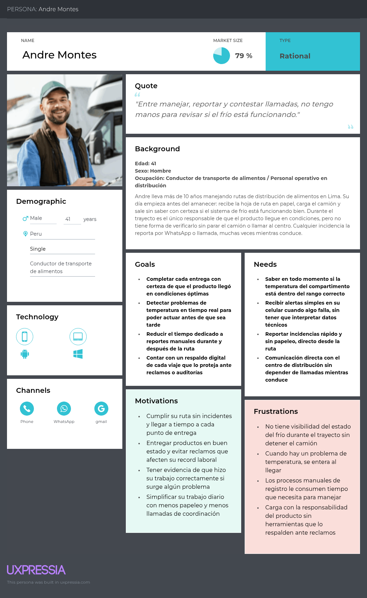

### 2.3.2. User Task Matrix

| **User Task** | **Personal de Logística y Operaciones** | **Personal de Transporte** |
|---------------|----------------------------|------------------------|
| Planificar rutas y tiempos | Frecuencia: Often          | Frecuencia: Rarely     |
| Monitorear condiciones de transporte | Frecuencia: Often          | Frecuencia: Often      |
| Analizar historial de envíos | Frecuencia: Often          | Frecuencia: Rarely     |
| Generar reportes de desempeño | Frecuencia: Often          | Frecuencia: Never      |
| Cumplir entregas puntuales | Frecuencia: Sometimes      | Frecuencia: Often      |
| Comunicar incidencias | Frecuencia: Often          | Frecuencia: Often      |
| Mantener condiciones óptimas de alimentos | Frecuencia: Sometimes      | Frecuencia: Often      |

### 2.3.3. User Journey Mapping

<h5 id="JourUser">Segmento #1: Personal de Logística y Operaciones </h5>


<h5 id="JourUser">Segmento #2: Personal de transporte </h5>


### 2.3.4. Empathy Mapping

**USER PERSONA: Raúl Gonzales**


**USER PERSONA: Andre Montes**


### 2.3.5. As-is Scenario Mapping

Los As-is Scenario Mapping muestran cómo los segmentos objetivo atienden actualmente el monitoreo de la cadena de frío antes de incorporar ColdTrack. La actualización diferencia las actividades, pensamientos y emociones de cada segmento para evidenciar los puntos de dolor que justifican la solución.

**USER PERSONA: Raúl Gonzales - Personal de Logística y Operaciones**


El personal de logística depende de reportes manuales, llamadas al conductor y registros aislados para confirmar el estado de cada envío. Esto genera incertidumbre durante la ruta, retrasa la toma de decisiones y limita la trazabilidad cuando ocurre una incidencia.

**USER PERSONA: Andre Montes - Personal de Transporte**


El personal de transporte revisa indicadores básicos o señales visibles del vehículo, comunica problemas por llamadas o mensajes y suele actuar con información incompleta. Esta situación produce presión operativa porque el conductor no siempre sabe cuándo debe intervenir ni qué acción priorizar.

**Actualización del As-is Scenario Mapping del segmento de transporte**

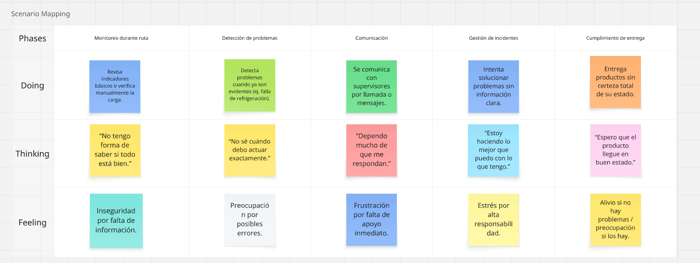

La actualización enfatiza cinco fases del proceso actual: monitoreo durante ruta, detección de problemas, comunicación, gestión de incidentes y cumplimiento de entrega. En cada fase se evidencian necesidades relacionadas con información en tiempo real, alertas accionables, comunicación con supervisores y reducción de incertidumbre sobre el estado de la carga.

### 2.3.6. Big Picture EventStorming

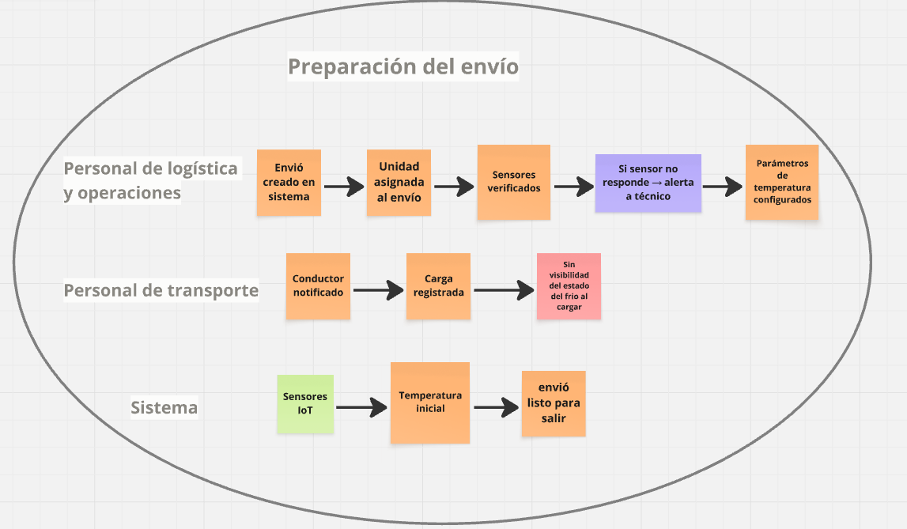

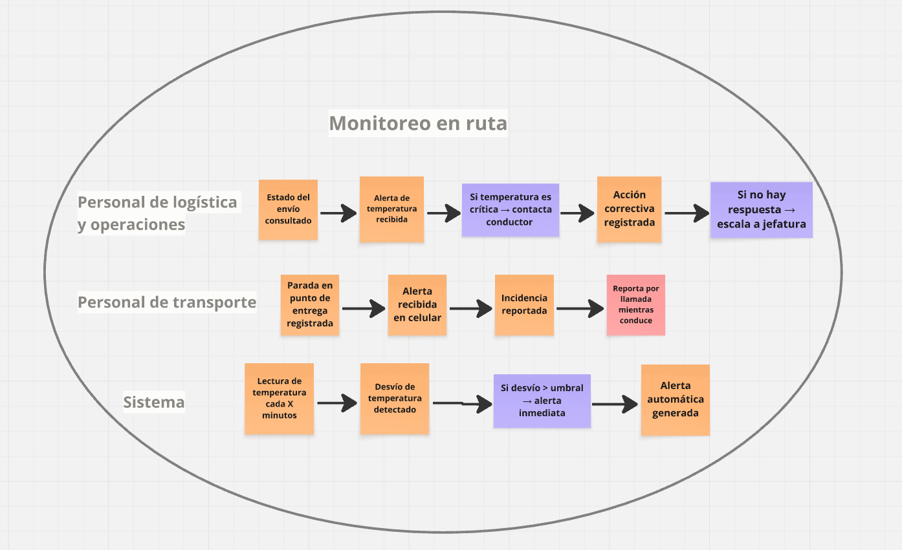

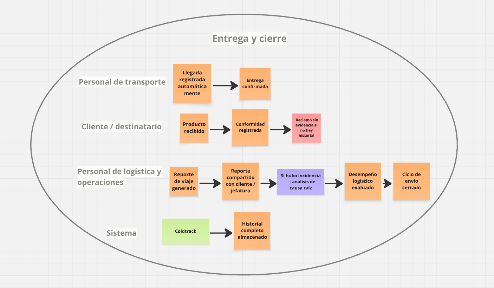

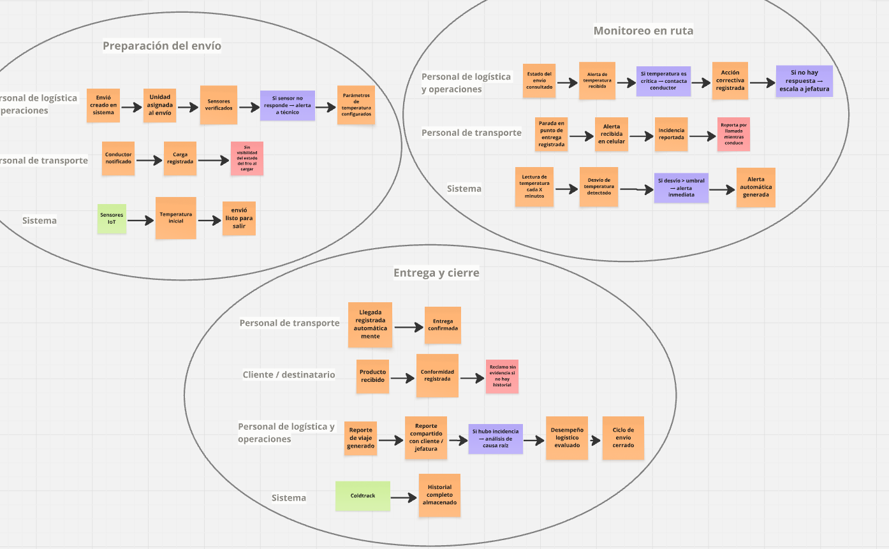

## 2.4. Ubiquitous Language

El Ubiquitous Language de ColdTrack consolida los términos compartidos entre negocio, diseño y desarrollo. Estos conceptos se usan de forma consistente en la landing page, la Web Application, los Web Services, la base de datos y la documentación del producto.

### Core Domain

- **ColdTrack:** Producto digital de FreshGuard orientado al monitoreo de la cadena de frío durante el transporte de alimentos sensibles.
- **Cold Chain (Cadena de Frío):** Conjunto de condiciones controladas que permiten conservar productos sensibles dentro de rangos aceptables de temperatura y humedad.
- **Refrigerated Shipment (Envío Refrigerado):** Traslado de productos alimenticios que requieren control ambiental desde el origen hasta el destino.
- **Shipment Code (Código de Envío):** Identificador visible para usuarios, por ejemplo `ENV-001`, usado en tablas, alertas e historial.
- **Shipment Lifecycle (Ciclo de Vida del Envío):** Secuencia de estados de un envío: registered, in transit, completed o cancelled.
- **Cargo Description (Descripción de Carga):** Información resumida sobre los productos transportados y sus condiciones de conservación.

### Identity and Access

- **User Account (Cuenta de Usuario):** Registro que permite acceder a ColdTrack mediante correo, contraseña y rol.
- **Role (Rol):** Nivel de responsabilidad del usuario dentro del sistema, como logistics admin o driver.
- **Authentication (Autenticación):** Proceso de validación de credenciales para ingresar a la Web Application.
- **JWT (JSON Web Token):** Token emitido por el backend para autorizar solicitudes protegidas desde el frontend.
- **Protected Route (Ruta Protegida):** Vista de la aplicación que requiere sesión activa para ser utilizada.

### Shipment Management

- **Dashboard:** Vista principal que resume envíos, alertas activas e indicadores operativos.
- **Shipment Detail (Detalle de Envío):** Vista o modal que consolida destino, estado, conductor, carga, fechas, lecturas, sensor asignado y alertas relacionadas.
- **Driver (Conductor):** Persona responsable del traslado del envío durante la ruta.
- **Estimated Arrival (Llegada Estimada):** Fecha y hora planificada para completar un envío.
- **Actual Arrival (Llegada Real):** Fecha y hora registrada cuando el envío se completa.
- **Shipment History (Historial de Envíos):** Vista que lista envíos completados y sus indicadores de desempeño.

### Telemetry and Sensors

- **Sensor:** Dispositivo IoT asociado a un envío para registrar temperatura y humedad.
- **Sensor Code (Código de Sensor):** Identificador visible del dispositivo, por ejemplo `SENS-A123`.
- **Sensor Assignment (Asignación de Sensor):** Vinculación de un sensor disponible con un envío refrigerado.
- **Telemetry Reading (Lectura de Telemetría):** Registro de temperatura, humedad y fecha capturado por un sensor.
- **Threshold (Umbral):** Límite de negocio usado para evaluar si una lectura es normal, de advertencia o crítica.

### Alerts, Analytics and Deployment

- **Alert (Alerta):** Incidencia generada cuando una lectura supera los límites permitidos o evidencia un riesgo operativo.
- **Severity (Severidad):** Nivel de gravedad de una alerta: warning o critical.
- **Alert Status (Estado de Alerta):** Situación de atención de la alerta: active, acknowledged o resolved.
- **Threshold Policy (Política de Umbrales):** Regla de dominio que evalúa lecturas de temperatura y humedad para disparar alertas.
- **PDF Report (Reporte PDF):** Documento descargable con métricas y detalle del período seleccionado.
- **Web Application:** Aplicación Vue desplegada en Firebase Hosting.
- **Web Services:** API REST ASP.NET Core desplegada en Render.
- **Persistence (Persistencia):** Almacenamiento de usuarios, envíos, sensores, telemetría, alertas y reportes en MySQL.
- **Swagger/OpenAPI:** Documentación interactiva usada para probar y validar contratos REST.

# Capitulo III: Requirements Specification

## 3.1. To-Be Scenario Mapping
1. Segmento 1: Personal de Logística y Operaciones.
 
 
2. Segmento 2: Personal de Transporte.
 

## 3.2. User Stories

Esta sección organiza las épicas, User Stories y Technical Stories que guían el desarrollo de ColdTrack. Las historias se formularon considerando los tres productos digitales desarrollados por el equipo: Landing Page, Web Application y Web Services. Cada historia mantiene trazabilidad con una épica y expresa criterios de aceptación verificables durante los Sprint Reviews.

| Epic/Story ID | Título | Descripción | Criterios de Aceptación | Relacionado con (Epic ID) |
|---|---|---|---|---|
| EP-001 | Landing Page y adquisición | Como visitante interesado en soluciones de cadena de frío<br>Quiero conocer la propuesta de valor, beneficios, equipo y acceso a la aplicación<br>Para decidir si ColdTrack responde a mis necesidades operativas. | N/A | N/A |
| EP-002 | Identidad, acceso y sesión | Como usuario de ColdTrack<br>Quiero registrarme, iniciar sesión, cerrar sesión y mantener una sesión segura<br>Para acceder a las funcionalidades protegidas según mi rol. | N/A | N/A |
| EP-003 | Gestión de envíos refrigerados | Como personal de logística<br>Quiero registrar, consultar, detallar y actualizar envíos refrigerados<br>Para controlar el ciclo operativo de productos sensibles. | N/A | N/A |
| EP-004 | Sensores y telemetría | Como personal de logística o transporte<br>Quiero registrar sensores, asignarlos a envíos y registrar lecturas ambientales<br>Para monitorear la temperatura y humedad durante la ruta. | N/A | N/A |
| EP-005 | Alertas e incidencias | Como usuario responsable del envío<br>Quiero visualizar, filtrar, reconocer y resolver alertas<br>Para actuar frente a variaciones críticas de la cadena de frío. | N/A | N/A |
| EP-006 | Analítica, historial y reportes | Como personal de logística<br>Quiero revisar indicadores, historial y reportes PDF<br>Para evaluar el desempeño de las operaciones completadas. | N/A | N/A |
| EP-007 | Plataforma, servicios y despliegue | Como equipo técnico<br>Quiero documentar, desplegar y operar la solución en entornos públicos<br>Para permitir validaciones reales de frontend, backend y base de datos. | N/A | N/A |
| US-001 | Visualizar propuesta de valor | Como visitante<br>Quiero entender el problema que resuelve ColdTrack y sus beneficios<br>Para evaluar si la solución se ajusta a mi operación. | Escenario 1: Dado que ingreso a la Landing Page, cuando reviso la sección principal, entonces visualizo propuesta de valor, beneficios y CTA.<br><br>Escenario 2: Dado que selecciono un CTA, cuando se ejecuta la acción, entonces soy redirigido a la Web Application desplegada. | EP-001 |
| US-002 | Navegar secciones informativas | Como visitante<br>Quiero recorrer características, funcionamiento, beneficios y documentación<br>Para comprender el alcance funcional de ColdTrack. | Escenario 1: Dado que uso la barra de navegación, cuando selecciono una sección, entonces el sitio desplaza hacia el contenido correspondiente.<br><br>Escenario 2: Dado que consulto documentación, cuando selecciono el enlace, entonces se abre el repositorio público asociado. | EP-001 |
| US-003 | Consultar información de empresa y equipo | Como visitante<br>Quiero conocer a FreshGuard y a los integrantes del equipo<br>Para generar confianza sobre la solución presentada. | Escenario 1: Dado que reviso la sección About Us, cuando se carga el contenido, entonces visualizo información de la empresa.<br><br>Escenario 2: Dado que reviso el equipo, cuando se muestran los integrantes, entonces se identifican sus nombres y participación. | EP-001 |
| US-004 | Cambiar idioma de interfaz | Como usuario o visitante<br>Quiero alternar entre inglés y español<br>Para comprender la información en mi idioma preferido. | Escenario 1: Dado que abro el producto por primera vez, cuando carga la interfaz, entonces los textos se muestran en inglés.<br><br>Escenario 2: Dado que selecciono ES o EN, cuando el sistema aplica el cambio, entonces los textos fijos se actualizan en la interfaz. | EP-001 |
| US-005 | Crear cuenta | Como usuario nuevo<br>Quiero registrar mis datos, correo, contraseña y rol<br>Para acceder al sistema ColdTrack. | Escenario 1: Dado que completo datos válidos, cuando envío el formulario, entonces el backend crea la cuenta.<br><br>Escenario 2: Dado que faltan campos o el correo ya existe, cuando se procesa la solicitud, entonces el sistema muestra un error claro. | EP-002 |
| US-006 | Iniciar sesión | Como usuario registrado<br>Quiero autenticarme con correo y contraseña<br>Para acceder al dashboard operativo. | Escenario 1: Dado que ingreso credenciales válidas, cuando inicio sesión, entonces recibo un JWT y accedo a vistas protegidas.<br><br>Escenario 2: Dado que ingreso credenciales inválidas, cuando intento acceder, entonces el sistema rechaza la operación. | EP-002 |
| US-007 | Mantener sesión segura | Como usuario autenticado<br>Quiero que mis solicitudes incluyan automáticamente el token<br>Para consumir endpoints protegidos sin repetir credenciales. | Escenario 1: Dado que existe sesión válida, cuando consulto recursos protegidos, entonces el cliente envía `Authorization: Bearer`.<br><br>Escenario 2: Dado que no existe token válido, cuando solicito una vista protegida, entonces el sistema redirige a Sign In. | EP-002 |
| US-008 | Cerrar sesión | Como usuario autenticado<br>Quiero cerrar mi sesión<br>Para proteger mi acceso cuando termino de usar la plataforma. | Escenario 1: Dado que selecciono Sign Out, cuando el sistema procesa la acción, entonces elimina la sesión local.<br><br>Escenario 2: Dado que intento volver a una vista protegida sin token, cuando navego, entonces se me redirige a Sign In. | EP-002 |
| US-009 | Registrar envío | Como personal de logística<br>Quiero crear un envío con destino, conductor, carga y fechas<br>Para iniciar el seguimiento operativo. | Escenario 1: Dado que completo campos requeridos, cuando registro el envío, entonces queda almacenado en MySQL.<br><br>Escenario 2: Dado que faltan datos, cuando intento guardar, entonces se muestran validaciones. | EP-003 |
| US-010 | Consultar dashboard de envíos | Como usuario autenticado<br>Quiero consultar indicadores, alertas activas y envíos en curso<br>Para identificar rápidamente el estado de la operación. | Escenario 1: Dado que existen envíos activos, cuando abro el dashboard, entonces veo código, destino, estado y llegada estimada.<br><br>Escenario 2: Dado que no existen envíos, cuando consulto la lista, entonces se muestra un estado vacío. | EP-003 |
| US-011 | Ver detalle del envío | Como usuario autenticado<br>Quiero revisar el detalle de un envío<br>Para conocer sensor asignado, alertas relacionadas y condiciones registradas. | Escenario 1: Dado que selecciono View details, cuando el sistema consulta el backend, entonces se muestran datos del envío, sensor y alertas.<br><br>Escenario 2: Dado que el envío no existe o la API no responde, cuando se intenta cargar, entonces se informa el problema. | EP-003 |
| US-012 | Actualizar estado de envío | Como personal de logística<br>Quiero cambiar el estado del envío<br>Para reflejar su avance hasta completarlo. | Escenario 1: Dado que el envío existe, cuando actualizo el estado, entonces el backend persiste el cambio.<br><br>Escenario 2: Dado que la transición no está permitida, cuando solicito el cambio, entonces se devuelve un error de dominio. | EP-003 |
| US-013 | Consultar historial de envíos | Como personal de logística<br>Quiero revisar envíos completados<br>Para analizar trazabilidad, fechas y resultados de operación. | Escenario 1: Dado que existen envíos completados, cuando abro History, entonces veo fechas, carga, métricas y alertas.<br><br>Escenario 2: Dado que no existen envíos completados, cuando consulto el historial, entonces se muestra un estado vacío. | EP-006 |
| US-014 | Registrar y consultar sensores | Como personal de logística<br>Quiero visualizar y registrar sensores<br>Para saber cuáles están asignados o disponibles. | Escenario 1: Dado que existen sensores, cuando abro Sensors, entonces veo código, modelo, estado, envío y última lectura.<br><br>Escenario 2: Dado que registro un sensor válido, cuando confirmo la operación, entonces queda disponible para asignación. | EP-004 |
| US-015 | Asignar sensor a envío | Como personal de logística<br>Quiero vincular un sensor disponible a un envío<br>Para comenzar el monitoreo de la carga. | Escenario 1: Dado que el sensor está disponible y el envío existe, cuando asigno el sensor, entonces ambos quedan vinculados.<br><br>Escenario 2: Dado que el sensor ya está asignado, cuando intento vincularlo, entonces se rechaza la operación. | EP-004 |
| US-016 | Registrar lectura de telemetría | Como usuario autorizado<br>Quiero registrar temperatura y humedad de un sensor<br>Para mantener actualizado el monitoreo del envío. | Escenario 1: Dado que el sensor está asignado, cuando registro temperatura y humedad, entonces la lectura se guarda.<br><br>Escenario 2: Dado que la lectura supera umbrales, cuando se procesa, entonces se genera una alerta asociada. | EP-004 |
| US-017 | Consultar lecturas de telemetría | Como usuario autenticado<br>Quiero revisar lecturas asociadas a un envío<br>Para validar la evolución ambiental de la carga. | Escenario 1: Dado que existen lecturas, cuando consulto la telemetría de un envío, entonces se listan temperatura, humedad y fecha.<br><br>Escenario 2: Dado que el envío no tiene lecturas, cuando consulto la telemetría, entonces se muestra una respuesta vacía controlada. | EP-004 |
| US-018 | Visualizar y filtrar alertas | Como usuario autenticado<br>Quiero ver alertas por severidad y estado<br>Para priorizar incidentes de cadena de frío. | Escenario 1: Dado que existen alertas, cuando filtro por severidad o estado, entonces veo resultados coincidentes.<br><br>Escenario 2: Dado que no existen coincidencias, cuando aplico filtros, entonces el sistema informa que no hay resultados. | EP-005 |
| US-019 | Reconocer alerta | Como usuario responsable<br>Quiero marcar una alerta como revisada<br>Para indicar que el incidente ya fue atendido inicialmente. | Escenario 1: Dado que una alerta está activa, cuando ejecuto acknowledgment, entonces su estado cambia a reconocido.<br><br>Escenario 2: Dado que la alerta ya fue resuelta, cuando intento reconocerla, entonces el backend rechaza la operación inválida. | EP-005 |
| US-020 | Resolver alerta | Como usuario responsable<br>Quiero resolver una alerta<br>Para cerrar el incidente luego de tomar acción. | Escenario 1: Dado que una alerta está activa o reconocida, cuando ejecuto resolution, entonces queda resuelta.<br><br>Escenario 2: Dado que la alerta no existe, cuando solicito resolverla, entonces se retorna un error controlado. | EP-005 |
| US-021 | Consultar analítica del dashboard | Como personal de logística<br>Quiero ver indicadores consolidados<br>Para evaluar el estado general de operaciones, alertas y entregas. | Escenario 1: Dado que la API responde, cuando abro el dashboard, entonces se muestran totales de envíos, activos, completados y alertas.<br><br>Escenario 2: Dado que ocurre un error, cuando se consulta la analítica, entonces se muestra un mensaje de recuperación. | EP-006 |
| US-022 | Generar reporte PDF | Como personal de logística<br>Quiero generar y descargar un reporte PDF<br>Para compartir resultados de la cadena de frío. | Escenario 1: Dado que existe información del período, cuando presiono Export report, entonces se genera y descarga un PDF.<br><br>Escenario 2: Dado que no hay datos, cuando solicito el reporte, entonces se informa la falta de registros. | EP-006 |
| TS-001 | Implementar API REST versionada | Como equipo técnico<br>Quiero exponer recursos bajo `/api/v1`<br>Para mantener contratos claros entre frontend y backend. | La API expone endpoints versionados, responde JSON y documenta contratos con Swagger/OpenAPI. | EP-007 |
| TS-002 | Configurar persistencia MySQL | Como equipo técnico<br>Quiero almacenar entidades en MySQL<br>Para conservar datos entre sesiones y despliegues. | EF Core aplica migraciones, usa TLS y conserva usuarios, envíos, sensores, telemetría, alertas y reportes. | EP-007 |
| TS-003 | Integrar frontend con backend productivo | Como equipo técnico<br>Quiero reemplazar MockAPI por la API de Render<br>Para ejecutar el flujo completo con persistencia real. | Las variables de entorno de producción apuntan a Render y los servicios axios usan JWT. | EP-007 |
| TS-004 | Documentar y desplegar servicios | Como equipo técnico<br>Quiero publicar Swagger, Firebase Hosting y Render<br>Para facilitar pruebas, exposición pública y revisión académica. | Swagger está disponible en producción, Firebase sirve la Web Application y Render expone la API conectada a MySQL. | EP-007 |

## 3.3. Impact Mapping


## 3.4. Product Backlog

| Prioridad | User Story ID | Título HU | Story Points |
|----------|--------------|----------|-------------|
| 1 | US-001 | Visualizar propuesta de valor | 3 |
| 2 | US-002 | Navegar secciones informativas | 3 |
| 3 | US-003 | Consultar información de empresa y equipo | 2 |
| 4 | US-004 | Cambiar idioma de interfaz | 5 |
| 5 | US-005 | Crear cuenta | 5 |
| 6 | US-006 | Iniciar sesión | 5 |
| 7 | US-007 | Mantener sesión segura | 5 |
| 8 | US-008 | Cerrar sesión | 3 |
| 9 | US-009 | Registrar envío | 8 |
| 10 | US-010 | Consultar dashboard de envíos | 8 |
| 11 | US-011 | Ver detalle del envío | 5 |
| 12 | US-012 | Actualizar estado de envío | 5 |
| 13 | US-013 | Consultar historial de envíos | 5 |
| 14 | US-014 | Registrar y consultar sensores | 8 |
| 15 | US-015 | Asignar sensor a envío | 8 |
| 16 | US-016 | Registrar lectura de telemetría | 8 |
| 17 | US-017 | Consultar lecturas de telemetría | 5 |
| 18 | US-018 | Visualizar y filtrar alertas | 8 |
| 19 | US-019 | Reconocer alerta | 5 |
| 20 | US-020 | Resolver alerta | 5 |
| 21 | US-021 | Consultar analítica del dashboard | 8 |
| 22 | US-022 | Generar reporte PDF | 8 |
| 23 | TS-001 | Implementar API REST versionada | 8 |
| 24 | TS-002 | Configurar persistencia MySQL | 8 |
| 25 | TS-003 | Integrar frontend con backend productivo | 8 |
| 26 | TS-004 | Documentar y desplegar servicios | 5 |

# Capítulo IV: Product Design

## 4.1. Style Guidelines

En esta sección, detallamos los lineamientos de diseño, estilo y apariencia visual de la plataforma ColdTrack. El objetivo es garantizar una interfaz intuitiva que permita a los supervisores logísticos y conductores monitorear datos críticos de temperatura sin distracciones. Para ello, hemos optado por una estética moderna y funcional, utilizando elementos visuales claros que facilitan la toma de decisiones rápida.

### 4.1.1. General Style Guidelines

**Branding:** El logotipo de **ColdTrack** ha sido diseñado para reflejar tecnología y seguridad en la cadena de frío. Los colores seleccionados transmiten profesionalismo y confianza, reforzando la identidad de una solución robusta.

<p align="center">
  
</p>

**Tono de Comunicación:**
- **Analítico y Profesional:** Para brindar seguridad sobre la precisión de los datos de los sensores.
- **Directo y Preventivo:** Uso de alertas claras para facilitar la reacción inmediata ante cambios en la temperatura.
- **Eficiente:** Enfocado en la reducción de mermas y la optimización de la logística.

**Tipografía:** Para garantizar un rendimiento óptimo y una apariencia integrada en cualquier sistema operativo, ColdTrack utiliza una **pila de fuentes nativas (System Fonts)**. Esto permite que la aplicación se sienta familiar y sea altamente legible tanto en dispositivos móviles como en escritorio, utilizando fuentes como -apple-system, BlinkMacSystemFont (macOS/iOS), Segoe UI (Windows) y Roboto (Android).

**Colores de Marca:**
Basándonos en la implementación actual de la Landing Page, la paleta se define por los siguientes códigos hexadecimales:
- **Primario (#0052CC):** Azul corporativo que representa confianza y frío controlado.
- **Secundario (#F5F5F5):** Gris claro para fondos de secciones y tarjetas.
- **Oscuro (#0F1117):** Color para el footer y elementos de alto contraste.
- **Éxito (#10B981):** Verde para estados "Normales" de los envíos.
- **Advertencia (#F59E0B):** Ámbar para alertas preventivas en el dashboard.

**Paleta de Colores:**

| Color | Código Hex | Uso Principal |
| :--- | :--- | :--- |
| Primario | #0052CC | Identidad de marca, botones CTA y navegación. |
| Secundario | #F5F5F5 | Fondos de secciones y tarjetas de características. |
| Oscuro | #0F1117 | Fondo de Footer y elementos de contraste. |
| Éxito | #10B981 | Indicadores de estado óptimo (Badge Normal). |
| Advertencia | #F59E0B | Alertas de temperatura (Badge Advertencia). |

**Espaciado y Distribución:** Se utiliza un diseño basado en contenedores (container) y una rejilla responsiva (shipments-grid). El espaciado generoso entre las tarjetas de "Envío" en el preview del dashboard asegura que el usuario pueda identificar rápidamente qué unidad requiere atención.

### 4.1.2. Web Style Guidelines

La plataforma **ColdTrack** está diseñada bajo un enfoque **Responsive**, asegurando que la visualización de los datos sea fluida en computadoras de escritorio, tablets y smartphones.

**Componentes Implementados:**

**Cabecera (Header):**
- **Navegación Fija (Sticky):** Permite acceso rápido a Características, Cómo Funciona y Beneficios.
- **Identidad:** Logo de ColdTrack y nombre de marca siempre visibles a la izquierda.
- **Acceso:** Botón de "Iniciar Sesión" destacado con fondo azul a la derecha.

**Hero Section:**
- **Propuesta de Valor:** Título principal centrado ("Monitoreo en Tiempo Real...") y descripción del impacto del producto en la calidad.
- **Dashboard Preview:** Representación visual con tarjetas individuales para envíos activos, mostrando métricas de temperatura en grados Celsius y porcentaje de humedad.

**Secciones Operativas:**
- **Características:** Tres pilares con iconos minimalistas: Monitoreo en Tiempo Real, Alertas Automáticas e Historial Detallado.
- **Cómo Funciona:** Proceso numerado del 1 al 4 (Instalación, Transmisión, Monitoreo y Reportes).
- **Beneficios:** Sección con fondo azul sólido y tarjetas translúcidas que destacan la Eficiencia, Reducción de Riesgos y Decisiones Rápidas.

---

## 4.2. Information Architecture

### 4.2.1. Organization Systems

Hemos implementado una **Estructura Jerárquica (Tree Structure)** basada en la navegación por secciones:

* **Estructura de la Landing Page:**
  * **Inicio (Hero):** Captación y visión general del dashboard.
  * **Características:** Detalle técnico de las capacidades del sistema.
  * **Proceso (Cómo Funciona):** Guía paso a paso de la implementación IoT.
  * **Valor (Beneficios):** Impacto directo en la operación logística.

* **Estructura del Dashboard:**
  * **Raíz:** Monitoreo en Vivo (Resumen de envíos activos).
  * **Nivel 1:** Tarjetas de Envío (ID, Estado con Badges de color, Temperatura, Humedad).

### 4.2.2. Labeling Systems

El sistema de etiquetado utiliza términos claros para evitar ambigüedades operativas:
- **"Dashboard - Monitoreo en Vivo":** Define el área de trabajo en tiempo real.
- **"Normal" / "Advertencia":** Etiquetas de estado (Badges) con colores verde y naranja respectivamente.
- **"Envío #XXXX":** Identificador único para trazabilidad de carga.

### 4.2.3. SEO Tags and Meta Tags

- **Title:** ColdTrack - Monitoreo en Tiempo Real para el Transporte de Alimentos.
- **Description:** Asegura la calidad de tus productos con control de temperatura y humedad en cada etapa del transporte.
- **Keywords:** monitoreo de alimentos, cadena de frío, sensores IoT, transporte refrigerado.
- **Meta Tags:** Viewport configurado para escalabilidad (width=device-width, initial-scale=1.0).

### 4.2.4. Searching Systems

- **Navegación Anclada:** Enlaces internos en el Header (#caracteristicas, #como-funciona, #beneficios) que permiten un desplazamiento suave (smooth scroll) hacia las secciones correspondientes.

### 4.2.5. Navigation Systems

- **Sticky Navbar:** Menú superior fijo que mantiene el acceso al login y a las secciones durante todo el recorrido.
- **Call to Action (CTA):** Botones principales ("Comenzar Ahora") con alta visibilidad para guiar la conversión del usuario.


## 4.3. Landing Page UI Design

### 4.3.1. Landing Page Wireframe

<p align="center">
  
</p>


<p align="center">
  
</p>

### 4.3.2. Landing Page Mock-up

**Sección Hero y Detalles del Dashboard:**
Visualización principal de la propuesta de valor y estados de monitoreo activos.

<p align="center">
  
</p>

**Características y Funcionamiento:**
Explicación de las capacidades técnicas y el flujo de implementación del sistema.

<p align="center">
  
</p>

**Beneficios y Footer:**
Sección de impacto operativo y enlaces de navegación secundaria.

<p align="center">
  
</p>

<p align="center">
  
</p>

## 4.4. Web Applications UX/UI Design

### 4.4.1. Web Applications Wireframes

<p align="center">
  
</p>

### 4.4.2. Web Applications Wireflow Diagrams

<p align="center">
  
</p>

### 4.4.3. Web Applications Mock-ups

<p align="center">
  
</p>

### 4.4.4. Web Applications User Flow Diagrams

<p align="center">
  
</p>

<p align="center">
  
</p>

<p align="center">
  
</p>

## 4.5. Web Applications Prototyping

<p align="center">
  
</p>

#### Link del video explicativo: https://upcedupe-my.sharepoint.com/:v:/g/personal/u202320699_upc_edu_pe/IQACBR9pDoCKSIpvd7NcFc3CAcul48K88RqMf49wIC2AbMA?nav=eyJyZWZlcnJhbEluZm8iOnsicmVmZXJyYWxBcHAiOiJPbmVEcml2ZUZvckJ1c2luZXNzIiwicmVmZXJyYWxBcHBQbGF0Zm9ybSI6IldlYiIsInJlZmVycmFsTW9kZSI6InZpZXciLCJyZWZlcnJhbFZpZXciOiJNeUZpbGVzTGlua0NvcHkifX0&e=Ji22ya

## 4.6. Domain-Driven Software Architecture
En esta sección, el equipo profundiza en la arquitectura de software para la solución ColdTrack, tomando como base los hitos alcanzados durante el Big Picture Event Storming. 
El objetivo es realizar una transición desde el entendimiento del negocio hacia un modelo técnico riguroso bajo la perspectiva de Domain-Driven Design (DDD).

Este enfoque permite delimitar los Bounded Contexts necesarios para separar responsabilidades críticas, como el monitoreo IoT en tiempo real, la gestión logística de los envíos y el motor automatizado de alertas tempranas. 
A través de esta metodología, se han identificado los Aggregates, Events, Commands y Queries que garantizan la integridad de la lógica de negocio en cada etapa del transporte de carga refrigerada y la conservación de la cadena de frío.

La arquitectura de ColdTrack responde directamente a los hallazgos definidos en el Lean UX Process y en las entrevistas de validación. Los usuarios necesitan visibilidad del estado de los envíos, alertas comprensibles, historial confiable y reportes que respalden decisiones de calidad. Por ello, el diseño arquitectónico no se limita a organizar componentes técnicos, sino que busca reflejar el lenguaje del negocio: envío, sensor, lectura, alerta, incidencia, conductor, supervisor, reporte y trazabilidad.

Desde la perspectiva DDD, ColdTrack se divide en contextos que permiten evolucionar cada capacidad sin mezclar responsabilidades. Shipment Management se encarga de la planificación y ciclo de vida de los envíos; Telemetry Monitoring administra sensores y lecturas ambientales; Alerting evalúa condiciones fuera de rango y registra incidencias; Reporting consolida evidencias históricas; e Identity and Access protege el acceso de usuarios según su rol. Esta separación facilita que el sistema pueda crecer hacia integraciones con sensores reales, notificaciones en tiempo real y reportes más avanzados sin afectar toda la aplicación.

También se consideraron decisiones arquitectónicas derivadas de la implementación del Sprint 3. La Web Application consume servicios REST publicados por el backend, el backend persiste información operativa en MySQL y los endpoints se documentan mediante Swagger/OpenAPI. Esta arquitectura permite que los flujos del frontend, como registro de envíos, consulta de sensores, revisión de alertas e historial, se conecten con servicios especializados y trazables.

Finalmente, se presenta y explica la representación visual de la arquitectura utilizando el C4 Model. 
Esta estructura jerárquica nos permite comunicar de manera efectiva la solución a través de tres niveles de detalle: el Software Architecture Context Level Diagram, los Software Architecture Container Level Diagrams y los Software Architecture Component Diagrams.

### 4.6.1. Design-Level Event Storming
La sesión de Design-Level EventStorming nos permitió transicionar desde los requerimientos de negocio hacia un diseño técnico estructurado y orientado al dominio. Como resultado del análisis colaborativo, identificamos cinco **Bounded Contexts (BC)** principales. Estos contextos no solo aíslan lógicamente las responsabilidades del sistema, sino que guían directamente la **Arquitectura DDD** que hemos implementado, donde cada Bounded Context se traduce en módulos independientes estructurados por capas.

A continuación, se detalla el modelado técnico extraído para cada Bounded Context a partir de los diagramas generados:

#### 1. Shipment Management
Encargado de la logística central de la carga, vinculando los sensores físicos con los viajes registrados en el sistema.
* **Comandos:** `Register Shipment`, `Assign Sensor`, `Finalize Shipment`.
* **Agregados:** `Shipment`, `Sensor`.
* **Eventos de Dominio:** `Shipment Registered`, `Sensor Assigned`, `Shipment Finalized`.
* **Políticas:** `Validation Rules`.

El Design-Level Event Storming permitió analizar el comportamiento del dominio antes de definir componentes técnicos. A partir de los eventos del negocio se identificaron situaciones relevantes como el registro de un envío, la asignación de un sensor, la recepción de una lectura de telemetría, la detección de una condición fuera de rango, la generación de una alerta y la emisión de un reporte. Estos eventos sirvieron para comprender qué información debe conservarse y qué decisiones debe tomar el sistema en cada etapa.

Los comandos representan acciones solicitadas por usuarios o sistemas externos, por ejemplo registrar un envío, iniciar monitoreo, guardar una lectura, reconocer una alerta o generar un reporte. Los aggregates agrupan reglas de consistencia, como evitar que una alerta exista sin un envío asociado o impedir que una lectura quede registrada sin referencia a un sensor. Las queries, por su parte, responden a necesidades de consulta rápida: ver envíos activos, revisar historial, consultar alertas por severidad y obtener evidencias para control de calidad.

Como resultado, el equipo pudo relacionar los flujos de usuario diseñados en la Web Application con los servicios de dominio implementados posteriormente. Esto ayudó a mantener coherencia entre diseño, requerimientos, backend y validación del producto.

<p align="center">
  
</p>

#### 2. Real-Time IoT Monitoring
Núcleo de la telemetría. Procesa la ingesta constante de datos ambientales emitidos desde el hardware en ruta.
* **Comandos:** `Receive Telemetry`, `Update Environmental Data`.
* **Agregados:** `Telemetry Data`, `Shipment Status`.
* **Eventos de Dominio:** `Telemetry Received`, `Temperature Updated`, `Humidity Updated`.
* **Sistemas Externos:** `Hardware IoT Sensors`, `WebSocket Server`.

<p align="center">
  
</p>

#### 3. Alerting Engine
Motor crítico que evalúa las anomalías climáticas detectadas por los sensores para emitir advertencias tempranas.
* **Comandos:** `Evaluate Conditions`, `Trigger Alert`, `Send Notification`.
* **Agregados:** `Alert`.
* **Eventos de Dominio:** `Anomaly Detected`, `Alert Triggered`, `Driver Notified`.
* **Políticas / Sistemas Externos:** `Threshold Policies`, `Push Notification Service / SMS API`.

<p align="center">
  
</p>

#### 4. Analytics & Reporting
Encargado del análisis estadístico post-viaje y la generación de reportes de calidad para la gerencia.
* **Comandos:** `Filter History`, `Request Report`, `Generate PDF`.
* **Agregados:** `Historical Log`, `Report`.
* **Eventos de Dominio:** `History Filtered`, `Report Requested`, `PDF Generated`.
* **Sistemas Externos:** `PDF Generator Engine`.

<p align="center">
  
</p>

#### 5. Identity & Access
Gestiona la seguridad, roles y credenciales de los distintos actores del sistema (Logística y Transportistas).
* **Comandos:** `Register User`, `Authenticate Login`, `Request Password Reset`.
* **Agregados:** `User Account`.
* **Eventos de Dominio:** `User Registered`, `Login Successful`, `Recovery Link Sent`.

<p align="center">
  
</p>


### 4.6.2. Software Architecture Context Diagram
El Context Diagram muestra a ColdTrack como una plataforma que conecta a los principales actores del negocio con los servicios digitales del producto. Los supervisores logísticos y responsables de calidad utilizan la aplicación para monitorear envíos, revisar alertas, consultar historial y generar reportes. Los conductores participan como usuarios operativos que necesitan recibir información clara sobre el estado del envío y posibles incidencias durante la ruta.

En este nivel también se representa la relación con sistemas externos o componentes de soporte, como sensores de temperatura y humedad, servicios de despliegue, base de datos y mecanismos de autenticación. El objetivo del diagrama es mostrar el alcance general de la solución y explicar cómo ColdTrack aporta valor dentro del proceso de transporte refrigerado.

El diagrama de contexto (Context Level) ilustra la visión general de más alto nivel de **ColdTrack**. Su objetivo principal es mostrar cómo nuestro sistema central interactúa con los usuarios (actores) y los sistemas externos necesarios para funcionar, sin entrar en detalles internos.

**Actores Principales (Personas):**
* **Personal de Logística:** Supervisa los envíos, monitorea las condiciones en tiempo real y analiza los reportes históricos.
* **Personal de Transporte:** Traslada los alimentos físicos y necesita recibir alertas críticas inmediatas durante su ruta en caso de anomalías climáticas.

**Sistema Principal (Software System):**
* **ColdTrack System:** La plataforma central desarrollada por nosotros. Su responsabilidad es procesar la telemetría recibida, gestionar los estados de los envíos y disparar alertas automatizadas.

**Sistemas Externos (External Systems):**
* **Authentication Provider:** Servicio de terceros utilizado para validar credenciales y asegurar los inicios de sesión.
* **Hardware IoT Sensors:** Dispositivos físicos instalados en los vehículos que proveen los datos en vivo de temperatura y humedad al sistema central.
* **PDF Generator Service:** Motor externo utilizado para compilar los historiales de viaje y exportarlos en formato PDF.

<p align="center">
  
</p>

### 4.6.3. Software Architecture Container Diagram
El Container Diagram detalla los principales contenedores que componen la solución. La Web Application funciona como interfaz principal para los usuarios, permitiendo consultar dashboards, registrar envíos, revisar sensores, visualizar alertas y acceder al historial. El Web API concentra los endpoints REST que exponen las capacidades del backend y orquesta la comunicación con los bounded contexts.

La base de datos almacena usuarios, envíos, sensores, lecturas, alertas e información histórica requerida para reportes. Además, el despliegue separado entre frontend y backend permite que la interfaz pueda evolucionar de manera independiente de los servicios de negocio, siempre que se mantengan los contratos definidos por la API. Esta separación mejora la mantenibilidad y facilita futuras integraciones con sensores físicos o servicios de notificación.

Haciendo un "zoom in" al sistema ColdTrack, el diagrama de contenedores desglosa la solución en piezas ejecutables independientes que interactúan entre sí. Este nivel refleja las decisiones tecnológicas clave tomadas por el equipo.

El **Software Architecture Container Diagram** de **ColdTrack** muestra la estructura interna del sistema, identificando los principales contenedores de software, los actores que interactúan con la plataforma y los servicios externos necesarios para su funcionamiento.

En el centro de la arquitectura se encuentra **ColdTrack System**, el cual permite monitorear y gestionar la cadena de frío durante el transporte de productos perecibles. Este sistema procesa la telemetría proveniente de sensores IoT, almacena la información y facilita la supervisión en tiempo real.

#### Actores principales

ColdTrack interactúa con dos actores principales:

- **Logística:** supervisa los envíos, consulta la telemetría y gestiona la operación general del transporte.
- **Transporte:** monitorea las condiciones del cargamento durante la ruta y revisa alertas generadas por el sistema.

**Contenedores Internos (Containers):**
* **Landing Page:** Aplicación web estática encargada de la información comercial y captación de clientes.
* **Web Application (Vue.js):** La SPA (Single Page Application) donde la logística y los transportistas interactúan con la plataforma. Es la interfaz principal de gestión.
* **API Application:** Backend central que contiene toda la lógica de negocio, reglas de dominio y motor de alertas. Es consumido directamente por la Web App y la Landing Page.
* **Database (MySQL):** El almacén persistente de todos los datos transaccionales del sistema.

#### Sistemas externos

ColdTrack se integra con servicios externos que complementan su funcionamiento:

- **Sensors:** dispositivos IoT que recopilan datos de temperatura y humedad durante el transporte.
- **Reports:** servicio encargado de generar reportes en formato PDF.
- **Auth:** servicio de autenticación que valida credenciales y garantiza acceso seguro.

**Interacciones Clave:**
* El **Personal de Logística** opera sobre la *Web Application* para gestión y sobre la *Landing Page* para información, mientras que el **Transportista** utiliza la *Web Application* para ver las alertas.
* La *API Application* actúa como el gran orquestador: interactúa con la *Database* para persistencia, recibe la telemetría de los *Sensors*, utiliza *Auth* externa para validación y desencadena procesos hacia *Reports* y *Notif*.

#### Flujo de interacción

El flujo principal inicia cuando los sensores IoT recopilan datos ambientales y envían la telemetría al API Application. Posteriormente, el backend procesa esta información, la almacena en la base de datos y la pone a disposición de la Web Application, donde puede ser visualizada por los usuarios.

Adicionalmente, el sistema puede generar reportes históricos en PDF y utilizar servicios de autenticación para garantizar la seguridad de acceso a la plataforma. Este diagrama permite comprender cómo se organizan los componentes de ColdTrack y cómo fluye la información dentro del sistema.

<p align="center">
  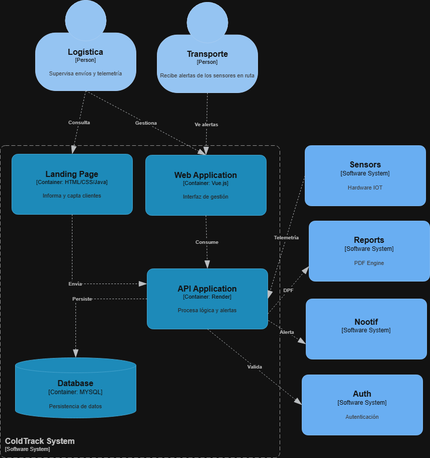
</p>

### 4.6.4. Software Architecture Components Diagram
El Components Diagram describe la organización interna del backend de ColdTrack. Cada componente representa una capacidad del dominio o una responsabilidad técnica necesaria para ejecutar los casos de uso. Los controladores reciben solicitudes HTTP, los servicios de aplicación coordinan los casos de uso, los servicios de dominio contienen reglas de negocio y los repositorios administran la persistencia de los aggregates.

Los componentes más relevantes son los asociados a Shipment Management, Telemetry Monitoring, Alerting, Reporting e Identity and Access. Esta estructura permite mantener una arquitectura modular, donde cada contexto tiene sus propias reglas y evita depender directamente de detalles internos de otros contextos. Por ejemplo, el módulo de alertas puede reaccionar ante lecturas de telemetría sin asumir la lógica completa del envío, mientras que reporting puede consolidar información histórica sin modificar la operación principal.

Esta organización también facilita la trazabilidad entre diseño y construcción. Los flujos validados con usuarios, como consultar el estado de un envío o interpretar una alerta, se reflejan en servicios concretos del backend y en datos persistidos. Así, la arquitectura soporta tanto las necesidades funcionales del producto como los criterios de calidad identificados en las evaluaciones heurísticas: claridad, prevención de errores, historial confiable y acciones oportunas.

<p align="center">
  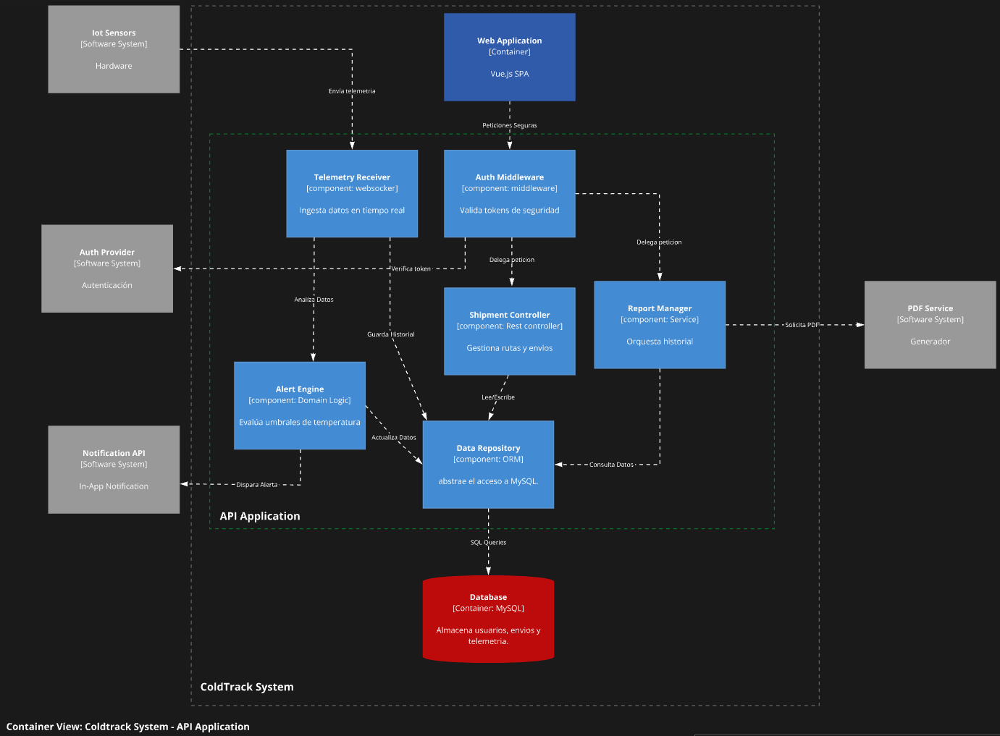
</p>

### Software Architecture Components Diagram — ColdTrack

El Software Architecture Components Diagram de ColdTrack muestra la estructura interna del sistema, identificando los componentes que conforman el API Application, los sistemas externos con los que se integra y el flujo de información entre ellos.
En el centro de la arquitectura se encuentra el ColdTrack System, cuyo backend procesa la telemetría proveniente de los sensores IoT, gestiona los envíos refrigerados, evalúa umbrales de temperatura y facilita la supervisión en tiempo real desde la Web Application.


### El API Application está compuesto por los siguientes componentes:

- **Telemetry Receiver (WebSocket):** recibe e ingesta en tiempo real los datos de temperatura y humedad enviados por los sensores IoT hacia el sistema.
- **Auth Middleware (Middleware):** intercepta todas las peticiones entrantes, valida los tokens de seguridad y delega cada petición al componente correspondiente.
- **Alert Engine (Domain Logic):** evalúa los umbrales de temperatura configurados y genera alertas automáticas cuando se detectan desvíos que pueden comprometer la calidad del producto transportado.
- **Shipment Controller (REST Controller):** gestiona las rutas y el ciclo de vida de los envíos refrigerados, incluyendo su creación, actualización de estado y trazabilidad.
- **Report Manager (Service):** orquesta la generación de reportes históricos de desempeño de la cadena de frío, consultando datos del repositorio y solicitando la producción del documento al servicio externo PDF Service.
- **Data Repository (ORM):** abstrae el acceso a la base de datos MySQL, centralizando todas las operaciones de lectura y escritura del sistema.

### ColdTrack se integra con los siguientes servicios externos:

- **IoT Sensors:** dispositivos de hardware instalados en las unidades de transporte que recopilan y envían datos de temperatura y humedad en tiempo real al Telemetry Receiver.
- **Auth Provider:** proveedor externo de autenticación que verifica los tokens de seguridad en coordinación con el Auth Middleware.
- **Notification API:** servicio externo que recibe las alertas disparadas por el Alert Engine y las entrega como notificaciones in-app al personal correspondiente.
- **PDF Service: generador** externo de documentos utilizado por el Report Manager para producir los reportes de cadena de frío en formato PDF.

### Base de datos

- **Database (MySQL):** contenedor de persistencia responsable de almacenar usuarios, envíos y telemetría de sensores. Recibe todas las operaciones mediante SQL Queries a través del Data Repository.

### Flujo de interacción
El flujo principal inicia cuando los sensores IoT recopilan datos ambientales y envían la telemetría al Telemetry Receiver. Este componente analiza los datos y los deriva al Alert Engine, que evalúa si existe algún desvío de temperatura. De detectarse una alerta, el sistema la dispara hacia la Notification API, que notifica al personal correspondiente.

Paralelamente, toda la información procesada es persistida en la base de datos MySQL a través del Data Repository.
La Web Application permite al personal de logística acceder al sistema mediante peticiones seguras validadas por el Auth Middleware, quien verifica los tokens con el Auth Provider externo y delega cada petición al Shipment Controller o al Report Manager según corresponda.

## 4.7. Software Object-Oriented Design

### 4.7.1. Class Diagrams

<p align="center">
  
</p>

<p align="center">
  
</p>

<p align="center">
  
</p>

<p align="center">
  
</p>

<p align="center">
  
</p>


### 4.7.2. Class Dictionary

A continuación, se detalla el diccionario de clases, el cual describe la responsabilidad y el propósito de las entidades, objetos de valor, agregados y servicios definidos en el diseño orientado a objetos del sistema ColdTrack.

#### 1. Shipment Management (Gestión de Envíos)
Este módulo centraliza la planificación y el estado logístico de los traslados físicos de los alimentos.

| Clase / Interfaz | Estereotipo (DDD) | Descripción y Responsabilidad |
| :--- | :--- | :--- |
| **ShipmentAppService** | Application Service | Orquesta los casos de uso logísticos. Coordina la creación de envíos, la asignación de sensores físicos y la finalización de las rutas, delegando la persistencia al repositorio. |
| **Shipment** | Aggregate Root | Representa un envío físico de alimentos. Gestiona su propio ciclo de vida (estado) y protege la invariante de negocio de que cada envío debe estar asociado a un sensor físico en la ruta. |
| **Route** | Value Object | Encapsula la información de origen y destino del transporte. Al ser inmutable, cualquier cambio en la ruta requiere la creación de un nuevo objeto de valor. |
| **ShipmentId** | Value Object | Identificador único y tipado del envío, evitando errores comunes al usar cadenas de texto (`String`) genéricas. |
| **ShipmentStatus** | Enum | Define los estados posibles del envío: `REGISTERED` (creado), `IN_TRANSIT` (en ruta), `COMPLETED` (finalizado con éxito) y `CANCELLED`. |
| **ShipmentRepository** | Repository | Abstracción de acceso a datos para persistir y recuperar los agregados `Shipment` de la base de datos SQL Server. |

#### 2. Real-Time IoT Monitoring (Monitoreo de Telemetría)
Este contexto está enfocado exclusivamente en la ingesta, validación e hidratación de los datos capturados por el hardware.

| Clase / Interfaz | Estereotipo (DDD) | Descripción y Responsabilidad |
| :--- | :--- | :--- |
| **TelemetryAppService** | Application Service | Expone los puertos de entrada para recibir la data en tiempo real desde los sensores vía WebSockets o API REST, y facilita la consulta del historial de un sensor. |
| **TelemetryStream** | Aggregate Root | Actúa como un contenedor lógico de todas las lecturas de un sensor específico. Garantiza el orden cronológico y la agrupación de los datos durante un viaje. |
| **TelemetryLog** | Entity | Representa una captura de telemetría individual en un momento exacto del tiempo. |
| **Temperature** | Value Object | Encapsula el valor numérico de la temperatura y su unidad (Celsius). Contiene lógica intrínseca para validar si el valor se encuentra dentro de un rango seguro establecido. |
| **Humidity** | Value Object | Encapsula el porcentaje de humedad relativa, validando que el valor matemático ingresado tenga sentido (por ejemplo, entre 0% y 100%). |
| **TelemetryRepository** | Repository | Interfaz encargada de la persistencia de alto rendimiento para el gran volumen de logs de telemetría generados durante la ruta. |

#### 3. Alerting Engine (Motor de Alertas)
Responsable de evaluar anomalías en las condiciones ambientales e interactuar con servicios externos para notificar a los actores.

| Clase / Interfaz | Estereotipo (DDD) | Descripción y Responsabilidad |
| :--- | :--- | :--- |
| **AlertAppService** | Application Service | Ejecuta el flujo de evaluación. Si detecta una anomalía mediante el `ThresholdPolicy`, crea una alerta y coordina con el `NotificationGateway` el envío del mensaje. |
| **Alert** | Aggregate Root | Entidad principal que registra una incidencia crítica (ej. ruptura de cadena de frío). Controla cuándo fue disparada, si el conductor ya la reconoció y si fue resuelta. |
| **ThresholdPolicy** | Domain Service | Contiene la lógica de dominio pura (umbrales permitidos) para determinar si las condiciones de temperatura actuales violan la seguridad alimentaria. |
| **AlertId** | Value Object | Identidad única inmutable de la alerta generada. |
| **AlertType** | Enum | Categoriza la anomalía: `CRITICAL_TEMPERATURE`, `HIGH_HUMIDITY` o `SENSOR_DISCONNECTED`. |
| **AlertStatus** | Enum | Gestiona el ciclo de atención: `TRIGGERED` (disparada), `ACKNOWLEDGED` (vista por el conductor) y `RESOLVED` (solucionada). |
| **NotificationGateway** | Gateway (Interface) | Abstracción (Puerto) para integrarse con servicios externos como Twilio o Firebase para disparar SMS o notificaciones Push. |

#### 4. Analytics & Reporting (Analítica y Reportes)
Módulo encargado de consolidar la información histórica para facilitar la toma de decisiones gerenciales.

| Clase / Interfaz | Estereotipo (DDD) | Descripción y Responsabilidad |
| :--- | :--- | :--- |
| **AnalyticsAppService** | Application Service | Coordina la solicitud de reportes. Filtra el historial de un envío y delega la construcción del archivo físico al motor generador de PDF. |
| **Report** | Aggregate Root | Un consolidado del rendimiento de un envío finalizado. Almacena métricas pre-calculadas (como el total de alertas disparadas) para consultas eficientes. |
| **HistoricalLog** | Entity | Un registro plano, desnormalizado y optimizado para la lectura, diseñado para conformar las filas de datos en los reportes exportables. |
| **DateRange** | Value Object | Encapsula una fecha de inicio y una de fin, garantizando que el inicio no sea posterior al fin del rango temporal. |
| **PdfGeneratorService** | Domain Service | Motor interno que se encarga de formatear la data de dominio y compilarla en un documento PDF descargable. |

#### 5. Identity & Access (Gestión de Identidad y Accesos)
Maneja la seguridad, controlando quién puede interactuar con el sistema según su rol.

| Clase / Interfaz | Estereotipo (DDD) | Descripción y Responsabilidad |
| :--- | :--- | :--- |
| **AuthAppService** | Application Service | Procesa las solicitudes de registro, inicio de sesión y recuperación de contraseña, apoyándose en el `TokenProvider`. |
| **UserAccount** | Aggregate Root | Representa las credenciales y el estado (activo/inactivo) de un trabajador. Controla el acceso basado en sus roles y protege la seguridad de la contraseña cifrada. |
| **EmailAddress** | Value Object | Asegura que toda cadena de texto utilizada como correo electrónico pase una validación de formato (Regex) antes de interactuar con el sistema. |
| **UserRole** | Enum | Define los niveles de acceso del sistema. Principalmente `LOGISTICS_ADMIN` (para el dashboard web) y `DRIVER` (para recibir alertas). |
| **TokenProvider** | Domain Service | Servicio responsable de emitir los JWT (JSON Web Tokens) que las aplicaciones web y móviles usarán para mantener la sesión abierta de manera segura. |

## 4.8. Database Design

En esta sección se presenta el modelo relacional de la base de datos de ColdTrack. El esquema detalla las entidades principales del sistema, sus atributos y las relaciones entre ellas. Este diseño asegura la integridad referencial y soporta los módulos clave definidos en la arquitectura, como la gestión de usuarios, el registro de vehículos, la asignación de sensores y el historial de telemetría y alertas.

### 4.8.1. Database Diagram

<p align="center">
  
</p>


# Capitulo V: Product Implementation, Validation & Deployment

## 5.1. Software Configuration Management

Esta sección describe cómo el equipo gestionó la configuración, versionamiento, convenciones y despliegue de los tres productos digitales que conforman ColdTrack: Landing Page, Web Application y Web Services.

### 5.1.1. Software Development Environment Configuration.

| Categoría | Herramientas | Uso dentro del proyecto |
|---|---|---|
| Product UX/UI Design | Figma, Miro, Lucidchart | Diseño de wireframes, mock-ups, user flows, scenario mapping, event storming y diagramas de arquitectura. |
| Landing Page | HTML5, CSS3, JavaScript | Implementación del sitio informativo, navegación, secciones comerciales, CTA e internacionalización ligera. |
| Web Application | JavaScript, Vue 3.5, Vite, Composition API, Vue Router, Vue I18n, PrimeVue, axios | Implementación de autenticación, dashboard, envíos, sensores, alertas, historial y reportes. |
| Web Services | C#, ASP.NET Core, Entity Framework Core, Swashbuckle/OpenAPI, QuestPDF | Implementación de la API REST, seguridad JWT, persistencia, documentación interactiva y generación de PDF. |
| Persistence | MySQL 8 en Filess.io | Almacenamiento de usuarios, envíos, sensores, telemetría, alertas y reportes. |
| Deployment | GitHub Pages, Firebase Hosting, Render, Docker | Publicación de Landing Page, Web Application y Web Services. |
| Collaboration | Git, GitHub, Trello, Discord | Gestión de ramas, commits, tareas, coordinación y evidencias de colaboración. |

### 5.1.2. Source Code Management

| Producto | Repositorio | Rama estable | Rama de integración | Propósito |
|---|---|---|---|---|
| Landing Page | https://github.com/1ASI0730-2610-10215/Landing-Page | `main` | `develop` | Sitio informativo y punto de entrada hacia la aplicación. |
| Web Application | https://github.com/1ASI0730-2610-10215/ColdTrack-Front | `main` | `develop` | Frontend operativo desplegado en Firebase Hosting. |
| Web Services | https://github.com/1ASI0730-2610-10215/FreshGuard.ColdTrack.Platform | `main` | `develop` | Backend REST desplegado en Render y conectado a MySQL. |
| Project Report | https://github.com/1ASI0730-2610-10215/final-report | `main` | `develop` | Documentación académica y evidencias del proyecto. |

El flujo de trabajo siguió GitFlow. Las ramas `feature/*`, `fix/*` y `hotfix/*` se crean desde `develop`; las versiones estables pasan por `release/*` antes de llegar a `main`; y los commits siguen Conventional Commits para conservar trazabilidad técnica y documental.

### 5.1.3. Source Code Style Guide & Conventions

**Landing Page:** HTML semántico, clases CSS en kebab-case, separación entre `index.html`, `css/styles.css` y `js/script.js`, atributos `aria-*`, foco visible y textos preparados para inglés y español.

**Web Application Vue:** componentes físicos en kebab-case, PrimeVue con prefijo `pv-`, Composition API, organización por bounded contexts de frontend (`iam`, `shipments`, `sensors`, `alerts`, `shared`, `locales`), axios con interceptores JWT y Vue I18n.

**Web Services ASP.NET Core:** arquitectura DDD por bounded contexts, separación Domain/Application/Interfaces/Infrastructure, endpoints REST bajo `/api/v1`, seguridad JWT Bearer, Swagger/OpenAPI, EF Core y MySQL configurado por variables de entorno.

### 5.1.4. Software Deployment Configuration

| Producto | Plataforma | URL pública | Configuración principal |
|---|---|---|---|
| Landing Page | GitHub Pages | https://1asi0730-2610-10215.github.io/Landing-Page/ | Publicación de sitio estático desde GitHub. |
| Web Application | Firebase Hosting | https://coldtrack-front-web.web.app/ | Compilación con Vite y publicación del directorio `dist`. |
| Web Services | Render Web Service | https://freshguard-coldtrack-platform.onrender.com | Contenedor Docker con ASP.NET Core y puerto dinámico de Render. |
| Database | Filess.io | MySQL 8.0.29 | Credenciales gestionadas como variables de entorno y conexión TLS. |

La Web Application usa variables de entorno para separar la URL base y las rutas semánticas de los recursos. El backend utiliza variables protegidas para `DATABASE_HOST`, `DATABASE_PORT`, `DATABASE_NAME`, `DATABASE_USER`, `DATABASE_PASSWORD` y `TokenSettings__Secret`; las credenciales no se versionan en GitHub.

## 5.2. Landing Page, Services & Applications Implementation 

La presente sección documenta la evolución progresiva de ColdTrack desde una primera presencia digital mediante landing page hasta una solución web integrada con servicios backend, persistencia de datos y despliegue público. El objetivo de esta parte del informe es evidenciar cómo el equipo transformó los hallazgos de análisis, diseño UX/UI y arquitectura en entregables funcionales organizados por sprints.

Durante el desarrollo se trabajó en tres frentes principales. Primero, se implementó la landing page como punto de entrada comercial del producto, orientada a comunicar la propuesta de valor: monitoreo en tiempo real para el transporte de alimentos y productos sensibles. Luego, se construyó la Web Application, enfocada en permitir la interacción operativa con envíos, sensores, alertas e historial. Finalmente, se integraron Web Services desplegados, autenticación, persistencia en MySQL y reportes, permitiendo que la solución deje de depender únicamente de datos simulados.

Cada sprint generó evidencias de planificación, desarrollo, ejecución, documentación de servicios, despliegue y colaboración del equipo. De esta manera, la sección permite observar no solo el resultado final del producto, sino también la forma en que se organizaron las tareas, se integraron los módulos y se validó el avance técnico de ColdTrack a lo largo del ciclo de implementación.

### 5.2.1. Sprint 1

El Sprint 1 estuvo orientado a construir la primera versión visible de ColdTrack mediante una landing page funcional. Esta entrega permitió presentar la identidad del producto, explicar el problema de la cadena de frío, comunicar los beneficios de la solución y preparar un punto de contacto inicial para los usuarios interesados. En esta fase, el producto todavía no contaba con una aplicación operativa conectada a servicios, por lo que el énfasis estuvo en la comunicación visual, la estructura informativa y la publicación del sitio.

La landing page fue importante porque conectó los resultados del análisis de negocio con una pieza concreta de comunicación. A través de sus secciones, el equipo pudo expresar la propuesta de valor de FreshGuard, mostrar las funcionalidades esperadas de ColdTrack y establecer una base visual que luego sería coherente con la Web Application. Además, esta entrega permitió practicar el flujo de versionamiento, colaboración y despliegue que se continuaría usando en los sprints posteriores.

#### 5.2.1.1. Sprint Planning 1

El equipo de desarrollo se reunió virtualmente para definir los objetivos, tareas y entregables del primer sprint, el cual tuvo una duración de una semana. El enfoque principal fue el desarrollo y despliegue de la landing page del proyecto en GitHub Pages, asegurando que el producto inicial esté operativo y sirva como base sólida para las siguientes iteraciones.

Durante la planificación se priorizaron tareas relacionadas con la estructura HTML, el diseño responsivo, las secciones informativas, la identidad visual, la accesibilidad básica y la preparación del despliegue. También se distribuyeron responsabilidades entre los integrantes para asegurar que cada sección del sitio pudiera avanzar de manera coordinada y ser integrada en una versión estable.

| Sprint                             | Sprint 1                                                                                                                                                                                     |
| ---------------------------------- | -------------------------------------------------------------------------------------------------------------------------------------------------------------------------------------------- |
|                                    | Sprint Planning Background                                                                                                                                                                   |
| Date                               | 2026/04/17                                                                                                                                                                                   |
| Time                               | 19:28 PM                                                                                                                                                                                     |
| Location                           | El desarrollo de la reunión se hizo virtualmente por medio de Discord                                                                                                                        |
| Prepared By                        | Eslander Celis Berrospi                                                                                                                                                                      |
| Attendees (to planning meeting)    | Eslander Celis Berrospi, Gabriel Mendoza Palacios, Rodrigo Oblitas Alcalde, Aarón Avila Palacios, Mathias Arechaga Saavedra	                                                               |
| Sprint n – 1 Review Summary        | En este primer sprint se asignaron responsabilidades a cada integrante y se planteó los requerimientos para el desarrollo de la Landing Page.                                                |
| Sprint n – 1 Retrospective Summary | En esta sección todos los integrantes mencionaron tener aciertos en partes del código y en otras partes poder mejorar sus habilidades realizando la Landing Page                             |
|                                    |Sprint Goal & User Stories                                                                                                                                                                    |
| Sprint 1 Goal                      | Desarrollar y desplegar la landing page funcional en Github Pages, garantizando que cumpla con los requisitos básicos de diseño, contenido y accesibilidad para servir como base de proyecto |
| Sprint 1 Velocity                  | 8                                                                                                                                                                                            |
| Sum of Story Points                | 8                                                                                                                                                                                            |

#### 5.2.1.2. Aspect Leaders and Collaborators

La organización del Sprint 1 se basó en la asignación de responsabilidades por aspecto. Rodrigo Oblitas asumió el liderazgo de la landing page, mientras que los demás integrantes colaboraron en mejoras visuales, contenido, accesibilidad, optimización y soporte documental. Esta distribución permitió que el trabajo no se concentre únicamente en la implementación técnica, sino también en la claridad del mensaje, la experiencia de navegación y la presentación profesional del producto.


| Team Member | Referencia | Landing Page |
|------------|------------|--------------|
| Rodrigo Oblitas Alcalde | Repositorio `1ASI0730-2610-10215/Landing-Page` | L |
| Eslander Celis | Colaborador de accesibilidad y soporte documental | C |
| Mathias Aréchaga | Colaborador en mejoras visuales del dashboard preview | C |
| Aarón Avila | Colaborador en optimizaciones SEO y metadatos | C |
| Mariano Vilela | Colaborador en secciones visuales y estilos responsivos | C |
| Gabriel Mendoza | Colaborador en mejoras visuales complementarias e iconografía | C |

#### 5.2.1.3. Sprint Backlog 1

El Sprint Backlog 1 se enfocó en construir la Landing Page como primer artefacto público de ColdTrack. Las tareas priorizaron comunicación de valor, navegación informativa, presentación de empresa y equipo, accesibilidad, responsividad, soporte EN/ES y preparación para despliegue.

| Sprint # | User Story Id | User Story Title | Task Id | Task Title | Task Description | Estimation (Hours) | Assigned To | Status |
|---|---|---|---|---|---|---:|---|---|
| Sprint 1 | US-001 | Visualizar propuesta de valor | T01 | Configurar estructura base | Crear `index.html`, carpetas de estilos, scripts e imágenes para la Landing Page. | 2 | Rodrigo Oblitas Alcalde | Done |
| Sprint 1 | US-001 | Visualizar propuesta de valor | T02 | Implementar header y hero | Agregar navegación, logo, propuesta de valor, CTA principal y mensaje inicial. | 3 | Rodrigo Oblitas Alcalde | Done |
| Sprint 1 | US-001 | Visualizar propuesta de valor | T03 | Desarrollar dashboard preview | Mostrar una vista simulada de monitoreo con envíos, temperatura, humedad y estado. | 3 | Mathias Arechaga Saavedra | Done |
| Sprint 1 | US-002 | Navegar secciones informativas | T04 | Implementar secciones del sitio | Agregar características, proceso de funcionamiento, beneficios y CTA final. | 4 | Gabriel Mendoza Palacios | Done |
| Sprint 1 | US-002 | Navegar secciones informativas | T05 | Enlazar documentación | Conectar la sección de documentación con el repositorio público de la Landing Page. | 2 | Eslander Celis Berrospi | Done |
| Sprint 1 | US-003 | Consultar información de empresa y equipo | T06 | Incorporar empresa y equipo | Presentar información de FreshGuard y miembros del equipo. | 3 | Aarón Avila Palacios | Done |
| Sprint 1 | US-004 | Cambiar idioma de interfaz | T07 | Agregar selector EN/ES | Implementar cambio de idioma para textos fijos de la Landing Page. | 3 | Aarón Avila Palacios | Done |
| Sprint 1 | US-002 | Navegar secciones informativas | T08 | Optimizar SEO y accesibilidad | Configurar metadatos, Open Graph, ARIA labels, navegación por teclado y foco visible. | 3 | Eslander Celis Berrospi | Done |
| Sprint 1 | TS-004 | Documentar y desplegar servicios | T09 | Ajustar responsividad y desplegar | Validar escritorio/móvil y publicar la Landing Page en GitHub Pages. | 3 | Rodrigo Oblitas Alcalde | Done |

Link del Trello: https://trello.com/invite/b/69e82f5d88b7df3fa977adbe/ATTId31bae723ab545af9d3a4c721a1b848443078604/sprint-1-freshguard-coldtrack

#### 5.2.1.4. Development Evidence for Sprint Review

El desarrollo del producto se realizó de forma incremental, partiendo desde la configuración inicial del proyecto hasta la incorporación de secciones visuales, estilos responsivos, interacciones y mejoras de accesibilidad. Cada commit permitió registrar una mejora específica y conservar trazabilidad sobre la evolución de la landing page.

Esta evidencia demuestra que el equipo trabajó mediante entregas pequeñas, revisables y alineadas con los objetivos del sprint. A continuación, se presentan algunos de los commits más representativos del proceso:

| Repository | Branch | Commit Id | Commit Message | Commit Message Body | Commited on (Date) |
|------------|--------|-----------|----------------|---------------------|--------------------|
| ColdTrack-Landing | `main` | `5ce9ead8` | `feat: initial project setup` | Se realizó la configuración inicial del proyecto y la estructura base del repositorio para comenzar el desarrollo de la landing page. | 12/05/2025 |
| ColdTrack-Landing | `main` | `0fd39538` | `feat: add basic HTML structure with header` | Se implementó la estructura HTML inicial incluyendo el encabezado principal y navegación base. | 13/05/2025 |
| ColdTrack-Landing | `main` | `b0f9279b` | `feat: add hero section with title and CTA` | Se añadió la sección principal de bienvenida con título descriptivo y botón de llamada a la acción. | 13/05/2025 |
| ColdTrack-Landing | `main` | `be251506` | `feat: add features section` | Se desarrolló la sección de funcionalidades principales del sistema para comunicar el valor del producto. | 14/05/2025 |
| ColdTrack-Landing | `main` | `9da665ca` | `feat: add how it works section` | Se implementó una sección explicativa del funcionamiento general de la plataforma. | 14/05/2025 |
| ColdTrack-Landing | `main` | `d6e284ea` | `feat: add benefits section` | Se agregó la sección de beneficios destacando ventajas competitivas del producto. | 14/05/2025 |
| ColdTrack-Landing | `main` | `388e262f` | `feat: add CTA and footer sections` | Se incorporaron secciones de llamada a la acción y pie de página con enlaces relevantes. | 14/05/2025 |
| ColdTrack-Landing | `main` | `5a9590e7` | `feat: add responsive CSS styles` | Se añadieron estilos responsivos para adaptar la interfaz a distintos tamaños de pantalla. | 15/05/2025 |
| ColdTrack-Landing | `main` | `4708704c` | `feat: link CSS and JavaScript files` | Se enlazaron archivos de estilos y scripts para estructurar mejor el proyecto frontend. | 15/05/2025 |
| ColdTrack-Landing | `main` | `a9e7c80b` | `feat: add JavaScript interactivity` | Se implementó interactividad dinámica usando JavaScript para mejorar la experiencia del usuario. | 15/05/2025 |
| ColdTrack-Landing | `main` | `6b2c0750` | `feat: add SVG icons to header and navigation links` | Se añadieron íconos SVG al encabezado y elementos de navegación para mejorar la estética visual. | 16/05/2025 |
| ColdTrack-Landing | `main` | `eaaddd96` | `feat: add dashboard preview with shipment cards` | Se incorporó una vista previa del dashboard mostrando tarjetas de monitoreo de envíos. | 16/05/2025 |
| ColdTrack-Landing | `main` | `fea423b9` | `feat: add icons to feature cards` | Se agregaron íconos visuales en las tarjetas de funcionalidades para mejorar la claridad visual. | 16/05/2025 |
| ColdTrack-Landing | `main` | `391772c4` | `feat: add icons to benefits section` | Se mejoró la sección de beneficios añadiendo iconografía descriptiva. | 16/05/2025 |
| ColdTrack-Landing | `main` | `648b6747` | `feat: expand footer with additional navigation links and sections` | Se amplió el footer incluyendo nuevas secciones y enlaces de navegación. | 17/05/2025 |
| ColdTrack-Landing | `main` | `725c67d6` | `fix: improve mobile responsiveness and add mobile-specific styles` | Se corrigieron problemas de visualización móvil y se añadieron estilos específicos para celulares. | 17/05/2025 |
| ColdTrack-Landing | `main` | `4bb124b2` | `feat: enhance button interactions with visual effects` | Se añadieron efectos visuales e interacciones a botones para mejorar la usabilidad. | 17/05/2025 |
| ColdTrack-Landing | `main` | `df123a29` | `feat: add SEO meta tags` | Se incorporaron meta tags SEO para mejorar el posicionamiento en motores de búsqueda. | 19/05/2025 |
| ColdTrack-Landing | `main` | `bcceae74` | `feat: add OpenGraph meta tags for social sharing` | Se agregaron etiquetas OpenGraph para optimizar la visualización al compartir en redes sociales. | 19/05/2025 |
| ColdTrack-Landing | `bugfix/accessibility-improvements` | `0cd942ea` | `fix: add ARIA labels for accessibility` | Se añadieron etiquetas ARIA para mejorar la accesibilidad para lectores de pantalla. | 20/05/2025 |
| ColdTrack-Landing | `bugfix/accessibility-improvements` | `39eb78fc` | `fix: add focus styles for keyboard navigation` | Se implementaron estilos de enfoque para facilitar navegación mediante teclado. | 20/05/2025 |
| ColdTrack-Landing | `feature/link-app-company-i18n` | `06db9ba1` | `feat: add landing page internationalization` | Se añadió soporte multilenguaje mediante internacionalización (i18n). | 09/05/2026 |
| ColdTrack-Landing | `feature/link-app-company-i18n` | `c204b7e8` | `fix: set english as default language` | Se configuró inglés como idioma por defecto del sitio. | 09/05/2026 |
| ColdTrack-Landing | `feature/link-app-company-i18n` | `d302619c` | `feat: link app and add company sections` | Se añadieron enlaces a la aplicación y secciones relacionadas a la empresa. | 13/05/2026 |
| ColdTrack-Landing | `develop` | `eebdf90` | `docs: correct i18n framework description` | Se corrigió la descripción técnica de internacionalización. | 14/06/2026 |

#### 5.2.1.5. Execution Evidence for Sprint Review

La implementación final de ColdTrack quedó organizada en una sola página principal compuesta por secciones claramente diferenciadas:

- **Header**: navegación principal con identidad visual del producto.
  
  
  
- **Hero Section**: presentación de la propuesta de valor y botones de llamada a la acción.
  
  
  
- **Dashboard Preview**: simulación visual de monitoreo en tiempo real mediante tarjetas de envíos activos.

  
  
- **Features Section**: exposición de las capacidades principales del sistema.

  
  
- **How It Works Section**: explicación resumida del flujo operativo del producto.

   
  
- **Benefits Section**: presentación de ventajas operativas para el usuario.

   
  
- **CTA Section**: sección final orientada a reforzar el interés en la solución.

  
  
- **Footer**: bloque final con navegación complementaria e información general.

  

Desde el punto de vista técnico, la implementación se concentra en:

- `index.html` como archivo estructural principal,
- `css/styles.css` como archivo de estilos,
- `js/script.js` como archivo de interactividad.

Además, el proyecto incluye una estructura HTML semántica, aproximadamente **595 líneas de CSS** y aproximadamente **97 líneas de JavaScript**, con separación clara entre contenido, presentación y comportamiento.

#### 5.2.1.6. Services Documentation Evidence for Sprint Review

En el Sprint 1 la Landing Page no incorporó un backend propio ni endpoints REST. Sin embargo, sí documentó servicios de navegación y recursos estáticos necesarios para la revisión del producto inicial.

| Recurso o servicio | Tipo | Ubicación | Propósito | Validación |
|---|---|---|---|---|
| Página principal | Documento HTML | `/index.html` | Presentar propuesta de valor, beneficios, equipo y CTA. | Carga correctamente desde GitHub Pages. |
| Estilos globales | Recurso CSS | `/css/styles.css` | Definir layout, responsividad, colores y estados visuales. | Interfaz adaptable a escritorio y móvil. |
| Interacciones | Recurso JavaScript | `/js/script.js` | Gestionar navegación suave, animaciones y comportamiento del sitio. | Navegación entre secciones sin errores. |
| CTA hacia Web Application | Enlace externo | Firebase Hosting | Redirigir desde la landing hacia la aplicación operativa. | Redirección hacia `https://coldtrack-front-web.web.app/`. |
| Documentación del repositorio | Markdown | `/README.md` | Explicar stack, ejecución local y despliegue. | Información disponible para revisión académica. |

La documentación de servicios REST se reservó para los sprints posteriores, cuando la Web Application y los Web Services quedaron implementados.

#### 5.2.1.7. Software Deployment Evidence for Sprint Review

La Landing Page fue publicada mediante GitHub Pages como sitio estático. Este mecanismo fue adecuado para el Sprint 1 porque no requería servidor propio ni base de datos, y permitía entregar una URL pública para validar la propuesta de valor.

| Elemento | Detalle |
|---|---|
| Plataforma de despliegue | GitHub Pages |
| Repositorio fuente | https://github.com/1ASI0730-2610-10215/Landing-Page |
| Rama de publicación | `main` |
| Tipo de aplicación | Sitio web estático HTML, CSS y JavaScript |
| URL pública | https://1asi0730-2610-10215.github.io/Landing-Page/ |
| Validaciones previas | Rutas relativas, carga de imágenes, navegación, CTA, responsive design y accesibilidad básica |

Proceso aplicado para el despliegue: consolidar `main`, verificar `index.html`, configurar GitHub Pages, seleccionar rama/carpeta raíz, esperar la URL pública y validar secciones, estilos, imágenes, CTA y navegación.


#### 5.2.1.8. Team Collaboration Insights during Sprint
Durante el Sprint 1, el equipo se enfocó en implementar las funcionalidades principales de la landing page y en mantener actualizada la documentación del informe. La colaboración se reflejó en la división de tareas, la revisión de avances y la integración progresiva de los cambios en el repositorio.

El trabajo colaborativo permitió que la landing page no solo funcione como una página informativa, sino como una pieza inicial del ecosistema ColdTrack. El equipo coordinó la construcción de secciones, la revisión visual, la incorporación de contenido y la preparación de evidencias para la Sprint Review. Esto permitió consolidar una primera versión presentable y desplegable del producto.

#### Colaboración y Desarrollo de Actividades

1. **Asignación de Tareas**:


2. **Evidencia de commits**:

Repositorio:

**Documento**


**Landing Page**


3. **Evidencia de Network**:

Repositorio:

**Documento**


**Landing Page**


4.**Contributions**

Repositorios:

**Documento**


**Landing Page**


### 5.2.2. Sprint 2

Durante el Sprint 2, el equipo avanzó desde la landing page inicial hacia la integración del ecosistema ColdTrack, incorporando la Web Application desplegada, la conexión con una fake API pública y la actualización de la landing page para redirigir a los usuarios hacia la aplicación operativa. En esta entrega, las evidencias asignadas corresponden a la ejecución funcional de los principales flujos implementados y a la evidencia del despliegue de los productos desarrollados.

Este sprint representó un cambio importante en el alcance del producto, ya que ColdTrack dejó de ser únicamente una propuesta comunicada desde la landing page y pasó a contar con una aplicación web navegable. La Web Application permitió validar flujos esenciales para el negocio, como autenticación, registro de envíos, visualización de sensores, alertas e historial. Aunque los datos aún provenían de una fake API, esta integración fue suficiente para probar la experiencia operativa y preparar la arquitectura de consumo de servicios que se consolidaría en el Sprint 3.

#### 5.2.2.1. Sprint Planning 2. 
El equipo de desarrollo se reunió virtualmente para definir los objetivos, tareas y entregables del segundo sprint, el cual tuvo una duración de una semana. El enfoque principal fue el desarrollo del frontend de la aplicación, implementando las interfaces principales, navegación y componentes necesarios para la interacción del usuario con el sistema.

Durante esta planificación se priorizaron las historias relacionadas con autenticación, registro de envíos, monitoreo desde dashboard, gestión de sensores, alertas e historial. También se acordó utilizar una fake API pública para simular operaciones de lectura y escritura, de modo que el equipo pudiera validar la experiencia de usuario sin esperar la implementación completa del backend. Esta decisión permitió avanzar de manera incremental y reducir riesgos de integración para el siguiente sprint.

| Sprint                             | Sprint 2                                                                                                                                                                                                |
| ---------------------------------- | ------------------------------------------------------------------------------------------------------------------------------------------------------------------------------------------------------- |
|                                    | Sprint Planning Background                                                                                                                                                                              |
| Date                               | 2026/05/01                                                                                                                                                                                              |
| Time                               | 19:30 PM                                                                                                                                                                                                |
| Location                           | El desarrollo de la reunión se hizo virtualmente por medio de Discord                                                                                                                                   |
| Prepared By                        | Eslander Celis Berrospi                                                                                                                                                                                 |
| Attendees (to planning meeting)    | Eslander Celis Berrospi, Gabriel Mendoza Palacios, Rodrigo Oblitas Alcalde, Aarón Avila Palacios                                                      |
| Sprint n – 1 Review Summary        | En el sprint anterior se logró desarrollar y desplegar correctamente la Landing Page en GitHub Pages, cumpliendo con los requisitos básicos establecidos para el proyecto.                             |
| Sprint n – 1 Retrospective Summary | En esta sección los integrantes identificaron mejoras en la organización del código, distribución de tareas y optimización del tiempo para el desarrollo de las interfaces del sistema.               |
|                                    | Sprint Goal & User Stories                                                                                                                                                                             |
| Sprint 2 Goal                      | Desarrollar el frontend funcional de la aplicación, implementando las principales vistas, componentes y navegación necesarias para permitir la interacción inicial de los usuarios con el sistema. |
| Sprint 2 Velocity                  | 12                                                                                                                                                                                                      |
| Sum of Story Points                | 12                                                                                                                                                                                                     |

#### 5.2.2.2. Aspect Leaders and Collaborators

Durante el Sprint 2, el equipo organizó el trabajo tomando como principales aspectos la implementación del frontend de ColdTrack, la integración con datos simulados, la construcción de los módulos funcionales principales y la preparación del despliegue de la Web Application. Para asegurar una mejor coordinación, se definieron líderes por aspecto y colaboradores de apoyo según el alcance de las tareas desarrolladas.

En esta matriz, `L` representa al líder del aspecto y `C` representa a los colaboradores que participaron en la implementación, revisión o integración de dicho aspecto.

| Team Member | GitHub Username | Frontend Setup & Routing | Authentication | Shipments Management | Dashboard & Fake API | Sensors Module | Alerts Module | History & i18n | Deployment & Integration |
|-------------|-----------------|--------------------------|----------------|----------------------|----------------------|----------------|---------------|----------------|--------------------------|
| Avila Palacios, Aarón | u201823654 | C | L | C | L | C | L | L | C |
| Oblitas Alcalde, Rodrigo | rodri-ob | L | C | L | C | L | C | C | L |
| Celis Berrospi, Eslander | Eslander-Celis | C | C | L | C | C | C | L | C |
| Mendoza Palacios, Gabriel | GabrielMendoza18 | C | C | C | L | C | C | C | C |
| Arechaga Saavedra, Mathias | mathiasarechaga62 | C | C | C | C | C | L | C | C |

La asignación de liderazgo se relaciona con la organización del Sprint Backlog 2: Aarón lideró los aspectos vinculados con autenticación, dashboard, alertas, historial e internacionalización, mientras que Rodrigo lideró la configuración base, la gestión de envíos, sensores y despliegue. Además, Eslander asumió liderazgo en actividades de gestión de envíos e historial, Gabriel en la integración con la fake API y soporte de datos del dashboard, y Mathias en la definición visual de alertas. Todos los integrantes también colaboraron en la revisión, documentación, pruebas funcionales e integración de los módulos.

#### 5.2.2.3. Sprint Backlog 2

El Sprint Backlog 2 se enfocó en la construcción de la Web Application con Vue 3 y en la primera integración de datos mediante una fake API pública. En este incremento se priorizaron autenticación visual, navegación protegida, módulos operativos, internacionalización, exportación inicial y despliegue en Firebase Hosting.

| Sprint # | User Story Id | User Story Title | Task Id | Task Title | Task Description | Estimation (Hours) | Assigned To | Status |
|---|---|---|---|---|---|---:|---|---|
| Sprint 2 | US-005 | Crear cuenta | T01 | Implementar vista Sign Up | Crear formulario de registro con rol, validación visual y navegación hacia Sign In. | 3 | Rodrigo Oblitas Alcalde | Done |
| Sprint 2 | US-006 | Iniciar sesión | T02 | Implementar vista Sign In | Crear formulario de acceso, credenciales demo y redirección al dashboard. | 3 | Rodrigo Oblitas Alcalde | Done |
| Sprint 2 | US-007 | Mantener sesión segura | T03 | Configurar rutas protegidas | Restringir vistas internas hasta contar con sesión activa. | 2 | Aarón Avila Palacios | Done |
| Sprint 2 | US-008 | Cerrar sesión | T04 | Agregar acción Sign Out | Limpiar sesión local y retornar a la vista de inicio de sesión. | 2 | Aarón Avila Palacios | Done |
| Sprint 2 | US-009 | Registrar envío | T05 | Crear formulario New Shipment | Capturar destino, conductor, carga, fecha de salida y llegada estimada. | 4 | Rodrigo Oblitas Alcalde | Done |
| Sprint 2 | US-010 | Consultar dashboard de envíos | T06 | Construir dashboard | Mostrar tarjetas de indicadores, alertas activas y tabla de envíos. | 4 | Aarón Avila Palacios | Done |
| Sprint 2 | US-011 | Ver detalle del envío | T07 | Preparar acción View details | Incorporar acción en tabla para abrir detalle de envío en futuras integraciones. | 2 | Mathias Arechaga Saavedra | Done |
| Sprint 2 | US-013 | Consultar historial de envíos | T08 | Implementar módulo History | Consultar envíos completados y métricas principales desde datos simulados. | 3 | Eslander Celis Berrospi | Done |
| Sprint 2 | US-014 | Registrar y consultar sensores | T09 | Implementar módulo Sensors | Mostrar sensores, estado, lectura y acciones disponibles. | 4 | Rodrigo Oblitas Alcalde | Done |
| Sprint 2 | US-018 | Visualizar y filtrar alertas | T10 | Implementar módulo Alerts | Mostrar alertas por severidad y estado con filtros básicos. | 4 | Aarón Avila Palacios | Done |
| Sprint 2 | US-022 | Generar reporte PDF | T11 | Preparar acción de exportación | Incorporar botones de exportación iniciales para futuras integraciones. | 2 | Aarón Avila Palacios | Done |
| Sprint 2 | US-004 | Cambiar idioma de interfaz | T12 | Implementar Vue I18n | Traducir navegación, títulos, formularios, tablas y footer. | 4 | Aarón Avila Palacios | Done |
| Sprint 2 | TS-003 | Integrar frontend con backend productivo | T13 | Configurar MockAPI temporal | Usar `.env.development` y `.env.production` para consumir recursos simulados. | 3 | Gabriel Mendoza Palacios | Done |
| Sprint 2 | TS-004 | Documentar y desplegar servicios | T14 | Publicar en Firebase Hosting | Compilar con Vite y desplegar la Web Application. | 3 | Rodrigo Oblitas Alcalde | Done |

#### 5.2.2.4. Development Evidence for Sprint Review

| Repository | Branch | Commit Id | Commit Message | Commit Message Body | Committed on (Date) |
|---|---|---|---|---|---|
| ColdTrack-Front | `main` | `ba713ca` | `chore: initialize clean Vue project` | Se inicializó el proyecto Vue con Vite. | 12/05/2026 |
| ColdTrack-Front | `feature/dashboard-module` | `8ecbb74` | `feat: add fake api and dashboard module` | Se agregó la fake API y el dashboard inicial. | 12/05/2026 |
| ColdTrack-Front | `feature/sign-in-new-shipment` | `517cd52` | `feat: add sign in and shipment registration views` | Se desarrollaron inicio de sesión y registro de envíos. | 12/05/2026 |
| ColdTrack-Front | `feature/sign-up-sensors` | `3ed397f` | `feat: add account creation and sensors module` | Se implementaron creación de cuenta y sensores. | 12/05/2026 |
| ColdTrack-Front | `feature/alerts` | `acd14fd` | `feat: add alerts module` | Se agregó la vista de alertas. | 12/05/2026 |
| ColdTrack-Front | `develop/history-module` | `ff63f97` | `feat: add history view, i18n` | Se añadió historial e internacionalización. | 13/05/2026 |
| ColdTrack-Front | `main` | `f8ef8a9` | `chore: configure environment api endpoints` | Se configuraron endpoints por variables de entorno. | 13/05/2026 |
| ColdTrack-Front | `develop` | `4580feb` | `feat(iam): integrate backend JWT authentication` | Se preparó la autenticación para el backend productivo. | 19/06/2026 |
| ColdTrack-Front | `develop` | `594e46a` | `feat(shipments): integrate backend dashboard and shipment flows` | Se conectaron dashboard y envíos con la API. | 19/06/2026 |
| ColdTrack-Front | `develop` | `eac32f8` | `feat(sensors): integrate assignments and telemetry workflows` | Se integraron sensores, asignaciones y telemetría. | 19/06/2026 |
| ColdTrack-Front | `develop` | `9366e3d` | `feat(analytics): integrate alerts history and PDF reports` | Se integraron alertas, historial, analítica y reportes PDF. | 19/06/2026 |
| ColdTrack-Front | `develop` | `ad9def6` | `feat(shipments): add details status updates and PDF exports` | Se agregó detalle de envíos, actualización de estado y exportación PDF. | 19/06/2026 |
| ColdTrack-Front | `develop` | `d3911c1` | `feat(iam): strengthen session guard and request interceptors` | Se reforzó el guard de sesión y los interceptores HTTP. | 23/06/2026 |

#### 5.2.2.5. Execution Evidence for Sprint Review

La ejecución del Sprint 2 se centró en validar que la solución ColdTrack pueda ser utilizada como una aplicación web funcional para la gestión de envíos refrigerados. La aplicación implementada permite iniciar sesión, registrar usuarios, administrar envíos, consultar sensores, revisar alertas y visualizar historial de envíos completados. Además, la landing page fue actualizada para conectar sus call-to-action con la Web Application desplegada en Firebase.

Las principales funcionalidades ejecutadas y validadas durante el Sprint 2 fueron las siguientes:

- **Inicio de sesión**: la aplicación presenta una vista inicial de autenticación y permite ingresar con el usuario de demostración registrado en la fuente de datos. Este flujo restringe el acceso a las vistas internas hasta que exista una sesión activa.

  

- **Creación de cuenta**: la aplicación permite registrar nuevos usuarios mediante el formulario de creación de cuenta. Los datos ingresados se envían a la fake API configurada, permitiendo simular el almacenamiento de usuarios.

  

- **Dashboard de envíos**: luego de iniciar sesión, el usuario accede al dashboard principal, donde se visualizan métricas de envíos, alertas activas y una tabla con información operativa de los envíos registrados.

  

- **Registro de nuevo envío**: la aplicación permite crear un nuevo envío ingresando destino, conductor asignado, descripción de carga, fecha de salida y llegada estimada. Esta funcionalidad permite alimentar la fuente de datos desde la interfaz web.

  

- **Gestión de sensores**: se implementó una vista para revisar sensores registrados, su estado de asignación, última lectura, temperatura, humedad y acción disponible. También se incorporó la opción de registrar nuevos sensores.

  

- **Sistema de alertas**: la aplicación muestra alertas generadas por variaciones críticas o de advertencia, permitiendo filtrar por severidad y estado. Esta vista facilita el monitoreo de incidencias durante el transporte.

  

- **Historial de envíos**: se incorporó una vista de historial para revisar envíos completados, temperatura promedio, humedad promedio y alertas generadas.

  

- **Internacionalización de interfaz**: se validó el cambio de idioma entre inglés y español mediante el selector `EN | ES`, afectando textos fijos de navegación, formularios, títulos, etiquetas y footer.

  

- **Integración Landing Page - Web Application**: la landing page fue actualizada para que sus botones de acción redirijan hacia la aplicación web desplegada, manteniendo continuidad entre la presentación comercial del producto y el uso de la plataforma.

  

Desde el punto de vista técnico, la Web Application se implementó con JavaScript y Vue 3, utilizando Composition API, Vue Router, Vue I18n, PrimeVue y axios. La aplicación consume recursos desde una fake API expuesta públicamente, lo que permite validar el flujo de lectura y registro de información sin depender todavía de un backend propio.

#### 5.2.2.6. Services Documentation Evidence for Sprint Review

Durante el Sprint 2, ColdTrack aún no incorporó un backend propio completamente implementado. Sin embargo, para validar la comunicación entre la Web Application y una fuente de datos externa, el equipo configuró una fake API pública mediante MockAPI.io. Esta API permitió simular servicios REST para los principales recursos del sistema y validar operaciones de lectura y registro desde el frontend desplegado.

La Web Application consume los servicios desde la siguiente URL base:

- Base URL: https://6a0490212afe8349b4b6d716.mockapi.io/api/v1
- Plataforma: MockAPI.io
- Tipo de servicio: Fake REST API
- Formato de intercambio: JSON

Los recursos configurados para el Sprint 2 fueron los siguientes:

| Resource | Endpoint | HTTP Methods Used | Purpose |
|----------|----------|-------------------|---------|
| Users | `/users` | `GET`, `POST` | Permite consultar usuarios de prueba y registrar nuevas cuentas desde la aplicación. |
| Shipments | `/shipments` | `GET`, `POST` | Permite listar envíos activos y registrar nuevos envíos refrigerados. |
| Drivers | `/drivers` | `GET` | Permite consultar conductores disponibles para asignarlos a los envíos. |
| Sensors | `/sensors` | `GET`, `POST` | Permite visualizar sensores disponibles y registrar nuevos sensores IoT simulados. |
| Alerts | `/alerts` | `GET` | Permite consultar alertas asociadas a variaciones de temperatura o humedad. |

La documentación de estos servicios permitió conectar los módulos principales de la Web Application con datos simulados. El módulo de autenticación utiliza el recurso `users`, el dashboard y la vista de historial consumen información de `shipments`, la creación de envíos se apoya en `drivers`, la gestión de sensores utiliza `sensors` y la vista de alertas consulta el recurso `alerts`.


Además, se configuraron variables de entorno para separar el consumo de datos entre desarrollo y producción. Durante el desarrollo local se utilizó una fuente local basada en `db.js` o JSON Server, mientras que en producción la aplicación consume la fake API pública de MockAPI.io.

| Environment | API Source | Purpose |
|-------------|------------|---------|
| Development | `http://localhost:3000` | Pruebas locales con datos simulados. |
| Production | `https://6a0490212afe8349b4b6d716.mockapi.io/api/v1` | Consumo público de datos desde la Web Application desplegada. |


Esta documentación de servicios evidencia que, aunque el backend propio será desarrollado en una iteración posterior, el equipo ya validó la integración inicial entre frontend y servicios REST simulados. Esto permitió probar los flujos principales de ColdTrack, reducir riesgos técnicos y preparar la arquitectura para una futura migración hacia Web Services propios.

#### 5.2.2.7. Software Deployment Evidence for Sprint Review

Durante el Sprint 2 se completó el despliegue de los principales productos de software del ecosistema ColdTrack: la landing page, la Web Application y la fake API utilizada como fuente de datos para la aplicación. Estos despliegues permiten validar públicamente la navegación entre productos, el consumo de datos y el funcionamiento de los flujos principales.

**Landing Page Deployment**

La landing page se mantiene desplegada mediante **GitHub Pages**, utilizando el repositorio de la organización como fuente del sitio estático. En el Sprint 2 se actualizó para enlazar sus call-to-action con la aplicación web desplegada.

- Repositorio: https://github.com/1ASI0730-2610-10215/Landing-Page
- URL desplegada: https://1asi0730-2610-10215.github.io/Landing-Page/
- Rama de despliegue: `main`
- Plataforma: GitHub Pages


**Web Application Deployment**

La Web Application de ColdTrack fue desplegada mediante **Firebase Hosting**, permitiendo acceso público a la interfaz operativa de la plataforma. La aplicación contiene los módulos de autenticación, dashboard, registro de envíos, sensores, alertas, historial e internacionalización.

- Repositorio: https://github.com/1ASI0730-2610-10215/ColdTrack-Front
- URL desplegada principal: https://coldtrack-front-web.web.app/
- URL alternativa: https://coldtrack-front-web.firebaseapp.com/
- Plataforma: Firebase Hosting
- Comando de construcción: `npm run build`
- Carpeta pública de despliegue: `dist`
- Configuración SPA: redirección de rutas hacia `index.html`


**Fake API Deployment**

Para simular la persistencia y consulta de datos, se configuró una fake API pública en **MockAPI.io**. Esta API funciona como reemplazo desplegado del `db.js` local durante las pruebas de producción, permitiendo consumir recursos como usuarios, envíos, conductores, sensores y alertas desde la Web Application.

- URL base: https://6a0490212afe8349b4b6d716.mockapi.io/api/v1
- Plataforma: MockAPI.io
- Recursos esperados:
  - `/users`
  - `/shipments`
  - `/drivers`
  - `/sensors`
  - `/alerts`


**Configuración de entorno para despliegue**

La Web Application utiliza variables de entorno para separar la configuración de desarrollo y producción:

- `.env.development`: apunta al entorno local `http://localhost:3000`
- `.env.production`: apunta al endpoint público de MockAPI.io

De esta forma, el equipo puede ejecutar la aplicación localmente con JSON Server durante el desarrollo y compilarla para producción consumiendo la fake API desplegada.


**Pasos de despliegue ejecutados**

1. Se integraron los cambios de la aplicación en el repositorio `ColdTrack-Front` siguiendo GitFlow.
2. Se configuraron variables de entorno para diferenciar desarrollo local y producción.
3. Se ejecutó el build de producción con `npm run build`.
4. Se configuró Firebase Hosting usando la carpeta `dist` como salida pública.
5. Se habilitó el comportamiento de single-page application para redirigir rutas internas hacia `index.html`.
6. Se desplegó la aplicación en Firebase Hosting.
7. Se configuraron los recursos necesarios en MockAPI.io para simular el backend.
8. Se actualizó la landing page para enlazar con la aplicación desplegada.
9. Se validó el acceso público a la landing page y a la Web Application.

Con estos despliegues, ColdTrack cuenta con una landing page pública, una Web Application accesible en la nube y una fake API disponible para validar los flujos principales desarrollados en el Sprint 2.

#### 5.2.2.8. Team Collaboration Insights during Sprint

<p>
Durante el Sprint 2, los analíticos de colaboración del repositorio ColdTrack-Front evidencian la participación de los integrantes del equipo sobre el código de la aplicación web ColdTrack. A lo largo del sprint se registran commits asociados a la configuración inicial del proyecto con Vue.js, así como a la implementación de los módulos de dashboard, autenticación, registro de envíos, gestión de sensores, alertas e historial. Esta actividad confirma que la construcción de la Web Application (Frontend) se realizó de forma incremental, alineada a los objetivos definidos en el Sprint 2 Goal.
</p>


<p>
El Network Graph correspondiente al Sprint 2 muestra un uso activo del flujo de trabajo basado en GitFlow, con ramas de características (features como <code>feature/dashboard-module</code>, <code>feature/alerts</code>, <code>feature/sign-in-new-shipment</code>) creadas para la interfaz y componentes, que luego son fusionadas a la rama <code>develop</code> y posteriormente integradas tras el desarrollo. Este patrón de ramas indica que los integrantes coordinaron el trabajo de forma estructurada, alineados con las prácticas definidas para el proyecto (feature branches y consolidación en develop), reforzando la trazabilidad y la calidad del código entregado durante el sprint.
</p>


<p>
En conjunto, la evidencia recopilada en el repositorio demuestra que el equipo mantuvo una dinámica de trabajo constante conforme avanzaban las fechas de integración de los distintos módulos de la aplicación. La consolidación exitosa de las vistas y componentes sugiere un alto nivel de organización para preparar la Sprint Review. Estos analíticos y la correcta ejecución del GitFlow confirman que, durante el Sprint 2, los miembros del equipo participaron efectivamente en la implementación de la Web Application (Frontend) según el alcance establecido, cumpliendo con el principio de trabajo colaborativo.
</p>

### 5.2.3. Sprint 3

El Sprint 3 tuvo como objetivo consolidar ColdTrack como una solución integrada de extremo a extremo. A diferencia del Sprint 2, donde la Web Application consumía datos simulados, en esta etapa se implementaron Web Services propios con ASP.NET Core, persistencia en MySQL, autenticación con JWT, documentación mediante Swagger/OpenAPI y despliegue del backend en Render. Esta evolución permitió conectar la interfaz web con servicios reales y conservar la información operativa del sistema.

La prioridad del sprint fue integrar los bounded contexts definidos en la arquitectura: IAM para identidad y acceso, Shipments para gestión de envíos, Telemetry para sensores y lecturas, Alerting para incidencias, y Reporting/Analytics para historial y reportes. Con ello, el equipo pudo validar flujos más cercanos a un escenario productivo, como iniciar sesión, crear envíos, asociar sensores, registrar lecturas, generar alertas, consultar historial y descargar reportes.

Además de la implementación técnica, el Sprint 3 fortaleció la trazabilidad del proyecto mediante evidencias de desarrollo, ejecución, servicios documentados, despliegue y colaboración. Esta etapa fue clave para demostrar que ColdTrack podía funcionar como un ecosistema compuesto por frontend, backend y base de datos, manteniendo una separación clara entre responsabilidades y una base preparada para futuras iteraciones.

#### 5.2.3.1. Sprint Planning 3
La planificación del Sprint 3 se enfocó en cerrar la brecha entre la Web Application desarrollada en el Sprint 2 y una solución backend funcional. Para ello, el equipo priorizó tareas relacionadas con autenticación, persistencia, servicios REST, despliegue, documentación de endpoints y validación de flujos integrados.

En esta etapa se buscó asegurar que cada módulo técnico respondiera a una necesidad del negocio: gestión de envíos para trazabilidad logística, telemetría para monitoreo ambiental, alertas para reacción oportuna y reportes para control de calidad. La planificación también consideró la coordinación entre repositorios, variables de entorno, despliegue en servicios externos y verificación posterior de disponibilidad.

| Sprint                             | Sprint 3                                                                                                                                                                                                                                                                                                                              |
| ---------------------------------- |---------------------------------------------------------------------------------------------------------------------------------------------------------------------------------------------------------------------------------------------------------------------------------------------------------------------------------------|
|                                    | Sprint Planning Background                                                                                                                                                                                                                                                                                                            |
| Date                               | 2026/06/01                                                                                                                                                                                                                                                                                                                            |
| Time                               | 19:30 PM                                                                                                                                                                                                                                                                                                                              |
| Location                           | El desarrollo de la reunión se hizo virtualmente por medio de Discord                                                                                                                                                                                                                                                                 |
| Prepared By                        | Eslander Celis Berrospi                                                                                                                                                                                                                                                                                                               |
| Attendees (to planning meeting)    | Eslander Celis Berrospi, Gabriel Mendoza, Rodrigo Oblitas Alcalde, Aarón Avila Palacios, Mathias Aréchaga Saavedra                                                                                                                                                                                                                    |
| Sprint n – 1 Review Summary        | En el Sprint 2 se desarrolló exitosamente el frontend de la aplicación, implementando las principales vistas, componentes y mecanismos de navegación necesarios para la interacción de los usuarios con el sistema.                                                                                                                   |
| Sprint n – 1 Retrospective Summary | Durante la retrospectiva del Sprint 2, el equipo identificó oportunidades de mejora en la integración entre frontend y backend, la organización del código y la distribución de tareas para optimizar el desarrollo del proyecto.                                                                                                     |
|                                    | Sprint Goal & User Stories                                                                                                                                                                                                                                                                                                            |
| Sprint 3 Goal                      | Implementar nuevas historias de usuario relacionadas con el backend, iniciar el desarrollo de la API REST, configurar mecanismos de autenticación, establecer procedimientos para el reporte y monitoreo de servicios backend, y continuar con las tareas pendientes del frontend para lograr una integración progresiva del sistema. |
| Sprint 3 Velocity                  | 14                                                                                                                                                                                                                                                                                                                                    |
| Sum of Story Points                | 14                                                                                                                                                                                                                                                                                                                                    |

#### 5.2.3.2. Aspect Leaders and Collaborators

Durante el Sprint 3, el equipo organizó el trabajo tomando como principales aspectos la implementación del backend de ColdTrack utilizando ASP.NET Core, la configuración de la persistencia con MySQL, la construcción de los servicios de dominio (IAM, Shipments, Telemetry, Alerting, Reporting) y la preparación del despliegue en Render y Filess.io. Para asegurar una mejor coordinación, se definieron líderes por aspecto y colaboradores de apoyo según el alcance de las tareas desarrolladas.

En esta matriz, `L` representa al líder del aspecto y `C` representa a los colaboradores que participaron en la implementación, revisión o integración de dicho aspecto.

| Team Member | GitHub Username | Backend Setup & DDD | IAM & Auth | Shipments API | Telemetry & Sensors | Alerting Engine | Analytics & Reports | DB & Deployment |
|-------------|-----------------|---------------------|------------|---------------|---------------------|-----------------|---------------------|-----------------|
| Avila Palacios, Aarón | AaronAvilap | C | C | C | C | L | C | C |
| Oblitas Alcalde, Rodrigo | Darkdren | L | L | C | C | C | C | L |
| Celis Berrospi, Eslander | Eslander-Celis | C | C | C | L | C | C | C |
| Mendoza Palacios, Gabriel | Gabriel2349 | C | C | C | C | C | L | C |
| Arechaga Saavedra, Mathias | MathZell | C | C | L | C | C | C | C |

La asignación de liderazgo se relaciona con la organización del Sprint Backlog 3: Rodrigo lideró los aspectos vinculados con la configuración base del backend en ASP.NET Core, autenticación (IAM) y el despliegue de los Web Services y base de datos. Mathias asumió el liderazgo en la gestión de envíos (Shipments API), Eslander en la integración de sensores y soporte de datos de telemetría, Aarón en la definición de reglas de validación y políticas del motor de alertas, y Gabriel en los reportes analíticos. Todos los integrantes también colaboraron en la revisión, documentación, pruebas funcionales e integración de los módulos del backend.

#### 5.2.3.3. Sprint Backlog 3

El Sprint Backlog 3 consolidó la integración del ecosistema ColdTrack: backend ASP.NET Core, persistencia MySQL, documentación Swagger, conexión del frontend con Render, despliegue productivo y reportes PDF. Las historias seleccionadas corresponden a los flujos de negocio que requerían persistencia real, seguridad JWT y comunicación completa entre Firebase Hosting, Render y Filess.io.

| Sprint # | User Story Id | User Story Title | Task Id | Task Title | Task Description | Estimation (Hours) | Assigned To | Status |
|---|---|---|---|---|---|---:|---|---|
| Sprint 3 | US-005 | Crear cuenta | T01 | Implementar endpoints de autenticación | Crear sign-up, validaciones de correo, contraseña y persistencia de usuario. | 6 | Rodrigo Oblitas Alcalde | Done |
| Sprint 3 | US-006 | Iniciar sesión | T02 | Implementar emisión de JWT | Validar credenciales y retornar token con datos del usuario autenticado. | 5 | Rodrigo Oblitas Alcalde | Done |
| Sprint 3 | US-007 | Mantener sesión segura | T03 | Configurar JWT Bearer y Swagger | Proteger endpoints, agregar interceptores axios y permitir pruebas autorizadas desde Swagger. | 4 | Rodrigo Oblitas Alcalde | Done |
| Sprint 3 | US-009 | Registrar envío | T04 | Implementar Shipments API | Crear agregado Shipment, persistencia y endpoint POST. | 5 | Mathias Arechaga Saavedra | Done |
| Sprint 3 | US-010 | Consultar dashboard de envíos | T05 | Integrar dashboard con backend | Exponer consultas de envíos, indicadores y alertas activas para el dashboard. | 5 | Aarón Avila Palacios | Done |
| Sprint 3 | US-011 | Ver detalle del envío | T06 | Integrar detalle técnico en frontend | Consultar envío por identificador y relacionar sensor asignado y alertas asociadas. | 4 | Aarón Avila Palacios | Done |
| Sprint 3 | US-012 | Actualizar estado de envío | T07 | Implementar PATCH de estado | Actualizar ciclo de vida del envío y reflejarlo en historial cuando corresponda. | 4 | Mathias Arechaga Saavedra | Done |
| Sprint 3 | US-013 | Consultar historial de envíos | T08 | Implementar Shipment History | Consultar envíos completados desde Analytics API y mostrarlos en History. | 4 | Gabriel Mendoza Palacios | Done |
| Sprint 3 | US-014 | Registrar y consultar sensores | T09 | Implementar Sensors API | Registrar y listar sensores con modelo, estado de asignación y última lectura. | 4 | Eslander Celis Berrospi | Done |
| Sprint 3 | US-015 | Asignar sensor a envío | T10 | Implementar asignación | Vincular sensor disponible con envío existente y evitar asignaciones duplicadas. | 3 | Eslander Celis Berrospi | Done |
| Sprint 3 | US-016 | Registrar lectura de telemetría | T11 | Implementar Telemetry API | Registrar temperatura, humedad y fecha de lectura. | 5 | Eslander Celis Berrospi | Done |
| Sprint 3 | US-017 | Consultar lecturas de telemetría | T12 | Exponer historial de telemetría | Listar lecturas registradas para un envío específico. | 3 | Eslander Celis Berrospi | Done |
| Sprint 3 | US-018 | Visualizar y filtrar alertas | T13 | Implementar Alerting API | Listar alertas por estado y severidad. | 4 | Aarón Avila Palacios | Done |
| Sprint 3 | US-019 | Reconocer alerta | T14 | Implementar acknowledgment | Marcar alertas activas como reconocidas desde API y frontend. | 3 | Aarón Avila Palacios | Done |
| Sprint 3 | US-020 | Resolver alerta | T15 | Implementar resolution | Cerrar alertas atendidas y actualizar su estado. | 3 | Aarón Avila Palacios | Done |
| Sprint 3 | US-021 | Consultar analítica del dashboard | T16 | Implementar Analytics API | Consultar indicadores consolidados de envíos, alertas y desempeño. | 4 | Gabriel Mendoza Palacios | Done |
| Sprint 3 | US-022 | Generar reporte PDF | T17 | Implementar Reporting API | Generar y descargar PDF mediante QuestPDF desde frontend y Swagger. | 5 | Gabriel Mendoza Palacios | Done |
| Sprint 3 | TS-002 | Configurar persistencia MySQL | T18 | Configurar Filess.io | Provisionar MySQL, variables de entorno, TLS y migraciones EF Core. | 4 | Rodrigo Oblitas Alcalde | Done |
| Sprint 3 | TS-001 | Implementar API REST versionada | T19 | Publicar Swagger/OpenAPI | Documentar endpoints en `/swagger/index.html` y aplicar seguridad Bearer. | 3 | Rodrigo Oblitas Alcalde | Done |
| Sprint 3 | TS-003 | Integrar frontend con backend productivo | T20 | Reemplazar MockAPI | Actualizar variables de entorno y servicios axios hacia Render. | 5 | Aarón Avila Palacios | Done |
| Sprint 3 | TS-004 | Documentar y desplegar servicios | T21 | Desplegar API y frontend | Publicar backend en Render, frontend en Firebase Hosting y validar URLs públicas. | 5 | Rodrigo Oblitas Alcalde | Done |

Link del Trello: https://trello.com/b/IcxxPY0t/sprint-backlog-3-coldtrack

#### 5.2.3.4. Development Evidence for Sprint Review

| Repository | Branch | Commit Id | Commit Message | Commit Message Body | Committed on (Date) |
|---|---|---|---|---|---|
| FreshGuard.ColdTrack.Platform | `feature/iam-authentication` | `00e489f6` | `feat(iam): add email and authentication security tests` | Se agregaron validaciones y pruebas de seguridad para IAM. | 13/06/2026 |
| FreshGuard.ColdTrack.Platform | `feature/create-shipment` | `c59d4007` | `feat(shipments): add shipment domain errors` | Se incorporaron errores de dominio para envíos. | 13/06/2026 |
| FreshGuard.ColdTrack.Platform | `feature/get-shipments` | `0fb3b8d3` | `feat(shipments): implement shipment query service` | Se implementaron consultas de envíos. | 13/06/2026 |
| FreshGuard.ColdTrack.Platform | `feature/update-shipment-status` | `cabbc1a8` | `feat(shipments): implement shipment command service` | Se agregó actualización del ciclo de vida. | 13/06/2026 |
| FreshGuard.ColdTrack.Platform | `feature/register-sensor` | `cb855649` | `feat(telemetry): add sensor repository contract` | Se preparó persistencia de sensores. | 13/06/2026 |
| FreshGuard.ColdTrack.Platform | `feature/record-telemetry` | `95cec308` | `feat(telemetry): implement telemetry command service` | Se registraron lecturas de telemetría. | 13/06/2026 |
| FreshGuard.ColdTrack.Platform | `feature/alerting-api` | `e4ae8e61` | `feat(alerting): add alert lifecycle endpoints` | Se implementó ciclo de vida de alertas. | 13/06/2026 |
| FreshGuard.ColdTrack.Platform | `feature/analytics-api` | `3283e03` | `feat(analytics): add analytics and reporting endpoints` | Se agregaron endpoints de analítica y reportes. | 13/06/2026 |
| FreshGuard.ColdTrack.Platform | `feature/pdf-report` | `e5116149` | `feat(reporting): implement QuestPDF report generation` | Se implementó generación de PDF. | 13/06/2026 |
| FreshGuard.ColdTrack.Platform | `feature/database-initialization` | `fe7645d` | `feat(shared): add safe database initialization seed` | Se agregó carga inicial controlada para demo. | 16/06/2026 |
| FreshGuard.ColdTrack.Platform | `feature/render-deployment` | `343700f` | `chore(deploy): add Render deployment support` | Se preparó despliegue en Render con Docker. | 16/06/2026 |
| FreshGuard.ColdTrack.Platform | `feature/allow-mysql-user-variables` | `0211bf3` | `fix(persistence): allow MySQL migration user variables` | Se corrigió compatibilidad de migraciones con Filess.io. | 16/06/2026 |
| FreshGuard.ColdTrack.Platform | `feature/fix-swagger-bearer-security` | `1c0a3aa` | `fix(api): apply bearer security to Swagger operations` | Se aplicó seguridad Bearer en Swagger. | 16/06/2026 |
| ColdTrack-Front | `feature/backend-iam-integration` | `4580feb` | `feat(iam): integrate backend JWT authentication` | Se reemplazó autenticación simulada por JWT del backend. | 19/06/2026 |
| ColdTrack-Front | `feature/backend-shipments-dashboard` | `594e46a` | `feat(shipments): integrate backend dashboard and shipment flows` | Se conectaron dashboard y envíos con Render. | 19/06/2026 |
| ColdTrack-Front | `feature/backend-sensors-telemetry` | `eac32f8` | `feat(sensors): integrate assignments and telemetry workflows` | Se integraron sensores y telemetría con API real. | 19/06/2026 |
| ColdTrack-Front | `feature/backend-alerts-analytics-reports` | `9366e3d` | `feat(analytics): integrate alerts history and PDF reports` | Se conectaron alertas, historial, analítica y reportes PDF. | 19/06/2026 |
| ColdTrack-Front | `feature/shipment-details-status` | `ad9def6` | `feat(shipments): add details status updates and PDF exports` | Se agregó detalle de envíos, actualización de estado y exportación PDF. | 19/06/2026 |
| ColdTrack-Front | `feature/iam-session-hardening` | `d3911c1` | `feat(iam): strengthen session guard and request interceptors` | Se reforzó guard de sesión, logs e interceptores HTTP. | 23/06/2026 |

#### 5.2.3.5. Execution Evidence for Sprint Review

Durante el Sprint 3 se ejecutó la solución integrada de ColdTrack utilizando la Web Application desplegada y los Web Services conectados a una base de datos MySQL persistente. Las pruebas funcionales se realizaron sobre los flujos principales de autenticación, gestión de envíos, asignación de sensores, registro de telemetría, generación de alertas, consulta del historial y exportación de reportes. Esta ejecución permitió comprobar que el frontend consume correctamente los contratos REST del backend y que los cambios se conservan en la base de datos remota.

| Componente | Entorno de ejecución | Resultado observado |
|---|---|---|
| Web Application | Firebase Hosting | La interfaz se encuentra disponible públicamente y consume la API de producción. |
| Web Services | Render | La API ASP.NET Core responde mediante HTTPS y expone sus operaciones con Swagger/OpenAPI. |
| Persistencia | MySQL en Filess.io | Los usuarios, envíos, sensores, lecturas y alertas permanecen disponibles entre sesiones. |
| Seguridad | JWT Bearer | Los recursos protegidos requieren un token obtenido mediante el inicio de sesión. |

##### Scope and execution criteria

La revisión se concentró en comprobar el flujo de negocio de extremo a extremo y no solamente la disponibilidad aislada de cada endpoint. Para considerar satisfactoria la ejecución se establecieron los siguientes criterios:

1. La Web Application debe cargar desde Firebase Hosting y comunicarse con la URL productiva del backend.
2. El usuario debe poder autenticarse y utilizar el token JWT para acceder a recursos protegidos.
3. Los envíos, sensores y lecturas deben persistir en MySQL y permanecer disponibles en consultas posteriores.
4. Una lectura fuera de los umbrales de 2 °C a 8 °C o por encima de 60 % de humedad debe reflejarse como una alerta operativa.
5. El cambio de estado de un envío debe respetar el ciclo de vida soportado por la API.
6. Los envíos completados deben aparecer en el historial y poder incluirse en un reporte PDF.

El siguiente gráfico resume la secuencia ejecutada durante la Sprint Review:

<p align="center">
  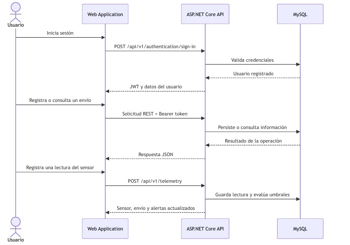
</p>

<p align="center"><em>Figura. Secuencia de autenticación, operación de envíos y registro de telemetría.</em></p>

##### API operations included in the review

| Módulo | Método y ruta | Propósito verificado |
|---|---|---|
| Authentication | `POST /api/v1/authentication/sign-up` | Registrar una cuenta de ColdTrack. |
| Authentication | `POST /api/v1/authentication/sign-in` | Autenticar al usuario y emitir un JWT. |
| Users | `GET /api/v1/users/me` | Recuperar el usuario identificado por el token. |
| Shipments | `POST /api/v1/shipments` | Registrar un envío refrigerado. |
| Shipments | `GET /api/v1/shipments` | Listar envíos y aplicar el filtro opcional de estado. |
| Shipments | `GET /api/v1/shipments/{shipmentId}` | Consultar el detalle técnico de un envío. |
| Shipments | `PATCH /api/v1/shipments/{shipmentId}/status` | Actualizar el estado del ciclo de vida. |
| Sensors | `GET /api/v1/sensors` y `POST /api/v1/sensors` | Consultar y registrar sensores. |
| Sensors | `PATCH /api/v1/sensors/{sensorId}/assignment` | Asignar un sensor disponible a un envío. |
| Telemetry | `POST /api/v1/telemetry` | Registrar una lectura de temperatura y humedad. |
| Telemetry | `GET /api/v1/shipments/{shipmentId}/telemetry` | Consultar las lecturas asociadas a un envío. |
| Alerts | `GET /api/v1/alerts` | Listar alertas por estado y severidad. |
| Alerts | `PATCH /api/v1/alerts/{alertId}/acknowledgment` | Reconocer una alerta activa. |
| Alerts | `PATCH /api/v1/alerts/{alertId}/resolution` | Resolver una alerta. |
| Analytics | `GET /api/v1/analytics/dashboard` | Obtener indicadores consolidados del dashboard. |
| Analytics | `GET /api/v1/analytics/shipment-history` | Consultar el historial de envíos completados. |
| Reports | `POST /api/v1/reports` | Generar y registrar un reporte analítico. |
| Reports | `GET /api/v1/reports/{reportId}/file` | Descargar el reporte generado en PDF. |
| Health | `GET /health` | Comprobar que el proceso de la API está disponible. |

La documentación interactiva de Swagger permitió revisar y ejecutar los endpoints implementados. Se verificaron las operaciones de alertas, analítica, autenticación, reportes, sensores, envíos, telemetría y consulta del usuario autenticado.

<p align="center">
  
</p>

<p align="center"><em>Figura 1. Documentación Swagger desplegada para los Web Services de ColdTrack.</em></p>

<p align="center">
  
</p>

<p align="center"><em>Figura 2. Operaciones de autenticación, generación de reportes y gestión de sensores.</em></p>

<p align="center">
  
</p>

<p align="center"><em>Figura 3. Operaciones protegidas para envíos, telemetría y usuario autenticado.</em></p>

En la Web Application se comprobó que el dashboard consolida los envíos y presenta las alertas activas. El flujo de registro permite crear un envío con destino, conductor, descripción de carga y fechas de salida y llegada estimada.

<p align="center">
  
</p>

<p align="center"><em>Figura 4. Dashboard conectado a los indicadores y alertas del backend.</em></p>

<p align="center">
  
</p>

<p align="center"><em>Figura 5. Formulario de creación de un envío refrigerado.</em></p>

La gestión de sensores permitió consultar los dispositivos registrados, identificar su estado, asociarlos con envíos y registrar nuevas lecturas de temperatura y humedad. Las lecturas fuera de los límites configurados generaron alertas relacionadas con el envío correspondiente.

<p align="center">
  
</p>

<p align="center"><em>Figura 6. Sensores registrados, asignación y acceso al registro de telemetría.</em></p>

<p align="center">
  
</p>

<p align="center"><em>Figura 7. Detalle integrado del envío, sensor asignado y alertas relacionadas.</em></p>

El módulo de alertas mostró los eventos generados por temperatura o humedad fuera del rango permitido, incluyendo severidad, estado, valor registrado y límite. También se verificaron las acciones para reconocer y resolver una alerta.

<p align="center">
  
</p>

<p align="center"><em>Figura 8. Alertas generadas a partir de las lecturas de telemetría.</em></p>

Finalmente, se completó un envío para comprobar su incorporación al historial y se ejecutó la exportación de un reporte PDF. El documento generado incluyó los indicadores del período y el detalle del envío completado.

<p align="center">
  
</p>

<p align="center"><em>Figura 9. Historial de envíos completados consultado desde la Web Application.</em></p>

<p align="center">
  
</p>

<p align="center"><em>Figura 10. Reporte PDF generado por ColdTrack para el período seleccionado.</em></p>

##### Integrated functional scenarios

| ID | Escenario ejecutado | Evidencia esperada | Resultado |
|---|---|---|---|
| EX-01 | Autenticar una cuenta registrada | La API devuelve un JWT y las solicitudes protegidas incluyen `Authorization: Bearer` | Conforme |
| EX-02 | Consultar el dashboard | Se muestran indicadores, envíos y alertas recuperados desde la API | Conforme |
| EX-03 | Registrar un nuevo envío | El envío se guarda y queda disponible para consultas posteriores | Conforme |
| EX-04 | Consultar el detalle del envío | Se muestran carga, conductor, fechas, condiciones, sensor y alertas relacionadas | Conforme |
| EX-05 | Consultar y asignar sensores | La tabla muestra el sensor y el envío vinculado | Conforme |
| EX-06 | Registrar telemetría fuera del rango | Se actualiza la última lectura y se genera una alerta asociada | Conforme |
| EX-07 | Reconocer y resolver alertas | El estado de la alerta cambia y se conserva en MySQL | Conforme |
| EX-08 | Completar un envío | El envío se incorpora al historial de completados | Conforme |
| EX-09 | Exportar información | Se genera un archivo PDF con indicadores y detalle del período | Conforme |
| EX-10 | Cambiar el idioma de la interfaz | Los textos fijos se presentan en inglés o español | Conforme |

##### Technical verification commands

Antes de publicar los incrementos se utilizaron las validaciones disponibles en cada repositorio:

```bash
# Web Application
npm install
npm run build

# Web Services
dotnet restore
dotnet build cold-track-platform.sln
dotnet test cold-track-platform.sln
```

En conjunto, estas evidencias demuestran que el incremento del Sprint 3 funciona como una solución integrada: la interfaz ejecuta los casos de uso, la API aplica las reglas de negocio y MySQL conserva el estado resultante. Las capturas complementan la demostración en vivo y permiten rastrear el resultado de cada escenario revisado.

#### 5.2.3.6. Services Documentation Evidence for Sprint Review

Durante el Sprint 3, el equipo concentró sus esfuerzos en la construcción de la capa de backend del sistema, abarcando la implementación de la lógica de dominio, la configuración de persistencia de datos y la exposición de servicios a través de endpoints REST, sentando así las bases funcionales de los principales módulos de la aplicación.
En lo que respecta al módulo de gestión de identidad y acceso, se llevó a cabo la implementación del agregado UserAccount junto con sus reglas de negocio, el value object Email con validación de formato, y la configuración del repositorio de usuarios sobre MySQL.
Adicionalmente, se desarrolló el servicio de hashing y verificación segura de contraseñas, los casos de uso correspondientes al registro e inicio de sesión de usuarios con generación de token JWT, y los endpoints REST necesarios para exponer dichas funcionalidades, incluyendo la consulta del perfil del usuario autenticado.
En cuanto al módulo de gestión de envíos, se implementó el agregado Shipment con sus respectivas reglas de negocio, la capa de persistencia en MySQL, y los casos de uso para el registro y actualización de envíos refrigerados. Asimismo,
se desarrollaron los endpoints REST bajo los métodos POST, GET y PATCH para permitir el registro, consulta y actualización del estado de los envíos, apoyándose en el value object ShipmentStatus para modelar correctamente el ciclo de vida de cada envío.
Finalmente, en el módulo de monitoreo de temperatura, se implementaron los endpoints del controlador de alertas de temperatura, así como el servicio encargado de registrar y preservar el historial de alertas generadas por el sistema.

La siguiente tabla recoge la documentación de los servicios web desarrollados durante el sprint, organizados por módulos funcionales del sistema.

| Módulo | Endpoint base | Acciones disponibles | Métodos HTTP | Descripción |
|---|---|---|---|---|
| Plataforma | `/health` | Verificar estado del servidor | `GET` | Estado de salud de la plataforma |
| Autenticación | `/api/v1/authentication` | Registrar cuenta, iniciar sesión | `POST /sign-up`<br>`POST /sign-in` | Registro y autenticación de usuarios ColdTrack |
| Usuarios | `/api/v1/users` | Obtener perfil del usuario autenticado | `GET /me` | Gestión del perfil de usuario |
| Envíos | `/api/v1/shipments` | Registrar envío, listar envíos, obtener por ID, actualizar estado | `POST`<br>`GET`<br>`GET /{shipmentId}`<br>`PATCH /{shipmentId}/status` | Gestión del ciclo de vida de envíos refrigerados |
| Sensores | `/api/v1/sensors` | Registrar sensor, listar sensores, asignar a envío | `POST`<br>`GET`<br>`PATCH /{sensorId}/assignment` | Registro y asignación de sensores de monitoreo |
| Telemetría | `/api/v1/telemetry` | Registrar lectura de sensor, consultar telemetría por envío | `POST`<br>`GET /shipments/{shipmentId}/telemetry` | Ingesta y consulta de datos de temperatura y humedad en tiempo real |
| Alertas | `/api/v1/alerts` | Listar alertas, reconocer alerta, resolver alerta | `GET`<br>`PATCH /{alertId}/acknowledgment`<br>`PATCH /{alertId}/resolution` | Gestión de alertas por desvíos de temperatura o humedad |
| Analítica | `/api/v1/analytics` | Obtener indicadores del dashboard, consultar historial de envíos | `GET /dashboard`<br>`GET /shipment-history` | Indicadores operativos consolidados y análisis histórico de envíos |
| Reportes | `/api/v1/reports` | Generar reporte, listar reportes, descargar reporte como PDF | `POST`<br>`GET`<br>`GET /{reportId}/file` | Generación y descarga de reportes de desempeño de la cadena de frío |

#### 5.2.3.7. Software Deployment Evidence for Sprint Review

El despliegue del Sprint 3 se organizó en tres servicios independientes: MySQL para la persistencia, Render para los Web Services y Firebase Hosting para la Web Application. Esta separación permite actualizar cada componente de manera controlada y mantener las credenciales de producción fuera de los repositorios.

##### Deployed architecture

La arquitectura desplegada separa la interfaz web, los Web Services y la persistencia. Esta separación permite publicar cada componente de forma independiente y mantener las credenciales de producción fuera del repositorio.

| Componente | Tecnología y plataforma | Dirección o configuración principal |
|---|---|---|
| Web Application | Vue 3.5, Vite y Firebase Hosting | https://coldtrack-front-web.web.app/ |
| Web Application alternativa | Firebase Hosting | https://coldtrack-front-web.firebaseapp.com/ |
| Web Services | ASP.NET Core sobre .NET 10 y Render | https://freshguard-coldtrack-platform.onrender.com |
| Swagger UI | Swashbuckle en Render | https://freshguard-coldtrack-platform.onrender.com/swagger/index.html |
| Health check | ASP.NET Core | https://freshguard-coldtrack-platform.onrender.com/health |
| Persistencia | Entity Framework Core y MySQL 8.0.29 | Filess.io mediante conexión TLS |
| Reportes | QuestPDF | Generación y descarga desde los endpoints de reportes |

##### Database deployment

La base de datos MySQL 8.0.29 fue aprovisionada en Filess.io mediante una instancia compartida. La configuración remota utiliza un host y puerto asignados por el proveedor, mientras que el nombre de la base de datos y el usuario se gestionan como variables de entorno en el servicio backend. La contraseña no se publica en el informe ni en GitHub.

<p align="center">
  
</p>

<p align="center"><em>Figura 11. Instancia MySQL de producción activa en Filess.io.</em></p>

La configuración productiva de ASP.NET Core construye la cadena de conexión a partir de variables de entorno y exige `SslMode=Required`. De este modo, el repositorio conserva solamente los nombres de las variables y Render almacena sus valores sensibles.

| Variable | Propósito |
|---|---|
| `DATABASE_HOST` | Host asignado por Filess.io. |
| `DATABASE_PORT` | Puerto de la instancia MySQL. |
| `DATABASE_NAME` | Esquema productivo de ColdTrack. |
| `DATABASE_USER` | Usuario con permisos sobre el esquema. |
| `DATABASE_PASSWORD` | Contraseña almacenada como secreto. |
| `TokenSettings__Secret` | Clave utilizada para firmar los JWT. |
| `TokenSettings__Issuer` | Emisor esperado por la validación del token. |
| `TokenSettings__Audience` | Audiencia autorizada para consumir el token. |

La API aplica las migraciones pendientes al iniciar mediante `Database.MigrateAsync()`. En el entorno preparado para la Sprint Review también se habilitó la carga controlada de datos de demostración, lo que permitió disponer de cuentas, envíos y sensores iniciales sin ejecutar scripts manuales sobre producción.

La persistencia se comprobó registrando y consultando usuarios, envíos, sensores, lecturas, alertas y reportes. Los datos permanecieron disponibles después de recargar la Web Application y después de nuevos despliegues del frontend.

##### Web Services deployment

Los Web Services de FreshGuard.ColdTrack.Platform fueron desplegados en Render como un Web Service basado en Docker y conectado al repositorio del backend. El servicio se ejecuta en el entorno Production, escucha en el puerto proporcionado por Render y publica la API mediante HTTPS. La evidencia del log confirma que la aplicación inició correctamente y que el servicio quedó disponible en su URL pública.

- Backend URL: https://freshguard-coldtrack-platform.onrender.com
- Swagger URL: https://freshguard-coldtrack-platform.onrender.com/swagger/index.html

<p align="center">
  
</p>

<p align="center"><em>Figura 12. Web Service de ColdTrack ejecutándose en el entorno de producción de Render.</em></p>

El backend utiliza un `Dockerfile` multi-stage. La primera etapa restaura y publica la solución con el SDK de .NET 10; la segunda ejecuta únicamente los artefactos publicados sobre la imagen de ASP.NET Core, reduciendo el contenido del contenedor final.

```dockerfile
FROM mcr.microsoft.com/dotnet/sdk:10.0 AS build
WORKDIR /src
COPY . .
RUN dotnet restore cold-track-platform.sln
RUN dotnet publish FreshGuard.ColdTrack.Platform/FreshGuard.ColdTrack.Platform.csproj \
    -c Release -o /app/publish /p:UseAppHost=false

FROM mcr.microsoft.com/dotnet/aspnet:10.0 AS runtime
WORKDIR /app
COPY --from=build /app/publish .
EXPOSE 10000
ENTRYPOINT ["sh", "-c", "dotnet FreshGuard.ColdTrack.Platform.dll --urls http://0.0.0.0:${PORT:-10000}"]
```

Proceso aplicado para publicar los Web Services:

1. Las ramas funcionales del backend se integraron en `develop` y se validaron antes de llegar a `main`.
2. Render se conectó al repositorio `FreshGuard.ColdTrack.Platform` y utilizó la rama estable para construir la imagen Docker.
3. Se configuraron como variables protegidas la conexión MySQL y los parámetros de firma JWT.
4. El proceso tomó el puerto dinámico `PORT` proporcionado por Render; en ausencia de este valor utiliza el puerto 10000.
5. Al iniciar, Entity Framework Core aplicó las migraciones pendientes y preparó los datos de demostración configurados.
6. Se verificaron `/health`, Swagger UI, autenticación y consultas protegidas desde la URL pública.

Swagger permanece habilitado en producción para la revisión académica. La captura de Render confirma que el servicio inició en el entorno `Production` y quedó disponible en el dominio público. Debido al plan gratuito, una instancia inactiva puede suspenderse temporalmente y la primera solicitud puede tardar aproximadamente 50 segundos en reactivarla.

##### Web Application deployment

La Web Application fue construida con Vite y desplegada en Firebase Hosting. La versión publicada utiliza la URL del backend de Render configurada para producción, lo cual permite ejecutar el flujo completo desde el navegador sin depender de la API simulada utilizada en incrementos anteriores.

- Production URL: https://coldtrack-front-web.web.app/
- Alternative URL: https://coldtrack-front-web.firebaseapp.com/

<p align="center">
  
</p>

<p align="center"><em>Figura 13. Versión de la Web Application publicada en Firebase Hosting.</em></p>

La configuración de Firebase publica el directorio generado por Vite y redirige cualquier ruta hacia `index.html`, condición necesaria para que Vue Router mantenga la navegación de la Single Page Application después de una recarga.

```json
{
  "hosting": {
    "public": "dist",
    "ignore": ["firebase.json", "**/.*", "**/node_modules/**"],
    "rewrites": [
      { "source": "**", "destination": "/index.html" }
    ]
  }
}
```

El entorno productivo del frontend separa la URL base de las rutas semánticas de cada recurso:

```dotenv
VITE_API_BASE_URL=https://freshguard-coldtrack-platform.onrender.com
VITE_AUTHENTICATION_ENDPOINT_PATH=/api/v1/authentication
VITE_SHIPMENTS_ENDPOINT_PATH=/api/v1/shipments
VITE_SENSORS_ENDPOINT_PATH=/api/v1/sensors
VITE_TELEMETRY_ENDPOINT_PATH=/api/v1/telemetry
VITE_ALERTS_ENDPOINT_PATH=/api/v1/alerts
VITE_ANALYTICS_ENDPOINT_PATH=/api/v1/analytics
VITE_REPORTS_ENDPOINT_PATH=/api/v1/reports
```

Los comandos utilizados para construir y publicar la aplicación fueron:

```bash
npm install
npm run build
firebase deploy --only hosting
```

##### Release strategy and post-deployment verification

Los tres repositorios mantuvieron el flujo `feature/* → develop → release/* → main`. Las ramas de característica aislaron cada incremento, `develop` concentró la integración y `main` representó la versión publicada. Cada release se identificó mediante un tag para conservar la relación entre código, evidencia y despliegue.

La disponibilidad pública se volvió a comprobar el 19 de junio de 2026. Firebase Hosting respondió con estado HTTP `200`, el health check de Render devolvió `{"status":"Healthy"}` y Swagger UI respondió con estado HTTP `200` después de la reactivación de la instancia gratuita.

| Verificación posterior al despliegue | Resultado observado |
|---|---|
| El contenedor de Render inicia con el puerto asignado | Conforme |
| `GET /health` responde desde el dominio público | `200 OK` y estado `Healthy` |
| Swagger UI expone los contratos de la API | `200 OK` |
| El inicio de sesión emite un JWT utilizable | Conforme |
| Los endpoints protegidos rechazan solicitudes sin credenciales válidas | Conforme |
| Firebase Hosting entrega la Web Application | `200 OK` |
| La recarga de rutas internas conserva la navegación SPA | Conforme |
| El frontend consume la API de Render | Conforme |
| MySQL conserva la información entre solicitudes | Conforme |
| El reporte PDF se genera y descarga correctamente | Conforme |

Como aspecto de seguridad pendiente, la política CORS del backend se encuentra configurada actualmente para aceptar cualquier origen durante la demostración. Para una siguiente versión productiva se recomienda restringirla a los dominios autorizados de Firebase y a los entornos locales de desarrollo.

Las tres evidencias confirman que la solución fue desplegada de extremo a extremo: Firebase entrega la interfaz, Render procesa las solicitudes de negocio y Filess.io conserva la información en MySQL. Los secretos de conexión y autenticación se administran mediante variables de entorno y no forman parte de los archivos versionados.

#### 5.2.3.8. Team Collaboration Insights during Sprint

<p>
Durante el Sprint 3, los analíticos de colaboración del repositorio FreshGuard.ColdTrack.Platform evidencian la participación de los integrantes del equipo sobre el código del backend de ColdTrack. A lo largo del sprint se registran commits asociados a la configuración inicial del proyecto con ASP.NET Core, así como a la implementación de los módulos de autenticación, gestión de envíos, telemetría, alertas, analítica y reportes. Esta actividad confirma que la construcción de los Web Services y la persistencia en MySQL se realizó de forma incremental, alineada a los objetivos definidos en el Sprint 3 Goal.
</p>

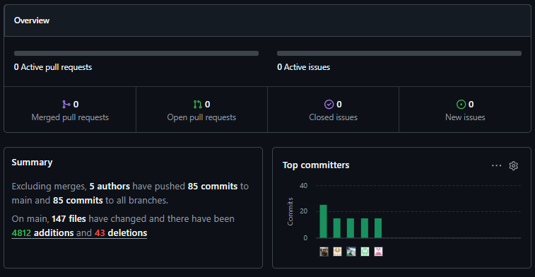

<p>
El Network Graph correspondiente al Sprint 3 muestra un uso activo del flujo de trabajo basado en GitFlow, con ramas de características (features como <code>feature/iam-authentication</code>, <code>feature/create-shipment</code>, <code>feature/alerting-api</code>) creadas para los dominios y servicios, que luego son fusionadas a la rama <code>develop</code> y posteriormente integradas tras el desarrollo. Este patrón de ramas indica que los integrantes coordinaron el trabajo de forma estructurada, alineados con las prácticas definidas para el proyecto (feature branches y consolidación en develop), reforzando la trazabilidad y la calidad del código entregado durante el sprint.
</p>

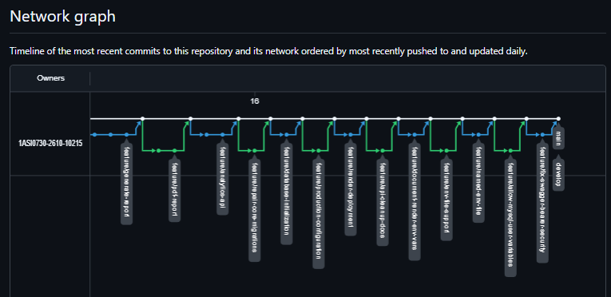

<p>
En conjunto, la evidencia recopilada en el repositorio demuestra que el equipo mantuvo una dinámica de trabajo constante conforme avanzaban las fechas de integración de los distintos bounded contexts del backend. La consolidación exitosa de las APIs y servicios sugiere un alto nivel de organización para preparar la Sprint Review. Estos analíticos y la correcta ejecución del GitFlow confirman que, durante el Sprint 3, los miembros del equipo participaron efectivamente en la implementación de la aplicación backend según el alcance establecido, cumpliendo con el principio de trabajo colaborativo.
</p>

### 5.2.4. Sprint 4

En esta sección se documentará el trabajo correspondiente al Sprint 4 de ColdTrack. El apartado queda preparado para registrar la planificación, responsables, backlog, evidencias de desarrollo, ejecución, documentación de servicios, despliegue y colaboración del equipo durante la iteración.

#### 5.2.4.1. Sprint Planning 4


#### 5.2.4.2. Aspect Leaders and Collaborators

Durante el Sprint 4, el equipo organizó el trabajo enfocándose de lleno en la documentación final del proyecto, las correcciones (hotfixes) y la alineación del reporte con la rúbrica de evaluación. Los aspectos principales abarcaron la actualización de la arquitectura de software (Modelo C4), refinamiento de Domain-Driven Design (EventStorming), evaluación de la experiencia de usuario (Lean UX, heurísticas, entrevistas) y la trazabilidad de historias de usuario y Student Outcomes.

En esta matriz, `L` representa al líder del aspecto y `C` representa a los colaboradores que participaron en la implementación, revisión o integración de dicho aspecto.

| Team Member | GitHub Username | Report Integration & Hotfixes | Software Architecture (C4) & Annexes | DDD & EventStorming | UX Evaluation & Interviews | Traceability, Evidence & Outcomes |
|-------------|-----------------|-------------------------------|--------------------------------------|---------------------|----------------------------|-----------------------------------|
| Avila Palacios, Aarón | AaronAvilap | C | C | C | C | L |
| Oblitas Alcalde, Rodrigo | Darkdren | L | C | C | C | C |
| Celis Berrospi, Eslander | Eslander-Celis | C | L | C | C | C |
| Mendoza Palacios, Gabriel | Gabriel2349 | C | C | C | L | C |
| Arechaga Saavedra, Mathias | MathZell | C | C | L | C | C |

La asignación de liderazgo refleja la actividad del repositorio en esta etapa de cierre documental: Rodrigo lideró la integración general del reporte, la resolución de hotfixes mediante merges y ajustes en Lean UX y heurísticas. Eslander asumió el liderazgo en la documentación de la arquitectura de software (diagramas de contenedores) y secciones de anexos. Mathias lideró el refinamiento de los artefactos de Domain-Driven Design (Big Picture EventStorming, diagrama de componentes). Gabriel se enfocó en el análisis de entrevistas y la actualización de contextos, mientras que Aarón lideró la trazabilidad de historias de usuario y la alineación de las evidencias del sprint con la rúbrica final. Todos colaboraron aportando al cumplimiento de los Student Outcomes.

#### 5.2.4.3. Sprint Backlog 4

El Sprint Backlog 4 se enfocó en el cierre y estabilización del ecosistema ColdTrack: optimización de formularios y vistas del frontend, endurecimiento de servicios backend, pruebas de integración, documentación OpenAPI y despliegue final de ambos componentes en producción.

| Sprint # | User Story Id | User Story Title | Task Id | Task Title | Task Description | Estimation (Hours) | Assigned To | Status |
|---|---|---|---|---|---|---:|---|---|
| Sprint 4 | US-001 | Registro de usuario | FE-001 | Optimizar formulario de registro | Optimizar el formulario de registro con validaciones en tiempo real | 3 | Rodrigo Oblitas Alcalde | Done |
| Sprint 4 | US-002 | Inicio de sesión | FE-002 | Mejorar interfaz de login | Mejorar la interfaz de inicio de sesión y manejo de errores de autenticación | 3 | Rodrigo Oblitas Alcalde | Done |
| Sprint 4 | US-004 | Crear envío | FE-003 | Refinar formulario de creación de envíos | Validar y refinar el formulario de creación de envíos en el frontend | 3 | Mathias Arechaga Saavedra | Done |
| Sprint 4 | US-005 | Ver envíos activos | FE-004 | Optimizar tabla de envíos y filtros | Optimizar la visualización de la tabla de envíos y agregar filtros avanzados | 4 | Mathias Arechaga Saavedra | Done |
| Sprint 4 | US-006 | Ver detalle del envío | FE-005 | Mejorar vista de detalle del envío | Mejorar la vista de detalle del envío con información consolidada de monitoreo | 3 | Mathias Arechaga Saavedra | Done |
| Sprint 4 | US-009 | Ver temperatura en tiempo real | FE-006 | Actualización en tiempo real de temperatura | Implementar actualización en tiempo real de temperatura mediante WebSocket | 4 | Eslander Celis Berrospi | Done |
| Sprint 4 | US-010 | Ver humedad en tiempo real | FE-007 | Actualización en tiempo real de humedad | Implementar actualización en tiempo real de humedad mediante WebSocket | 4 | Eslander Celis Berrospi | Done |
| Sprint 4 | US-013 | Alertas de temperatura | FE-008 | Mejorar visualización de alertas | Mejorar visualización de alertas con indicadores visuales y sonoros | 3 | Aarón Avila Palacios | Done |
| Sprint 4 | US-015 | Historial de alertas | FE-009 | Optimizar tabla de historial de alertas | Optimizar la tabla de historial de alertas con filtros y exportación | 4 | Aarón Avila Palacios | Done |
| Sprint 4 | US-016 | Ver historial de envíos | FE-010 | Refinar historial de envíos completados | Refinar la visualización del historial de envíos completados | 3 | Gabriel Mendoza Palacios | Done |
| Sprint 4 | US-017 | Descargar reporte | FE-011 | Exportar reportes CSV/PDF (frontend) | Implementar exportación de reportes en formatos CSV y PDF desde el frontend | 4 | Gabriel Mendoza Palacios | Done |
| Sprint 4 | US-019 | Ver información de la app (Landing) | FE-012 | Validar responsividad y SEO del Landing | Validar responsividad y SEO del Landing Page en todos los dispositivos | 3 | Eslander Celis Berrospi | Done |
| Sprint 4 | TS-001 | Crear usuario | BE-001 | Optimizar persistencia de usuarios | Optimizar el servicio de persistencia de usuarios en MySQL | 3 | Rodrigo Oblitas Alcalde | Done |
| Sprint 4 | TS-002 | Autenticación | BE-002 | Refinar generación de tokens JWT | Validar y refinar la generación de tokens JWT con expiración correcta | 3 | Rodrigo Oblitas Alcalde | Done |
| Sprint 4 | TS-003 | CRUD envíos | BE-003 | Optimizar operaciones CRUD de envíos | Optimizar las operaciones de lectura y escritura de envíos en la base de datos | 4 | Mathias Arechaga Saavedra | Done |
| Sprint 4 | TS-004 | Asignación sensor | BE-004 | Refinar validaciones de asignación de sensores | Refinar la lógica de asignación de sensores a envíos con validaciones de negocio | 3 | Eslander Celis Berrospi | Done |
| Sprint 4 | TS-005 | Integración IoT | BE-005 | Validar recepción de datos IoT | Validar la recepción de datos IoT desde sensores y almacenamiento en telemetría | 4 | Eslander Celis Berrospi | Done |
| Sprint 4 | TS-006 | Tiempo real | BE-006 | Implementar WebSocket en backend | Implementar WebSocket para actualización de datos en tiempo real en frontend | 4 | Eslander Celis Berrospi | Done |
| Sprint 4 | TS-007 | Motor alertas | BE-007 | Refinar detección de anomalías | Refinar la lógica de detección de anomalías y generación automática de alertas | 4 | Aarón Avila Palacios | Done |
| Sprint 4 | TS-008 | Notificaciones | BE-008 | Notificaciones vía Firebase Cloud Messaging | Implementar notificaciones automáticas mediante Firebase Cloud Messaging | 3 | Aarón Avila Palacios | Done |
| Sprint 4 | TS-009 | Guardar historial | BE-009 | Validar persistencia de historial | Validar persistencia correcta del historial de envíos y alertas en MySQL | 3 | Gabriel Mendoza Palacios | Done |
| Sprint 4 | TS-010 | Exportar PDF | BE-010 | Generar reportes PDF dinámicos | Implementar generación dinámica de reportes en PDF desde el backend | 4 | Aarón Avila Palacios | Done |
| Sprint 4 | US-002 | Inicio de sesión | BE-011 | Endpoint de validación/renovación JWT | Implementar endpoint de validación y renovación de tokens JWT | 3 | Rodrigo Oblitas Alcalde | Done |
| Sprint 4 | US-007 | Asignar sensor a envío | FE-013 | Interfaz para vincular sensores | Implementar interfaz gráfica para vincular sensores disponibles a envíos | 3 | Eslander Celis Berrospi | Done |
| Sprint 4 | US-008 | Finalizar envío | BE-013 | Endpoint de finalización de envío | Implementar endpoint para finalizar envío y generar reporte automático | 4 | Mathias Arechaga Saavedra | Done |
| Sprint 4 | US-011 | Estado del envío | FE-014 | Estado consolidado con indicadores | Visualizar estado consolidado del envío con indicadores de color | 2 | Mathias Arechaga Saavedra | Done |
| Sprint 4 | US-012 | Visualizar gráficos históricos | FE-015 | Gráficos interactivos de temp/humedad | Implementar gráficos interactivos de temperatura y humedad en tiempo histórico | 4 | Gabriel Mendoza Palacios | Done |
| Sprint 4 | US-014 | Notificación al conductor | FE-016 | Notificaciones push en navegador | Integrar notificaciones push en el navegador para alertas críticas | 3 | Aarón Avila Palacios | Done |
| Sprint 4 | US-018 | Filtrar historial | FE-017 | Filtros avanzados de historial | Implementar filtros avanzados para búsqueda en historial de envíos y alertas | 3 | Gabriel Mendoza Palacios | Done |
| Sprint 4 | TS-011 | CORS Configuration | BE-014 | Configurar CORS para Firebase Hosting | Configurar CORS para permitir solicitudes desde Firebase Hosting | 2 | Rodrigo Oblitas Alcalde | Done |
| Sprint 4 | TS-012 | OpenAPI/Swagger Documentation | BE-015 | Actualizar documentación OpenAPI | Actualizar documentación OpenAPI a versión 1.0.0 y validar todos los endpoints | 3 | Rodrigo Oblitas Alcalde | Done |
| Sprint 4 | TS-013 | Unit Tests | BE-017 | Ejecutar pruebas unitarias backend | Ejecutar pruebas unitarias del backend y validar cobertura de reglas de negocio | 4 | Mathias Arechaga Saavedra | Done |
| Sprint 4 | TS-014 | Integration Tests | FE-018 | Pruebas de integración FE-BE | Realizar pruebas de integración frontend-backend en ambiente de staging | 4 | Aarón Avila Palacios | Done |
| Sprint 4 | TS-015 | Firebase Hosting Deployment | FE-019 | Desplegar frontend en producción | Desplegar versión final del frontend en Firebase Hosting | 2 | Aarón Avila Palacios | Done |
| Sprint 4 | TS-016 | Render Web Service Deployment | BE-018 | Desplegar backend en producción | Desplegar versión final del backend en Render Web Service con Docker | 3 | Aarón Avila Palacios| Done |
| Sprint 4 | TS-017 | GitHub Release Frontend | FE-020 | Publicar release v1.0.0 frontend | Crear y publicar release v1.0.0 del frontend en GitHub | 2 | Rodrigo Oblitas Alcalde | Done |
| Sprint 4 | TS-018 | GitHub Release Backend | BE-020 | Publicar release v1.0.0 backend | Crear y publicar release v1.0.0 del backend en GitHub | 2 | Rodrigo Oblitas Alcalde | Done |

Link del Trello: https://trello.com/b/hD8QYP0u/sprint-backlog-4-coldtrack


#### 5.2.4.4. Development Evidence for Sprint Review


#### 5.2.4.5. Execution Evidence for Sprint Review


#### 5.2.4.6. Services Documentation Evidence for Sprint Review

#### 5.2.4.6. Services Documentation Evidence for Sprint Review

Durante el Sprint 4, el equipo no incorporó nuevos módulos de negocio, sino que se enfocó en endurecer, optimizar y cerrar los servicios ya construidos en los Sprints 2 y 3. El trabajo incluyó la validación de reglas de negocio existentes, la incorporación de un canal de comunicación en tiempo real, la finalización del ciclo de vida de los envíos con generación automática de reportes, y la actualización de la documentación OpenAPI a su versión mas estable.

Entre las novedades puntuales de este sprint se encuentran: el endpoint de renovación de tokens JWT, el endpoint de finalización de envío con generación automática de reporte, y el canal WebSocket para la transmisión de datos de telemetría en tiempo real hacia el frontend.

La siguiente tabla recoge el estado consolidado de los servicios web al cierre del Sprint 4, organizados por módulo funcional del sistema.

| Módulo | Endpoint base | Acciones disponibles | Métodos HTTP | Descripción |
|---|---|---|---|---|
| Plataforma | `/health` | Verificar estado del servidor | `GET` | Estado de salud de la plataforma, validado como parte del checklist de despliegue final |
| Autenticación | `/api/v1/authentication` | Registrar cuenta, iniciar sesión, renovar token  | `POST /sign-up`<br>`POST /sign-in`<br>`POST /refresh` | Registro, autenticación y renovación de sesión mediante JWT con expiración validada |
| Usuarios | `/api/v1/users` | Obtener perfil del usuario autenticado | `GET /me` | Gestión del perfil de usuario |
| Envíos | `/api/v1/shipments` | Registrar envío, listar envíos, obtener por ID, actualizar estado, finalizar envío  | `POST`<br>`GET`<br>`GET /{shipmentId}`<br>`PATCH /{shipmentId}/status`<br>`PATCH /{shipmentId}/finalize` | Gestión completa del ciclo de vida del envío, incluyendo cierre con generación automática de reporte |
| Sensores | `/api/v1/sensors` | Registrar sensor, listar sensores, asignar a envío | `POST`<br>`GET`<br>`PATCH /{sensorId}/assignment` | Registro y asignación de sensores, con validaciones de negocio reforzadas en Sprint 4 |
| Telemetría | `/api/v1/telemetry` | Registrar lectura de sensor, consultar telemetría por envío, transmitir datos en tiempo real  | `POST`<br>`GET /shipments/{shipmentId}/telemetry`<br>`WS /ws/telemetry` | Ingesta, consulta y transmisión en tiempo real de datos de temperatura y humedad mediante WebSocket |
| Alertas | `/api/v1/alerts` | Listar alertas, reconocer alerta, resolver alerta | `GET`<br>`PATCH /{alertId}/acknowledgment`<br>`PATCH /{alertId}/resolution` | Gestión de alertas, con lógica de detección de anomalías refinada y notificaciones push vía Firebase Cloud Messaging |
| Analítica | `/api/v1/analytics` | Obtener indicadores del dashboard, consultar historial de envíos | `GET /dashboard`<br>`GET /shipment-history` | Indicadores operativos consolidados y análisis histórico de envíos |
| Reportes | `/api/v1/reports` | Generar reporte, listar reportes, descargar reporte como PDF | `POST`<br>`GET`<br>`GET /{reportId}/file` | Generación y descarga de reportes de desempeño, ahora también disparada automáticamente al finalizar un envío |

Adicionalmente, se actualizó la documentación OpenAPI/Swagger a la versión **1.0.0**, validando todos los endpoints listados en la tabla, y se configuró CORS en el backend para aceptar solicitudes desde el origen de producción de Firebase Hosting.


#### 5.2.4.7. Software Deployment Evidence for Sprint Review


#### 5.2.4.8. Team Collaboration Insights during Sprint

<p>
Durante el Sprint 4, los analíticos de colaboración evidencian la participación activa de todos los integrantes del equipo enfocados en el cierre documental y la estabilización del proyecto ColdTrack. A lo largo del sprint, se registran numerosos commits orientados a la actualización de la arquitectura de software (Modelo C4), refinamiento del Domain-Driven Design (EventStorming), integración del reporte final, trazabilidad de historias de usuario y corrección de observaciones (hotfixes). Esta actividad confirma que la consolidación de los entregables se realizó de forma colaborativa, asegurando la alineación con los requerimientos finales.
</p>

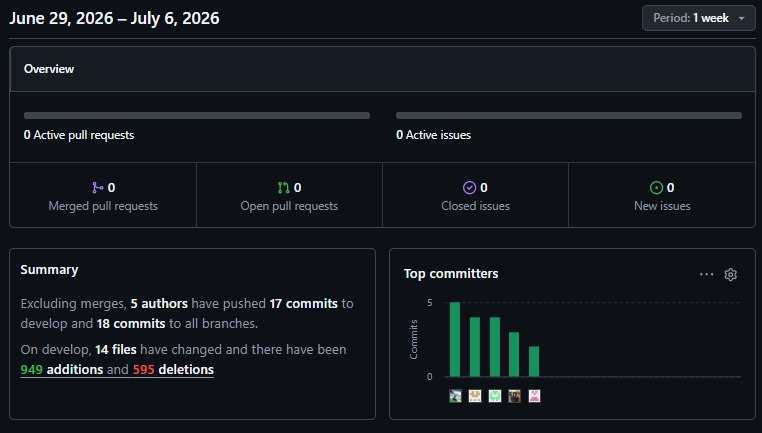

<p>
El Network Graph correspondiente al Sprint 4 muestra un flujo de trabajo enfocado en la corrección e integración de documentos finales. Se puede observar el uso de ramas específicas (como <code>docs/c4-model</code>, <code>hotfix/lean-ux-evaluation</code>, <code>docs/sprint-evidence</code>) para organizar las aportaciones individuales antes de fusionarlas a la rama principal. Este patrón demuestra que, incluso en etapas de actualización de reporte y ajustes, el equipo mantuvo las buenas prácticas de versionado y revisión, garantizando una entrega ordenada y libre de conflictos.
</p>

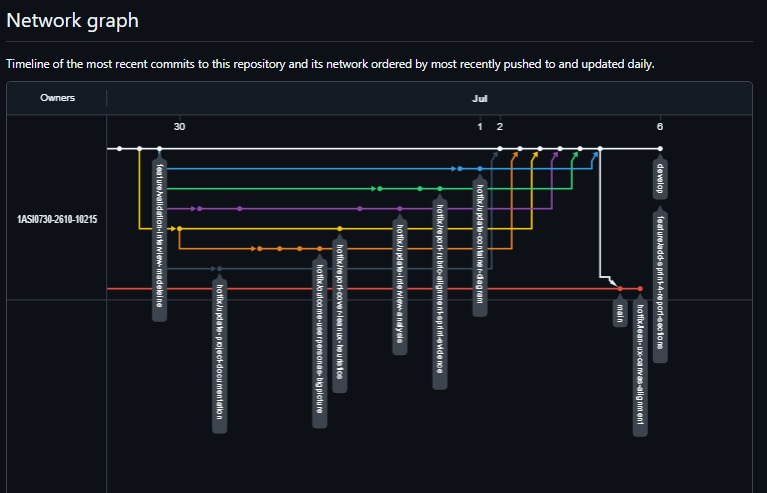

<p>
En conjunto, la evidencia recopilada demuestra que el equipo mantuvo una dinámica de trabajo constante y bien distribuida para cumplir con las fechas de entrega del último sprint. La consolidación exitosa de los diagramas, anexos y evidencias del proyecto sugiere un alto nivel de madurez en la organización para preparar la presentación de cierre. Estos analíticos confirman que, durante el Sprint 4, los miembros del equipo participaron efectivamente cumpliendo con el principio de trabajo colaborativo.
</p>

## 5.3. Validation Interviews

### 5.3.1. Diseño de Entrevistas

En esta sección se describe el diseño de las entrevistas de validación realizadas para ColdTrack durante el Sprint 3. El objetivo de estas sesiones fue comprobar si los usuarios de los segmentos objetivo comprenden la propuesta de valor presentada en el Landing Page y si pueden interactuar con las principales funcionalidades de la Web Application de manera clara, rápida y sin asistencia constante.

Las entrevistas fueron planteadas como sesiones guiadas, donde cada participante primero revisó el Landing Page de ColdTrack y luego ejecutó tareas específicas dentro de la aplicación. Durante la validación se observaron sus comentarios, dudas, tiempos de navegación, facilidad para completar los flujos y apreciaciones sobre la utilidad de la solución.

#### Metodología de la sesión

| **Etapa** | **Actividad realizada** | **Propósito** |
|-----------|--------------------------|---------------|
| Presentación del participante | Se solicitaron datos generales como nombre, edad, ocupación y relación con logística, operaciones o transporte. | Caracterizar al usuario y confirmar su pertenencia al segmento objetivo. |
| Exploración del Landing Page | El participante revisó la propuesta de valor, beneficios y explicación general de ColdTrack. | Validar si el producto web comunica claramente el problema que resuelve. |
| Ejecución de tareas en la Web Application | El usuario completó flujos relacionados con envíos, monitoreo, alertas e historial. | Evaluar la comprensión de la navegación y la facilidad para completar tareas. |
| Preguntas de cierre | Se recogieron opiniones sobre utilidad, claridad, alertas, información visible y oportunidades de mejora. | Obtener retroalimentación cualitativa para mejorar la experiencia de usuario. |

#### Objetivos de la validación

| **Objetivo** | **Descripción** |
|--------------|-----------------|
| Validar la comprensión del Landing Page | Comprobar si el usuario entiende el problema que resuelve ColdTrack, la propuesta de valor y los beneficios de la solución. |
| Validar la navegación de la aplicación | Evaluar si el usuario puede desplazarse por las vistas principales sin confundirse. |
| Validar los flujos principales | Observar si el usuario puede completar tareas relacionadas con envíos, monitoreo, alertas e historial. |
| Identificar oportunidades de mejora | Recoger comentarios sobre claridad visual, organización de la información, términos usados y elementos que podrían optimizarse. |

#### Segmentos considerados

| **Segmento objetivo** | **Perfil del usuario validado** | **Necesidad principal a validar** |
|-----------------------|----------------------------------|-----------------------------------|
| Personal de Logística y Operaciones | Supervisores, jefes de operaciones o personal de control de calidad relacionado con transporte refrigerado. | Supervisar envíos, revisar condiciones de temperatura y humedad, detectar alertas y consultar historial para tomar decisiones. |
| Personal de Transporte | Conductores o transportistas encargados del traslado de productos refrigerados. | Consultar el estado del envío, interpretar alertas y reaccionar oportunamente ante incidencias durante la ruta. |

#### Elementos evaluados

| **Elemento** | **Aspecto validado** |
|--------------|----------------------|
| Landing Page | Claridad del mensaje, comprensión de la propuesta de valor, beneficios percibidos y relación con el problema de cadena de frío. |
| Dashboard principal | Facilidad para reconocer el estado general de los envíos, métricas principales y alertas visibles. |
| Gestión de envíos | Comprensión del listado de envíos, estado operativo y detalle de información del transporte. |
| Alertas | Interpretación de mensajes críticos, severidad y capacidad de reacción ante incidencias. |
| Historial | Utilidad de la información histórica para trazabilidad, revisión de incidentes y toma de decisiones. |

#### User flows utilizados en la validación

| **Segmento** | **Elemento validado** | **User flow** | **Tarea asignada al entrevistado** |
|--------------|-----------------------|---------------|------------------------------------|
| Personal de Logística y Operaciones | Landing Page | Comprensión de propuesta de valor | Revisar el Landing Page e indicar qué problema considera que resuelve ColdTrack. |
| Personal de Logística y Operaciones | Web Application | Revisar monitoreo en tiempo real | Ingresar al dashboard y ubicar el estado actual de un envío refrigerado. |
| Personal de Logística y Operaciones | Web Application | Revisar alertas | Identificar si existe una alerta asociada a un envío y explicar qué acción tomaría. |
| Personal de Logística y Operaciones | Web Application | Consultar historial de envíos | Acceder al historial y revisar información de un envío finalizado. |
| Personal de Transporte | Landing Page | Comprensión de propuesta de valor | Revisar el Landing Page e indicar para qué sirve la solución. |
| Personal de Transporte | Web Application | Consultar estado del envío | Ubicar el envío asignado y revisar su estado general. |
| Personal de Transporte | Web Application | Interpretar alertas | Revisar una alerta de temperatura o humedad e indicar si el mensaje es comprensible. |
| Personal de Transporte | Web Application | Revisar detalle de ruta o carga | Consultar los detalles principales del envío para identificar información útil durante el transporte. |

#### Guía de preguntas

| **Segmento** | **Preguntas posteriores a la interacción** |
|--------------|--------------------------------------------|
| Personal de Logística y Operaciones | ¿Comprendió claramente qué problema resuelve ColdTrack después de revisar el Landing Page?<br>¿Le resultó sencillo encontrar la información necesaria para monitorear un envío?<br>¿Las alertas mostradas le permitieron identificar rápidamente posibles incidencias?<br>¿Considera que la plataforma podría mejorar el control de las operaciones logísticas? ¿Por qué? |
| Personal de Transporte | ¿Entendió fácilmente para qué sirve la aplicación después de revisar el Landing Page?<br>¿Le resultó sencillo consultar el estado de un envío?<br>¿Las alertas le parecieron claras y fáciles de interpretar durante una ruta?<br>¿Considera que la aplicación le ayudaría a reaccionar más rápido ante problemas de temperatura o humedad? ¿Por qué? |

### 5.3.2. Registro de Entrevistas

#### **Primer Segmento - Personal de Logística y Operaciones:** <br>

| **ENTREVISTA 1** | |
|------------------|----------------------------|
| **Nombre entrevistado** | Gianelly Vásquez |
| **Edad** | 27 |
| **Profesión** | supervisora de control de calidad |
| **Departamento** | Lima |
| **Inicio del video** | 0:00 |
| **Fin del video** | 3:55 |
| **Link del video** | https://drive.google.com/file/d/1D8FggaAjoaZGn1T6NujB7ZEzi5Wi1Bjq/view?usp=drive_link |
| **Foto entrevista** |  |
| **Resumen** | Gianelly Vásquez, supervisora de control de calidad en transporte de alimentos refrigerados que vive en Jesús María, actualmente gestiona el monitoreo de temperatura de forma manual usando termómetros digitales, dataloggers básicos y registros en Excel, sin contar con un sistema integrado en tiempo real, lo que genera dependencia del conductor y riesgo de errores humanos; tras interactuar con el Landing Page de ColdTrack, indicó que comprendió claramente el problema que la plataforma busca resolver, relacionado con el monitoreo de la cadena de frío durante el transporte, además señaló que la información presentada fue fácil de encontrar y estuvo bien organizada, lo que facilitó la comprensión de los datos del envío; también destacó que las alertas mostradas son visibles y permiten identificar rápidamente posibles incidencias durante el trayecto; finalmente, considera que la plataforma puede mejorar significativamente el control de las operaciones logísticas al permitir la supervisión en tiempo real y la detección oportuna de problemas, facilitando una mejor toma de decisiones y reduciendo riesgos en la cadena de suministro. |

| **ENTREVISTA 2** | |
|------------------|----------------------------|
| **Nombre entrevistado** | Claudio Castillo |
| **Edad** | 25 |
| **Profesión** | Personal relacionado con logística, operaciones o control de calidad |
| **Departamento** | Lima |
| **Entrevistador** | Mariano Vilela |
| **Inicio del video** | 0:00 |
| **Fin del video** | 3:05 |
| **Link del video** | https://drive.google.com/file/d/1XwYRweeNHZzyui3-aG7p3ch4PIPFYLEc/view?usp=drive_link |
| **Foto entrevista** |  |
| **Resumen** | Claudio Castillo participó en la entrevista de validación del primer segmento, guiada por Mariano Vilela. Durante la sesión revisó el Landing Page y la Web Application de ColdTrack, enfocándose en los flujos de monitoreo de envíos, revisión de alertas y consulta de información operativa. A partir de la interacción, comprendió que la propuesta busca mejorar el control de la cadena de frío durante el transporte de alimentos mediante información centralizada y alertas oportunas. Asimismo, valoró que la plataforma permita visualizar el estado del envío y posibles incidencias en un solo entorno, ya que esto podría reducir la dependencia de reportes manuales o llamadas constantes al conductor. Como oportunidad de mejora, se identificó que los mensajes de alerta deben ser directos y priorizar la acción que debe tomar el responsable logístico. |

| **ENTREVISTA 3** | |
|------------------|----------------------------|
| **Nombre entrevistado** | Madeleine del Carmen |
| **Edad** | 42 |
| **Profesión** | Personal de logistica |
| **Departamento** | Lima |
| **Inicio del video** | 0:00 |
| **Fin del video** | 3:15 |
| **Link del video** | https://drive.google.com/drive/folders/1rANjDqi1zW6pRqvGjqWI6h-k5BQxF-Vp?usp=sharing |
| **Foto entrevista** | |
| **Resumen** | Madeleine del Carmen, de 42 años y personal de logística en Lima, participó en la validación del Landing Page y la Web Application de ColdTrack. Durante la entrevista, resaltó que la propuesta de valor es clara y que el dashboard centralizado facilita enormemente la supervisión de la cadena de frío en tiempo real. Mencionó que, en su día a día, consolidar reportes manuales toma mucho tiempo y genera retrasos en la toma de decisiones, por lo que contar con un historial automatizado y alertas instantáneas les permitiría reaccionar proactivamente ante variaciones críticas de temperatura. Como oportunidad de mejora, sugirió que la plataforma permita exportar los reportes de incidentes de manera sencilla para compartirlos directamente con la gerencia o los clientes. |

#### **Segundo Segmento - Personal de Transporte:** <br>

| **ENTREVISTA 1** | |
|------------------|----------------------------|
| **Nombre entrevistado** | Edery Abanto |
| **Edad** | 30 |
| **Profesión** | personal de transporte |
| **Departamento** | Lima |
| **Inicio del video** | 15:13 |
| **Fin del video** | 20:40 |
| **Link del video** | https://1drv.ms/v/c/466c954577703c8e/IQD08OoosNeVTpXvfWKiGIz-ARMSa0vKfloaK4arRjvux34?e=laJkWr |
| **Foto entrevista** |  |
| **Resumen** | Edery Abanto, conductor de transporte de carga refrigerada de 30 años con 5 años de experiencia, encargado de trasladar productos perecibles como lácteos, embutidos y carnes frescas que requieren una cadena de frío estricta, actualmente monitorea la temperatura mediante un sistema integrado en la cabina que le permite visualizar el estado general sin detenerse, pero que no proporciona datos precisos, ni alertas preventivas, ni información en tiempo real compartible con la central. Considera que ColdTrack podría brindarle mayor seguridad operativa, facilitar la toma de decisiones durante la ruta y reducir significativamente el riesgo de pérdida de productos. |

| **ENTREVISTA 2** | |
|------------------|----------------------------|
| **Nombre entrevistado** | Camila Vega |
| **Edad** | 28 |
| **Profesión** | conductora |
| **Departamento** | Lima |
| **Entrevistador** | Aarón Avila Palacios |
| **Inicio del video** | 0:00 |
| **Fin del video** | 2:18 |
| **Link del video** | https://drive.google.com/file/d/1qJee7ydMPY_k7aXL2FoFVtS1GJaTjhjl/view?usp=drive_link |
| **Foto entrevista** | 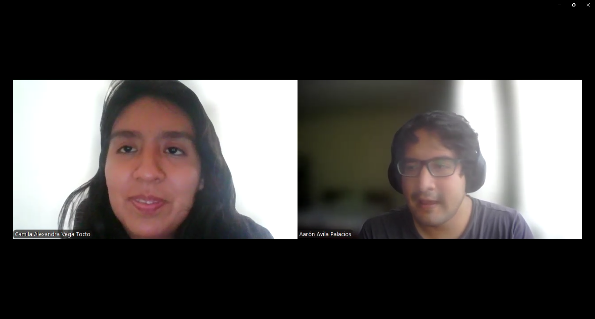 |
| **Resumen** | Camila Vega, conductora de 28 años, participó en la validación del Landing Page y de la Web Application de ColdTrack. Indicó que comprendió fácilmente el propósito de la aplicación y que la información de los envíos se encuentra organizada, permitiéndole consultar rápidamente su estado. También destacó que las alertas de temperatura y humedad son claras y fáciles de identificar. Finalmente, señaló que recibir notificaciones en tiempo real le ayudaría a detectar variaciones fuera de los rangos permitidos, reaccionar oportunamente y proteger la mercancía durante el transporte. |

| **ENTREVISTA 3** | |
|------------------|----------------------------|
| **Nombre entrevistado** | Fernando Pérez |
| **Edad** | 51 |
| **Profesión** | conductor |
| **Departamento** | Lima |
| **Inicio del video** | 0:00 |
| **Fin del video** | 1:28 |
| **Link del video** | https://drive.google.com/file/d/12zC-XNC_SjH2qDJEn48HsPJ6_leXD-kd/view?usp=drive_link |
| **Foto entrevista** |  |
| **Resumen** | Fernando Pérez, conductor de 51 años perteneciente al segmento de personal de transporte, evaluó la propuesta de ColdTrack desde la perspectiva de un usuario que necesita información simple y oportuna durante una ruta. Al revisar la solución, identificó la utilidad de consultar el estado del envío y recibir alertas relacionadas con temperatura o humedad, ya que estas señales podrían ayudar a prevenir pérdidas de mercadería y comunicar incidencias a tiempo. También destacó la importancia de que la aplicación sea clara, con indicadores visuales fáciles de interpretar y mensajes concretos, debido a que el conductor no puede dedicar demasiado tiempo a navegar por varias pantallas mientras cumple sus actividades de transporte. |

### 5.3.3. Evaluaciones según heurísticas

Para complementar las entrevistas de validación del Sprint 3, se aplicó una evaluación basada en heurísticas de experiencia de usuario. Esta evaluación permitió analizar la propuesta de ColdTrack desde tres enfoques principales: usabilidad, arquitectura de información e inclusive design. El objetivo fue identificar riesgos de interacción, claridad, accesibilidad y organización de contenido que pudieran afectar la experiencia de los usuarios durante el uso del Landing Page y la Web Application.

La evaluación se realizó considerando los comentarios obtenidos en las entrevistas, las tareas ejecutadas por los participantes y la revisión de los flujos principales del producto. Se prestó especial atención a los puntos donde un usuario podría confundirse, tardar más de lo necesario o no saber qué acción tomar ante una alerta de temperatura o humedad. Debido a que ColdTrack se orienta a operaciones logísticas, la evaluación priorizó la rapidez de interpretación, la visibilidad del estado del envío y la reducción de errores durante acciones críticas.

#### Alcance de la evaluación

| **Elemento evaluado** | **Aspectos revisados** |
|-----------------------|------------------------|
| Landing Page | Claridad de la propuesta de valor, comprensión del problema de cadena de frío, beneficios comunicados y relación con la Web Application. |
| Dashboard | Visibilidad de envíos activos, lectura rápida de temperatura, humedad, estados operativos e incidencias. |
| Gestión de envíos | Registro, listado, detalle del envío, información de ruta, producto, conductor y estado. |
| Sensores y telemetría | Comprensión de lecturas, asociación con envíos y utilidad de la información ambiental. |
| Alertas | Claridad del mensaje, severidad, causa del problema, impacto y acción recomendada. |
| Historial y reportes | Trazabilidad, revisión de incidencias pasadas y utilidad para control de calidad. |
| Accesibilidad e inclusive design | Contraste, legibilidad, tamaño de textos, uso de iconos, lenguaje simple y adaptación a dispositivos. |

#### Escala de severidad utilizada

| **Nivel** | **Severidad** | **Descripción** | **Prioridad sugerida** |
|-----------|---------------|-----------------|-------------------------|
| 0 | Sin problema | No se identifican dificultades relevantes. El elemento funciona correctamente para el objetivo evaluado. | Mantener y monitorear. |
| 1 | Problema menor | Puede generar una pequeña duda, pero no impide completar la tarea. | Corregir en una iteración posterior. |
| 2 | Problema moderado | Puede retrasar al usuario, requerir orientación adicional o aumentar el riesgo de error. | Corregir en la siguiente iteración. |
| 3 | Problema crítico | Dificulta significativamente la tarea, puede impedir la acción correcta o afectar una operación sensible. | Corregir con alta prioridad antes de una versión productiva. |

#### Evaluación heurística

| **Criterio heurístico** | **Elemento evaluado** | **Hallazgo** | **Riesgo identificado** | **Severidad** | **Recomendación** |
|-------------------------|-----------------------|--------------|--------------------------|---------------|-------------------|
| Visibilidad del estado del sistema | Dashboard y detalle de envíos | La aplicación permite reconocer el estado general de los envíos mediante indicadores de temperatura, humedad y estado operativo. | Si los estados visuales no se mantienen consistentes, el usuario podría no distinguir rápidamente un envío normal de uno crítico. | 1 | Mantener indicadores visibles, usar colores consistentes para estados normales, preventivos y críticos, y agregar etiquetas textuales junto al color. |
| Correspondencia entre el sistema y el mundo real | Landing Page, dashboard y alertas | Los usuarios comprenden que ColdTrack se relaciona con cadena de frío, transporte y monitoreo de alimentos; sin embargo, algunos términos técnicos pueden resultar menos familiares para conductores. | El usuario podría interpretar una alerta como un dato informativo y no como una acción urgente. | 2 | Usar lenguaje operativo y directo, por ejemplo: "Temperatura fuera de rango", "Revisar refrigeración" o "Contactar supervisor". |
| Control y libertad del usuario | Navegación de la Web Application | Los flujos principales permiten desplazarse entre dashboard, envíos, alertas e historial, pero en vistas de detalle debe reforzarse la salida o retorno. | El usuario puede sentirse atrapado en una vista de detalle o tardar más en volver al dashboard durante una operación. | 1 | Mantener menú principal visible, agregar botones de retorno claros y conservar breadcrumbs o rutas de navegación cuando el flujo crezca. |
| Consistencia y estándares | Interfaz general | La aplicación mantiene una estructura visual consistente en tarjetas, tablas, botones y estados, lo que favorece el aprendizaje del sistema. | Si se agregan módulos futuros sin la misma lógica visual, la curva de aprendizaje puede aumentar. | 0 | Conservar patrones de diseño, nombres de acciones y colores de estado en futuras versiones. |
| Prevención de errores | Registro y actualización de envíos | Para operaciones críticas como registrar, actualizar o finalizar un envío, se requiere evitar datos incompletos o acciones accidentales. | Un error en el registro de rangos, conductor o sensor podría afectar la trazabilidad y generar alertas incorrectas. | 2 | Incorporar validaciones por campo, mensajes de error específicos, confirmaciones antes de finalizar envíos y revisión previa de datos críticos. |
| Reconocimiento antes que memoria | Alertas e historial | Los usuarios interpretan mejor la información cuando está agrupada por estado, fecha, severidad, envío o sensor. | Si el usuario debe recordar códigos, rutas o eventos previos, aumentan los errores de interpretación. | 1 | Mantener filtros visibles, etiquetas descriptivas, iconos con texto y resúmenes por envío. |
| Flexibilidad y eficiencia de uso | Flujos de logística y transporte | Los usuarios necesitan encontrar rápidamente envíos activos, incidencias e historial para tomar decisiones. | En escenarios con muchos envíos, la ausencia de búsqueda avanzada podría retrasar la atención de incidentes. | 2 | Agregar filtros por estado, criticidad, fecha, conductor, sensor y ruta; incluir ordenamiento por alertas más recientes o más graves. |
| Diseño estético y minimalista | Landing Page y Web Application | La información se percibe organizada y orientada al propósito del producto, pero las vistas operativas deben priorizar los datos que impactan la decisión. | Una pantalla saturada puede ocultar información crítica durante una operación real. | 1 | Priorizar temperatura, humedad, estado, ruta, alerta activa y acción sugerida; mover datos secundarios a vistas de detalle. |
| Ayuda para reconocer y recuperarse de errores | Alertas y mensajes del sistema | Las alertas comunican incidencias, pero deben indicar claramente qué ocurrió, cuál es el impacto y qué acción se recomienda. | El usuario podría reconocer que existe un problema, pero no saber cómo responder. | 2 | Redactar alertas con estructura: causa, severidad, envío afectado y acción sugerida. Ejemplo: "Temperatura alta en envío CT-004. Revisar unidad de refrigeración y avisar a operaciones". |
| Inclusive design y accesibilidad | Interfaz visual y uso en campo | La solución debe considerar usuarios con distintos niveles de experiencia digital y condiciones de uso en oficina, almacén o ruta. | Bajo contraste, textos pequeños o iconos sin etiqueta pueden dificultar el uso en móviles o ambientes con poca visibilidad. | 2 | Asegurar contraste suficiente, tamaños legibles, botones táctiles amplios, textos simples, iconos acompañados de etiquetas y diseño responsive. |
| Seguridad y confianza | Autenticación, reportes y datos operativos | La aplicación protege el acceso mediante autenticación y conserva información operativa, pero debe comunicar claramente qué datos son persistentes y qué acciones quedan registradas. | Si el usuario no entiende la persistencia de datos, puede desconfiar del historial o de los reportes generados. | 1 | Mostrar confirmaciones de guardado, fechas de actualización, usuario responsable y estado de generación de reportes. |
| Ayuda y documentación contextual | Flujos nuevos o poco frecuentes | Los usuarios pueden completar tareas principales, pero algunos conceptos como sensores, telemetría o reportes pueden requerir apoyo inicial. | Usuarios nuevos podrían necesitar asistencia para entender la relación entre envío, sensor, lectura y alerta. | 1 | Agregar microcopy, tooltips o mensajes breves en formularios y vistas de detalle sin saturar la interfaz. |

#### Resumen de severidades

| **Severidad** | **Cantidad de hallazgos** | **Interpretación** |
|---------------|---------------------------|--------------------|
| 0 - Sin problema | 1 | La consistencia visual general es adecuada y debe mantenerse como estándar del producto. |
| 1 - Problema menor | 6 | Existen mejoras de claridad, navegación y documentación contextual que no bloquean el uso, pero pueden optimizar la experiencia. |
| 2 - Problema moderado | 5 | Los principales riesgos están relacionados con alertas, prevención de errores, accesibilidad, filtros y comprensión de acciones críticas. |
| 3 - Problema crítico | 0 | No se identificaron bloqueos graves durante la validación, aunque los problemas moderados deben atenderse antes de una versión productiva. |

#### Resultados por segmento

| **Segmento** | **Resultado de la validación** | **Riesgos detectados** | **Principales oportunidades de mejora** |
|--------------|--------------------------------|-----------------------|------------------------------------------|
| Personal de Logística y Operaciones | El segmento comprendió que ColdTrack permite centralizar el monitoreo de la cadena de frío y mejorar la visibilidad del estado de los envíos. Se valoró positivamente la posibilidad de detectar incidencias mediante alertas, consultar información en tiempo real y revisar historial operativo. | Puede requerir filtros más avanzados si el número de envíos aumenta. También necesita mensajes de alerta con causa, impacto y acción recomendada para decidir con rapidez. | Reforzar filtros de búsqueda, priorizar alertas por severidad, mostrar indicadores de última actualización y mejorar la explicación de acciones sugeridas ante incidentes. |
| Personal de Transporte | El segmento identificó la utilidad de consultar el estado del envío y recibir alertas claras durante la ruta. Los participantes destacaron que la aplicación debe ser rápida, simple y fácil de interpretar porque el conductor no puede dedicar demasiado tiempo a navegar. | Puede haber dificultad si las alertas usan lenguaje técnico, si los botones son pequeños en móvil o si la ruta para volver al estado del envío no es inmediata. | Simplificar mensajes de alerta, mantener indicadores visuales grandes, reducir pasos en la consulta del envío, reforzar diseño responsive y usar instrucciones breves orientadas a la acción. |

#### Acciones de mejora priorizadas

| **Prioridad** | **Mejora propuesta** | **Justificación** | **Impacto esperado** |
|---------------|----------------------|-------------------|----------------------|
| Alta | Rediseñar los mensajes de alerta con causa, severidad, envío afectado y acción sugerida. | Las alertas son el punto más sensible del producto porque conectan el monitoreo con la reacción operativa. | Mayor rapidez de respuesta y menor ambigüedad ante condiciones críticas. |
| Alta | Agregar validaciones visibles en registro y actualización de envíos. | Datos incompletos o incorrectos pueden afectar sensores, historial y reportes. | Menor riesgo de errores operativos y mayor confianza en la información registrada. |
| Media | Incorporar filtros y ordenamiento por criticidad, fecha, estado, conductor y sensor. | Los supervisores necesitan priorizar incidentes cuando existen varios envíos activos. | Mayor eficiencia para encontrar envíos críticos y revisar historial. |
| Media | Mejorar accesibilidad visual en móvil y condiciones de campo. | Conductores y personal operativo pueden usar la aplicación en rutas o ambientes con poca comodidad visual. | Mejor legibilidad, menor esfuerzo de interacción y uso más inclusivo. |
| Media | Agregar microcopy y ayuda contextual en sensores, telemetría y reportes. | Algunos conceptos técnicos pueden ser nuevos para usuarios no especializados. | Menor curva de aprendizaje y mayor comprensión de los flujos. |
| Baja | Mantener consistencia visual en tarjetas, tablas, botones y estados. | La consistencia actual favorece el aprendizaje y debe conservarse al crecer el producto. | Experiencia más coherente en futuras funcionalidades. |

#### Conclusión de la evaluación

La evaluación heurística muestra que ColdTrack presenta una experiencia comprensible para los usuarios de logística, operaciones y transporte, especialmente en la visualización del estado de envíos, la identificación de alertas y la relación entre el problema comunicado en el Landing Page y las funcionalidades disponibles en la Web Application. Los principales aspectos positivos se relacionan con la centralización de información, la consistencia visual, la disponibilidad de historial y la posibilidad de detectar incidencias durante el transporte.

Sin embargo, los hallazgos moderados evidencian que la propuesta debe reforzar elementos críticos antes de una versión productiva. En especial, se recomienda mejorar la redacción de alertas, agregar validaciones en acciones sensibles, ampliar filtros de búsqueda y asegurar criterios de accesibilidad visual. Estas mejoras permitirán que la plataforma sea más efectiva para usuarios que deben tomar decisiones rápidas durante operaciones de transporte refrigerado y que requieren información clara, confiable y accionable.

En conclusión, ColdTrack no presenta problemas críticos que impidan su uso durante la validación, pero sí requiere mejoras de precisión y prevención de errores para aumentar su confiabilidad operativa. La siguiente iteración debe enfocarse en reducir la ambigüedad de las alertas, mejorar la navegación en escenarios con varios envíos y fortalecer la experiencia móvil para conductores y personal en campo.

## 5.4. Video About-the-Product

Esta sección presentará el Video About-the-Product de ColdTrack. Su propósito será comunicar de manera breve el problema de la cadena de frío, los segmentos objetivo, la propuesta de valor y el funcionamiento del producto digital integrado. El contenido estará dirigido a responsables de logística, control de calidad, transportistas y organizaciones que necesitan supervisar productos sensibles durante su traslado.

El video deberá mostrar el vínculo entre la propuesta comunicada en la Landing Page y las capacidades disponibles en la Web Application. El recorrido incluirá el inicio de sesión, dashboard, registro y seguimiento de envíos, gestión de sensores, telemetría, alertas, historial y exportación de reportes. También explicará que la solución utiliza Web Services desplegados y persistencia MySQL para conservar la información operativa.

### Planned video structure

| Bloque | Contenido esperado |
|---|---|
| Problem statement | Riesgo de pérdida de calidad por falta de visibilidad sobre temperatura y humedad. |
| Target segments | Empresas distribuidoras, responsables de logística, control de calidad y transportistas. |
| Value proposition | Monitoreo centralizado, alertas oportunas, trazabilidad e historial de envíos. |
| Landing Page | Presentación de la startup, beneficios y acceso a la aplicación. |
| Web Application | Demostración de envíos, sensores, lecturas, alertas, historial y reportes. |

### Video evidence

**Microsoft Stream o SharePoint URL:**
https://1drv.ms/v/c/466c954577703c8e/IQDBRgrAHfY5SZuIpmjrplS_AfoB8JxUMlgs1fC9S-F4XKc?e=4ikZuD

**YouTube URL:**
https://youtu.be/uSd4PrDiAcs

**Duración:**
02:22 minutos

**Captura del video:**


# Conclusiones

## Conclusiones y recomendaciones

Como equipo, concluimos que ColdTrack responde a una problemática real dentro de la cadena de frío: la falta de visibilidad oportuna sobre las condiciones de temperatura y humedad durante el transporte de productos sensibles. A partir de los Problem Statements definidos en Lean UX, confirmamos que los usuarios vinculados a logística, control de calidad y transporte necesitan una herramienta centralizada que reduzca la dependencia de controles manuales, permita reaccionar ante incidencias y facilite la trazabilidad de cada envío.

En relación con los assumptions planteados, validamos que los segmentos objetivo valoran especialmente la supervisión en tiempo real, el registro histórico de envíos y las alertas visibles ante condiciones fuera de rango. Si bien inicialmente asumimos que la principal necesidad era solo registrar datos de temperatura, el desarrollo del producto nos permitió observar que el valor percibido aumenta cuando el sistema también organiza conductores, sensores, estados de envío, historial y evidencias operativas en una sola interfaz. Esto refuerza la importancia de diseñar ColdTrack como una plataforma de gestión y no únicamente como un panel de lectura de sensores.

Respecto a los Hypothesis Statements, consideramos que los avances de los Sprints 2 y 3 respaldan la hipótesis de que una aplicación web con autenticación, dashboard, registro de envíos, gestión de sensores, telemetría, alertas e historial puede mejorar el control operativo de la cadena de frío. Los criterios de éxito definidos en el proceso Lean UX se contrastaron mediante la implementación y validación funcional de los flujos principales: ingreso a la aplicación, creación y seguimiento de envíos, consulta de sensores y lecturas, actualización de estados, generación de alertas y revisión del historial. Aunque todavía se requiere una validación más profunda con usuarios reales, la evidencia obtenida demuestra que el producto ya cuenta con una base funcional e integrada para futuras iteraciones.

También concluimos que la integración entre landing page, Web Application y Web Services fue clave para presentar una experiencia completa del modelo de negocio digital. La landing page comunica la propuesta de valor, mientras que la aplicación desplegada en Firebase evidencia el funcionamiento operativo de ColdTrack. En AV2 se reemplazó la dependencia principal de MockAPI por una API REST desarrollada con ASP.NET Core, protegida con autenticación JWT y desplegada en Render. La persistencia en MySQL permitió conservar usuarios, envíos, sensores, lecturas y alertas, con lo cual la solución dejó de depender de datos exclusivamente simulados y se aproximó a un escenario operativo real.

La integración alcanzada en el Sprint 3 también permitió comprobar que la separación del backend en bounded contexts facilita distribuir responsabilidades y evolucionar las capacidades de negocio sin concentrar toda la lógica en un solo módulo. El uso de Swagger/OpenAPI hizo posible verificar los contratos de los endpoints antes de conectarlos al frontend, mientras que GitFlow y los releases versionados aportaron trazabilidad sobre los incrementos incorporados. Como equipo, reconocemos que estas decisiones redujeron el riesgo de integración y facilitaron que todos los integrantes comprendieran y probaran el flujo completo del producto.

Como recomendaciones para los siguientes pasos del roadmap, proponemos priorizar la conexión con sensores reales o simuladores más cercanos al contexto operativo, completar la autorización por roles, incorporar comunicación en tiempo real para telemetría y alertas, y mejorar los reportes exportables para supervisores. También recomendamos automatizar pruebas y despliegues mediante integración continua, incorporar observabilidad y copias de seguridad, y ejecutar pruebas de seguridad, rendimiento y resiliencia sobre el backend y la base de datos.

Finalmente, recomendamos ampliar las Validation Interviews con empresas que gestionen productos refrigerados y definir métricas verificables, como tiempo de detección de incidencias, porcentaje de envíos dentro del rango permitido, reducción de registros manuales y facilidad de uso percibida. Estos resultados deberán compararse con los criterios de éxito de Lean UX para priorizar el siguiente incremento y evitar que las decisiones del roadmap se basen únicamente en supuestos técnicos del equipo.

## Video About-the-Team

En esta sección se presenta el video **About-the-Team**, el cual resume el proceso de trabajo colaborativo desarrollado por el equipo durante la construcción del proyecto **ColdTrack**. A lo largo del video se muestran evidencias reales de sesiones de trabajo, reuniones de coordinación, planificación de sprints y desarrollo técnico de los distintos componentes del sistema.

Durante el desarrollo del proyecto, el equipo trabajó de manera organizada aplicando metodologías ágiles, distribuyendo tareas entre frontend, backend, integración de componentes y validación final del producto. Se documentaron reuniones periódicas para la planificación, seguimiento y retrospectiva de cada sprint, permitiendo mantener una comunicación constante y un progreso sostenido.

Entre los principales logros alcanzados por el equipo se encuentran:

- Desarrollo completo de la **Landing Page** corporativa de ColdTrack.
- Implementación del **frontend** del sistema con interfaces funcionales y responsivas.
- Construcción del **backend** y conexión con servicios de almacenamiento de datos.
- Integración de módulos de monitoreo para temperatura y humedad.
- Desarrollo de dashboards para visualización de datos en tiempo real.
- Implementación de funcionalidades de alertas y registro histórico.
- Aplicación de principios de **usabilidad, accesibilidad, SEO e internacionalización (i18n)**.

Asimismo, el video incluye el testimonio individual de cada integrante del equipo, donde explican las actividades realizadas, sus contribuciones al proyecto, los outcomes logrados y las competencias desarrolladas durante el ciclo académico. Esto evidencia no solo el desarrollo del producto, sino también el crecimiento técnico, colaborativo y profesional de cada miembro.

Adicionalmente, este video fue incrustado en la sección **About the Team** del **Landing Page**, permitiendo su visualización directa desde la plataforma principal del proyecto.

### Información del video

**Nombre del archivo:**  
`upc-pre-202610-1asi0730-coldtrack-aboutthe-team-sprint-3.mp4`

**Formato:**  
`.mp4`

**Duración total:**  
`00:09:57`

### Pauta de secuencias del contenido

| Sección | Descripción | Inicio |
|---------|-------------|--------|
| Proceso colaborativo y desarrollo del proyecto | Se resume el proceso de trabajo del equipo durante el desarrollo de ColdTrack, mostrando reuniones, planificación de sprints, coordinación entre integrantes, desarrollo del frontend y backend, integración del sistema y despliegue final. | 00:00:00 |
| Testimonio individual – Eslander Celis | Explica sus actividades realizadas, contribuciones al proyecto, outcomes logrados y competencias desarrolladas. | 00:04:14 |
| Testimonio individual – Rodrigo Oblitas | Explica sus actividades realizadas, contribuciones al proyecto, outcomes logrados y competencias desarrolladas. | 00:05:15 |
| Testimonio individual – Mathias Aréchaga | Explica sus actividades realizadas, contribuciones al proyecto, outcomes logrados y competencias desarrolladas. | 00:06:31 |
| Testimonio individual – Aarón Ávila | Explica sus actividades realizadas, contribuciones al proyecto, outcomes logrados y competencias desarrolladas. | 00:07:25 |
| Testimonio individual – Gabriel Mendoza | Explica sus actividades realizadas, contribuciones al proyecto, outcomes logrados y competencias desarrolladas. | 00:08:22 |

### Evidencia del video

**Screenshot representativo del video:**

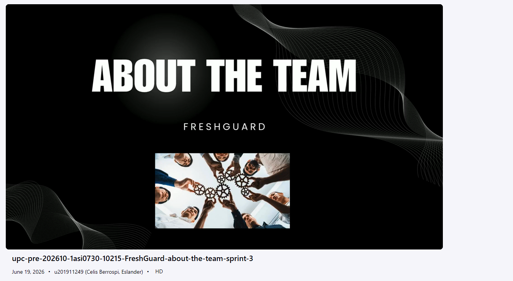

### Video publicado en Microsoft Stream

Microsoft Stream URL:  

https://upcedupe-my.sharepoint.com/:v:/g/personal/u201911249_upc_edu_pe/IQDK3zANe96kTKttTEQVPc51AeFOEgs5dNd1qZa33zZqOjs?e=tx1J4F&nav=eyJyZWZlcnJhbEluZm8iOnsicmVmZXJyYWxBcHAiOiJTdHJlYW1XZWJBcHAiLCJyZWZlcnJhbFZpZXciOiJTaGFyZURpYWxvZy1MaW5rIiwicmVmZXJyYWxBcHBQbGF0Zm9ybSI6IldlYiIsInJlZmVycmFsTW9kZSI6InZpZXcifX0%3D

### Video publicado en YouTube

YouTube URL:  

https://youtu.be/ULdg35MGr-Q

# Bibliografía

Amazon Web Services. (2026). *What is a RESTful API?* Recuperado el 19 de junio de 2026, de https://aws.amazon.com/what-is/restful-api/

Axios. (2026). *Axios documentation*. Recuperado el 13 de mayo de 2026, de https://axios-http.com/

Evans, E. (2003). *Domain-driven design: Tackling complexity in the heart of software*. Addison-Wesley.

Firebase. (2026). *Firebase Hosting documentation*. Recuperado el 13 de mayo de 2026, de https://firebase.google.com/docs/hosting

Filess.io. (2026). *Managed database hosting*. Recuperado el 19 de junio de 2026, de https://filess.io/

Fowler, M. (2004). *UML distilled: A brief guide to the standard object modeling language* (3rd ed.). Addison-Wesley.

Gamma, E., Helm, R., Johnson, R., & Vlissides, J. (1994). *Design patterns: Elements of reusable object-oriented software*. Addison-Wesley.

GitHub Docs. (2026). *GitHub Pages documentation*. Recuperado el 13 de mayo de 2026, de https://docs.github.com/en/pages

GitHub Docs. (2026). *Managing branches in your repository*. Recuperado el 19 de junio de 2026, de https://docs.github.com/en/repositories/configuring-branches-and-merges-in-your-repository/managing-branches-in-your-repository

Gothelf, J., & Seiden, J. (2021). *Lean UX: Designing great products with agile teams* (3rd ed.). O'Reilly Media.

International Organization for Standardization. (2018). *ISO 9241-11:2018 Ergonomics of human-system interaction: Usability*. ISO.

Kruchten, P. (1995). The 4+1 view model of architecture. *IEEE Software, 12*(6), 42-50. https://doi.org/10.1109/52.469759

Microsoft. (2026). *ASP.NET Core documentation*. Recuperado el 19 de junio de 2026, de https://learn.microsoft.com/aspnet/core/

Microsoft. (2026). *Authentication and authorization in ASP.NET Core*. Recuperado el 19 de junio de 2026, de https://learn.microsoft.com/aspnet/core/security/

Microsoft. (2026). *Entity Framework Core documentation*. Recuperado el 19 de junio de 2026, de https://learn.microsoft.com/ef/core/

MockAPI. (2026). *MockAPI documentation*. Recuperado el 13 de mayo de 2026, de https://mockapi.io/docs

MySQL. (2026). *MySQL 8.0 reference manual*. Recuperado el 19 de junio de 2026, de https://dev.mysql.com/doc/refman/8.0/en/

Nielsen, J. (1994). *10 usability heuristics for user interface design*. Nielsen Norman Group. https://www.nngroup.com/articles/ten-usability-heuristics/

OpenAPI Initiative. (2026). *OpenAPI Specification*. Recuperado el 19 de junio de 2026, de https://spec.openapis.org/oas/latest.html

PrimeTek. (2026). *PrimeVue documentation*. Recuperado el 13 de mayo de 2026, de https://primevue.org/

QuestPDF. (2026). *QuestPDF documentation*. Recuperado el 19 de junio de 2026, de https://www.questpdf.com/

Render. (2026). *Render documentation*. Recuperado el 19 de junio de 2026, de https://render.com/docs

Trello. (2026). *Trello guide*. Recuperado el 19 de junio de 2026, de https://trello.com/guide

Vernon, V. (2013). *Implementing domain-driven design*. Addison-Wesley.

Vue I18n. (2026). *Vue I18n documentation*. Recuperado el 13 de mayo de 2026, de https://vue-i18n.intlify.dev/

Vue.js. (2026). *Vue.js documentation*. Recuperado el 13 de mayo de 2026, de https://vuejs.org/

Vite. (2026). *Vite documentation*. Recuperado el 13 de mayo de 2026, de https://vite.dev/

# Anexos

## Videos de Exposiciones

En esta sección se incluyen los videos de las exposiciones realizadas durante las diferentes entregas del proyecto **ColdTrack**. Cada video evidencia el progreso del equipo en las distintas fases del desarrollo, mostrando la evolución del producto, las decisiones técnicas tomadas y los avances alcanzados en cada evaluación.

### AV1 (Avance 1)

Video correspondiente a la primera exposición del proyecto, donde se presentó la idea de negocio, problemática identificada, propuesta de solución y primeros avances en el diseño del sistema.

Microsoft Stream URL:  

https://upcedupe-my.sharepoint.com/:v:/g/personal/u201911249_upc_edu_pe/IQD2U2NEzg8xSLo8XOF1COuCAWLFyQgeSYzqyomeXHynISo?e=Iq89WY&nav=eyJyZWZlcnJhbEluZm8iOnsicmVmZXJyYWxBcHAiOiJTdHJlYW1XZWJBcHAiLCJyZWZlcnJhbFZpZXciOiJTaGFyZURpYWxvZy1MaW5rIiwicmVmZXJyYWxBcHBQbGF0Zm9ybSI6IldlYiIsInJlZmVycmFsTW9kZSI6InZpZXcifX0%3D

### TB1 (Trabajo Parcial / Trabajo Final Intermedio)

Video correspondiente a la exposición intermedia del proyecto, donde se presentaron los avances en el desarrollo de la Landing Page, frontend del sistema y validaciones funcionales del producto.

Microsoft Stream URL:  

https://upcedupe-my.sharepoint.com/:v:/g/personal/u201911249_upc_edu_pe/IQBzHTo9GCR1RpI0WITzlzTLAdLiHay8hkvnxDjYvTBgo5E?e=3ZaFCc&nav=eyJyZWZlcnJhbEluZm8iOnsicmVmZXJyYWxBcHAiOiJTdHJlYW1XZWJBcHAiLCJyZWZlcnJhbFZpZXciOiJTaGFyZURpYWxvZy1MaW5rIiwicmVmZXJyYWxBcHBQbGF0Zm9ybSI6IldlYiIsInJlZmVycmFsTW9kZSI6InZpZXcifX0%3D

### AV2 (Avance 2)

Video correspondiente a la exposición del segundo avance, donde se evidenció principalmente el desarrollo del backend, integración de servicios, persistencia de datos y conexión entre frontend y backend.

Microsoft Stream URL:  

https://upcedupe-my.sharepoint.com/:v:/g/personal/u201911249_upc_edu_pe/IQDhwhrZnP6XTYKLr4AJchVxAe2WkJG6o9PUKwTbrZbFmC8?e=4rlZG5&nav=eyJyZWZlcnJhbEluZm8iOnsicmVmZXJyYWxBcHAiOiJTdHJlYW1XZWJBcHAiLCJyZWZlcnJhbFZpZXciOiJTaGFyZURpYWxvZy1MaW5rIiwicmVmZXJyYWxBcHBQbGF0Zm9ybSI6IldlYiIsInJlZmVycmFsTW9kZSI6InZpZXcifX0%3D
